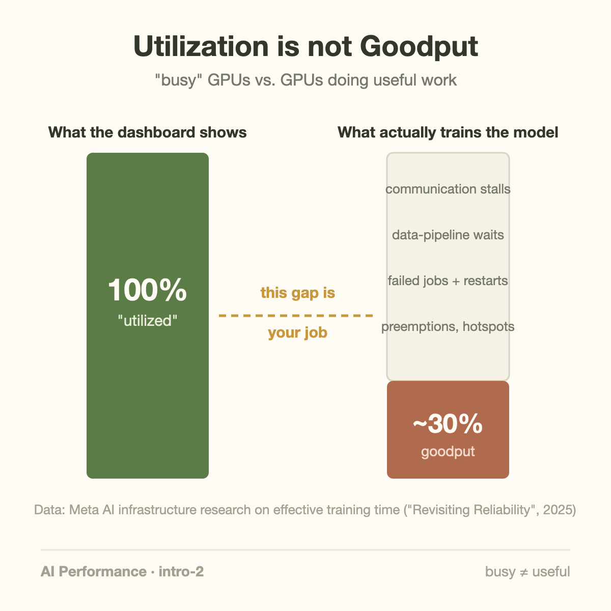
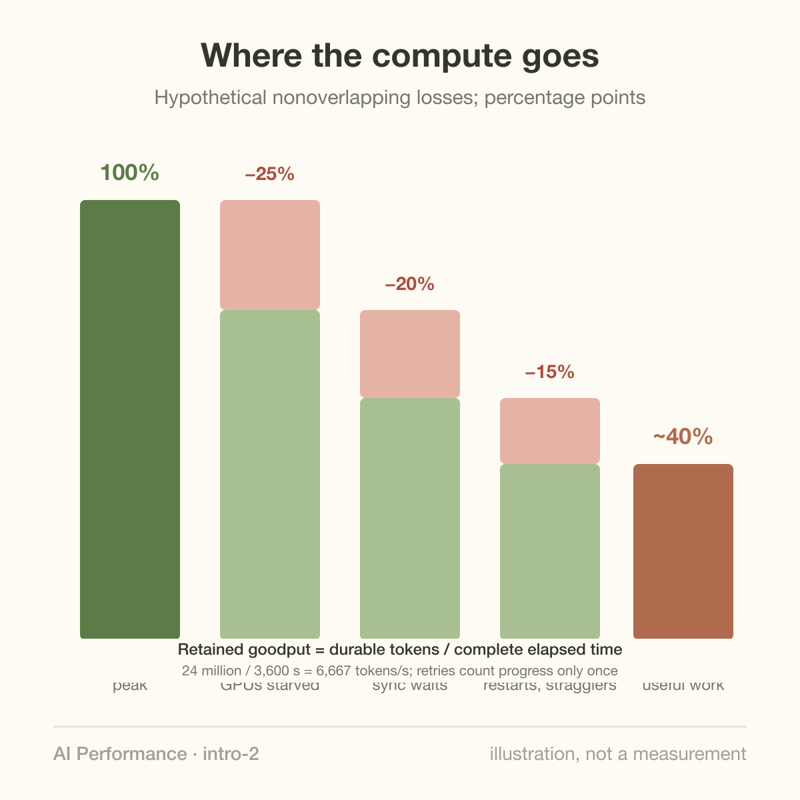

Your GPU dashboard says 100% utilization. Meta's infrastructure team measured that 70–75% of that compute produced nothing useful.

Those two sentences can both be true at once, and understanding why is the single most important idea in AI performance engineering. This article is about the metric that exposes the gap: **goodput**.

## Busy is not useful

"Utilization" answers one question: is the GPU doing *something* right now? It says nothing about whether that something moves your training run or your user's request forward.

Goodput asks the better question: **of the work this hardware could theoretically deliver, how much became useful output?** For an LLM cluster, useful output is tokens actually processed toward training or inference — after subtracting everything else:

- GPUs stalled waiting for gradient synchronization over the network
- GPUs starved because the data pipeline can't feed them fast enough
- Compute thrown away when a job fails and restarts from a checkpoint
- Preemptions, network congestion, stragglers holding back the whole cluster

Every one of those failure modes keeps the GPU *busy* — spinning on a collective operation, re-running lost work — while producing nothing. The dashboard stays green. The money burns.

## What Meta actually measured

The numbers above aren't hypothetical. Meta's infrastructure team analyzed their large ML training fleet and introduced an "effective training time" metric — in essence, goodput — in their [reliability study of large-scale ML clusters](https://arxiv.org/abs/2410.21680). Across real workloads, clusters that looked fully utilized were losing most of their compute to exactly the overheads listed above, with job preemptions, hardware faults, and network hotspots as major contributors.

The arithmetic of the gap is easy to feel with a toy example. Suppose one node can theoretically process 12,000 tokens per second. If it achieves 10,000, it runs at 83% goodput — healthy. But chain together a slow input pipeline (−25%), poorly overlapped gradient sync (−20%), and one failure-restart cycle a day (−10%), and the same "fully utilized" node delivers 30–40% of its potential. Nothing on a utilization dashboard distinguishes these two worlds.

## Why this metric changes behavior

Once you track goodput instead of utilization, priorities reorder themselves:

**Utilization thinking** says: the GPUs are busy, buy more GPUs. **Goodput thinking** says: find out what the busy-ness is made of first. A caching layer for the data pipeline, overlapping communication with computation, or faster failure recovery can each be worth more than new hardware — at a fraction of the price.

This is also why the job I described in [the previous article](/blog/what-does-an-ml-performance-engineer-do/) exists at all. The gap between theoretical and useful throughput *is* the performance engineer's territory. Closing 20 points of it on a large cluster is worth millions of dollars a year — and unlike buying hardware, it compounds: every future job runs on the improved stack.

## How to start measuring it

You don't need Meta's infrastructure to begin:

1. Compute your hardware's theoretical ceiling for the workload (tokens/sec from published FLOPS and bandwidth — a later article covers this napkin math)
2. Measure tokens actually completed per wall-clock hour, *including* failures and restarts
3. Divide. That ratio — not utilization — is the number to put on the team dashboard

The first time a team runs this exercise, the result is usually uncomfortable. That discomfort is the point: you can't close a gap you haven't measured.

## Takeaway

- Utilization measures busy-ness; goodput measures useful output per unit of theoretical capacity. Only the second one correlates with money.
- Meta's fleet-scale measurements showed 70–75% of "fully utilized" compute lost to data stalls, communication, preemptions, and failures.
- Track tokens-completed against theoretical peak. The gap you find is the highest-ROI engineering work available to your team.

## Sources

- Meta — ["Revisiting Reliability in Large-Scale Machine Learning Research Clusters"](https://arxiv.org/abs/2410.21680) (effective training time / goodput measurements)
- [MLPerf benchmark results](https://mlcommons.org/benchmarks/) — reference points for achievable throughput
- [DeepSeek-V3 Technical Report](https://arxiv.org/abs/2412.19437) — communication/computation overlap as a goodput lever

---

*Part of the **AI Performance Engineering** series. Previous: [What does an ML Performance Engineer actually do?](/blog/what-does-an-ml-performance-engineer-do/) Next: what a modern AI rack really is.*
