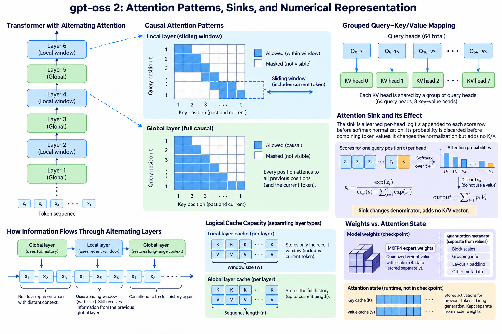
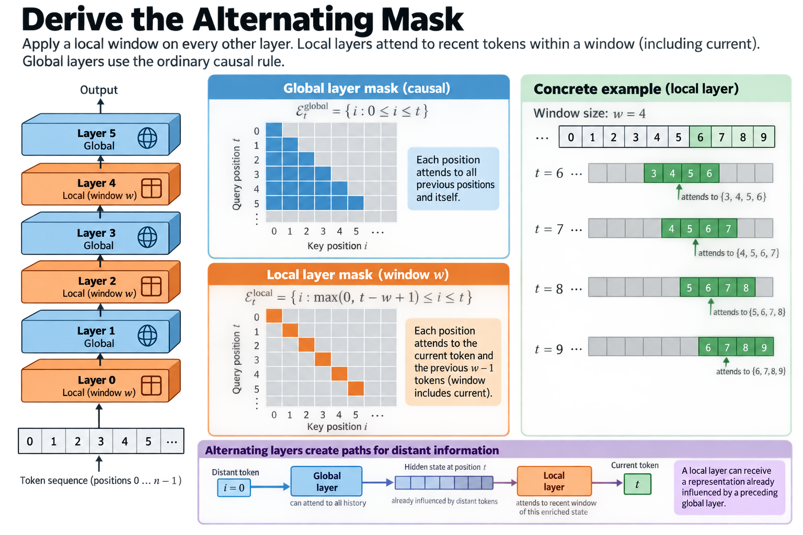
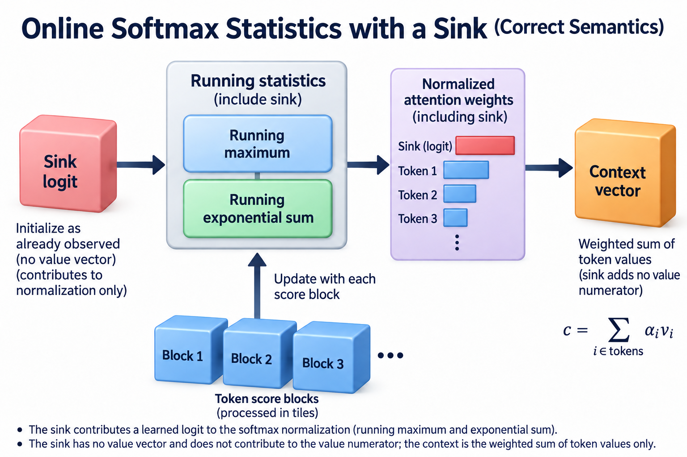

The gpt-oss reference implementation combines grouped key-value heads, alternating local and global attention, and a learnable attention sink. Its model card also describes MXFP4 expert weights. These mechanisms influence different system quantities: eligible history, cached head dimensions, normalized output magnitude, and weight residency.

This article follows the official reference code rather than inferring implementation from a model-family label. The cited defaults use 64 query heads, 8 key-value heads, head width 64, and a local window of 128. Checkpoint configuration and backend behavior must be recorded for an actual benchmark.

## 1. Derive the alternating mask

*Overview of the article’s core mechanism. The following sections explain the objects, relationships, equations, assumptions, and worked examples shown here.*

The reference applies the local window on every other layer, using the layer index to choose local or unrestricted causal attention. For a local layer, query position t attends to the current position and preceding positions within the window. Global layers retain the ordinary causal eligibility rule.

$$
\mathcal E_t^{\mathrm{global}}=\{i:0\le i\le t\},\qquad
\mathcal E_t^{\mathrm{local}}=\{i:\max(0,t-w+1)\le i\le t\}.
$$

The window convention here includes the current token, matching the reference's mask boundary. Off-by-one definitions matter when comparing kernels. A backend using a different “window size” convention must translate it correctly.

Alternating layers create different paths for recent and distant information. A local layer can receive a representation already influenced by a preceding global layer. It is therefore incorrect to say that every local layer makes the entire model unable to use older context.

## 2. Calculate logical cache capacity

If local layers retain only their necessary recent state, while global layers retain full history, a simple logical cache estimate separates them. Let L_G and L_W be their layer counts and let n be current sequence length.

$$
M_{KV}\approx2BH_{KV}d_hs\left[L_Gn+L_W\min(n,w)\right].
$$

The formula assumes equal dimensions and stored dtype across those layers. It excludes allocator padding and other metadata. A backend can retain more history than mathematically required, so inspect actual allocation rather than assuming it exploits every local-storage opportunity.

For short contexts below the window, both families retain similar lengths. For long contexts, global layers dominate the growing term. Alternating local attention reduces one component; it does not make the complete cache constant-size.

## 3. Explain grouped head mapping

The reference's attention tensor arrangement explicitly expands key and value views across the query multiplicity. With 64 queries and 8 key-value heads, each KV head serves 8 query heads. Logical view expansion need not mean allocating a copied history in an optimized implementation.

The query heads can produce different attention distributions over shared keys. Grouping shares representations, while each query still contributes its own compatibility scores. The output projection then maps combined head results into the residual width.

Test this mapping with distinct values for each KV head. An implementation using a wrong grouping order can preserve every tensor shape while pairing queries with unintended content. Shape validation alone is not a complete correctness check.

## 4. Derive the attention sink

The reference appends a learned per-head sink logit to the ordinary score row before softmax. It then discards the sink's probability when combining token values. The sink therefore participates in normalization without adding a value vector.

$$
p_i=\frac{\exp z_i}{\exp s+\sum_{j\in\mathcal E_t}\exp z_j},\qquad
p_{\mathrm{sink}}=\frac{\exp s}{\exp s+\sum_{j\in\mathcal E_t}\exp z_j},\qquad
y=\sum_{i\in\mathcal E_t}p_iv_i.
$$

The real-token probabilities sum to one minus the sink probability. Ordinary attention without this term normalizes the eligible token probabilities to one. Omitting the sink changes both normalization and output, even if masks and key-value tensors are correct.

The sink is not necessarily a special cached first token. In this implementation it is an extra learned score, with no corresponding retrieved content. That distinction is important because other systems use “attention sink” to describe a different token-retention phenomenon.

## 5. Work through sink behavior

Consider 2 eligible positions with logits zero and zero. Without a sink, each has probability 1/2. Add a sink logit of zero and all 3 entries receive 1/3. The resulting token output is 2/3 of the ordinary equal-weight combination in this illustrative example.

If the sink logit grows relative to token scores, more probability mass goes to the sink and less to values. If token logits dominate it, the real-token weights approach ordinary normalization. This gives the head a learned route to reduce its retrieved contribution under particular score conditions.

The sink's effect is query- and context-dependent through the competing scores, even though the learned sink parameter itself is per head. Its presence should be included in numerical references, especially when testing extreme score magnitudes.

## 6. Preserve stable normalization

A stable softmax subtracts the maximum across both eligible token logits and the sink. Subtracting only the token maximum while treating the sink through an unrelated unstable expression can introduce overflow or inconsistent scaling.

A fused attention implementation can incorporate the sink into an online normalization scheme, but it must preserve the same denominator. The sink changes the initial or combined normalization state according to the algorithm, not the causal eligibility of real tokens.

Test large positive and negative token scores, a dominant sink, and a weak sink. Compare against a high-precision small reference. Entirely masked token rows need an explicit supported behavior; the sink can supply a normalization entry in some cases, but a backend must follow the actual contract rather than infer arbitrary outputs.

## 7. Distinguish weight representation from attention state

The model card reports MXFP4 quantization of MoE weights. Those weights are part of the learned checkpoint. KV cache consists of request-dependent attention representations. The card's weight statement does not establish that cache uses MXFP4 or that every attention operation computes in that format.

Stored packed weights can be decoded or processed by kernels using another arithmetic precision. The straightforward PyTorch reference upcasts its weights to BF16. Its allocation and throughput therefore differ from optimized kernels that preserve packed representations.

A resource report should list expert-weight storage, nonsparse-weight storage, cache dtype, accumulator dtype, and temporary buffers separately. One precision label for the entire model conceals the actual implementation.

## 8. Include quantization metadata

Block-scaled low-precision weights include scale data alongside packed values. Their effective bytes per parameter exceed the nominal value-bit count when metadata is included. Padding, alignment, and nonquantized tensors add more storage.

For a generic block of b values with 4-bit payload and one 8-bit scale, the simple effective bit count is:

$$
b_{\mathrm{effective}}=4+\frac{8}{b}.
$$

This generic equation explains scale overhead. The official weight decoder defines blocks of 32 FP4 values packed into 16 payload bytes. With one 8-bit scale, the simple effective count is 4.25 bits per value before other layout overhead. Use those actual block definitions rather than borrowing the 16-channel grouping from the DeepSeek cache scheme.

Weight quantization can affect quality and kernel efficiency. The official card says evaluations used its MXFP4 quantization. Preserve that provenance instead of assuming a BF16 reference result is the same measured deployment path.

## 9. Interpret memory-fit claims

The official card states that gpt-oss-120b can run on an 80 GB GPU under its low-precision setup. That statement should retain its implementation scope. Weight fit alone does not reserve arbitrary batch sizes, context lengths, or temporary workspace.

An educational implementation that expands weights to BF16 can require more device memory. A serving implementation can also allocate cache and other buffers beyond the checkpoint. Use actual peak memory under the intended workload when deciding capacity.

The architecture's alternating windows and grouped heads help determine logical cache growth, while quantized experts help determine weight bytes. These are complementary categories, not interchangeable explanations for one memory figure.

## 10. Test local-global transitions

A tiny attention reference should exercise local and global layers with positions near the window boundary. Give old and recent positions distinguishable values. Verify that local masks exclude the intended old positions while global masks still permit them.

Compare prefill followed by a cached extension with processing the full sequence. The extension tests position offsets, local eviction, head mapping, and sink normalization together. Test lengths shorter than the window as well as longer histories.

When a backend uses ring-buffer storage for local history, ensure physical wraparound preserves logical ordering. A valid address and a valid token position are not the same property. Use unique position patterns to expose wrong translation.

## 11. Benchmark each mechanism at its own boundary

Measure prefill, decode, and memory separately. Local attention changes eligible positions, while grouped heads change retained representations and potential operand reuse. Sink handling adds a normalization term whose implementation cost depends on the kernel.

Compare equivalent numerical paths and keep checkpoint, backend, cache dtype, batch distribution, and context lengths fixed. A speedup involving both a new quantized expert kernel and another attention implementation is a system result; it cannot isolate one architectural mechanism without further controls.

No timings here are device measurements. The equations explain mask eligibility, normalization, and storage. Production results require actual execution on the stated hardware and a correctness comparison with the intended reference.

## 12. Check the complete residual result

The attention output is projected and added to the residual stream. A sink-induced reduction in attention contribution interacts with learned output projection and later expert computation. It is not a global confidence score or a direct probability that the model should abstain.

Validate the attention branch separately and then the complete block. A correct sink denominator can still feed the wrong output projection or residual input. Conversely, final-block agreement on a trivial example can hide attention errors canceled by zero weights elsewhere.

Use nontrivial test projections and inputs. The goal is to cover the actual interfaces, not merely reproduce the names of the components in an assertion.

## 13. Keep the architecture and backend distinct

The official reference establishes a clear semantic baseline: alternating masks, grouped heads, learnable sink logits, and explicit expert functions. An optimized backend can implement those semantics through a different schedule and packed representation.

Record both sources in a deployment report. The architecture explains the computation and logical state. The backend explains actual allocation, traffic, and execution. Keeping both visible makes the model's infrastructure behavior easier to assess and prevents educational reference code from being mistaken for a production performance limit.

## 14. Relate the sink to online softmax statistics

A tiled attention algorithm maintains a running maximum and a running exponential sum while processing score blocks. Including a sink means that its logit participates in those statistics. A conceptual initialization can begin with the sink as an already observed score and no value numerator. Subsequent token blocks update the denominator and weighted-value numerator under the same rescaling rule.

This explanation does not prescribe the official optimized kernel's exact schedule. It shows why the sink cannot be added by scaling the output with an unrelated fixed constant. Its probability depends on the competing token scores, so the correct factor changes with each query. A fixed postprocessing multiplier would generally implement another function.

For a small diagnostic, calculate the ordinary token-only exponential sum and then the sink-inclusive sum using the same numerical reference. The ratio between them describes how the real-token output is attenuated when the token-only normalized weighted sum is otherwise unchanged. Test several score distributions rather than one equal-logit case.

The diagnostic also separates semantic and numerical mistakes. Omitting the sink changes the denominator systematically. Mishandling rescaling can instead create errors only when a later score block contains a much larger maximum. Both tests are valuable, and neither requires claiming that the educational reference establishes production throughput. The intended equation is the baseline; the fused implementation must demonstrate that it preserves it within the supported precision.

## Sources

- [Official gpt-oss PyTorch model reference](https://github.com/openai/gpt-oss/blob/main/gpt_oss/torch/model.py).
- [Official weight decoding reference](https://github.com/openai/gpt-oss/blob/main/gpt_oss/torch/weights.py).
- [Official gpt-oss-120b model card](https://huggingface.co/openai/gpt-oss-120b).
