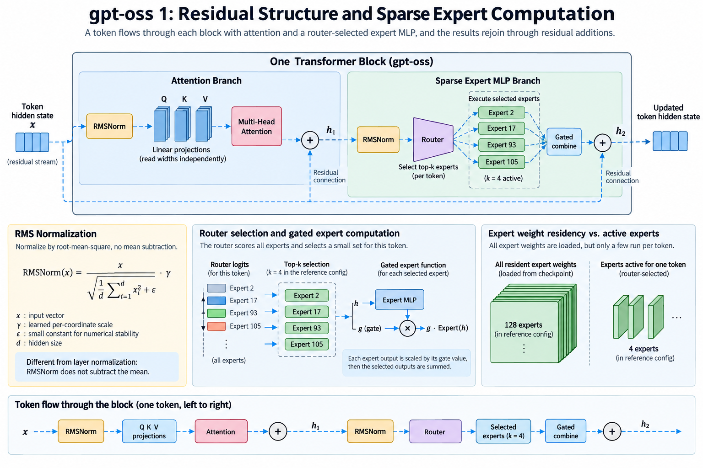
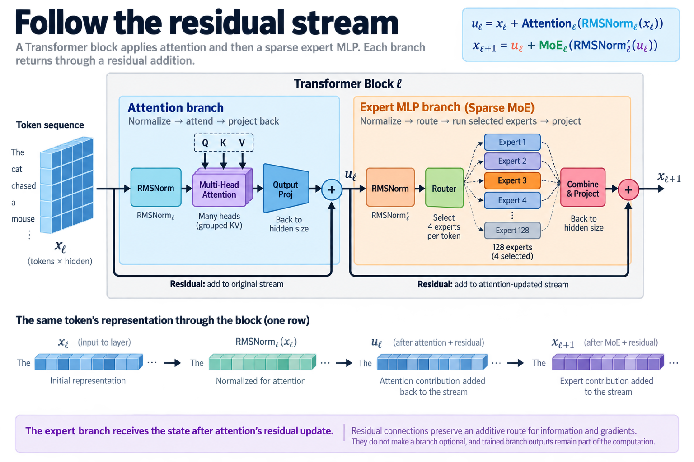
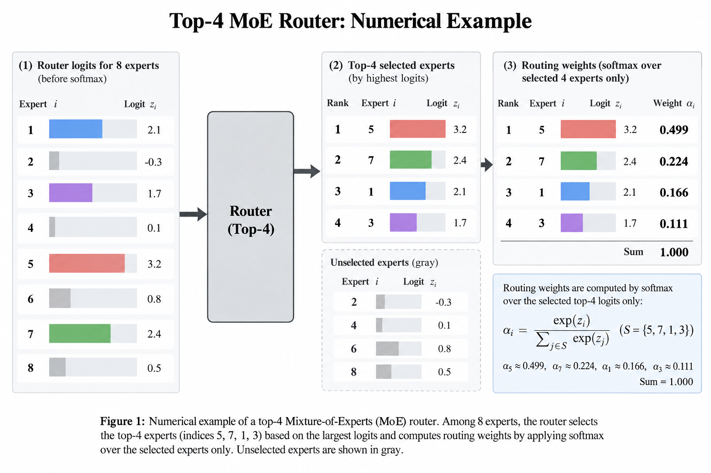
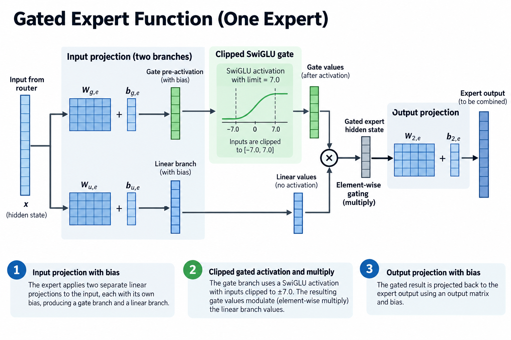
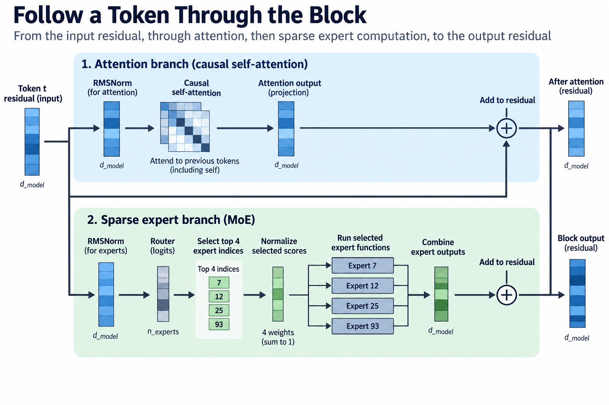
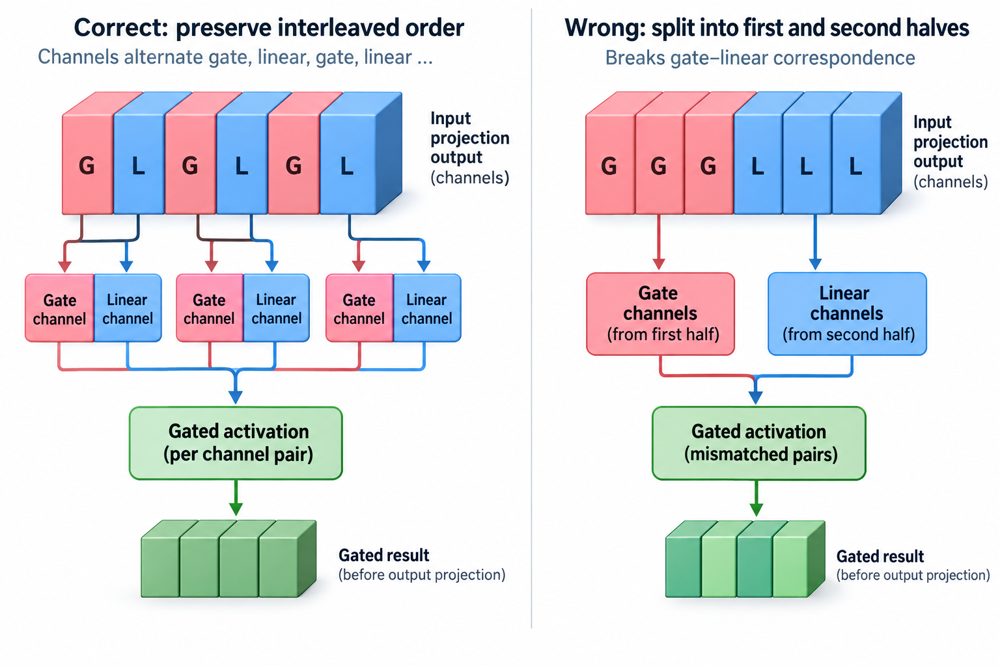

## Overview

The official gpt-oss repository includes a deliberately straightforward PyTorch reference implementation. Its value for an architecture article is transparency: normalization, attention, routing, expert arithmetic, and residual additions are visible in ordinary tensor operations. The repository explicitly says its reference implementations are educational and are not expected to be production deployments.

This article follows that official implementation and the gpt-oss-120b model card. The reference configuration's defaults include 36 layers, 128 experts, and 4 experts selected per token. Checkpoint-loaded configurations determine actual execution; defaults should not be transferred indiscriminately to another member of the family.

## Deep dive

### 1. Follow the residual stream

Each Transformer block applies an attention branch and then an expert MLP branch. Both return their contribution through a residual addition. A representative notation writes the two transitions separately so normalization placement remains visible.

$$
u_\ell=x_\ell+\operatorname{Attention}_\ell(\operatorname{RMSNorm}_\ell(x_\ell)),\qquad
x_{\ell+1}=u_\ell+\operatorname{MoE}_\ell(\operatorname{RMSNorm}'_\ell(u_\ell)).
$$

The expert branch therefore receives the state after attention's residual update. It is not evaluated on an unrelated copy of the original layer input. This ordering affects both the mathematical graph and live-value dependencies in an implementation.

The residual path preserves an additive route for information and gradients. It does not make a branch optional or establish that removing it leaves behavior unchanged. Trained branch outputs remain part of the computation.

### 2. Derive RMS normalization

RMSNorm divides a representation by a root-mean-square statistic and applies learned per-coordinate scaling. Unlike ordinary mean-subtracting layer normalization, this formulation does not center the vector before scaling.

$$
r(x)=\sqrt{\frac{1}{d}\sum_{i=1}^{d}x_i^2+\epsilon},\qquad
\operatorname{RMSNorm}(x)_i=\gamma_i\frac{x_i}{r(x)}.
$$

The epsilon term controls numerical behavior near zero. The learned gamma adjusts coordinate scales. Accumulation dtype and cast placement matter in low-precision execution, so use the implementation's actual numerical path when testing equivalence.

Normalization belongs to a branch's input transformation. The residual addition still uses the original stream for that branch. Saving or aliasing these values incorrectly can change the graph even if every individual normalization formula looks correct.

### 3. Read projection widths independently

The reference defaults list hidden width 2,880, attention head width 64, 64 query heads, and 8 key-value heads. The combined query-head width is therefore 4,096, which differs from hidden width. A projection can map between these dimensions; they need not be equal.

This is a useful example of why head width should not be inferred by dividing hidden width by query heads. The released configuration explicitly provides both. Output projection brings the attention result back to the residual interface width.

The next article examines grouped key-value heads, alternating windows, and sinks. Here the important interface is that the attention branch must return a vector compatible with the residual stream, regardless of its internal projection dimensions.

### 4. Trace router selection

The expert branch normalizes its input and calculates router logits through a learned linear map. The reference uses top-k selection on those logits, then softmax over the selected values. This is more precise than saying it “uses router probabilities” without naming the normalization population.

$$
S(x)=\operatorname{TopK}(W_rx+b_r,4),\qquad
a_e=\frac{\exp z_e}{\sum_{j\in S(x)}\exp z_j}\quad(e\in S(x)).
$$

The selected weights sum to unity within the chosen set. The reference retrieves the selected expert weight tensors and applies their functions. Other experts are not executed in that routed forward path.

Top-k ties and numerical score differences can change selected indices. A reproduction should follow the supported selection behavior rather than expecting a smooth derivative through an arbitrary tie. Tests away from ties are useful for verifying the combine arithmetic separately.

### 5. Explain the gated expert function

Each selected expert applies an input projection producing 2 branches, a gated activation, and an output projection. The reference's SwiGLU function includes a limit parameter; the defaults set it to 7.0. That clipping behavior is part of the architecture's numerical function, not a generic detail that can be discarded.

A generic gated form is:

$$
F_e(x)=W_{2,e}\left[\operatorname{gate}(W_{g,e}x+b_{g,e})\odot
\operatorname{linear}(W_{u,e}x+b_{u,e})\right]+b_{2,e}.
$$

The equation deliberately leaves the exact clipped function to the referenced code rather than pretending ordinary unbounded SwiGLU is identical. Matrix layout and interleaving of gate and linear channels must follow the stored weights.

Bias terms also matter. Removing them because another LLM family uses bias-free projections changes this model's function. Architecture reading should follow the release rather than applying familiar defaults from unrelated models.

### 6. Combine expert outputs correctly

The reference forms a weighted sum across selected experts and adds the result to the expert branch's residual input. The token-to-expert association must remain intact through any grouping or distributed execution.

$$
\operatorname{MoE}(x)=\sum_{e\in S(x)}a_eF_e(x).
$$

A production implementation can permute assignments to form efficient expert batches, but it must invert or track that permutation when returning results. Distinct token identifiers and expert outputs make a small reference test sensitive to mistaken association.

A selected expert should contribute once. Duplicated dispatch, lost output, or combining along the wrong dimension can produce plausible-looking vectors while violating the sparse mixture. Test the router, expert function, and combination as separate stages before integrating them.

### 7. Distinguish expert and tensor parallelism

The official reference supports a small amount of tensor parallelism inside its MoE implementation. It can partition expert intermediate work and use an all-reduce before adding the appropriate output bias. This is not the same thing as assigning disjoint complete experts to different devices.

Expert parallelism routes assignments to devices that own selected experts. Tensor parallelism divides arithmetic or weights within a function. A deployment can combine them, but their communication patterns and residency formulas differ.

The repository's reference arrangement demonstrates the architecture under its supported setup. It should not be presented as the optimal production communication strategy or used to derive network traffic for every gpt-oss serving engine.

### 8. Count weight residency

Sparse routing selects 4 expert functions per token, while the layer has 128 experts in the cited default configuration. Those weights still belong to the checkpoint. Whether they remain resident on one device, are distributed, or are supplied through another policy depends on the implementation.

The official card reports MXFP4 quantization of MoE weights. This changes their stored representation and is important to the model's memory-fit statements. The straightforward PyTorch reference upcasts weights to BF16, so its memory requirement differs from an optimized low-precision path.

An architecture article should retain this distinction. A fit statement about quantized weights does not imply that every reference implementation or context length fits in the same capacity. Cache and temporary buffers add their own requirements.

### 9. Separate the token protocol

The official repository also documents the model's Harmony format and tool-related interfaces. These specify serialization and behavior expected by the trained model. They are not an extra attention layer or another expert branch.

A serving application must use a compatible tokenizer and message format. Incorrect serialization can alter behavior even when the weights and kernels are correct. Architecture and input protocol are different parts of the deployment contract, and both need provenance.

Do not infer tool execution from the presence of a tool token. The application supplies the runtime that performs an allowed tool action and returns its result. The language model's trained protocol determines how those messages are represented.

### 10. Validate the reference graph

For a tiny configuration, compare branch outputs, selected expert indices, combine weights, and final residual values. Use nonzero biases and nonidentity projections so omitted terms become visible. Test supported masks and token shapes.

Check the normalization reference with zero and nonzero input vectors and precision-appropriate tolerances. Check the gated function near its clipping limits. Check that expert gathering preserves gate and linear channel layout.

These tests establish mathematical and tensor-interface correctness. They do not establish production speed or hardware efficiency. The code examples discussed here were inspected as architecture evidence; no model-weight execution or GPU benchmark was performed in this editing environment.

### 11. Interpret performance claims at the right boundary

An optimized backend can fuse operations, keep quantized weights packed, batch expert assignments, and use a different attention kernel. Those changes can substantially affect throughput while preserving the intended model function within a numerical contract.

A performance comparison should state checkpoint, backend, weight representation, cache dtype, context lengths, batch distribution, and device topology. The educational reference is useful for correctness comparison, but its runtime is not an architecture's inevitable performance.

Also distinguish prefill and decode. Expert group sizes and attention history differ between them. A claim that one sparse branch is efficient does not automatically describe the complete request or its time to first token.

### 12. Build an independent parameter check

Use actual tensor shapes to count router, normalization, attention, expert, embedding, and output parameters. Decide how tied embeddings or shared storage are counted. Avoid multiplying an expert headline by a guessed MLP size.

For a gated expert with compatible widths, the leading weight count involves 2 input-projection matrices and 1 output matrix, plus any biases. Multiply routed-expert storage by the actual expert collection, while selected arithmetic uses the routed subset. The nonsparse components remain active according to their own paths.

Model-card total and active counts should preserve their definitions. A manual tensor count is a useful audit, but discrepancies can reflect rounding, tied storage, or different inclusion rules rather than an immediate error in the release claim.

### 13. Follow a token through the block

Start with a token's residual vector. Normalize it for attention, calculate the causal attention branch, project the result, and add it. Normalize the updated stream for the expert branch, calculate router logits, select 4 indices, normalize their selected scores, run those expert functions, combine outputs, and add the branch.

This sequence explains why the architecture is more than a list of “RMSNorm, attention, MoE.” The order and interfaces define the computation. It also identifies which intermediates a fused or distributed implementation must preserve or reproduce.

The official reference provides a reviewable route through that computation. Use it to establish semantics, then use a documented optimized backend for measured deployment evidence. The next article follows the attention mask, sinks, and numerical representations that further shape the system.

### 14. Preserve clipping and channel order

The reference stores the 2 input-projection branches in an interleaved arrangement and applies a specific gated function. A backend converting weights into another layout must preserve the correspondence between each gate channel and its linear partner. Merely splitting the first and second halves can be wrong when the original layout alternates channels.

Construct a small input projection whose gate and linear outputs have intentionally different patterns. Compare the converted layout's gated result with the official function before adding the output projection. This isolates a layout error from routing or matrix multiplication. Test values near the limit and values on both sides of zero, since clipping can affect the 2 branches differently.

The activation function also contains its own coefficients and offset behavior. Ordinary textbook SwiGLU notation is useful for understanding gated computation but does not reproduce every implementation. When equivalence matters, quote the exact source revision in the test record and evaluate that function rather than replacing it with a familiar name.

## Conclusion

Finally inspect bias placement around distributed reductions. Adding a full output bias on every partition before summation can multiply its contribution by the process count. The reference's ordering provides the semantic baseline. A parallel implementation can reorganize operations, but it must preserve the intended total bias as well as the matrix products. These small terms are easy to overlook in a parameter-count discussion and important in a correctness review.

### Sources

- [Official gpt-oss repository](https://github.com/openai/gpt-oss).
- [Official PyTorch model reference](https://github.com/openai/gpt-oss/blob/main/gpt_oss/torch/model.py).
- [Official gpt-oss-120b model card](https://huggingface.co/openai/gpt-oss-120b).
