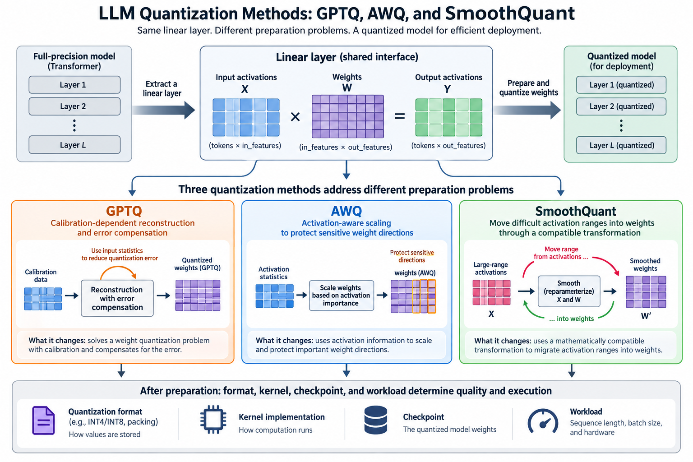
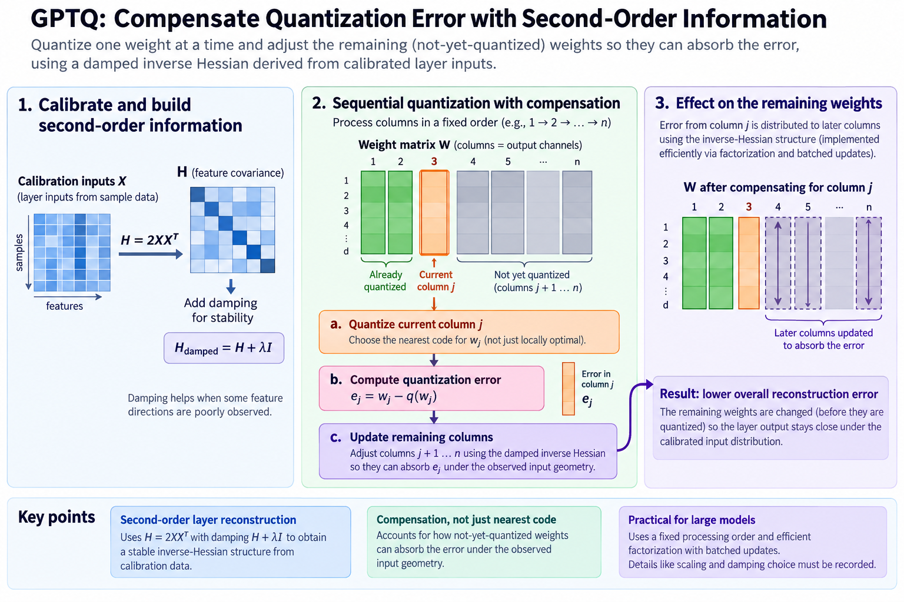
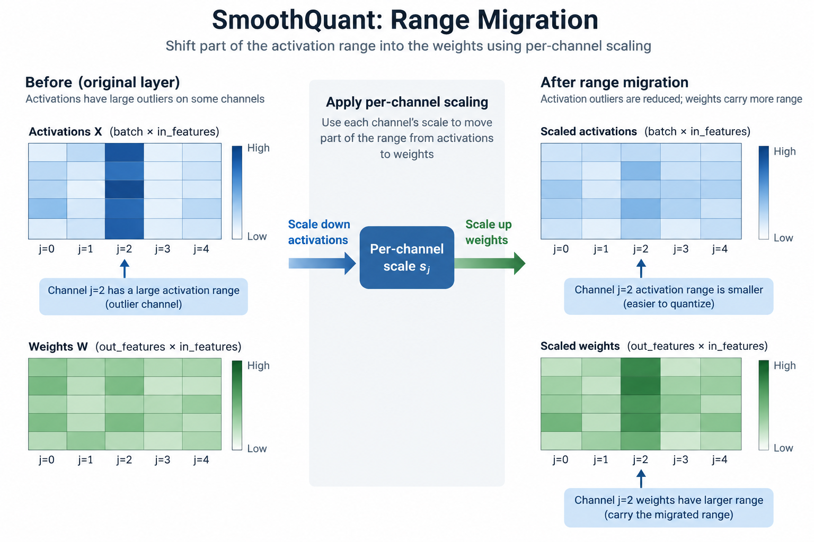
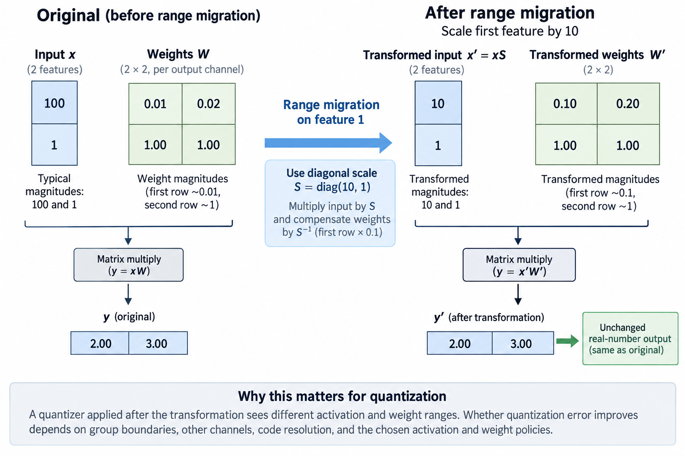

## Overview

GPTQ, AWQ, and SmoothQuant are often listed together as quantization options, but they solve different preparation problems. GPTQ uses calibration-dependent reconstruction and error compensation. AWQ uses activation-aware scaling to protect sensitive weight directions. SmoothQuant moves difficult activation ranges into weights through a compatible transformation.

Understanding those mechanisms is more useful than picking an acronym from a benchmark table, since 4 other things still decide quality and execution: the resulting format, the kernel, the checkpoint, and the workload. This article derives the linear interface the 3 methods share, then separates what each method changes and what evidence a deployment comparison needs.

*An original conceptual illustration. Numerical plots and examples are illustrative unless explicitly identified as measured evidence.*

## Deep dive

### 1. Establish the linear layer convention

Let X hold calibration token activations as columns, with feature width d and N examples. Let W map those features into output width o. The original layer output is their matrix product.

$$
X\in\mathbb R^{d\times N},\quad W\in\mathbb R^{o\times d},\qquad Y=WX.
$$

This convention makes feature scaling and reconstruction explicit. Papers and implementations can use transposed storage. Translate the axes; do not copy a formula into an incompatible tensor layout.

Calibration activations are data, not arbitrary noise, and their feature magnitudes and correlations shape reconstruction sensitivity, so when comparing methods keep 4 records: the tokenization, the preprocessing, the sampling, and the layer-input provenance. A convenient synthetic activation distribution can test the algebra, but it says nothing about model quality.

### 2. Derive the reconstruction objective

Quantized weights produce error through both their perturbation and the input distribution. A squared output-reconstruction objective is:

$$
\mathcal E(\widehat W)=\|(W-\widehat W)X\|_F^2.
$$

For 1 output row, the objective has quadratic curvature proportional to XX transpose. Correlated inputs therefore couple weight errors. Quantize entries independently by raw distance and you can miss the chance to cancel one perturbation with another direction.

This is a local stand-in for preserving the layer's outputs, and it does not prove the final language behavior is unchanged, especially after many layers are modified, so the complete checkpoint still needs held-out evaluation under the intended inference policy.

### 3. Explain GPTQ's compensation mechanism

GPTQ builds on second-order layer reconstruction. It quantizes weights 1 at a time and adjusts the not-yet-quantized values to absorb the error just introduced. Its computational organization makes the procedure practical for large language-model layers, including a fixed processing order and efficient batched updates.

$$
H=2XX^\top,\qquad H_{\mathrm{damped}}=H+\lambda I.
$$

The damping expression illustrates stabilization; record the actual implementation's scaling and parameter choice. Calibration can leave some feature directions poorly observed, which makes an undamped inverse unstable or undefined.

The key idea is not just choosing the nearest code. GPTQ accounts for how the remaining weights can absorb error under the observed layer-input geometry. The paper explains the algorithm and its efficient factorization. A generic inverse-Hessian derivation is useful theory, but it is not the exact optimized implementation.

### 4. Work through correlated inputs

Suppose 2 input coordinates are highly correlated. Their weights then produce similar output effects on calibration data. If one weight rounds upward, adjusting the other downward can partly preserve the output for that population.

If the coordinates instead vary independently, the same compensation may work poorly, because the reconstruction geometry changes even when the 2 weight magnitudes stay identical, which is why XX transpose matters and why the calibration distribution matters.

The example does not prove compensation is perfect after quantization: the remaining entries also face discrete constraints, and unseen inputs can break the observed correlation, so evaluate held-out reconstruction and task behavior, because a method tuned on a narrow prefix population can fail on another task distribution.

### 5. Derive an exact feature-scaling identity

Let D be an invertible diagonal feature-scale matrix. Multiply the weight columns by D and the input rows by its inverse, and the real-number linear output stays the same:

$$
WX=(WD)(D^{-1}X)=W'X'.
$$

This identity creates a degree of freedom before quantization. The unquantized function does not change, but the weight and activation ranges do. After quantization, the 2 representations can have different approximation errors.

The transformation must respect the surrounding operations and bias in the actual graph, since a nonlinearity cannot in general be moved through arbitrary scaling without another compatible identity, which makes model-specific folding and implementation support part of preparation correctness.

### 6. Explain SmoothQuant's range migration

The scaling freedom is what SmoothQuant uses to make activation outliers less difficult, by shifting part of their range into the weights. Its primary design targets efficient low-bit weight-and-activation quantization under the studied execution setup.

A representative channel-scale rule combines activation and weight maxima with a migration coefficient:

$$
s_j=\frac{\max|X_j|^{\alpha}}{\max|W_{:,j}|^{1-\alpha}}.
$$

The exact maxima population and the safe handling of zero values must follow the implementation. Alpha decides how the transformation splits the difficulty. Read the equation under the established orientation; do not copy it without checking which axis gets scaled.

The method does not remove outliers from the function, it moves where the numerical range sits before quantization, and a scale that helps activation error can make weight error harder, so evaluate the complete transformed quantized layer rather than 1 histogram.

### 7. Explain AWQ's activation-aware protection

AWQ starts from the observation that weight sensitivity depends on activation behavior, and it uses scaling to quantize the salient directions better. The primary paper distinguishes this from simply keeping a chosen set of important weights in full precision.

Scaling a sensitive channel changes how its values occupy a groupwise quantization grid. The inverse transformation preserves the original linear function before quantization. The preparation search evaluates scales under the method's chosen criteria and representation.

AWQ and SmoothQuant can therefore use related algebra while chasing different numerical preparation goals. Keep each method's studied weight and activation formats, objectives, and execution paths attached to its claims. Similar scaling notation does not make the procedures interchangeable.

### 8. Work through range migration

Take an illustrative 2-feature input whose typical magnitudes are 100 and 1, with corresponding weight magnitudes 0.01 and 1. A diagonal scale of 10 on the first feature reduces its transformed input magnitude to 10 and raises its transformed weight magnitude to 0.1. The exact real-number product stays the same.

A quantizer applied after the transformation sees different ranges. Whether the error improves depends on 4 things: group boundaries, other channels, code resolution, and the chosen activation and weight policies. The example proves the algebraic opportunity, not a universal quality gain.

Check the transformed unquantized output first. If it disagrees with the original reference beyond numerical tolerance, the preparation has an interface or folding error. Only then evaluate the quantized result, so transformation correctness and numerical approximation stay separate questions.

### 9. Compare what the methods require

GPTQ needs calibration geometry and a reconstruction procedure with compensation, AWQ needs activation-aware information and scale selection, and SmoothQuant needs channel-range information and a compatible range migration, so their preparation time, memory, and data dependencies differ.

A method comparison should report the actual calibration size, preprocessing, layer order, damping or scale policy, grouping, and preparation hardware. "One-shot" does not mean zero cost, and "activation-aware" does not fully specify a quantizer.

Include the resulting format and backend, because 2 prepared artifacts with different group sizes or kernels compare combined preparation and execution choices, which can be useful for deployment but does not isolate an algorithm's contribution without extra controls.

### 10. Keep format support separate

A prepared 4-bit weight tensor needs a supported packing layout and matrix kernel. Scale placement, zero points, group axis, and nonquantized tensors affect compatibility. A backend can load an acronym-labeled artifact and still run an unexpected fallback path.

Weight-only quantization differs from quantizing weights and activations. Cache state is yet another numerical category. Do not silently expand the original papers' evaluated settings into claims about all components.

Record storage and accumulation precision separately. A packed low-bit weight path can accumulate in a wider representation. Its quality and speed depend on the actual kernel schedule and shapes, not only the nominal payload bits.

### 11. Test preparation stages independently

For scaling methods, verify the exact unquantized identity on small nontrivial matrices and biases. Then verify quantized reconstruction with the correct group scales. For GPTQ, compare the local reconstruction objective before and after compensation on a small case.

Use 4 populations: correlated and independent activations, channels with distinct magnitudes, zero-range channels under the supported policy, and partial groups. These cases expose axis and stabilization mistakes that uniform random tests can miss.

Task evaluation comes afterward. A correctly implemented method can still pick an unsuitable policy for a checkpoint or workload. Numerical correctness and downstream quality are complementary evidence, not interchangeable checks.

### 12. Measure deployment phases

Report 5 numbers: preparation cost, packed bytes, peak allocation, prefill throughput, and decode latency, all under defined contexts and concurrency. Lower weight memory can help capacity while a small-batch kernel stays limited by decoding overhead or another resource.

Keep task quality and inference budgets consistent. A result that uses shorter outputs or fewer candidates cannot isolate numerical preparation. Include fallback layers and any changed cache policy.

No model execution or GPU benchmark was performed for this article. The equations explain method mechanisms. Provider and paper results should keep their provenance, and a deployment decision needs measurements of the actual artifact and backend.

### 13. Evaluate combinations carefully

Research can combine transformations and reconstruction procedures, including adaptations to newer numerical formats. Such combinations need checks on operation order and on whether one method changes the distribution or representation another assumes.

A scale transformation changes the inputs and weights a reconstruction solver sees. Groupwise packing and grid choices also change the problem. Combining individually useful methods does not automatically keep each one's reported gains.

Treat the combined pipeline as 1 more configuration on the quality-resource frontier, store intermediate artifacts or enough settings to reproduce them, and compare against the individual methods under the same workload and numerical contract rather than crediting the combined result to one familiar acronym.

### 14. Choose from the bottleneck and evidence

The bottleneck points to 1 of 3 answers. If weight capacity dominates, a supported weight-only path is attractive. If activation quantization is required for efficient arithmetic, range migration and training-aware methods become relevant. If sensitive reconstruction error limits quality, compensation or a different representation may help.

These are hypotheses to test, not universal selection rules. Do 4 things: read the primary method equations, inspect backend support, establish transformation correctness, and evaluate held-out quality. Then measure the operating point the application cares about.

The useful comparison is mechanistic, and it comes down to 4 questions: what error is optimized, what representation changes, what data is needed, and what executes afterward. That view explains innovation and limits more clearly than ranking method names without their numerical and deployment context.

### 15. Interpret damping as a changed local problem

If calibration contains fewer independent activation directions than the feature width, XX transpose is rank deficient, and even with many tokens strong correlations can leave some directions weakly observed, so no amount of solver precision recovers reliable unconstrained inverse information from those directions.

Adding a positive diagonal term stabilizes the local geometry, and you can read it as penalizing large compensating perturbations in a corresponding quadratic model, which explains why damping is more than a workaround for a failed matrix factorization: it changes how strongly the procedure trusts calibration-based compensation.

Too little regularization invites large updates along poorly observed directions, too much suppresses useful compensation and pushes the result toward independent quantization, so set the practical parameter from the method's documented scaling and validation rather than from an unexplained value copied across differently normalized inputs.

## Conclusion

For a tiny diagnostic, compare a fully independent activation set with 1 containing duplicated feature rows, inspect reconstruction and solver stability under the supported damping policy, then evaluate held-out activations outside the observed correlation. That separates numerical stability from generalization and makes the method's approximation visible, without claiming that a local objective proves final model quality.

### Sources

- [GPTQ](https://arxiv.org/abs/2210.17323).
- [AWQ](https://arxiv.org/abs/2306.00978).
- [SmoothQuant](https://arxiv.org/abs/2211.10438).
- [PTQ with microscaling formats](https://arxiv.org/abs/2405.07135).
