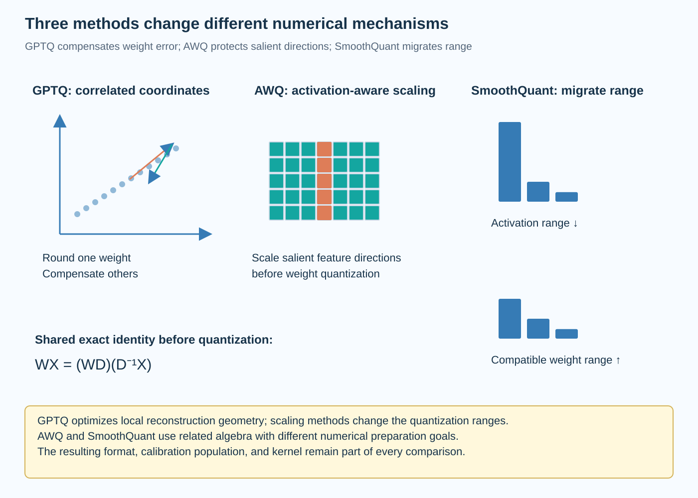
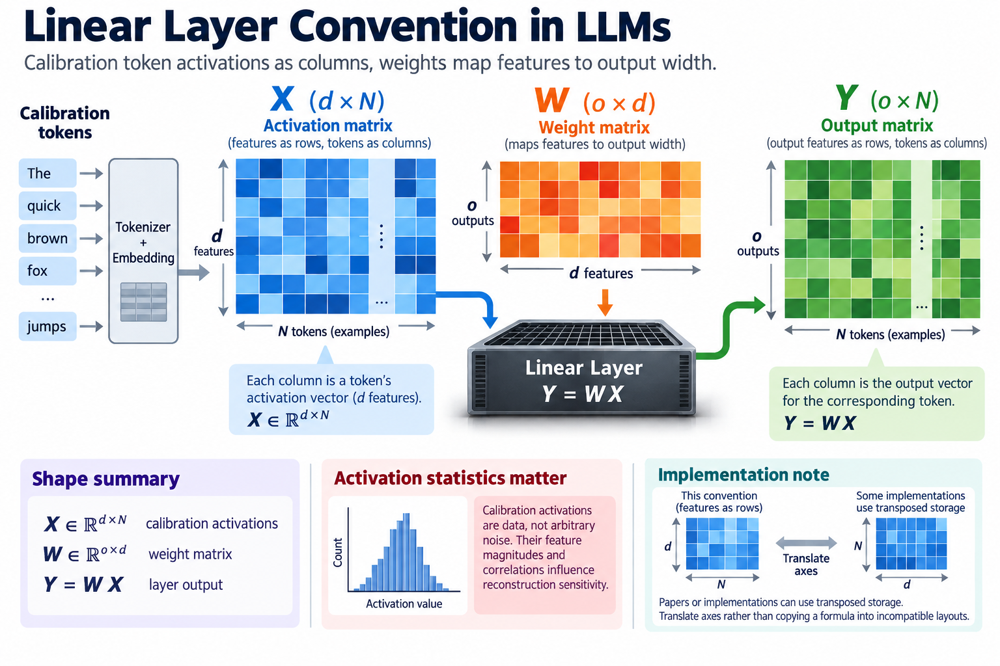
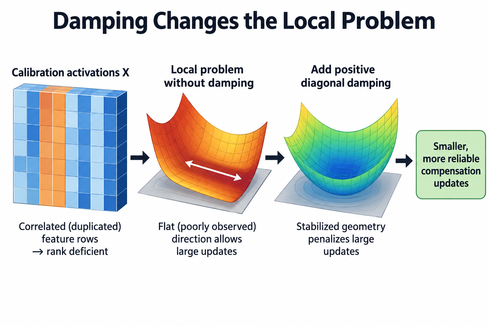

GPTQ, AWQ, and SmoothQuant are often listed together as quantization options, but they solve different preparation problems. GPTQ uses calibration-dependent reconstruction and error compensation. AWQ uses activation-aware scaling to protect sensitive weight directions. SmoothQuant moves difficult activation ranges into weights through a compatible transformation.

Understanding those mechanisms is more useful than choosing an acronym from a benchmark table. The resulting format, kernel, checkpoint, and workload still determine quality and execution. This article derives their shared linear interface, then separates what each method changes and what evidence a deployment comparison needs.

*An original conceptual illustration. Numerical plots and examples are illustrative unless explicitly identified as measured evidence.*

## 1. Establish the linear layer convention

Let X contain calibration token activations as columns, with feature width d and N examples. Let W map those features into output width o. The original layer output is their matrix product.

$$
X\in\mathbb R^{d\times N},\quad W\in\mathbb R^{o\times d},\qquad Y=WX.
$$

This convention makes feature scaling and reconstruction explicit. Papers or implementations can use transposed storage. Translate axes rather than copying a formula into incompatible tensor layouts.

Calibration activations are data, not arbitrary noise. Their feature magnitudes and correlations influence reconstruction sensitivity. Preserve tokenization, preprocessing, sampling, and layer input provenance when comparing methods. A convenient synthetic activation distribution can test algebra but does not establish model quality.

## 2. Derive the reconstruction objective

Quantized weights produce error through both their perturbation and the input distribution. A squared output-reconstruction objective is:

$$
\mathcal E(\widehat W)=\|(W-\widehat W)X\|_F^2.
$$

For one output row, the objective has quadratic curvature proportional to XX transpose. Correlated inputs therefore couple weight errors. Quantizing entries independently by raw distance can miss an opportunity to compensate one perturbation through another direction.

This is a local surrogate for preserving the layer's outputs. It does not prove that final language behavior remains unchanged, especially after multiple layers are modified. The complete checkpoint still needs held-out evaluation under the intended inference policy.

## 3. Explain GPTQ's compensation mechanism

GPTQ builds on second-order layer reconstruction and quantizes weights while adjusting not-yet-quantized values to compensate for introduced error. It uses computational organization that makes the procedure practical for large language-model layers, including a fixed processing order and efficient batched updates.

$$
H=2XX^\top,\qquad H_{\mathrm{damped}}=H+\lambda I.
$$

The damping expression illustrates stabilization; the actual implementation's scaling and parameter choice must be recorded. Calibration can leave some feature directions poorly observed, making an undamped inverse unstable or undefined.

The important innovation is not merely choosing a nearest code. It accounts for how the remaining weights can absorb error under the observed layer-input geometry. The paper explains the algorithm and its efficient factorization. A generic inverse-Hessian derivation is useful theory, but it should not be mistaken for the exact optimized implementation.

## 4. Work through correlated inputs

Suppose 2 input coordinates are highly correlated. Their weights can produce similar output effects on calibration data. If one weight is rounded upward, adjusting the other downward can partly preserve the output under that population.

If the coordinates instead vary independently, the same compensation may perform poorly. The reconstruction geometry changes even when the two weight magnitudes remain identical. This illustrates why XX transpose is relevant and why calibration distribution matters.

The example does not establish perfect compensation after quantization. The remaining entries also face discrete constraints, and unseen inputs can break the observed correlation. Evaluate held-out reconstruction and task behavior. A method optimized on a narrow prefix population can fail on another task distribution.

## 5. Derive an exact feature-scaling identity

Let D be an invertible diagonal feature-scale matrix. Multiplying weight columns by D and input rows by its inverse preserves the real-number linear output:

$$
WX=(WD)(D^{-1}X)=W'X'.
$$

This identity creates a degree of freedom before quantization. The unquantized function remains the same, but the weight and activation ranges change. After quantization, the two representations can have different approximation errors.

The transformation must preserve surrounding operations and bias under the actual graph. A nonlinearity cannot generally be moved through arbitrary scaling without another compatible identity. Model-specific folding and implementation support are therefore part of preparation correctness.

## 6. Explain SmoothQuant's range migration

SmoothQuant uses the scaling freedom to reduce activation outlier difficulty by shifting part of the range into weights. Its primary design targets efficient low-bit weight-and-activation quantization under the studied execution setup.

A representative channel-scale rule combines activation and weight maxima with a migration coefficient:

$$
s_j=\frac{\max|X_j|^{\alpha}}{\max|W_{:,j}|^{1-\alpha}}.
$$

The exact maxima population and safe handling of zero values must follow the implementation. Alpha determines how the transformation distributes difficulty. The equation should be read under the established orientation rather than copied without checking which axis is scaled.

The method does not make outliers disappear from the function. It changes where numerical range resides before quantization. A scale useful for activation error can make weight error harder, so evaluate the complete transformed quantized layer rather than one histogram alone.

## 7. Explain AWQ's activation-aware protection

AWQ observes that weight sensitivity depends on activation behavior and uses scaling to improve the quantization of salient directions. The primary paper distinguishes this from simply retaining a chosen set of important weights in full precision.

Scaling a sensitive channel can change how its values occupy a groupwise quantization grid. The inverse transformation preserves the original linear function before quantization. The preparation search evaluates scales under the method's chosen criteria and representation.

AWQ and SmoothQuant can therefore use related algebra while pursuing different numerical preparation goals. Their studied weight and activation formats, objectives, and execution paths should remain attached to their claims. Similar scaling notation does not make the procedures interchangeable.

## 8. Work through range migration

Take an illustrative 2-feature input whose typical magnitudes are 100 and 1, with corresponding weight magnitudes 0.01 and 1. Choosing a diagonal scale of 10 on the first feature reduces its transformed input magnitude to 10 and raises its transformed weight magnitude to 0.1. The exact real-number product remains unchanged.

A quantizer applied after the transformation sees different ranges. Whether error improves depends on group boundaries, other channels, code resolution, and the chosen activation and weight policies. This example proves the algebraic opportunity, not a universal quality improvement.

Check the transformed unquantized output first. If it disagrees substantially with the original reference beyond numerical tolerance, the preparation has an interface or folding error. Only then evaluate the quantized result to distinguish transformation correctness from numerical approximation.

## 9. Compare what the methods require

GPTQ needs calibration geometry and a reconstruction procedure with compensation. AWQ uses activation-aware information and scale selection. SmoothQuant uses channel-range information and compatible range migration. Their preparation time, memory, and data dependencies differ.

A method comparison should report actual calibration size, preprocessing, layer order, damping or scale policy, grouping, and preparation hardware. “One-shot” does not mean zero cost, and “activation-aware” does not fully specify a quantizer.

Include the resulting format and backend. Two prepared artifacts using different group sizes or kernels evaluate combined preparation and execution choices. That can be useful for deployment, but it does not isolate an algorithm's contribution without additional controls.

## 10. Keep format support separate

A prepared 4-bit weight tensor needs a supported packing layout and matrix kernel. Scale placement, zero points, group axis, and nonquantized tensors affect compatibility. A backend can load an acronym-labeled artifact while using an unexpected fallback path.

Weight-only quantization differs from quantizing weights and activations. Cache state is another numerical category. The original papers' evaluated settings should not be silently expanded into claims about all components.

Record storage and accumulation precision separately. A packed low-bit weight path can accumulate in a wider representation. Its quality and speed depend on the actual kernel schedule and shapes, not only the nominal payload bits.

## 11. Test preparation stages independently

For scaling methods, verify the exact unquantized identity on small nontrivial matrices and biases. Then verify quantized reconstruction with the correct group scales. For GPTQ, compare the local reconstruction objective before and after compensation on a small case.

Use correlated and independent activations, channels with distinct magnitudes, zero-range channels under the supported policy, and partial groups. These cases expose axis and stabilization mistakes that uniform random tests can miss.

Task evaluation comes afterward. A correctly implemented surrogate method can still choose an unsuitable policy for a checkpoint or workload. Numerical correctness and downstream quality are complementary evidence rather than interchangeable checks.

## 12. Measure deployment phases

Report preparation cost, packed bytes, peak allocation, prefill throughput, and decode latency under defined contexts and concurrency. A lower weight-memory requirement can help capacity while a small-batch kernel remains limited by decoding overhead or another resource.

Keep task quality and inference budgets consistent. A result using shorter outputs or fewer candidates cannot isolate numerical preparation. Include fallback layers and any changed cache policy.

No model execution or GPU benchmark was performed for this article. The equations explain method mechanisms. Provider and paper results should retain their provenance, while a deployment decision needs measurements of the actual artifact and backend.

## 13. Evaluate combinations carefully

Research can combine transformations and reconstruction procedures, including adaptations to newer numerical formats. Such combinations require verifying operation order and whether one method changes the distribution or representation assumed by another.

A scale transformation changes the inputs and weights seen by a reconstruction solver. Groupwise packing and quantization grid choices also affect the problem. Combining individually useful methods does not automatically preserve each one's reported gains.

Treat the combined pipeline as another configuration on the quality-resource frontier. Store intermediate artifacts or enough settings to reproduce them. Compare against individual methods under the same workload and numerical contract rather than attributing the combined result to one familiar acronym.

## 14. Choose from the bottleneck and evidence

If weight capacity dominates, a supported weight-only path can be attractive. If activation quantization is required for efficient arithmetic, range migration and training-aware methods become relevant. If sensitive reconstruction error limits quality, compensation or another representation may help.

These are hypotheses to test, not universal selection rules. Read the primary method equations, inspect backend support, establish transformation correctness, and evaluate held-out quality. Then measure the operating point that matters to the application.

The useful comparison is therefore mechanistic: what error is optimized, what representation changes, what data is needed, and what executes afterward. That view explains innovation and limitations more clearly than ranking method names without their numerical and deployment context.

## 15. Interpret damping as a changed local problem

If calibration contains fewer independent activation directions than the feature width, XX transpose is rank deficient. Even with many tokens, strong correlations can leave some directions weakly observed. A numerical solver cannot obtain reliable unconstrained inverse information from those directions merely by using more precision.

Adding a positive diagonal term stabilizes the local geometry and can be interpreted as penalizing large compensating perturbations in a corresponding quadratic model. That interpretation explains why damping is more than a workaround for a failed matrix factorization. It changes how strongly the procedure trusts calibration-based compensation.

Too little regularization can encourage large updates along poorly observed directions. Too much can suppress useful compensation and make the result behave more like independent quantization. The practical parameter should follow the method's documented scaling and validation rather than an unexplained value copied across differently normalized inputs.

For a tiny diagnostic, compare a fully independent activation set with one containing duplicated feature rows. Inspect reconstruction and solver stability under the supported damping policy. Then evaluate held-out activations outside the observed correlation. This separates numerical stability from generalization and makes the method's approximation visible without claiming that a local objective proves final model quality.

## Sources

- [GPTQ](https://arxiv.org/abs/2210.17323).
- [AWQ](https://arxiv.org/abs/2306.00978).
- [SmoothQuant](https://arxiv.org/abs/2211.10438).
- [PTQ with microscaling formats](https://arxiv.org/abs/2405.07135).
