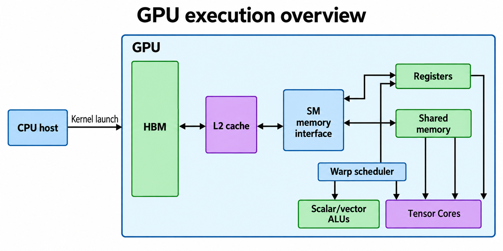
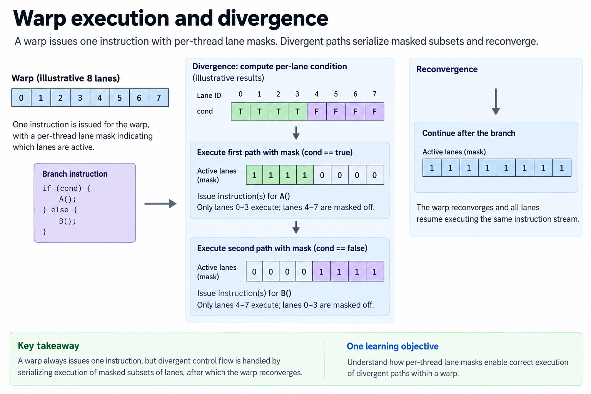
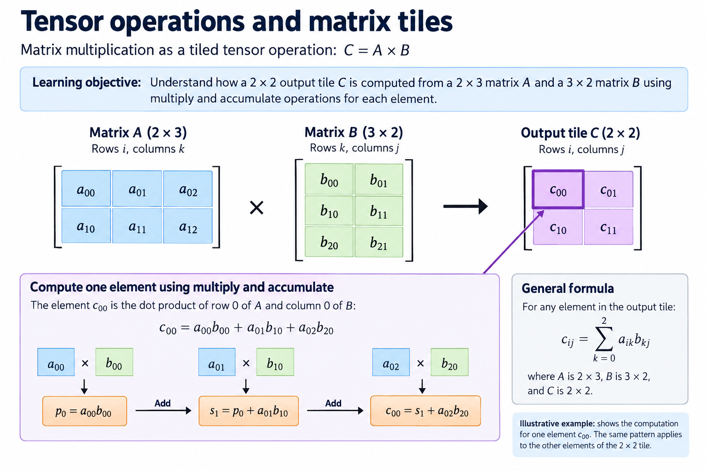
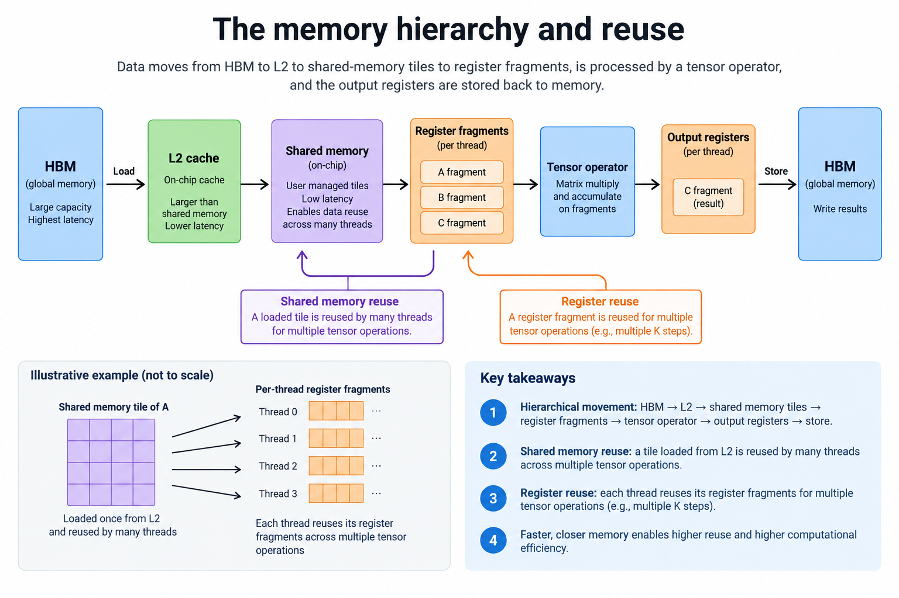
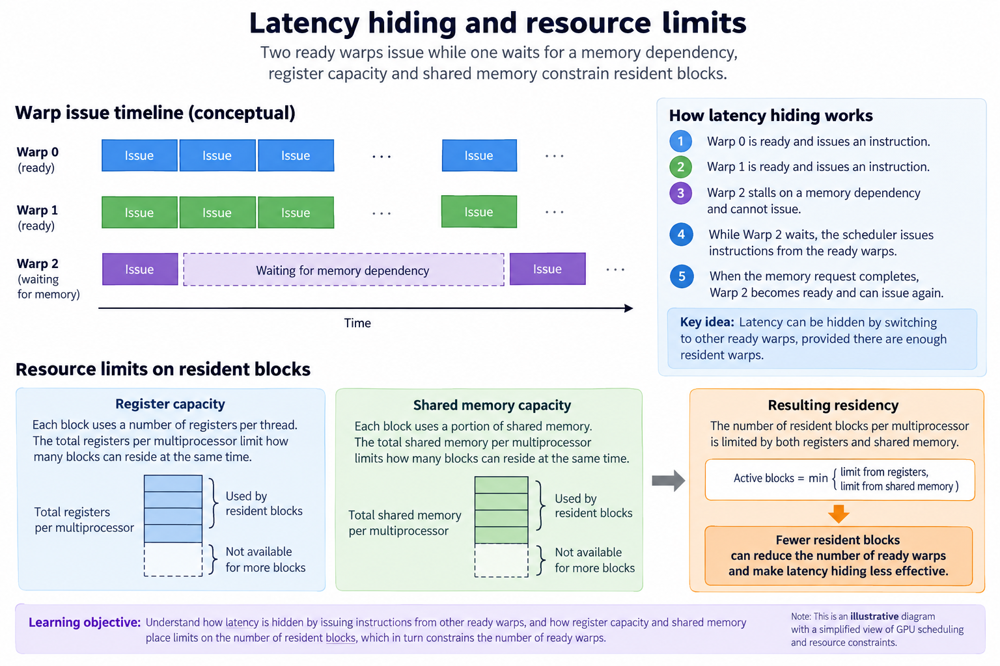
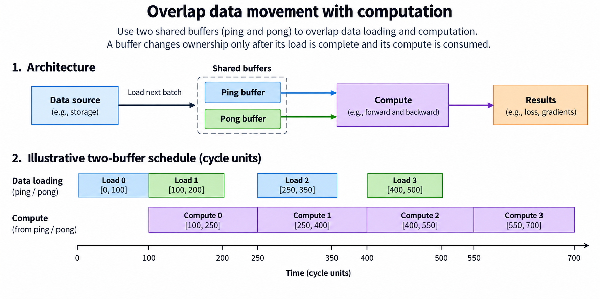
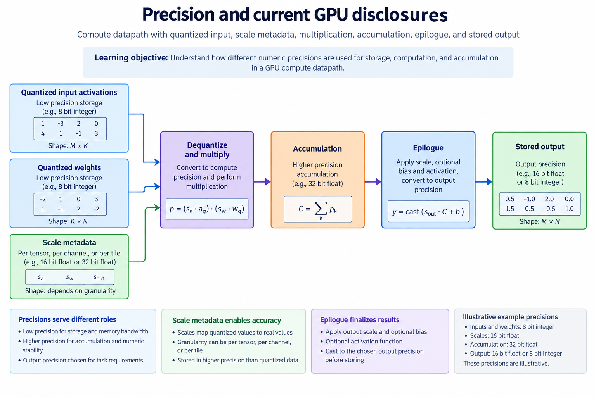

## Overview

A GPU calculates by spreading a program across many threads, then issues their arithmetic and memory operations through a hierarchy of schedulers, execution units and storage, and the overview connects these pieces: the CPU launches work, high-bandwidth memory holds large tensors, and streaming multiprocessors execute smaller groups of threads. Tensor Cores accelerate supported matrix operations within that system; they do not replace scheduling, addressing or synchronization.

The useful question is therefore not how many “cores” a product advertises. It is how a particular operator becomes instructions, how those instructions get operands, and what keeps the resulting pipeline from staying busy, and this article follows a matrix multiplication through those decisions, building on [CPU versus GPU](/blog/cpu-vs-gpu-latency-vs-throughput-machines/) and [SIMD](/blog/simd-one-instruction-many-numbers/), then connecting to the GPU Programming & Performance series.

Numerical examples below are illustrative calculations, not measurements of a commercial GPU, product disclosures are checked as of 2026-09-13, and NVIDIA terminology describes NVIDIA execution while other vendors expose related ideas with different instruction sets, thread-group names and resource organizations.

## Deep dive

### Warp execution and divergence

The figure separates a thread's logical identity from the hardware group that issues instructions. Each thread has an index, register values and a control-flow path, NVIDIA groups those threads into warps of 32, and an instruction issued for a warp operates on its participating lanes, where a lane mask can exclude threads that do not take a branch. These are programming-model properties documented in the [CUDA programming model](https://docs.nvidia.com/cuda/cuda-programming-guide/01-introduction/programming-model.html).

Suppose a kernel assigns one thread to each output element of a vector. Thread 7 loads input element 7, evaluates an expression and stores output element 7. Many threads can run that same instruction with different addresses, so the hardware does not need 32 independent copies of a general-purpose CPU frontend to make that progress: it shares instruction issue while keeping per-thread data and logical control flow.

Now let half the threads execute a long branch while the others execute a different long branch, and at points where the paths differ some lanes are masked, which creates unused arithmetic capacity even though the warp still has work. If a 10-instruction branch runs on 16 participating lanes, it contributes 160 lane-instruction operations, compared with 320 if all 32 lanes participate. That accounting does not predict wall-clock time: instruction type, dependencies and implementation affect timing. It does explain why divergent work can waste issue capacity.

A thread block groups warps that can cooperate through shared memory and supported barriers. A block must respect the device's resource limits, and a programmer must set up synchronization explicitly; modern independent thread scheduling makes undocumented assumptions about implicit lockstep unsafe, and warp-level collective operations also need the correct participation mask. Treat a warp as an execution group with defined synchronization rules. Do not assume that every lane's next instruction happens at the same physical instant.

### Tensor operations and matrix tiles

The matrix figure expands one output into a dot product. For matrices $$A\in\mathbb{R}^{M\times K}$$ and $$B\in\mathbb{R}^{K\times N}$$, the output $$C\in\mathbb{R}^{M\times N}$$ satisfies

$$
C_{ij}=\sum_{k=0}^{K-1} A_{ik}B_{kj}.
$$

Here $$i$$ selects an output row, $$j$$ an output column and $$k$$ the reduction dimension. A scalar implementation performs the products and additions individually, while a tensor instruction presents a supported tile or fragment to specialized matrix hardware, whose instruction contract specifies shapes, operand layouts, types and accumulation behavior; the physical circuit need not correspond one-to-one with the mathematical drawing.

For a checked example, let $$A=[[1,2],[3,4]]$$ and $$B=[[5,6],[7,8]]$$. The output is $$[[19,22],[43,50]]$$: the first element is $$1\times5+2\times7=19$$. All 4 output elements need 8 multiply–accumulate contributions. Under the conventional performance accounting of 2 operations per multiply–accumulate, that is 16 operations. This convention counts mathematical work, not instructions, clock cycles or separate physical multipliers.

Real kernels partition much larger matrices across thread blocks and tensor instructions. Threads load fragments, cooperate on the tile and keep partial sums while iterating over chunks of $$K$$, and boundary tiles need masks or padding, since an irregular matrix shape can otherwise create invalid accesses or useless work. The epilogue may add bias, apply an activation and convert the accumulator into the stored output type.

The benefit over scalar arithmetic comes from a datapath specialized for repeated matrix work and operand reuse, and its limitation is the same specialization, since arbitrary branching, unsupported layouts and tiny reductions may not map efficiently, a tensor instruction cannot use an operand that has not arrived, and matrix throughput therefore belongs to the entire load–compute–store schedule rather than only the multiplication unit.

### The memory hierarchy and reuse

The memory figure shows why a matrix kernel stages data: HBM stores the full matrices, caches can satisfy some repeated accesses, shared memory holds explicitly managed block-level tiles, and registers hold thread-local fragments and accumulators. These resources differ in capacity, visibility, access rules and lifetime, and shared memory is not simply a small automatic cache: the program chooses what to put there and when readers may consume it.

Consider a square tile with $$M=N=K=32$$, using 2-byte operands and 4-byte accumulated outputs. Loading each input tile once transfers $$32\times32\times2=2,048$$ bytes for $$A$$ and the same for $$B$$. Writing the output transfers $$32\times32\times4=4,096$$ bytes. With no initial output read, the illustrative external traffic is 8,192 bytes and useful work is $$2\times32^3=65,536$$ operations. Arithmetic intensity at this particular boundary is therefore 8 operations per byte.

If each output independently reloads every operand from external memory, input traffic increases enormously. Staging a tile lets an $$A$$ value contribute to several columns and a $$B$$ value to several rows. Register fragments then add more reuse near the arithmetic units. The traffic calculation must name its boundary, because external HBM bytes, shared-memory accesses and register reads are different quantities, and a cache hit may reduce HBM traffic without reducing the number of instructions.

Capacity limits the schedule: double buffering increases live input storage, wider accumulators increase register demand, and padding changes allocation, while memory layout matters too, since adjacent lanes accessing adjacent addresses can use memory transactions efficiently and scattered addresses can require extra transactions. The practical goal is a mapping that keeps numerical correctness and provides reuse. It must not eat so many resources that scheduling loses flexibility.

### Latency hiding and resource limits

The scheduling figure distinguishes waiting from executing. A warp whose next instruction depends on an unfinished load is not ready for that instruction, so a scheduler can issue ready work from another resident warp: this is latency hiding through concurrency, not a reduction in the latency of the original memory access.

Resident work is limited by register allocation, shared-memory allocation, block size and architectural limits: if a block consumes a large fraction of an SM's registers, fewer blocks may fit, and if a kernel stages several large input tiles, shared memory can impose another limit. Occupancy describes resident warps relative to a limit; it is not a direct measurement of useful arithmetic utilization.

For an illustrative resource calculation, suppose a hypothetical SM has 65,536 32-bit register slots. A 256-thread block uses 64 slots per thread. The block needs 16,384 slots before allocation granularity and other constraints. Register capacity alone allows at most 4 such blocks. Raising allocation to 128 slots per thread doubles per-block demand and reduces that bound to 2. This is an invented capacity example, not a specification of Rubin or another SKU.

More resident work is helpful only if it supplies useful instructions, and a kernel with plenty of warps can still stall on a shared dependency, run out of memory bandwidth or execute mostly masked lanes. Conversely, a kernel with lower occupancy can perform well through reuse and instruction-level parallelism, so inspect both the dependency graph and the limiting resource before changing launch geometry. [The occupancy and roofline article](/blog/occupancy-and-the-roofline/) develops the measurement side of this distinction.

### Overlap data movement with computation

The overlap figure assigns different lifetimes to two shared-memory buffers. While compute consumes tile 0 in the first buffer, a loader fills tile 1 in the second. The consumer must wait for the load's completion, and the producer must wait until the previous consumer no longer needs that buffer. These ownership dependencies are necessary even when the transfer instruction itself is asynchronous.

Let an illustrative tile load take 100 cycles and its computation take 150 cycles. A strictly sequential schedule needs 250 cycles per tile, excluding fixed overhead. Ideal overlap approaches a 150-cycle tile period after warmup because the slower stage determines steady progress. It still pays startup and drain costs, and it cannot achieve this bound if transfers contend or synchronization creates gaps. The arithmetic is a scheduling model, not a measured GPU speedup.

More buffering can expose more overlap but also eats shared memory and registers. Asynchronous movement helps when there is independent work to do during the transfer. Suppose the next operation immediately needs the same data. An asynchronous copy followed by an immediate wait then adds complexity without useful overlap.

The programmer must also respect supported copy granularities, layouts, barriers and memory-ordering rules, a complete kernel tests irregular dimensions and buffer reuse under the actual device's synchronization contract, and the safe order is to start from a correct sequential tile schedule, then introduce overlap and compare identical outputs. The loader–consumer relationship is also the basis of the FPGA project's [double-buffering lesson](/blog/fpga-ai-overlap-1-double-buffering/), though its implementation uses an explicit RTL controller.

### Precision and current GPU disclosures

The precision figure separates stored operands, scaling metadata, multiplication and accumulation. Lower-precision values cut storage and can open a faster supported execution path, while also changing approximation error, scale overhead, conversion work and supported instruction shapes, so an advertised low-bit throughput does not describe every operator or guarantee an application's accuracy.

The current disclosures provide concrete examples without changing this reasoning. NVIDIA's [Rubin architecture article](https://developer.nvidia.com/blog/inside-nvidia-rubin-gpu-architecture-powering-the-era-of-agentic-ai/) describes HBM4, Tensor Cores and a third-generation Transformer Engine. AMD's [MI350 product page](https://www.amd.com/en/products/accelerators/instinct/mi350.html) describes CDNA 4 and support including MXFP6/MXFP4. Those format names belong to specific numerical contracts and hardware paths; “4-bit” is not a complete specification.

For an illustrative storage calculation, 1 billion values need 2 billion bytes at 16 bits each. At 4 bits each they need 500 million payload bytes. Scales, packing, alignment and any uncompressed tensors add to the latter. If a kernel is limited by weight movement, reducing payload can help. If it is limited by an unsupported operation, synchronization or output traffic, the same reduction may have little effect.

A useful hardware comparison records the model, exact SKU and workload shapes. It also records storage and accumulation types, dense or sparse convention, system scope and measured software stack. A rack's aggregate peak and a single chip's sustained bandwidth answer different questions. Compare the complete operator pipeline with controlled numerical outputs, then connect its limits to end-to-end latency or throughput.

### A worked engineering decision

Consider a matrix whose useful output is only a narrow strip. The tensor instruction still has a physical tile shape. Padding can therefore occupy register fragments and instruction slots without producing useful elements. A larger advertised tensor rate cannot remove that mismatch. First record the logical M, N and K, the instruction format and the physical tile dimensions selected by the compiler. Compare useful operations with executed operations before blaming the memory system for a low measured application rate.

Now suppose the same kernel spills registers after increasing its software tile. The larger tile increases reuse, but the compiler needs more live accumulators and operands, and local-memory spill traffic can then undo the intended saving. Inspect register allocation and spill reports together with memory counters. Shared-memory allocation and register allocation also constrain how many blocks can reside concurrently, so a tile choice is a joint decision about reuse, residency and instruction mapping.

A useful experiment changes 1 variable at a time: keep the same numerical operation, precision, input layout and correctness check; compare 2 tile shapes; record latency, useful throughput, memory traffic and resources. Warm up the actual execution path before collecting repeated timings. If launch overhead dominates a workload, a different tile cannot fix that boundary; batching or fusion may be the right fix. Those measurements would describe the selected GPU and software revision, not every SIMT machine.

## Conclusion

A GPU's calculation is a coordinated sequence of thread issue, operand movement, matrix or scalar execution, accumulation and output conversion. SIMT explains how logical threads share instruction issue; tensor operations explain specialized arithmetic; the hierarchy and schedule explain whether either stays productive.

For a new operator, first draw its data dependencies and count useful arithmetic and external bytes, then choose tiles, layouts and resource allocations that support reuse, and finally measure the actual kernel with the intended precision and synchronization rules. That sequence connects architecture to programming without treating a vendor peak as an application result.

### Sources

- [CUDA programming model](https://docs.nvidia.com/cuda/cuda-programming-guide/01-introduction/programming-model.html)
- [CUDA programming guide](https://docs.nvidia.com/cuda/cuda-programming-guide/)
- [Inside NVIDIA Rubin GPU architecture](https://developer.nvidia.com/blog/inside-nvidia-rubin-gpu-architecture-powering-the-era-of-agentic-ai/)
- [AMD Instinct MI350 series](https://www.amd.com/en/products/accelerators/instinct/mi350.html)
