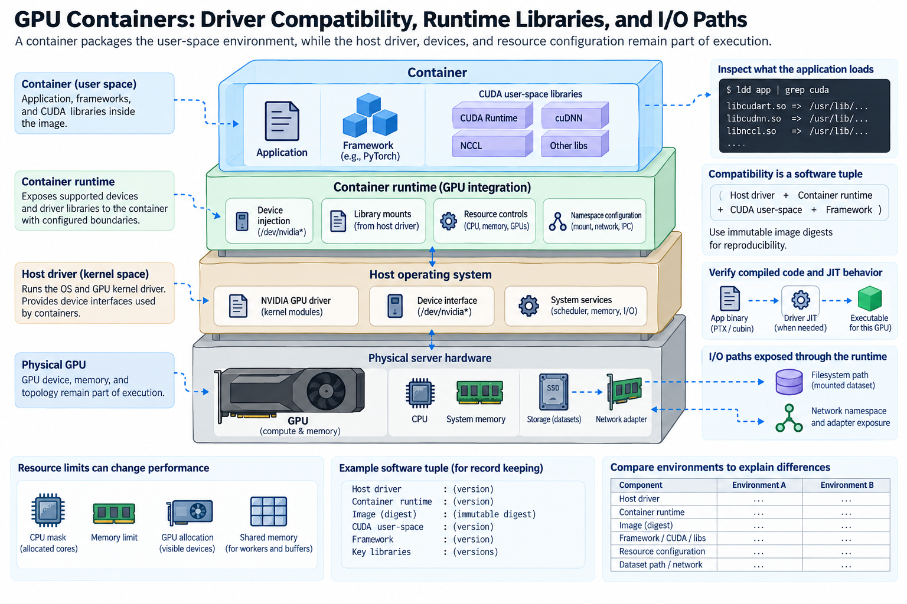
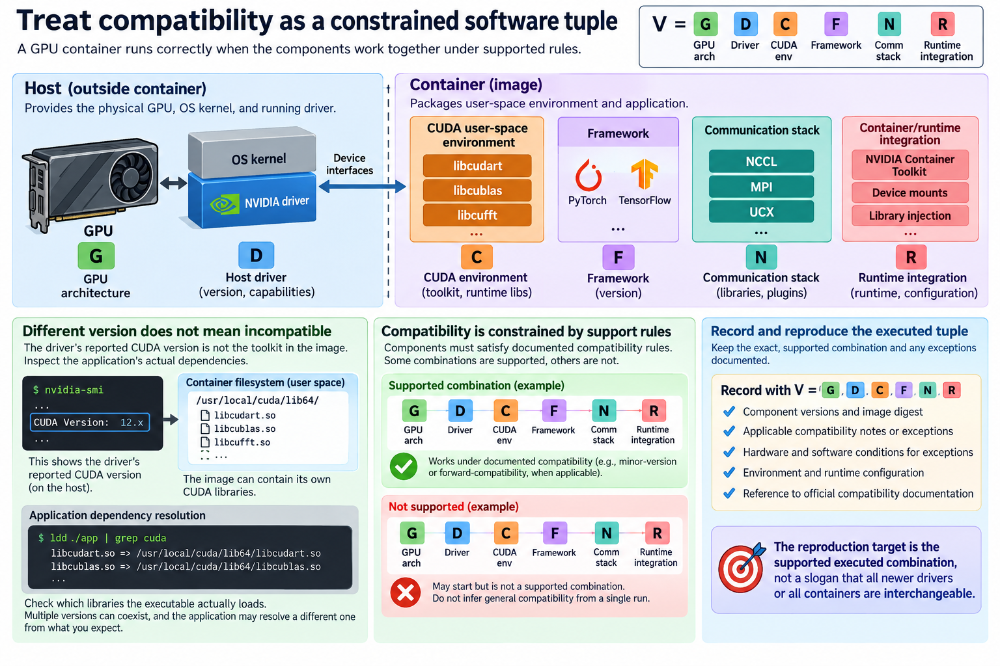
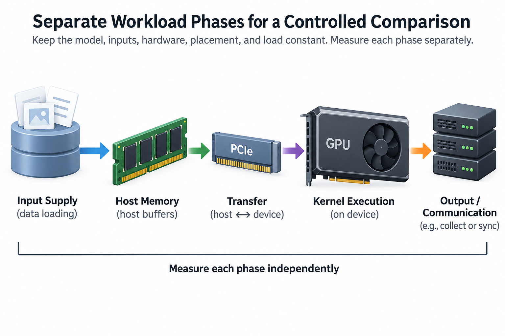

A GPU container packages an application's user-space environment, but it does not turn the host into an irrelevant detail. The physical GPU, running kernel driver, device topology, and resource allocation remain part of execution. The container runtime exposes supported devices and libraries so the application can use them through the host's driver stack.

This boundary explains many apparent container regressions. The framework version may change, a library may resolve differently, the process may receive a smaller CPU mask, or dataset access may follow a different filesystem path. The image can launch successfully while the workload executes a different program or receives different resources.

We will trace compatibility and I/O responsibilities, define a reproducible software tuple, and build a comparison method. Numerical examples are illustrative. Exact driver/runtime compatibility and supported forward-compatibility mechanisms should be checked in current NVIDIA documentation.

## 1. Separate the image from the running host driver

*Overview of the article’s core mechanism. The following sections explain the objects, relationships, equations, assumptions, and worked examples shown here.*

The host supplies the running operating-system kernel and GPU kernel driver. The image supplies application binaries and many user-space dependencies. NVIDIA's container tooling integrates supported GPU access with container execution, including the relevant device and driver interfaces.

Installing a toolkit in an image is not equivalent to replacing the host's running driver. Conversely, a capable host driver does not guarantee that the image contains the expected framework, CUDA runtime, or communication library. Both sides of the boundary matter.

Record GPU identity, host driver, container runtime integration, image identity, framework, and library versions. An image tag can move, so an immutable image digest is stronger reproduction evidence than a mutable name alone.

Keep the distinction visible during diagnosis. A device-access failure can originate in runtime exposure or host configuration. A missing application library originates elsewhere. A kernel-launch compatibility failure involves the compiled code, device, and driver capabilities rather than simply whether a GPU is visible.

## 2. Treat compatibility as a constrained software tuple

A useful execution tuple is

$$
V=(G,D,C,F,N,R),
$$

where G identifies GPU architecture, D the host driver, C the CUDA-related user-space environment, F the framework, N the communication stack, and R the container/runtime integration. This notation is an inventory, not a numerical formula that certifies compatibility.

Compatibility rules connect particular components and supported exceptions. CUDA documentation distinguishes mechanisms including minor-version and forward compatibility under defined conditions. Do not infer arbitrary compatibility from the fact that one older or newer combination happens to start.

The CUDA version printed by a driver-management utility should not be treated as proof of the toolkit installed in the image. Inspect the application's actual dependencies and environment. Multiple runtime libraries can coexist, and the executable may resolve a different one from the version an operator expected.

Preserve supported compatibility documentation beside the tuple. If a deployment uses an exception or compatibility package, record its applicable hardware and software conditions. The reproduction target is the supported executed combination, not a slogan that all newer drivers or all containers are interchangeable.

## 3. Verify compiled code and JIT behavior

GPU binaries can include architecture-specific machine code, intermediate representations, or both. The executed path depends on device compatibility and runtime selection. A framework or extension can also compile code at installation or first use.

A container change can alter compiler version, target architectures, or JIT cache behavior. Startup may become slower while steady kernels remain similar, or a different kernel implementation may execute. Compare the actual path rather than attributing every timing change to container isolation.

Separate build-time and runtime compilation. A cache populated in one environment may not apply to another software tuple or device. Preserve cache policy when it is part of the experiment, and report cold behavior separately from reused execution.

A simple amortized timing model is

$$
\overline T_{\mathrm{step}}\approx T_{\mathrm{setup}}/N+T_{\mathrm{steady}},
$$

for N comparable steps and one setup cost. With illustrative setup of 20 seconds and 1000 steps, setup contributes 20 milliseconds per step in the aggregate accounting. With only 10 steps, it contributes 2 seconds per step. The appropriate comparison follows the workload's lifetime.

## 4. Inspect the libraries the application actually loads

Framework packages, custom extensions, BLAS implementations, and communication libraries can be bundled or supplied through the environment. A version listing is useful, but the dynamic linker and application configuration determine what is actually loaded.

Record resolved library identities in a controlled diagnostic run where supported. A changed search path can select a different implementation without changing the application source. Duplicate libraries can complicate diagnosis if the operator assumes a package version alone defines execution.

For distributed workloads, preserve the communication-library and transport integration on every rank. Mixing unexpected components across hosts can create inconsistent behavior or unsupported combinations. The relevant evidence is the per-rank executed stack.

Compare a minimal operation before a full model. A small correctness and timing case can reveal basic device access or library resolution problems. The full application remains necessary because it exercises custom extensions, dynamic shapes, and communication paths that the minimal case omits.

## 5. Resource limits can change performance without changing code

The process receives an allocation of CPUs, memory, devices, and other resources through the host and container configuration. CPU quotas and allowed masks can influence data loading, posting, compilation, and progress. Device visibility determines which GPUs the process can select.

Record effective resources inside the container, not only the host's total capacity. A host with many CPUs does not imply the job can use them all. A GPU model name does not establish the rank's device placement or NIC locality.

A simplified CPU-demand condition is

$$
C_{\mathrm{loader}}+C_{\mathrm{progress}}+C_{\mathrm{application}}\le C_{\mathrm{available}},
$$

under a common accounting interval. It is not an exact scheduler model, but it identifies why a smaller host allocation can starve a GPU workload whose device kernels are unchanged.

Keep allocation constant during container-versus-host comparisons. If the native baseline receives more CPUs or a different NUMA placement, the result measures both packaging and resources. Those differences can be intentional, but they should be explicit.

## 6. Shared memory and worker buffers need capacity

Multiprocess data loading and interprocess tensor exchange can use shared-memory resources under the runtime's supported mechanisms. The container's shared-memory environment can differ from the host baseline, affecting capacity and failure behavior.

A first-order buffered-data estimate is workers times prefetched batches times batch footprint, plus relevant copies and process state. Actual sharing and reuse can change the physical total. Inspect observed memory and the runtime's definitions rather than assuming every logical buffer is independently allocated.

For illustrative 8 workers, 2 prefetched batches each, and 64 MiB per batch, queued data alone can reach 1 GiB. A smaller shared-memory resource or host-memory allocation can therefore become a practical limit even when the GPU has ample HBM.

Distinguish capacity failures from throughput regressions. A worker failure can leave the training loop waiting on input, which may look like a GPU or network stall. Preserve the first worker error and loader state rather than diagnosing only the final blocked step.

## 7. Trace the dataset's filesystem path

A dataset accessed through a mounted storage path can behave differently from files embedded in an image or written through a layered filesystem. Metadata, caching, copy-on-write behavior, and remote-storage configuration can affect the workload.

For N file operations with startup alpha and D bytes at effective bandwidth B, a simple serial model is

$$
T_{\mathrm{I/O}}\approx N\alpha+D/B.
$$

The equation explains why many small records can expose metadata and request overhead even when large-file bandwidth is healthy. Concurrency and caching can change the schedule, so measure the actual ready-input path.

Preserve dataset version, mount identity, cache state, and record layout. Comparing a warm host cache with a cold container path can produce a large apparent packaging penalty that is actually cache population. Similarly, a changed file layout can improve I/O while changing the experimental workload.

Direct-storage support requires its own platform and path verification. A GPU-enabled container is not automatically a GPUDirect Storage deployment. Verify the actual supported storage route and the decoding work that still follows it.

## 8. Network namespaces and adapter exposure matter

The application's visible interfaces and addressing can differ inside the container. Distributed communication must establish supported connectivity and select the intended transport and adapters. A successful frontend connection does not prove a high-performance collective path.

Use current communication-library diagnostics in a controlled run to identify devices and fallback. Preserve rank-to-GPU and rank-to-adapter mapping. A container change can alter discovery or selection even when the external fabric is unchanged.

Compare host-buffer and GPU-buffer communication where supported, then the intended collective. This hierarchy helps separate connectivity, direct-memory integration, and application scheduling. A healthy pair test is necessary evidence for its path, but not proof that every rank uses it in the full job.

Keep network and resource policies explicit in the deployment record. A native and containerized comparison with different interface access or process placement answers a broader question than container overhead alone.

## 9. Build a controlled comparison matrix

Hold model, useful inputs, output contract, hardware, placement, and offered load constant. Separate startup, compilation, input supply, transfer, kernel execution, and communication. A total duration without phase evidence can detect a change but cannot explain it.

Start with minimal correctness cases for device access and resolved libraries. Add representative kernel shapes, data loading, and distributed operations. Finally measure useful application throughput and latency under the intended concurrency.

For an illustrative investigation, identical kernel times with larger loader waits suggest an input or host-resource difference. A changed kernel selection suggests software resolution or compilation. Healthy host-buffer networking with degraded GPU-buffer transfers suggests device-memory integration or locality. These comparisons guide the next test rather than proving a cause from one observation.

Record the baseline and candidate tuples, effective resource masks, image digest, mounted paths, selected libraries, and raw timing observations. The comparison should be reproducible by another operator without guessing which parts of the host were inherited.

A compact manifest can include the immutable image digest, package lock or environment export, custom-extension build configuration, driver identity, visible devices, effective CPU masks, dataset mounts, and communication diagnostics. Store it with the measured observations rather than only in an operator's terminal history. If a rebuilt image uses a newer dependency despite the same human-readable tag, the manifest reveals that change. This makes the comparison an execution experiment with identifiable components instead of an unexplained contrast between inside and outside a container.

## 10. Keep packaging as part of the execution record

A container's value is a reproducible application environment integrated with supported host resources. It does not eliminate the host boundary, and it does not guarantee identical performance across differently configured machines.

After updates, verify the relevant compatibility and path cases rather than repeating an unrelated exhaustive benchmark. Preserve failure evidence and remove exploratory settings whose effect is no longer needed. The required checks follow the components changed by the update.

GPU container performance becomes understandable when the image, host driver, libraries, allocation, and I/O paths are recorded together. Compatibility establishes that execution is supported; phase measurements establish what executed and where time went. Adopt the environment that delivers correct useful work under the intended resource and service objectives.

## Sources

- [NVIDIA Container Toolkit overview](https://docs.nvidia.com/datacenter/cloud-native/container-toolkit/latest/overview.html).
- [NVIDIA CUDA compatibility documentation](https://docs.nvidia.com/deploy/cuda-compatibility/index.html).
- [PyTorch data loading and multiprocessing](https://docs.pytorch.org/docs/stable/data.html).
