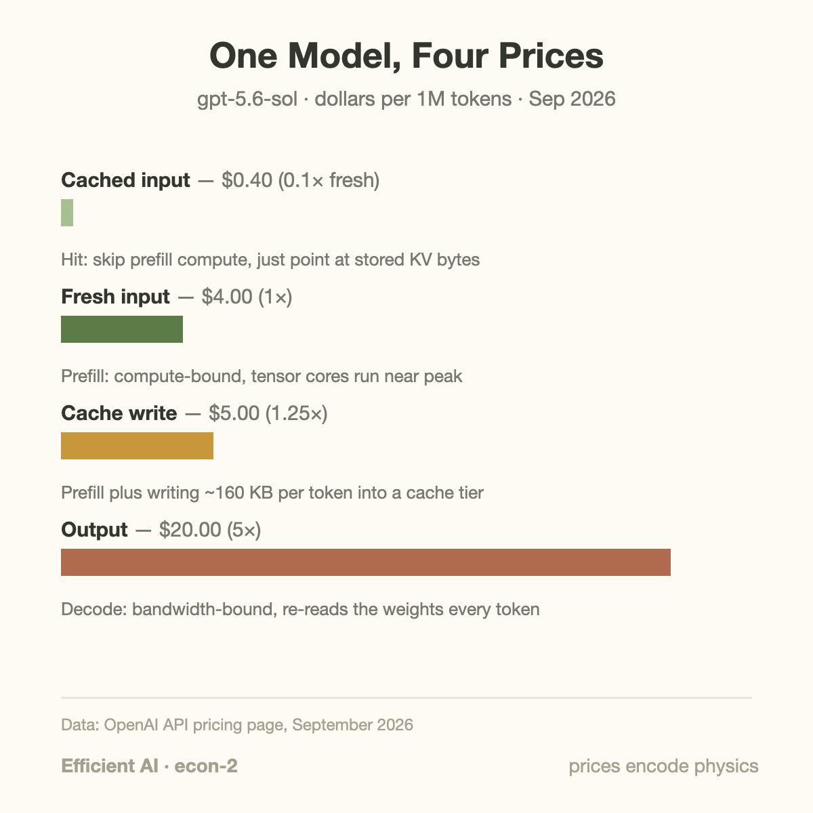
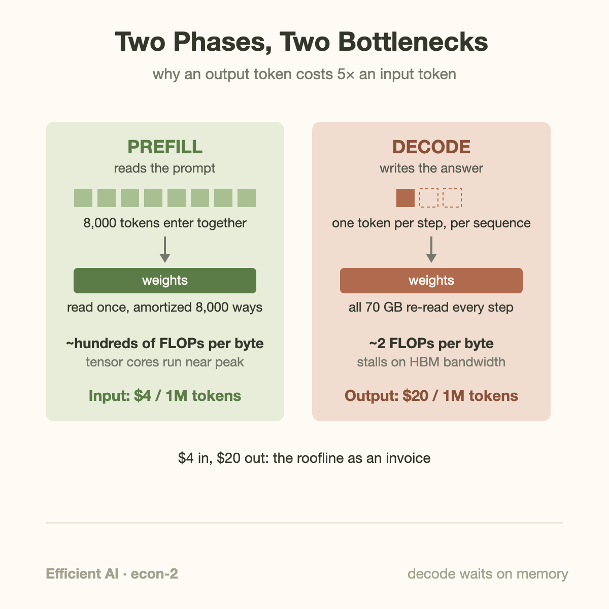
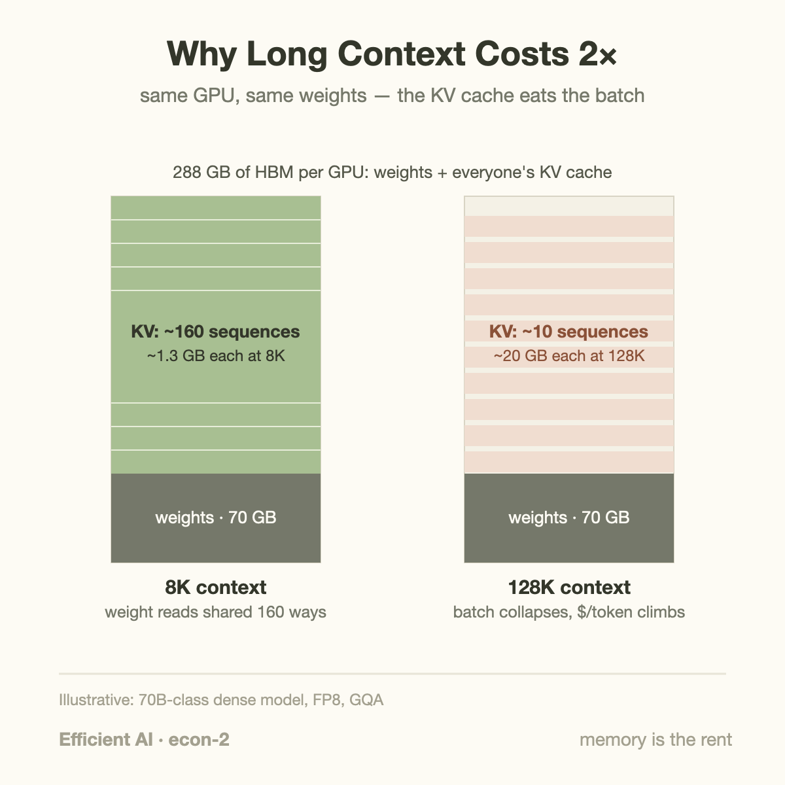

Fifty to one. That is the spread inside a single row of OpenAI's current price sheet: a million output tokens from gpt-5.6-sol costs $20, a million fresh input tokens costs $4, and a million cached input tokens costs $0.40. Nobody sat in a meeting and invented those gaps for marketing reasons. Each one is a hardware bottleneck with a dollar sign attached, and once you know what to look for, a public pricing page reads like a leaked engineering document.

This article decodes the page ratio by ratio. The prices themselves are public facts (I pulled them from OpenAI's pricing page in September 2026); the mapping from price to silicon is inference on my part, so treat the ratios as approximate signals rather than an audited bill of materials. The signals, though, are remarkably consistent.

## The vocabulary: two phases and a cache

Serving a large language model has two phases with opposite personalities.

**Prefill** is what happens to your prompt. The model reads all input tokens at once, in parallel, building up an internal record of what it has seen. This phase is *compute-bound*: the GPU performs enormous matrix multiplications, its tensor cores (the units that do bulk matrix math) run near their rated speed, and the whole prompt is digested in one pass over the model's weights.

**Decode** is what happens to the answer. The model produces output one token at a time, because each new token depends on the ones before it. For every single token, the GPU must stream the model's weights out of memory again. This phase is *bandwidth-bound*: the limiting factor is not how fast the chip can multiply, but how fast HBM (the stacked high-bandwidth memory soldered next to the GPU die) can feed it.

The bridge between the phases is the **KV cache**. During prefill, the model saves a compact summary of every input token, the "keys" and "values" that attention uses to look back at earlier context. Decode reads this cache constantly. And crucially, if you send the same long prompt twice, the provider can save the KV cache from the first request and skip prefill entirely on the second. That trick is what "cached input" pricing sells.

With those three ideas, the whole price sheet opens up.

## Four prices, four bottlenecks

Here is the standard-tier row for gpt-5.6-sol, OpenAI's mid-flagship, as of September 2026, in dollars per million tokens:

| Line item | Price | Ratio to fresh input |
|---|---|---|
| Cached input | $0.40 | 0.1x |
| Fresh input | $4.00 | 1x |
| Cache write | $5.00 | 1.25x |
| Output | $20.00 | 5x |

Every model on the page shows the same shape. Cached input is exactly 10% of fresh input across the lineup, from the $10 gpt-6-astra down to the $0.20 gpt-5.6-luna. Cache writes carry a 1.25x premium everywhere. Output runs 5x input on the flagships and 6x on the smaller tiers. Long-context requests pay roughly 2x on input and 1.5x on output. Batch processing is half price; the low-latency "fast mode" tier is double. When one shape repeats across a dozen models at wildly different absolute prices, you are looking at cost structure, not positioning.

Let's decode each ratio.

**Cached input at 0.1x: reuse beats recompute.** On a cache hit, the provider skips prefill compute entirely. The KV summary of your prompt already sits in a memory tier somewhere; serving your request means retrieving those bytes instead of re-deriving them with trillions of multiply-adds. A 90% discount says recompute is expensive and retrieval is cheap, which is exactly what the silicon says too (with an interesting wrinkle we will get to below).

**Cache write at 1.25x: storage is not free.** The first time a prompt is cached, you pay full prefill *plus* a 25% surcharge. The surcharge covers moving the KV bytes into a persistent tier and holding them there against future hits. Modern serving stacks like Mooncake and LMCache spill KV state from scarce HBM into cluster DRAM and even SSDs, and that pipeline has real costs: bandwidth to move the data, capacity to keep it, machinery to find it again.

**Output at 5x: decode is slow per token.** This is the roofline speaking, and it deserves its own section below.

**Long context at ~2x: attention grows and the cache balloons.** Attention cost during prefill grows quadratically with sequence length, and the KV cache grows linearly, hogging memory that would otherwise hold other users' requests. More on this below too.

## A worked example: one agent session, by hand

Abstract ratios stick better with a concrete bill. Take a coding agent with a 50,000-token context (system prompt plus a repository digest) that runs for 20 turns. Each turn the user adds 1,000 tokens and the model replies with 500, and the full history is resent every turn. All prices are gpt-5.6-sol standard tier.

**Without caching.** Turn *n* sends 50,000 + (n-1) x 1,500 input tokens. Over 20 turns:

- Input: 20 x 50,000 + 1,500 x (0+1+...+19) = 1,000,000 + 285,000 = **1,285,000 tokens**. At $4 per million: **$5.14**.
- Output: 20 x 500 = 10,000 tokens. At $20 per million: **$0.20**.
- Session total: **$5.34**, of which 96% is input.

**With caching.** Only the *new* tokens each turn are fresh; everything already seen is a cache hit. Roughly 79,500 tokens get written to cache over the session (the initial 51,000 plus 1,500 per subsequent turn), and the remaining ~1,205,500 input tokens are hits.

- Cache writes: 79,500 x $5 per million = **$0.40**.
- Cached reads: 1,205,500 x $0.40 per million = **$0.48**.
- Output: unchanged, **$0.20**.
- Session total: **$1.08**.

The bill dropped 5x, and its composition flipped: output went from a rounding error (4% of spend) to nearly a fifth of it. This is the general pattern for agentic workloads, which is why every serious agent framework became obsessed with prompt-cache hygiene. It also explains a breakeven rule you can derive from the sheet: the write premium is $1 per million tokens (the extra 0.25 x $4), and each later hit saves $3.60 per million ($4.00 minus $0.40). Caching pays for itself if a prefix has even a ~28% chance of being reused once. Almost any multi-turn conversation clears that bar on turn two.

## Going deeper: the ratios, derived from the chip

Now push one level down and ask why the ratios take these particular values. Use a concrete stand-in: a 70B-parameter dense model in FP8 (one byte per weight, so 70 GB of weights) on a GB300-class GPU with 288 GB of HBM at 8 TB/s, capable of very roughly 5 x 10^15 FLOPs of dense FP8 matrix math per second.

**Why output costs 5x input.** Generating one token requires about 2 FLOPs per parameter, so ~140 GFLOPs. At 5 PFLOP/s, that is 28 microseconds of arithmetic. But the GPU must also stream all 70 GB of weights through its compute units for that step, and at 8 TB/s that takes 8,750 microseconds. For a single sequence, the chip spends over 99% of each decode step waiting on memory. In roofline terms, decode at batch size 1 has an arithmetic intensity of about 2 FLOPs per byte moved, while the machine's balance point sits around 600 FLOPs per byte. Prefill, by contrast, amortizes one weight pass across thousands of prompt tokens and lands comfortably on the compute side of the roofline.

Providers claw back efficiency by batching many users' decode steps together, so one weight pass serves dozens of tokens. But batching has a ceiling (KV cache capacity, more below) and a latency cost, and even well-batched decode produces tokens far slower than prefill consumes them. Public serving benchmarks give a feel for the gap: SGLang on a GB200 NVL72 rack reports roughly 26,000 prefill tokens per second per GPU against roughly 13,000 decode tokens per second per GPU on DeepSeek-R1-class models, and that decode figure already assumes aggressive batching and disaggregated serving. Fold in the stricter latency guarantees on output and the 5-6x price multiple looks less like margin and more like physics plus a service-level agreement.

**Why cached input is 10x cheaper, not 1,000x.** Here is the wrinkle. Work out the raw silicon ratio yourself. Recomputing one prompt token costs ~140 GFLOPs, or 28 microseconds of GPU math in our stand-in. The KV cache for that token, in a GQA model with 80 layers and 8 KV heads of dimension 128 in FP8, is about 2 x 80 x 1,024 bytes, roughly 160 KB. Reading 160 KB at 8 TB/s takes 0.02 microseconds. Recompute is on the order of a *thousand times* more expensive than the read, yet the discount is only 10x. The gap between 1,000x and 10x is everything that surrounds the read: keeping terabytes of KV state warm across DRAM and SSD tiers, shipping it back into HBM on a hit, indexing and evicting it, and eating the cost of misses. The price tells you that caching, at scale, is a storage-systems business with real overhead, not a free lunch. The DistServe retrospective's framing is apt: inference has quietly become a storage problem.

**Why long context costs ~2x.** At 160 KB per token, an 8K-token conversation carries about 1.3 GB of KV state, while a 128K-token one carries about 20 GB. On our 288 GB GPU, after 70 GB of weights, the leftover memory fits roughly 160 short-context sequences but only about 10 long-context ones. Fewer concurrent sequences means each expensive weight read is shared fewer ways, so cost per token rises even before you count prefill's quadratic attention bill. OpenAI prices this as roughly 2x on input and 1.5x on output past the short-context threshold. The industry's answer at the hardware level is telling: NVIDIA's Rubin CPX is a GPU built specifically for long-context prefill, pairing heavy compute with cheaper GDDR7 memory because prefill does not need HBM's bandwidth the way decode does.

**Why batch is half price and fast mode is double.** These two tiers price the same thing in opposite directions: scheduling freedom. Batch jobs (results within 24 hours) let the provider fill idle capacity and run at maximum utilization, so they cost 50% of standard. Fast mode pins capacity for low latency, which means running GPUs at lower occupancy so your tokens never queue, and it costs 2x. Same silicon, different goodput contract.

## Common misconceptions

**"Cache discounts are a loyalty perk, like a bulk coupon."** No. The discount maps to compute the provider genuinely does not perform. The cleanest proof that serving prices track engineering costs came from DeepSeek: the day it shipped its sparse-attention architecture (DSA) in V3.2-Exp, it cut API prices by more than half, and published the kernels. When efficiency improves, prices move, because in a competitive market the price sheet is tethered to the cost sheet.

**"Output tokens cost more because answers are worth more than prompts."** Value-based pricing would vary wildly by vendor and use case. Instead, essentially every provider, on every model, lands output at roughly 4-6x input, because everyone faces the same roofline: decode re-reads weights per token and stalls on memory bandwidth, prefill amortizes one read across the whole prompt. When independent companies with different margins converge on the same ratio, the ratio belongs to the hardware.

**"A cache hit costs the provider basically nothing, so 10% is a rip-off."** The raw compute-versus-read ratio is indeed closer to 1,000x than 10x, but the priced product is not a memory read. It is a distributed storage tier holding your KV state (about 160 KB per token, gigabytes per long conversation) across HBM, DRAM, and SSD, with transfer, indexing, eviction, and miss costs baked in. Ten percent of fresh price for all of that is closer to fair than it first appears, and the 1.25x write premium is the honest admission that persistence costs money up front.

## The bigger picture

Once you read one price sheet this way, the whole market becomes legible. The 20x input-price spread between gpt-5.6-sol ($4) and gpt-5.6-luna ($0.20) tells you the frontier is no longer one flagship model but a routing ladder, where most tokens flow through small, cheap models and only hard queries pay flagship rates. The long-context premium tells you memory capacity, not FLOPs, is the scarce resource, the same conclusion the [Blackwell-to-Rubin memory math](/blog/blackwell-to-rubin-memory-math/) reaches from the hardware side, where capacity stays flat at 288 GB while bandwidth nearly triples. The batch and fast-mode tiers are [goodput versus utilization](/blog/goodput-vs-utilization/) translated into retail pricing: you are buying a latency distribution, not just tokens. And the entire cached-input economy exists because of the KV cache, a data structure whose origin story is the attention mechanism itself, covered in [Attention in Plain Words](/blog/attention-in-plain-words/).

This is also, quietly, a recruiting pitch. Every ratio on that page is a target painted on a bottleneck, and shifting any of them (a better cache hit rate, a leaner KV format, a smarter batch scheduler) moves real revenue. That is precisely the job described in [What Does an ML Performance Engineer Do?](/blog/what-does-an-ml-performance-engineer-do/), except now the performance report is published monthly, in dollars, for everyone to read.

## Takeaway

- API price sheets are compressed hardware documentation: cached input at 0.1x prices skipped prefill compute, the 1.25x cache-write premium prices KV storage, output at 5-6x prices bandwidth-bound decode, and long-context premiums price the KV cache crowding out batch size.
- The ratios are consistent across models and vendors because they come from the roofline, not from marketing; when architecture improves (DeepSeek's sparse attention), prices drop within a day.
- For anyone building on these APIs, the sheet is an optimization guide: maximize cache hits (stable prefixes, append-only context), budget output tokens hardest, and treat long context as a 2x luxury rather than a default.

## Sources

- OpenAI, "API Pricing," developer documentation: https://developers.openai.com/api/docs/pricing (prices retrieved September 2026)
- DeepSeek, "DeepSeek-V3.2-Exp Release" (DSA sparse attention with same-day 50%+ API price cut): https://api-docs.deepseek.com/news/news250929/
- Hao AI Lab, "DistServe: 18 Months Later," retrospective on prefill/decode disaggregation and KV-cache storage tiers: https://haoailab.com/blogs/distserve-retro/
- LMSYS, "Deploying DeepSeek on GB200 NVL72, Part 2," SGLang prefill/decode throughput measurements: https://lmsys.org/blog/2025-09-25-gb200-part-2/
- NVIDIA, "NVIDIA Unveils Rubin CPX," a GPU class dedicated to long-context prefill: https://nvidianews.nvidia.com/news/nvidia-unveils-rubin-cpx-a-new-class-of-gpu-designed-for-massive-context-inference
- Mooncake: KV-cache-centric disaggregated serving (Qin et al., FAST '25 best paper), cited without link.

*Part of the **Efficient AI & Co-Design** series. The previous entry, [Goodput vs Utilization](/blog/goodput-vs-utilization/), explains the latency contracts behind the batch and fast-mode tiers; next we follow the money one level down, from the price sheet to the power bill.*
