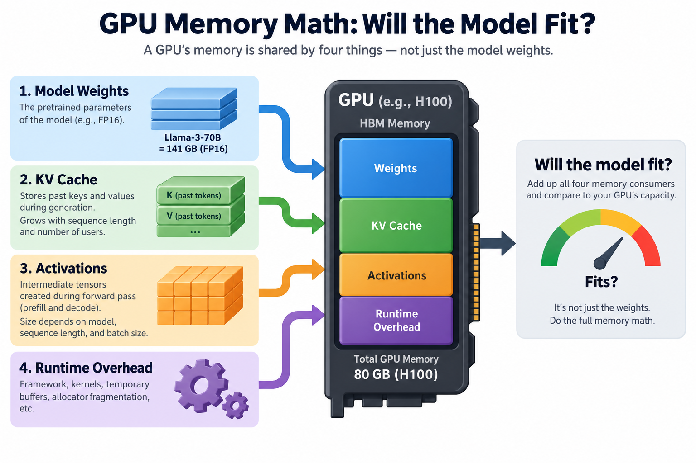
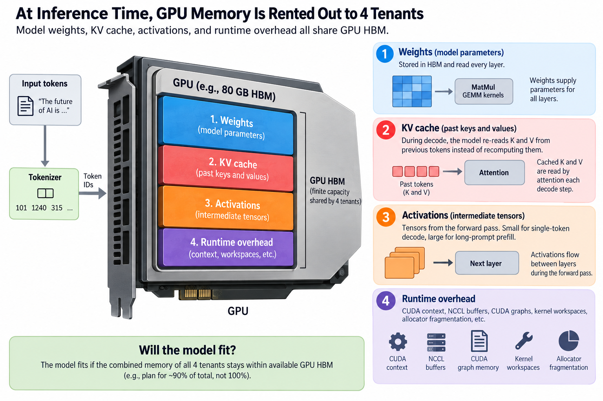
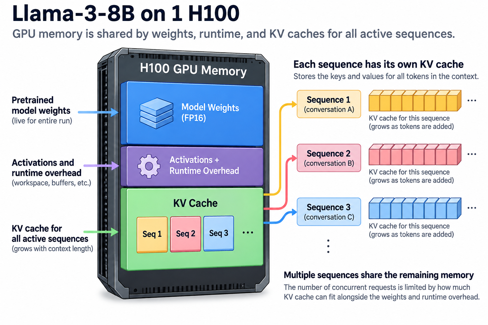
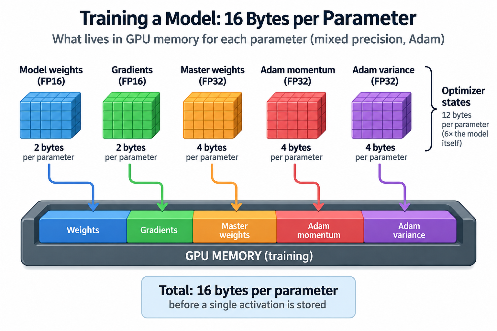

## Overview



A Llama-3-70B checkpoint in FP16 weighs 141 GB. An H100 has 80 GB of HBM. That single subtraction kills more deployment plans than any benchmark ever will, and yet the full version of the question "will it fit?" involves 4 separate memory consumers, only one of which is printed on the model card.

Every capacity conversation I have with infra teams starts the same way: someone quotes a parameter count, someone else quotes a GPU spec, and both walk away with a number that is wrong by 2x. The gap is almost never the weights. It is the KV cache, the activations, and the runtime overhead nobody budgeted for. The good news is that all of it is arithmetic you can do on a napkin, and this article is that napkin.

If prefill, decode, and the KV cache are fuzzy concepts for you, read [How an LLM Generates Text](/blog/how-an-llm-generates-text/) first; this piece assumes them.

## Deep dive

### The 4 tenants of GPU memory



At inference time, GPU memory is rented out to 4 tenants:

**1. Weights.** The 1 everyone knows. Parameters times bytes per parameter:

| Precision | Bytes/param | Llama-3-8B (8.03B) | Llama-3-70B (70.6B) |
|---|---|---|---|
| FP32 | 4 | 32.1 GB | 282 GB |
| FP16 / BF16 | 2 | 16.1 GB | 141 GB |
| FP8 | 1 | 8.0 GB | 70.6 GB |
| INT4 (grouped) | ~0.56 | ~4.5 GB | ~40 GB |

INT4 is not exactly 0.5 bytes per parameter because group-wise quantization stores a scale (and often a 0 point) per group of 64 or 128 weights, which adds 5 to 12 percent depending on the scheme.

**2. KV cache.** During decode, the model re-reads the keys and values of every previous token instead of recomputing them. Those cached tensors live in HBM, and their size is:

```
KV bytes = 2 × n_layers × n_kv_heads × head_dim × bytes_per_elem   (per token)
```

The leading 2 is for K and V. Note that it is `n_kv_heads`, not the full attention head count. Llama 3 uses grouped-query attention (GQA), where many query heads share 1 KV head; both the 8B and the 70B keep only 8 KV heads. That design choice is the difference between a serviceable batch size and an out-of-memory error, as we will see.

**3. Activations.** The intermediate tensors of the forward pass. For single-token decode steps these are small (tens to hundreds of MB), but prefill on a long prompt materializes activations proportional to prompt length, and serving engines pre-allocate for the worst case. Budget a few GB.

**4. Runtime overhead.** The CUDA context (~500 MB to 1 GB), NCCL communication buffers if you shard across GPUs, CUDA graph memory, workspace for attention and GEMM kernels, and allocator fragmentation. This is why vLLM's `gpu_memory_utilization` defaults to 0.9 rather than 1.0: on an 80 GB card, you realistically plan against about 72 GB.

Training adds 2 more tenants, gradients and optimizer states, which we will get to in the going-deeper section. They are why an 8B model that serves comfortably on 1 GPU needs a small cluster to fine-tune in full precision.

### Worked example: Llama-3-8B on 1 H100



Let's do the whole calculation by hand for a realistic serving setup: Llama-3-8B in FP16 on an H100 80 GB, 8k context, and we want to know how many concurrent sequences we can hold.

**Weights.** 8.03B parameters × 2 bytes = **16.1 GB**.

**KV cache per token.** The 8B model has 32 layers, 8 KV heads, head dimension 128, FP16 elements:

```
2 × 32 × 8 × 128 × 2 bytes = 131,072 bytes ≈ 131 KB per token
```

**KV cache per sequence.** At the full 8,192-token context:

```
8,192 × 131 KB ≈ 1.07 GB per sequence
```

Sit with that for a second. 1 conversation at full context costs a gigabyte of HBM, for an 8B model, with GQA already saving us a factor of 4.

**The budget.** Take 90 percent of 80 GB as usable: 72 GB. Subtract weights (16.1 GB) and a conservative 5 GB for activations plus runtime overhead. What remains for KV cache:

```
72 − 16.1 − 5 ≈ 51 GB  →  51 / 1.07 ≈ 47 full-length sequences
```

So 1 H100 serves this model with a modeled capacity ceiling of 47 concurrent 8k-context requests. In practice most requests do not use the full window, and PagedAttention allocates KV blocks on demand, so real concurrency runs higher; but 47 is the modeled maximum under these assumptions, and it is the number a capacity plan should quote.

**Now the 70B.** Weights in FP16: 141 GB. It does not fit; no amount of cleverness changes that. Your options, in the order most teams try them:

- **FP8 weights: 70.6 GB.** It loads. Then you subtract overhead and discover you have only 1.4 GB before the separate activation/runtime reserve. The 70B's KV cost per token is 2 × 80 × 8 × 128 × 2 = 328 KB, so an 8k sequence needs 2.7 GB. Under the stated reserve, this illustrative budget admits no full request. The model "fits" in the way a couch fits through a doorway held vertically: technically, and uselessly.
- **INT4 weights: ~40 GB.** Now ~27 GB of KV budget remains, about 10 8k sequences at FP16 KV, 20 if you quantize the cache to FP8 too. This is a genuine single-GPU configuration, with the accuracy caveats of 4-bit weights.
- **Tensor parallelism across 2 GPUs.** Each H100 holds 141.2 GB / 2 = 70.6 GB of FP16 weights, leaving only 1.4 GB before the additional reserve in this budget. The KV cache shards across GPUs as well (each holds its slice of the heads), so head sharding reduces per-device cache cost, but does not rescue a budget already exhausted by weights and reserve. TP=4 or lower-precision weights provides substantially more headroom.
- **Offload to CPU RAM.** It works for weight storage, but PCIe Gen5 moves ~64 GB/s against HBM3's 3,350 GB/s. Fine for loading, occasionally tolerable for rarely-used expert weights, ruinous for anything on the per-token path.


Use an admission inequality instead of rounding a capacity estimate up. Let $$H$$ be device capacity, $$u$$ the admitted memory fraction, $$P$$ parameter count, $$b_w$$ effective bytes per weight, $$A$$ separately budgeted activation and workspace memory, and $$k=2Lh_{kv}db_{kv}$$ cache bytes per token. For $$B$$ equal-length requests of $$S$$ live tokens,

$$
Pb_w+A+BSk\le uH,\qquad
B_{\max}=\left\lfloor\frac{uH-Pb_w-A}{Sk}\right\rfloor.
$$

Here $$L$$ is layer count, $$h_{kv}$$ KV-head count, $$d$$ head dimension, and $$b_{kv}$$ cache element bytes. With the rounded 16.1 GB weight budget, 5 GB reserve, and exact $$Sk=1073741824$$ bytes, the available 50.9 decimal GB admits at most 47 requests, not 48. The 48th requires 51.54 GB of cache. This is a capacity ceiling under specified assumptions, not a guaranteed serving throughput or stable worst-case floor.

Paging changes allocation granularity and avoids reserving unused future tokens; it cannot violate this inequality. Admit by projected live-token growth, include generation allowances, and check measured high-water memory. Sharding also needs per-device accounting: 141.2 GB of FP16 70B weights split across 2 GPUs leaves 70.6 GB of weights on each, not 35.3 GB. Under a 72 GB budget with a 5 GB reserve, that illustrative configuration has no positive cache budget. You need more devices, lower precision, or a different measured reserve.

### Going deeper: training, and where the formulas come from



The inference math above prices a model at 2 bytes per parameter plus cache. Training the same model in standard mixed precision costs **16 bytes per parameter** before a single activation is stored. The breakdown, from the ZeRO paper (Rajbhandari et al., 2019):

- FP16 weights: 2 bytes
- FP16 gradients: 2 bytes
- FP32 master weights: 4 bytes
- Adam momentum (FP32): 4 bytes
- Adam variance (FP32): 4 bytes

The optimizer's states alone are 12 bytes per parameter, 6 times the model itself. For Llama-3-8B that is 128 GB of state, which is why "it serves on 1 H100" and "it fine-tunes on 1 H100" are entirely different claims, and why 0's whole contribution was sharding those 16 bytes across data-parallel ranks instead of replicating them. Full fine-tuning of the 8B needs at least 2 80 GB GPUs just for state, plus activation memory, which scales with batch × sequence length × hidden size × layers and is the reason activation checkpointing (recompute instead of store) exists.


Back on the inference side, 2 mechanisms deserve 1 more level of detail.

**GQA changes attention architecture to reduce cache storage and traffic.** Multi-head attention in the 8B model would carry 32 KV heads: 524 KB per token, 4.3 GB per 8k sequence, and our 47-sequence H100 becomes an 11-sequence H100. The 70B with its 64 query heads would pay 2.6 MB per token under MHA; GQA's 8 KV heads cut that by 8x. Ainslie et al. (2023) showed the quality cost of this sharing is small, which is why many dense transformer families use it, while other architectures use different cache designs. When you evaluate a new checkpoint, `n_kv_heads` in the config file tells you more about its serving economics than the parameter count does.

**PagedAttention is why the "floor" isn't the ceiling.** Naive serving pre-allocates each request's KV cache at maximum context length, so a 200-token chat inside an 8k reservation wastes 97 percent of its gigabyte. vLLM's PagedAttention (Kwon et al., 2023) allocates KV memory in fixed-size blocks (16 tokens by default) on demand, exactly like OS virtual memory pages, reporting under 4 percent waste versus 60 to 80 percent for contiguous pre-allocation. The napkin math gives you the worst-case bound; paging is what lets real systems live near the average case instead.

### Common misconceptions

**"The parameter count tells you whether it fits."** It tells you the floor, not the footprint. Our 8B example spends 16 GB on weights and up to 51 GB on KV cache; at high concurrency the cache is 3 times the model. Long-context workloads invert the model card entirely: at 128k context, a single Llama-3-8B sequence carries 16.8 GB of KV, more than the weights themselves.

**"FP8 halves memory, so it doubles capacity."** It halves the *weights*. KV cache, activations, and overhead are priced separately, and each needs its own decision (FP8 KV cache is a distinct switch with its own accuracy validation). For the 70B-on-1-H100 case, FP8 weights technically fit and still leave no usable serving capacity. The honest framing: weight quantization frees memory that you then spend on KV cache, and the batch-size gain depends on which tenant was your bottleneck.

**"An 80 GB GPU gives you 80 GB."** The CUDA context takes its cut before your process allocates a byte, NCCL buffers appear as soon as you go multi-GPU, attention kernels want workspace, and allocators fragment. Serving engines institutionalize this: vLLM's default budget is 90 percent of device memory, and pushing it to 0.98 is a reliable way to meet a mid-traffic OOM. Plan against 72 GB and treat anything above it as margin, not capacity.

### The bigger picture

This arithmetic is the entry ticket to almost every topic in this series. The reason KV cache size matters so much is that decode is memory-bandwidth-bound: every generated token re-reads the weights plus the whole cache from HBM, a mechanism covered in [The Memory Wall](/blog/the-memory-wall-latency-numbers/) and [From DRAM to HBM](/blog/from-dram-to-hbm/). Fitting is necessary; streaming what you fit is what sets your tokens per second.

It is also the lens for reading hardware roadmaps. When NVIDIA moves from 80 GB (H100) to 192 GB (B200) to 288 GB (Rubin-era parts), the working set math of [Blackwell to Rubin](/blog/blackwell-to-rubin-memory-math/) is exactly this article's formulas applied to next year's models. And the observation that prefill and decode stress memory completely differently, 1 activation-heavy and compute-bound, the other cache-heavy and bandwidth-bound, is the entire premise of [the prefill/decode disaggregation story](/blog/the-prefill-decode-disaggregation-story/).

Later in the series, the napkin-math articles push this further: per-request cost modeling, bandwidth-bound tokens-per-second ceilings, and when the arithmetic says to shard versus quantize. Today's goal was narrower: never again let "will it fit?" be answered with a shrug and a parameter count.

## Conclusion

- Memory has 4 tenants at inference (weights, KV cache, activations, runtime overhead) and 6 at training (add gradients and 12 bytes/param of optimizer state). Budget all of them, not just the first.
- The KV formula `2 × layers × kv_heads × head_dim × bytes` is worth memorizing: Llama-3-8B costs 131 KB per token, about 1 GB per 8k sequence, and concurrency is whatever cache budget remains after weights and overhead.
- "Fits" is not binary. FP8 70B on 1 H100 loads but cannot serve; INT4 or TP=2 turn the same model into a real deployment. Always finish the subtraction before choosing the topology.


Capacity planning should include a small experiment that checks the estimate under the intended request distribution. Start with the chosen precision and engine configuration, then measure memory after loading, after warmup, and at the target concurrency. Use the longest admitted context, not an average context, when setting an admission limit. Record both allocated and reserved memory, since allocator behavior can leave a gap between them. A safe operating budget also leaves room for temporary workspaces and variations in request shape. An arithmetic estimate tells you where to begin; these measurements tell you whether that configuration is stable enough to serve.

### Sources

- Rajbhandari et al., "ZeRO: Memory Optimizations Toward Training Trillion Parameter Models," 2019. https://arxiv.org/abs/1910.02054
- Grattafiori et al., "The Llama 3 Herd of Models," 2024. https://arxiv.org/abs/2407.21783
- Ainslie et al., "GQA: Training Generalized Multi-Query Transformer Models from Multi-Head Checkpoints," 2023. https://arxiv.org/abs/2305.13245
- Kwon et al., "Efficient Memory Management for Large Language Model Serving with PagedAttention," 2023. https://arxiv.org/abs/2309.06180
- EleutherAI, "Transformer Math 101." https://blog.eleuther.ai/transformer-math/
- NVIDIA H100 Tensor Core GPU specifications. https://www.nvidia.com/en-us/data-center/h100/

*Part of the [AI Infrastructure Foundations](/series/ai-performance/) learning path. Browse its published articles by topic.*
