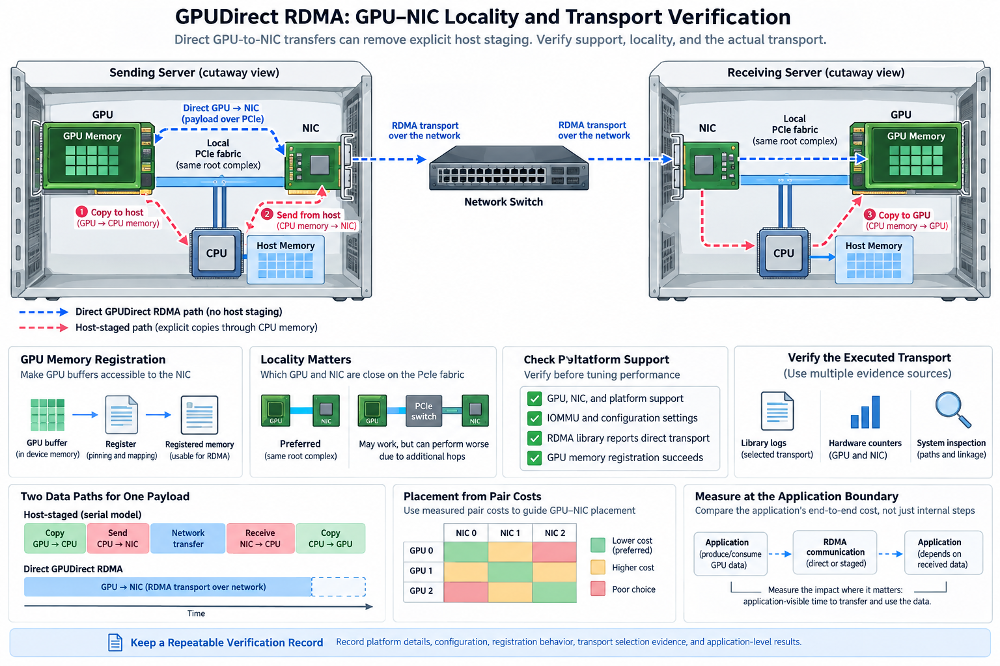
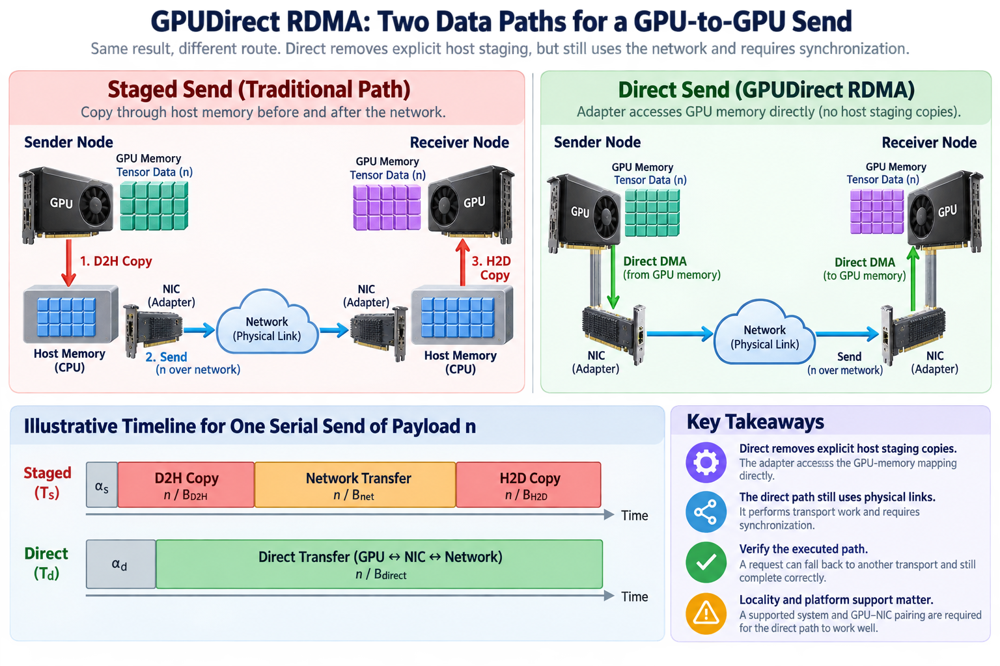
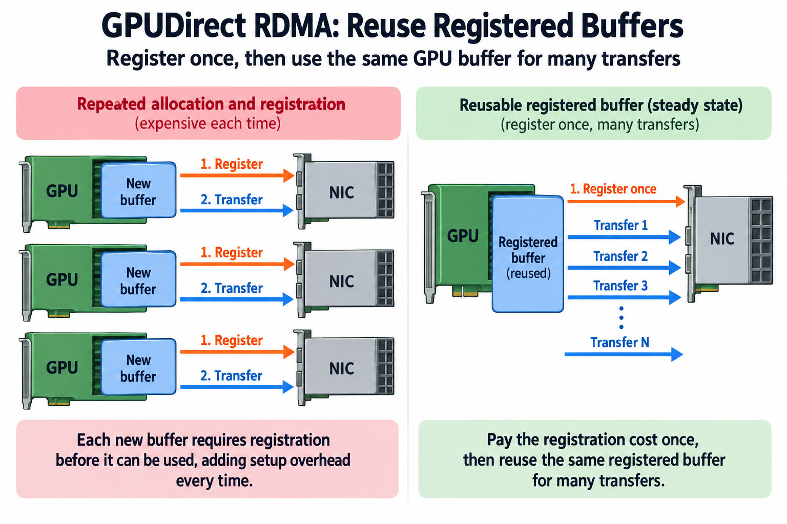
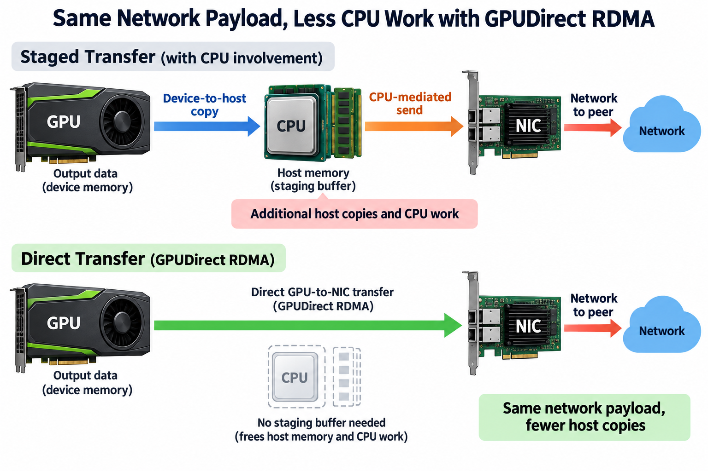

## Overview

GPUDirect RDMA is useful because it can remove explicit host staging from communication involving GPU memory. It is also easy to misdiagnose: a process can request a direct path, fall back to another transport, and still complete correctly. A cluster can support the capability while a particular GPU-adapter pairing performs poorly because of physical locality, which section 6 turns into numbers.

The engineering goal is evidence of the executed path, and it arrives in 4 kinds: compatibility checks show that the path is supported, registration and allocation behavior show that the buffers are accessible, diagnostics and counters show what the communication library selected, and measurements show whether the selection improves the application's exposed cost.

We will build this evidence in layers and use simple traffic and placement models to interpret it. Numerical rates below are illustrative assumptions, not observations from a particular server. Follow the current platform and library documentation for supported configurations.

## Deep dive

### 1. Draw both the direct and staged alternatives

A traditional staged send takes 3 steps: copy data from GPU memory to host memory, transmit it through the adapter, and copy received data from host memory to the remote GPU. A direct supported path allows the adapter to access the relevant GPU-memory mapping without those explicit staging copies.

The direct path still crosses physical interfaces, does transport work, and needs synchronization, so it does not make network traffic disappear and it does not give every running GPU kernel automatic visibility: the word direct describes an important data-path change rather than a universal coherence guarantee.

For payload n, a strictly serial staged model is

$$
T_s\approx\alpha_s+n/B_{\mathrm{D2H}}+n/B_{\mathrm{net}}+n/B_{\mathrm{H2D}},\qquad T_d\approx\alpha_d+n/B_{\mathrm{direct}}.
$$

The parameters include the selected measurement boundary. Real staged implementations can pipeline chunks, and direct transfers can have additional setup or signaling. Use the equations to identify avoided work, then compare the actual timelines instead of treating their ratio as a promised speedup.

### 2. Check platform support before tuning performance

NVIDIA documents hardware and platform constraints for GPUDirect RDMA, where the GPU, adapter, PCIe topology, driver integration, and supported memory-registration mechanism all 5 matter, so a device model name alone cannot tell you the complete configuration.

Record the operating system, GPU driver, adapter driver and firmware, communication library, and allocation strategy. Keep the supported-system information used for the deployment. An old installation recipe can refer to a registration mechanism that differs from the current supported stack.

Avoid diagnosing every failure as a missing environment variable, because if the underlying pair or platform is unsupported, a library setting cannot create the required hardware path, while a supported platform can still use a fallback when the selected buffers or runtime configuration do not meet the path's requirements.

Start with a minimal correctness test using the intended memory type. Confirm that the path can register and transfer the relevant allocation repeatedly. Only then move to bandwidth tuning, because an unstable or invalid direct path cannot support a meaningful performance comparison.

### 3. Locality determines which internal resources feed the adapter

Map GPU and NIC PCI bus identities and their relationship to switches, root complexes, and CPU NUMA domains, because a nearby pair can avoid shared upstream resources that a more distant pair traverses, and exact behavior depends on the platform, so discover and measure rather than rely on proximity labels alone, as the 2 pairings in section 6 show.

A path bottleneck model is

$$
B_{g,n}\le\min_{j\in\operatorname{path}(g,n)}B_j^{\mathrm{available}}.
$$

Here B_g,n is usable bandwidth between GPU g and NIC n, and each B_j is a required resource's available bandwidth. The bound omits startup and other costs, but it explains why an external port's nominal rate can exceed the rate at which a particular GPU feeds it.

Use topology tools as discovery evidence, then build a pair-performance matrix. Measure both directions and the relevant message range. Read and write behavior can differ, so keep those distinctions instead of collapsing them into 1 average. A software topology label identifies a relationship; it does not report achieved bandwidth under contention.

Adapter assignment also affects load balance. Sending every rank through the nearest adapter can overload 1 shared port when multiple nearby GPUs communicate together. The mapping must account for both local path quality and aggregate adapter capacity.

### 4. Registration is part of the steady-state design

Making GPU memory accessible to a peer device involves supported mapping and registration machinery, and setup can be expensive relative to a small payload, so communication libraries often benefit from reusable buffers and registration caching, with the exact mechanism and constraints depending on the current stack.

The application must preserve allocation lifetime until all dependent operations complete. A cache entry cannot remain valid after its underlying allocation is freed or repurposed without the required invalidation. Address reuse is especially important: a new allocation at the same virtual address is not automatically the same registered object.

For registration setup R reused across N transfers with average transfer cost c, a simplified amortized cost is

$$
\overline T\approx R/N+c.
$$

This model shows why repeated allocation and registration can degrade a workload even when large-buffer bandwidth is healthy. Measure cold registration separately from reused-buffer transfers, and keep the 2 results when the application actually creates short-lived buffers.

Allocator changes can therefore affect communication independently of kernel arithmetic. When speed regresses after an allocation-policy change, include registration-cache behavior in the investigation rather than assume the external fabric slowed down.

### 5. Preserve ordering and consumer visibility

An adapter writing GPU memory and a GPU kernel reading that memory are 2 different execution agents. Correct integration requires the supported synchronization and work-submission behavior documented for the memory path. Successful data movement does not make arbitrary concurrent consumption safe.

Draw the sequence from producer completion to transfer posting, transfer completion, consumer eligibility, and buffer reuse. Identify which API or library event establishes each of those 5 points. A host notification by itself is not a substitute for a documented device-memory ordering rule.

NVIDIA's GPUDirect RDMA documentation addresses memory ordering and synchronization explicitly, so prefer a supported communication-library contract when using a framework and verify that custom integrations preserve its requirements, and do not remove essential synchronization just to improve a pair benchmark.

A correctness test should alternate deterministic payloads and repeatedly reuse buffers under the intended concurrency. Check the sequence number and contents after the supported consumer boundary. Tests that never reuse memory can miss the lifetime and visibility races that appear only at sustained throughput.

### 6. Build a placement calculation from measured pair costs

Suppose an illustrative server has 4 GPUs and 2 adapters. GPUs 0–1 achieve 24 GB/s to adapter A and 12 GB/s to B; GPUs 2–3 have the reverse relationship. If each GPU sends a 1 GB message, the local-pair transfer component is about 41.7 milliseconds, while the distant-pair component is about 83.3 milliseconds.

Those isolated rates do not predict the concurrent result. If each adapter has only 25 GB/s aggregate available capacity, two 1 GB messages sharing it require at least 80 milliseconds of total serialization demand. Locality and port sharing therefore impose different bounds.

A simplified concurrent mapping objective can minimize the largest adapter demand:

$$
\min_{a(g)}\max_n\frac{\sum_{g:a(g)=n}D_g}{B_n},
$$

subject to supported GPU-adapter assignments and with additional path constraints. D_g is assigned traffic and B_n adapter capacity. A realistic solver also needs shared PCIe cuts and communication timing. Even with only 2 adapters, the expression illustrates why neither nearest-only assignment nor equal request count fully defines good placement.

### 7. Verify transport selection with multiple evidence sources

Enable appropriate library diagnostics for a controlled run and identify the selected transport, devices, and fallback behavior, keep the output bounded and tied to the test configuration, and remember that a requested setting is only an input: diagnostic evidence should describe what the library actually executed.

Correlate adapter traffic with the selected rank mapping. Device transfer events and host-memory traffic can help distinguish explicit staging from a supported direct path. Neither of those 2 counters proves the entire route on its own, so interpret the observations together.

Compare GPU-buffer and host-buffer cases where the benchmark supports them. If host-buffer networking is healthy but GPU-buffer transfers degrade, investigate registration and internal locality. If both degrade across nodes, investigate the adapter, fabric, and traffic conditions before focusing only on GPU integration.

Repeat with the actual collective, because its channels, rank groups, and algorithm can select different devices or paths from a point-to-point test. Check all participating ranks rather than conclude from 1 successful GPU-NIC pair that the whole distributed job is direct.

### 8. Measure the benefit at the application's dependency boundary

A direct transfer can save bytes and CPU work while leaving step time nearly unchanged if the transfer was already hidden behind computation. Conversely, an exposed final synchronization can benefit a lot even when total transferred bytes are a small fraction of the job's work.

A fixed-workload speedup approximation is

$$
S=1/\left((1-f)+f/s\right),
$$

where f is the baseline time fraction improved and s its local speedup. The model excludes queueing and resource interactions. For illustrative f=0.2 and s=2, overall speedup is about 1.11, which shows why transport speed should not be copied straight into a job forecast.

Measure computation duration alongside communication. Removing staging can free host memory and interface capacity, which can affect other phases. Direct communication can also contend with GPU work for shared resources. A timeline that shows overlap is not enough to prove that neighboring kernels remained unchanged.

Report useful tokens or completed steps under stable numerical behavior. Transfer throughput explains the mechanism; application throughput proves the result. Keep the workload and placement fixed so a different batch or rank assignment does not masquerade as a transport improvement.

A useful counter comparison uses the same payload population and duration for the 2 alternatives. If the staged case produces extra host-device copy events and host-memory traffic while the direct case does not, that supports the avoided-staging explanation. Adapter bytes alone cannot make this distinction because both paths still transmit the network payload. Check physical interface demand as well as logical payload, and account for background traffic before you credit all observed bytes to the test. Repeat at representative concurrency: an isolated direct path can look healthy while several ranks share an upstream link. Keep the per-rank message count and total payload fixed during this comparison so a different communication schedule does not accidentally explain the traffic reduction.

### 9. Maintain a repeatable verification record

Keep 8 things: platform support, versions, allocation type, topology, pair measurements, adapter mapping, diagnostics, and application results. Label theoretical bounds, illustrative calculations, and observed measurements separately. This record lets you revisit a regression after a driver or library change.

A minimal recurring check can test registration and correctness, representative pair transfer, the intended multi-node collective, and 1 application trace. It should detect fallback or locality changes without requiring a full tuning campaign after every update.

When performance changes, compare this record layer by layer, since healthy pair rates with a larger application tail suggest readiness or scheduling, poor GPU-buffer rates with healthy host-buffer networking suggest an internal device path, and broad cross-node degradation suggests a shared network resource or transport issue.

## Conclusion

GPUDirect RDMA earns its performance benefit by removing particular staging work on a supported path. The reliable way to use it is to verify all 5 of compatibility, locality, registration, ordering, and actual selection, then measure the exposed application cost. Directness is a data-path property that needs evidence, not a conclusion supplied by a configuration flag.

### Sources

- [NVIDIA GPUDirect RDMA guide](https://docs.nvidia.com/cuda/gpudirect-rdma/index.html).
- [NVIDIA topology and device-management documentation](https://docs.nvidia.com/deploy/nvidia-smi/index.html).
- [NCCL transport troubleshooting](https://docs.nvidia.com/deeplearning/nccl/user-guide/docs/troubleshooting.html).
