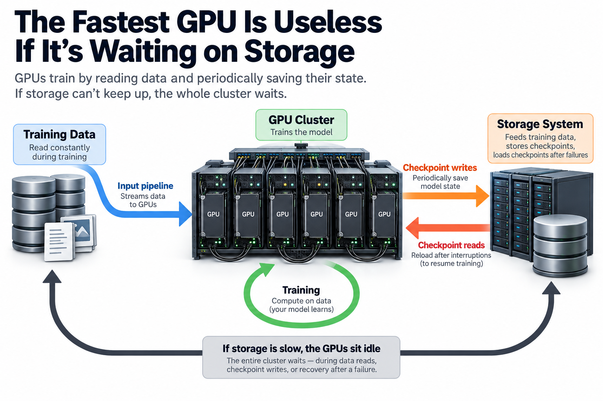
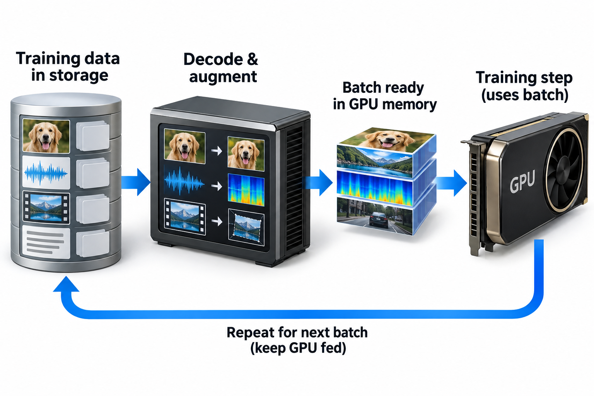
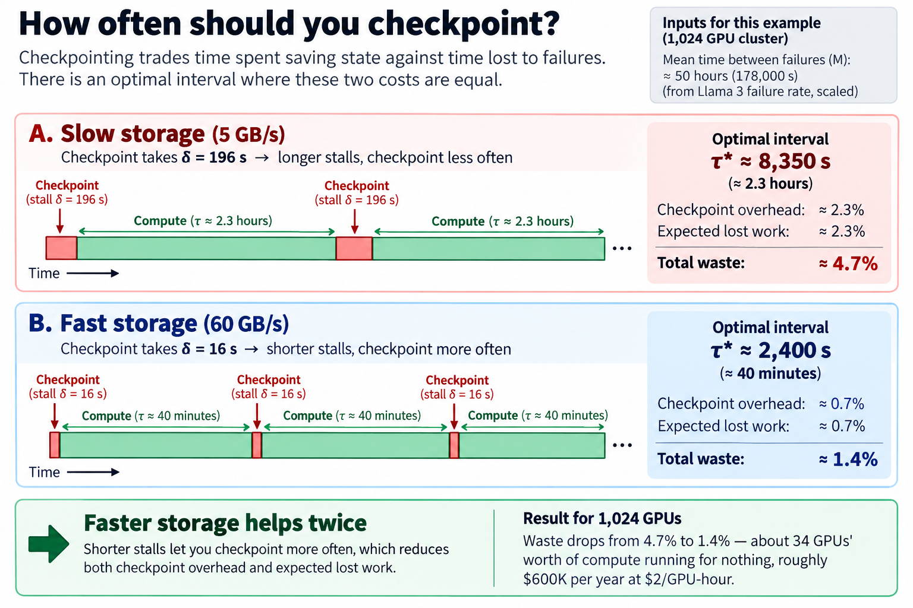
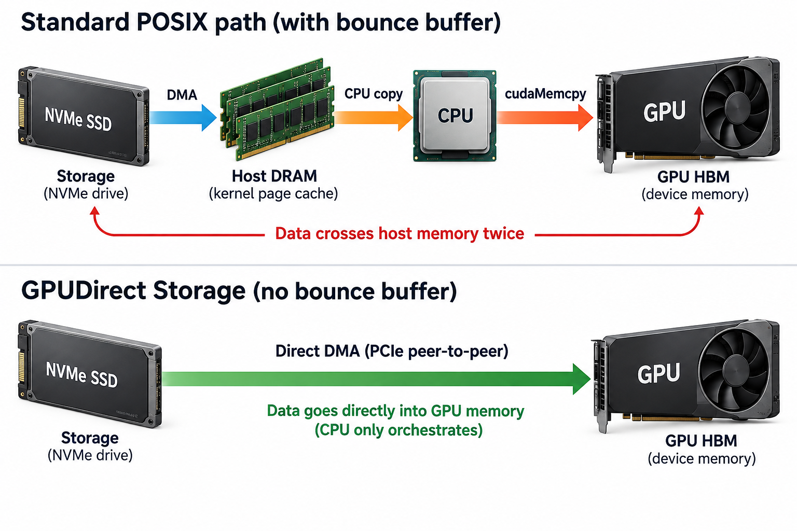

## Overview

During a 54-day stretch of Llama 3 405B pre-training, Meta's 16,384-GPU job was interrupted 466 times — 419 of them unplanned, mostly hardware failures. Every single interruption meant the same thing: roll the entire cluster back to the last checkpoint and redo the lost work. How much work gets lost, and how long the cluster stands still while checkpoints are written, is not decided by the GPUs at all. It's decided by storage.

Storage is the least glamorous part of an AI cluster, which is exactly why it's where clusters quietly bleed money. Teams will fight for weeks over a 3% kernel speedup and then attach 1,024 GPUs to a filesystem that stalls the whole job for 3 minutes every time it saves state. Scaling GPUs without scaling the data path just means paying more per hour for idle silicon.

This article covers the 2 places storage throttles training — the input pipeline and the checkpoint path — works the checkpoint math by hand, and then goes 1 level down into how GPUDirect Storage and DeepSeek's 3FS attack the problem.

## Deep dive

### 3 jobs storage does for a training cluster

When people say "storage for AI," they usually picture capacity: petabytes of tokens sitting in an object store. Capacity is the easy part. The hard part is bandwidth delivered at the right moments, and there are 3 distinct demand patterns:

**The input pipeline** runs continuously. Every training step needs a batch of data fetched from storage, decoded, shuffled, and staged into GPU memory before the GPU finishes the previous step. If the batch isn't ready, the GPU waits. Mohan et al. instrumented real DNN training jobs and found configurations where **more than half of epoch time** was spent blocked on data fetch and preprocessing rather than computation ([arXiv:2007.06775](https://arxiv.org/abs/2007.06775)). For LLM pre-training, tokenized text is compact and sequential, so this is usually manageable. For multimodal training — images, video, audio that need decoding and augmentation — the input pipeline is routinely the bottleneck, which is why tools like NVIDIA DALI move decoding onto the GPU itself.

**The checkpoint path** is the opposite: nothing for hours, then a write storm. A synchronous checkpoint means every rank pauses training and dumps its shard of model state at the same instant. Storage sized for the average write rate gets flattened by the peak. Meta's Llama 3 paper is explicit about this: their Tectonic-based storage cluster offers 240 PB and a sustained 2 TB/s, but was provisioned for a 7 TB/s peak precisely because "checkpointing is highly bursty" ([arXiv:2407.21783](https://arxiv.org/abs/2407.21783)).

**The restart path** is the mirror image of checkpointing: after a failure, thousands of ranks simultaneously read the same checkpoint back. A read storm on top of a write-optimized layout.

Inference adds a fourth pattern — model weights loaded at cold start, and increasingly KV-cache tiers spilled to SSD — but training is where the goodput math bites hardest, so let's stay there.

### Anatomy of a checkpoint write storm

Start with the size. A 70B-parameter model trained in mixed precision with Adam carries, per parameter: 2 bytes of bf16 weights, 4 bytes of fp32 master weights, and 4 + 4 bytes of fp32 Adam momentum and variance. That's 14 bytes per parameter:

> 70 × 10⁹ params × 14 bytes ≈ **980 GB per checkpoint**

Call it a terabyte. With the state sharded across 1,024 GPUs (0/FSDP style), each rank owns roughly 1 GB — trivial individually. But all 1,024 ranks open files and write at the same moment, because the checkpoint must be a consistent snapshot of 1 training step. The filesystem sees a synchronized burst of a terabyte, plus a metadata storm of file creates, from 1000 clients at once.

While that write drains, the GPUs do nothing. This is a pure goodput subtraction: the cluster is 100% allocated, 100% powered, and 0% productive. If your storage sustains 5 GB/s of aggregate write bandwidth — a perfectly respectable NFS appliance — the stall is 980 / 5 ≈ **196 seconds**. A parallel filesystem striping across NVMe at 60 GB/s takes **16 seconds**. Same GPUs, same model, 12× difference in stall.

So checkpoint rarely, right? That's where the failure math pushes back.

### Worked example: how often should you checkpoint?

This is a classic reliability trade-off, solved in first-order form by John Young in 1974 for mainframes and refined by John Daly in 2006 for HPC. You lose goodput 2 ways:

1. **Checkpoint overhead:** a stall of δ seconds every τ seconds costs δ/τ of your time.
2. **Lost work:** when a failure hits, you lose on average half an interval, τ/2. With a mean time between failures of M, that costs τ/(2M) of your time.

Total waste f(τ) = δ/τ + τ/(2M). Checkpoint too often and the first term eats you; too rarely and the second does. Setting the derivative to 0 gives **Young's formula**:

> τ_opt = √(2 · δ · M)

Now with real numbers. First, MTBF. Llama 3's 419 unplanned interruptions over 54 days on 16,384 GPUs is about 7.8 failures per day. Failure rate scales roughly linearly with component count, so a 1,024-GPU cluster (1/16th the size) sees ~0.49 failures/day: **MTBF ≈ 50 hours ≈ 178,000 s**.

**Case A — slow storage (5 GB/s, δ = 196 s):**

- τ_opt = √(2 × 196 × 178,000) ≈ **8,350 s ≈ 2.3 hours** between checkpoints
- Checkpoint overhead: 196 / 8,350 ≈ 2.3%
- Expected lost work: 8,350 / 356,000 ≈ 2.3%
- **Total waste ≈ 4.7%** of the cluster

**Case B — fast storage (60 GB/s, δ = 16 s):**

- τ_opt = √(2 × 16.3 × 178,000) ≈ **2,400 s ≈ 40 minutes** between checkpoints
- Checkpoint overhead: 16.3 / 2,400 ≈ 0.7%
- Expected lost work: 2,400 / 356,000 ≈ 0.7%
- **Total waste ≈ 1.4%**

Notice the elegant symmetry: at the optimum, checkpoint overhead and expected lost work are exactly equal. Notice also what faster storage buys you: not just shorter stalls, but the *freedom to checkpoint more often*, which shrinks the lost-work term too. Both terms drop by the same √12 ≈ 3.5× factor.

On 1,024 GPUs, the difference between 4.7% and 1.4% waste is 34 GPUs' worth of compute running around the clock for nothing. At $2/GPU-hour, that's roughly **$600K per year** — the price of the fast storage tier, funded entirely by checkpoint math. (This example ignores restart and re-initialization time, which only strengthens the case; Daly's higher-order formula handles the regime where δ is not tiny relative to M.)

The checkpoint interval has a calculable optimum under a restricted failure model. Let delta be the blocking checkpoint duration, tau the useful-compute interval between checkpoints, and M the mean time between independent job interruptions. If failures are rare and approximately uniform within an interval, lost work averages half an interval:

$$
f(\tau)\approx\frac{\delta}{\tau}+\frac{\tau}{2M},\qquad
f'(\tau)=-\frac{\delta}{\tau^2}+\frac1{2M},\qquad
\tau^*=\sqrt{2\delta M}.
$$

The first term buys durability; the second prices recomputation. With M equal to 178000 seconds and delta equal to 196 seconds, the optimum is approximately 8353 seconds and the estimated loss is 4.69%. Reducing delta to 16.3 seconds moves the optimum to 2409 seconds and loss to 1.35%. These are model outputs, not measured reliability guarantees. Correlated failures, restart duration, incomplete checkpoints, and asynchronous writes need extra terms.

Asynchronous checkpointing changes the blocking term but still must drain bytes to durable storage. For checkpoint size S and delivered storage bandwidth beta, a necessary steady-state condition is S/beta no greater than tau. Otherwise unfinished checkpoints accumulate. Measure both training stalls and time to durable completion; a faster acknowledgment alone does not give you a safer recovery point.

### Going deeper: shortening δ at the systems level

The formula says everything improves with √δ, so the engineering game is shrinking δ. 2 mechanisms matter.

#### Kill the bounce buffer: GPUDirect Storage

On the standard POSIX path, data moving between an NVMe drive and GPU memory takes a detour: the drive DMAs blocks into a kernel page cache in host DRAM, the CPU copies them into a user-space buffer, and then `cudaMemcpy` pushes them across PCIe into GPU HBM. Every byte crosses host memory 2 times and burns CPU cycles on copies. That intermediate staging area is the **bounce buffer**.

GPUDirect Storage (GDS) removes the detour. Through the cuFile API, the DMA engine in the NVMe drive or the storage NIC writes **directly into GPU memory** over PCIe peer-to-peer, with the CPU only orchestrating, never touching payload bytes ([NVIDIA GDS documentation](https://docs.nvidia.com/gpudirect-storage/)). NVIDIA's own gdsio benchmarks report 2–8× bandwidth gains and large CPU-utilization drops versus the bounce-buffer path — vendor-reported numbers, but the mechanism is sound and the same trick already proved out in networking as GPUDirect RDMA. For checkpoints, the win runs both directions: weights stream from HBM to flash on save and back on restore without squeezing through host DRAM, which matters precisely when 1000 ranks are doing it simultaneously and host memory bandwidth would otherwise become the chokepoint.

#### Build the filesystem for the burst: DeepSeek's 3FS

In early 2025 DeepSeek open-sourced the Fire-Flyer File System ([github.com/deepseek-ai/3FS](https://github.com/deepseek-ai/3FS)), the storage layer behind their training clusters, and it's a clean example of designing for exactly the patterns above. 3FS disaggregates storage across nodes stuffed with NVMe SSDs and reaches them over RDMA, so any client can hit the aggregate bandwidth of the whole cluster rather than 1 server's. Consistency uses CRAQ (chain replication with apportioned queries), which keeps reads cheap under strong consistency. DeepSeek reports **6.6 TiB/s aggregate read throughput** from a 180-node cluster — self-reported, but the design is inspectable in the repo. Notably, 3FS also serves as an SSD tier for inference KV cache, the fourth demand pattern from earlier.

The third lever is **asynchronous checkpointing**: snapshot GPU state into host DRAM in seconds, resume training, and let a background thread drain the snapshot to persistent storage. ByteDance's MegaScale ([arXiv:2402.15627](https://arxiv.org/abs/2402.15627)) and PyTorch's distributed checkpointing both do this. It shrinks the *stall* δ dramatically, though the drain time still bounds how often you can checkpoint, and a node that dies holding an undrained snapshot loses that checkpoint. The Young/Daly framework still applies; you just plug in different constants.

### Common misconceptions

**"Storage only matters when the job starts."** Loading the dataset is the *least* demanding phase. The input pipeline hammers storage every step for months, checkpoints hammer it every interval, and restarts hammer it at the worst possible moments. Meta provisioned 3.5× headroom (2 TB/s sustained vs. 7 TB/s peak) specifically for mid-training bursts, not for day 1.

**"Our storage does 40 GB/s, so we're fine."** A spec-sheet number is a sequential large-block benchmark. Training workloads issue shuffled reads over millions of samples, metadata-heavy small-file operations, and synchronized thousand-client bursts. A system that streams 40 GB/s to 1 client can collapse to a fraction of that under 1,024 simultaneous writers creating files. Measure your storage under the write-storm pattern (gdsio and fio can replay it), not the marketing pattern.

**"Checkpointing more often is always safer."** Young's formula says otherwise: waste is U-shaped in the interval. With δ = 196 s and a 50-hour MTBF, checkpointing every 20 minutes wastes 16% of the cluster on stalls alone — over triple the total waste at the 2.3-hour optimum. "Safer" checkpointing that ignores δ can cost more goodput than the failures it protects against.

### The bottom of the memory hierarchy

Storage is best understood as the last tier of the same hierarchy this series keeps returning to: registers, SRAM caches, HBM, host DRAM, then flash — each tier roughly 10× cheaper per byte and 10× slower than the one above ([The Memory Wall](/blog/the-memory-wall-latency-numbers/), [From DRAM to HBM](/blog/from-dram-to-hbm/)). The engineering pattern is identical at every level: overlap transfers with compute, batch small accesses into large ones, and keep the expensive resource fed. GPUDirect Storage is to flash what prefetching is to caches.

It's also a pure goodput story. A cluster stalled on a checkpoint shows near-0 GPU utilization if you look, but plenty of dashboards sample coarsely enough to miss 16-second stalls entirely — the waste hides in the gap between allocation and useful work that [the goodput article](/blog/goodput-vs-utilization/) is about. And it's a reminder that frontier labs treat infrastructure as a competitive weapon: DeepSeek didn't just write custom kernels to cut costs ([When a Kernel Cuts API Prices 50%](/blog/when-a-kernel-cuts-api-prices/)), they built and open-sourced an entire filesystem. If your mental model of an [ML performance engineer](/blog/what-does-an-ml-performance-engineer-do/) stops at CUDA, the storage tier is where the job description quietly doubles.

## Conclusion

- **Checkpoint stalls are a goodput tax with closed-form math.** Waste = δ/τ + τ/(2M), minimized at τ = √(2δM); at the optimum, checkpoint overhead equals expected lost work, and both scale with √δ — so faster storage pays 2 times.
- **Size storage for the burst, not the average.** A terabyte-scale checkpoint from 1000 synchronized ranks is the design point; Meta provisioned 7 TB/s peak against 2 TB/s sustained for exactly this.
- **Shrink δ with mechanism, not hope:** GPUDirect Storage removes the CPU bounce buffer, RDMA-based parallel filesystems like 3FS aggregate NVMe bandwidth across the cluster, and async checkpointing hides the drain behind compute.

### Sources

- Grattafiori et al., "The Llama 3 Herd of Models" — interruption counts and storage provisioning. [arXiv:2407.21783](https://arxiv.org/abs/2407.21783)
- Mohan et al., "Analyzing and Mitigating Data Stalls in DNN Training." [arXiv:2007.06775](https://arxiv.org/abs/2007.06775)
- NVIDIA, GPUDirect Storage documentation. [docs.nvidia.com/gpudirect-storage](https://docs.nvidia.com/gpudirect-storage/)
- DeepSeek, Fire-Flyer File System (3FS). [github.com/deepseek-ai/3FS](https://github.com/deepseek-ai/3FS)
- J. W. Young, "A First Order Approximation to the Optimum Checkpoint Interval," *Communications of the ACM*, 17(9), 1974.
- J. T. Daly, "A Higher Order Estimate of the Optimum Checkpoint Interval for Restart Dumps," *Future Generation Computer Systems*, 22(3), 2006.

*Part of the [AI Infrastructure Foundations](/series/ai-performance/) learning path. Browse its published articles by topic.*
