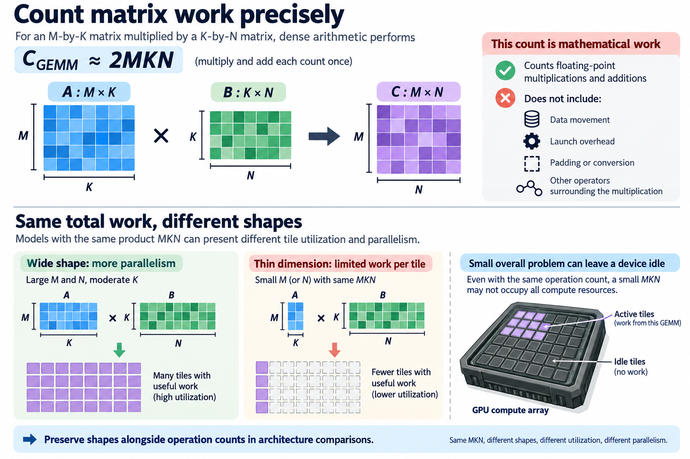
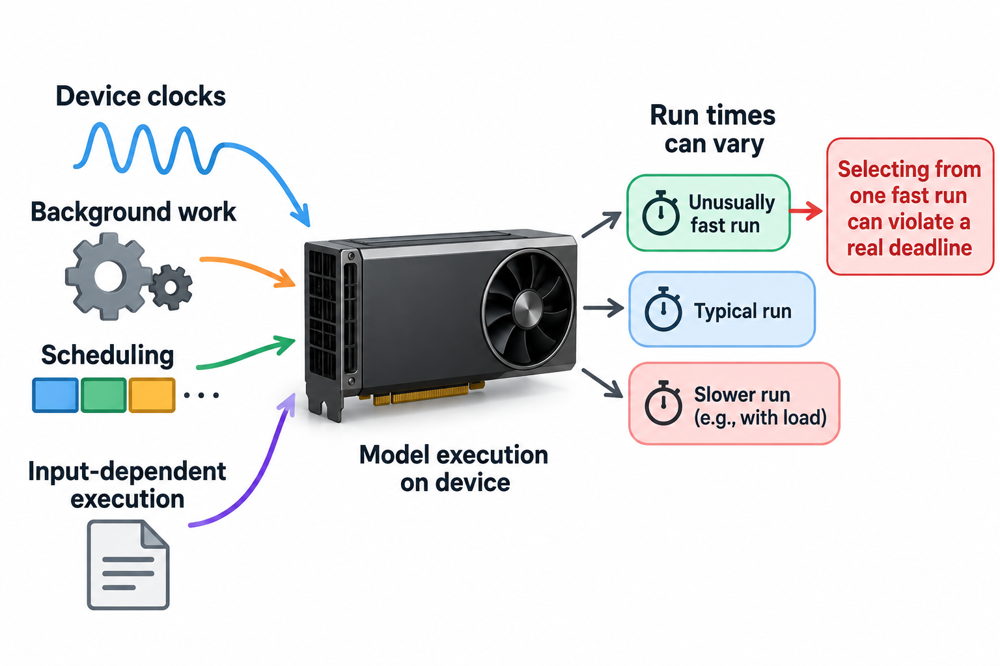

An efficient architecture is efficient on an execution system. Reducing mathematical operations can help, but the mapping from operations to latency depends on matrix shapes, memory traffic, kernel support, and workload. Hardware-aware model design brings those constraints into the architecture decision instead of checking them only after training.

This article builds a performance model for that decision and explains why equal-FLOP models can behave differently. The goal is not to predict every timing from a formula. It is to identify useful design variables, reject misleading proxies, and connect an architecture's quality to measured execution.

*An original conceptual illustration. Numerical plots and examples are illustrative unless explicitly identified as measured evidence.*

## 1. Define the deployment envelope

Specify the target device, backend, numerical format, batch, input resolution or sequence length, and concurrency. These settings determine the operations that the architecture actually executes.

For image classification, an architecture might be evaluated on one fixed resolution and batch. For language serving, prefill and decode produce different matrix shapes and state lifetimes. A single architecture can occupy different performance regimes across those workloads.

Also define the acceptance constraint: latency deadline, throughput, peak memory, energy, or a combination. Hardware-aware means the resource objective is attached to an operating envelope. Without that envelope, the phrase describes an intention rather than a testable design.

## 2. Count matrix work precisely

For multiplication of an M-by-K matrix with a K-by-N matrix, dense arithmetic performs approximately 2MKN floating-point operations under the convention that multiplication and addition each count once.

$$
C_{\mathrm{GEMM}}\approx2MKN.
$$

This count describes mathematical work, not elapsed time. It does not include data movement, launch overhead, padding, conversion, or other operators surrounding the multiplication.

Models with the same product MKN can present different tile utilization and parallelism. A thin dimension can limit available work per tile, while a small overall problem can leave much of a large device idle. Preserve shapes alongside operation counts in architecture comparisons.

## 3. Estimate arithmetic intensity

Arithmetic intensity divides operations by bytes transferred at a chosen memory boundary. A simple idealized estimate reads each input matrix once and writes the output once, using p bytes per element.

$$
I\approx\frac{2MKN}{p(MK+KN+MN)}.
$$

The denominator is a lower-level modeling assumption, not an exact measurement. Cache reuse, repeated reads, accumulation, fusion, and packing can change traffic. Define which boundary the estimate concerns, such as device memory rather than registers.

This ratio helps explain why smaller batch or decode shapes can become bandwidth sensitive. More arithmetic reuse can raise intensity, but only when the execution path realizes that reuse. Use the model to form a hypothesis and inspect measured traffic or performance when available.

## 4. Apply a roofline bound

Let P_peak be an appropriate compute ceiling and BW the relevant bandwidth ceiling. A basic roofline bounds achievable operation throughput by the smaller of compute capability and bandwidth times intensity.

$$
P\le\min(P_{\mathrm{peak}},BW\cdot I).
$$

The bound is optimistic. It does not account for every execution bottleneck, and advertised device peaks can require particular formats, instruction paths, or sparsity assumptions. Use the ceiling matching the actual kernel.

An architecture change that reduces bytes can help a bandwidth-sensitive workload even if FLOPs remain similar. Conversely, fewer operations may not lower latency when dispatch or memory movement dominates. The model identifies the limiting resource rather than declaring operation reduction useless.

## 5. Examine tile padding

Suppose a kernel organizes output tiles of t_M by t_N and reduction tiles of t_K. A conceptual padded operation count rounds each dimension up to a multiple of its tile size.

$$
C_{\mathrm{padded}}\approx2\left\lceil\frac M{t_M}\right\rceil t_M\left\lceil\frac N{t_N}\right\rceil t_N\left\lceil\frac K{t_K}\right\rceil t_K.
$$

Actual kernels can use masked edges, specialized variants, or different scheduling, so this is a utilization illustration rather than a universal implementation formula.

The expression shows why small changes in width can have discontinuous effects. Removing a few channels might reduce mathematical work while leaving the same tile footprint. A larger structured change can cross a shape boundary and affect execution more substantially. Verify the target kernel rather than assuming a smooth FLOP-to-latency relationship.

## 6. Work through shape utilization

With an illustrative output tile width of 64, an output dimension of 65 spans 2 tiles along that axis. The conceptual tiled width is 128, giving approximately 50.8 percent useful columns under this simplified view.

Reducing the dimension to 64 fits one tile and can change the utilization regime. Reducing it only to 64.5 is not a meaningful integer channel count, and reducing another dimension without changing this edge does not automatically remove the extra tile.

This example does not predict a speedup of exactly 2. Kernel selection, occupancy, memory, and launch overhead still matter. It explains why architecture widths should be tested against supported execution shapes rather than selected solely from a continuous parameter-count target.

## 7. Model launch and boundary costs

A simple graph timing model adds operator execution, dispatch, and boundary work. Its terms can interact when fusion changes the graph.

$$
T_{\mathrm{graph}}\approx\sum_i T_i+T_{\mathrm{dispatch}}+T_{\mathrm{conversion}}+T_{\mathrm{materialization}}.
$$

Many tiny operators can incur overhead disproportionate to their mathematical work. An architecture with fewer large compatible blocks can therefore execute differently from one with many small heterogeneous branches.

Fusion can avoid writing and rereading intermediates, but it depends on backend support and graph structure. Inspect the exported graph and compiled execution. A symbolic operator list does not establish which boundaries remain during deployment.

## 8. Include activation and state memory

Architecture width, depth, token count, and resolution affect intermediate memory. Stateful language inference also stores cache or recurrent state whose size depends on model structure and context policy.

A parameter-efficient architecture can still have expensive activations. High-resolution features or long token sequences can dominate memory traffic and peak allocation. Reducing model weights does not directly solve those terms.

Define tensor lifetimes and the workload when estimating peak memory. Summing every tensor can overestimate if lifetimes do not overlap, while counting only one largest activation can underestimate simultaneous buffers. Measure the complete artifact when capacity is a deployment constraint.

## 9. Treat operator support as a constraint

An architecture can select operations that are theoretically efficient but poorly supported on the target backend. A depthwise convolution, unusual activation, sparse pattern, or dynamic selection rule may have a very different execution path across devices.

Build representative microbenchmarks for the admissible operations and shapes before expensive model training. Inspect whether unsupported choices trigger decomposition or fallback. Keep correctness tests separate from resource acceptance.

The useful search space includes operators that can be exported and executed under the intended numerical policy. Excluding an unsupported option is a practical design decision, not proof that the mathematical operation is inherently inefficient on every possible system.

## 10. Use latency lookup tables cautiously

A lookup table can store measured operator timings indexed by shape, format, and device. A search algorithm can then estimate candidate cost without executing every complete model during selection.

This approach is useful when the table covers the search space and operator costs approximately compose. Interpolation outside measured shapes, graph fusion, and memory interactions can weaken the estimate.

Validate shortlisted complete architectures and inspect predictor error near the constraint boundary. A candidate predicted to be just below a deadline may be infeasible once exported. Keep measurements, backend versions, warmup, and repetition policy with the table so that it is reproducible evidence rather than an unexplained constant database.

## 11. Connect width and depth to quality

Reducing width or depth changes capacity and computation. Resolution and token reduction change the information presented to the model. These variables should be explored with quality-resource tradeoffs rather than only one cost metric.

A useful design objective can minimize latency under a quality threshold or maximize quality under a resource budget. The architecture parameters are discrete and interact with training, so a proxy score needs complete validation.

Compare candidates under documented training budgets. An architecture trained longer or on more data can appear superior for reasons unrelated to its hardware mapping. Preserve the reference recipe and report any additional preparation cost needed to obtain the efficient candidate.

## 12. Understand device-specific rankings

Two devices can favor different operator types, widths, and numerical paths. Even on one device, changes in batch or input length can reverse a ranking. Hardware-aware architecture research such as MnasNet, ProxylessNAS, and FBNet connects selection to a resource model or target execution rather than relying only on FLOPs.

The papers' specific experiments belong to their stated devices and tasks. Their broader lesson is that resource feedback should match the deployment goal. It is not that one published architecture is universally optimal.

When transferring an architecture to another backend, repeat complete measurements and inspect support. Similar advertised compute peaks do not establish equal operator performance or the same ordering between candidates.

## 13. Build a controlled comparison

Choose a baseline and several candidates that alter one interpretable design variable at a time where feasible. Record parameter count, operation count, activation or state bytes, measured latency, throughput, and task quality.

Use the same preprocessing and numerical contract. Warm up execution and report repetitions with an appropriate variability summary. Separate initialization and compilation from steady-state inference unless startup is itself the objective.

No device microbenchmark or model-training experiment was performed for this article. The shape examples and bounds are explanatory. A deployment decision requires executing the real candidate artifacts on the intended system, with quality evaluated under a consistent task protocol.

## 14. Make co-design concrete

Co-design can modify the model to fit an execution primitive or improve the execution system to support a valuable model structure. Both require an explicit interface: shapes, numerical representation, memory layout, and scheduling assumptions.

A regular block structure can be easier to compile than unpredictable data-dependent selection. Dynamic algorithms can still be useful, but selection overhead and workload variability belong in their measured cost.

The most informative explanation connects an architectural choice to a resource mechanism and then to evidence. Equal FLOPs do not imply equal execution, and a favorable microbenchmark does not imply equal complete-model quality. Hardware-aware design becomes useful when those levels are connected rather than collapsed into one efficiency score.

## 15. Interpret measurement uncertainty at the boundary

Timing variability can come from device clocks, background work, allocation, scheduling, and input-dependent execution. A search that accepts a candidate from one unusually fast run can violate a real service deadline.

Use a measurement policy matching the requirement. A throughput target needs sustained workload evidence, while a latency service objective can require tail measurements under realistic concurrency. Isolated operator timing answers a different question from end-to-end request latency.

Carry uncertainty into selection near the budget boundary. A small margin can be preferable to a candidate whose predicted advantage is smaller than model or timing error. This is a practical consequence of treating the resource constraint as an operating requirement.

Finally, preserve the measured backend and artifact revision. Compiler changes can improve one graph while leaving another unchanged. Reproducible hardware-aware design therefore records the software mapping as well as the model architecture and device identity.

A final comparison should keep the candidate's quality-resource point attached to its evidence. Store the architecture configuration, exported graph, numerical policy, workload, and measurement summary together. That package allows another engineer to test whether the same tradeoff holds after a device or compiler change. It also prevents a favorable operation count from being reused as if it were an independently measured latency result.

## Sources

- [Roofline: An Insightful Visual Performance Model](https://doi.org/10.1145/1498765.1498785).
- [MnasNet: Platform-Aware Neural Architecture Search for Mobile](https://arxiv.org/abs/1807.11626).
- [ProxylessNAS](https://arxiv.org/abs/1812.00332).
- [FBNet: Hardware-Aware Efficient ConvNet Design](https://arxiv.org/abs/1812.03443).
