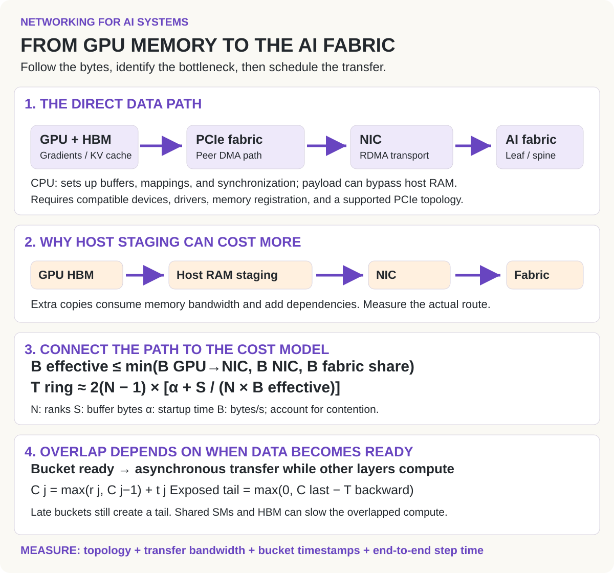
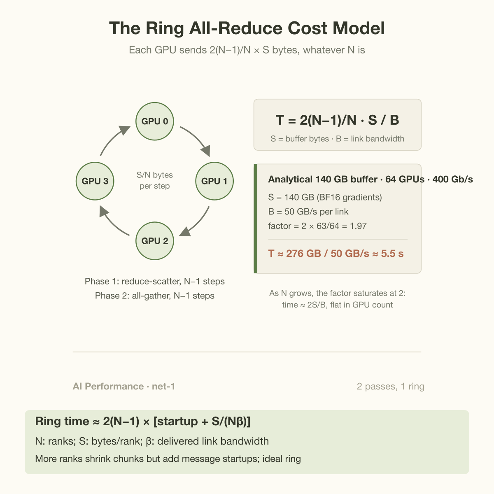
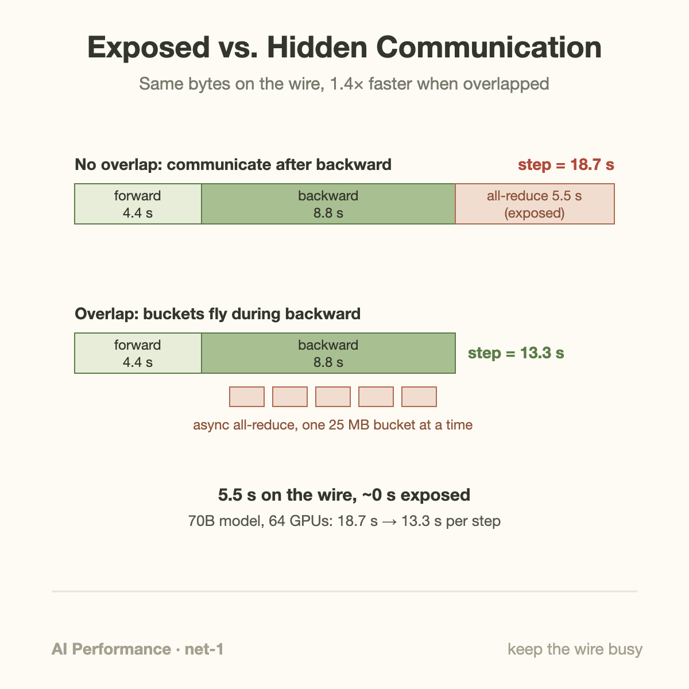

A 70B-parameter model produces 140 GB of gradients, in BF16, on every single training step. Synchronizing them across 64 GPUs over 400 Gb/s links costs about 5.5 seconds of network time, and on a well-tuned cluster the training step pays almost none of it. That sentence is the whole discipline of distributed ML networking in miniature. You cannot make the traffic go away. Data parallelism *is* gradient exchange; tensor parallelism *is* activation exchange; disaggregated inference *is* KV-cache shipping. The goal is never 0 communication. The goal is 0 **exposed** communication: every byte moves while the GPUs are busy doing something else, so the wall clock never sees it.

This article builds the cost model you need to reason about that, works a 70B example by hand, and then goes 1 level down into the machinery that makes hiding possible: bucketed all-reduce, topology-aware routing, in-network reduction, and the SM tax that overlap quietly charges.

## 2 kinds of traffic, 2 kinds of plumbing

Cluster communication in ML splits into 2 families that behave nothing alike.

**Collectives** are the training workhorse. An *all-reduce* takes a buffer that exists on every GPU (say, gradients), sums the copies elementwise, and leaves the identical sum on every GPU. Its cousins *all-gather* and *reduce-scatter* move the pieces without the final duplication, and *all-to-all* reshuffles data between every pair of ranks (the pattern behind expert parallelism). Collectives are bulk-synchronous: every rank participates, and the operation finishes at the speed of the slowest path through the network. On NVIDIA clusters they are almost universally executed by NCCL, which picks an algorithm (ring, tree, and friends) based on message size, rank count, and detected topology.

**Point-to-point transfers** dominate inference. When a prefill worker finishes computing a request's KV cache and a decode worker takes over generation, the cache has to move from 1 GPU's HBM to another's, once, between exactly 2 parties. No barrier, no global participation. This is what NIXL (NVIDIA's Inference Xfer Library, built for the Dynamo serving stack) exists for: an async, backend-agnostic API that routes each transfer over the fastest available path, NVLink or InfiniBand via GPUDirect RDMA, without staging through host memory.

The reason 2 separate libraries exist is that the overlap strategies differ. Collectives get hidden behind *the compute that produced their inputs*; point-to-point transfers get hidden behind *unrelated work the destination is already doing*. We will see both.

## From GPU memory to the fabric: the complete path

*Read the figure from 1 to 4: establish the payload route, compare staging costs, model the bottleneck, then examine the exposed tail.*

GPUDirect RDMA allows a supported NIC to access registered GPU memory without staging the payload in host RAM. The CPU still participates in setup and coordination. A direct path depends on device support, drivers, memory registration, and PCIe topology; an arrow labeled “RDMA” alone does not guarantee it. [NVIDIA’s GPUDirect RDMA documentation](https://docs.nvidia.com/cuda/gpudirect-rdma/) describes these requirements and ordering considerations.

The diagram separates 2 optimizations: choosing a better route changes transfer cost, while overlapping that transfer changes how much cost reaches the critical path. The bandwidth bound is a diagnostic approximation: compare capacities in the same direction and units, and include shared-link contention. The ring equation assumes a bandwidth-limited logical ring with comparable participants. The bucket recurrence assumes 1 serialized communication stream; its readiness times explain why enough total backward compute does not automatically eliminate the final tail. The next sections derive these relationships and work through the numbers.

## The worked example: a 70B gradient sync, by hand

The canonical collective algorithm is the **ring all-reduce**, and its cost model is worth committing to memory because it fits on an index card.

Arrange N GPUs in a logical ring and split the buffer of S bytes into N chunks. The algorithm runs in 2 phases. In the *reduce-scatter* phase, each GPU spends N−1 steps sending 1 chunk to its right neighbor while receiving and accumulating a chunk from its left; after N−1 steps, each GPU holds the fully-reduced version of exactly 1 chunk. The *all-gather* phase then spends another N−1 steps circulating those finished chunks until everyone has all of them. Total: each GPU sends (and receives) 2(N−1) chunks of S/N bytes, so the time on links of bandwidth B is

**T = 2(N−1)/N × S / B**

Now the numbers. A 70B model with BF16 gradients has S = 140 GB to reduce. Take N = 64 GPUs, each with a 400 Gb/s NIC, so B = 50 GB/s per link:

- Factor: 2 × 63/64 = 1.97
- Bytes per GPU: 1.97 × 140 GB ≈ 276 GB sent (and 276 GB received)
- Time: 276 / 50 ≈ **5.5 seconds**

Notice what the formula says as N grows: 2(N−1)/N approaches 2 and stops. Ring all-reduce is *bandwidth-optimal*; the transfer time is essentially 2S/B whether you have 8 GPUs or 8,000. What grows with N is the latency term, 2(N−1) serialized hops, which is a different problem we will come back to.

Is 5.5 seconds a lot? Only relative to the compute it could hide behind. Give those 64 H100s a global batch of 1 million tokens. Training FLOPs are roughly 6 × params × tokens = 6 × 70×10⁹ × 10⁶ ≈ 4.2×10¹⁷. At 50% MFU of the 989 TFLOPS BF16 peak, the cluster sustains about 3.2×10¹⁶ FLOP/s, so the step takes ≈ 13.3 s of compute: roughly 4.4 s of forward and 8.8 s of backward.

Run the all-reduce *after* the backward pass and your step is 4.4 + 8.8 + 5.5 = 18.7 s. That is a 41% tax, paid every step, for weeks. Run it *during* the backward pass and the step is 13.3 s, because 5.5 s of communication fits comfortably inside 8.8 s of backward compute. Same hardware, same bytes, 1.4× the training throughput.

## How the hiding actually works

The trick that makes overlap possible is an accident of calculus: backpropagation computes gradients in reverse layer order. The moment the backward pass finishes layer 47's computation, layer 47's gradients are final and will never be touched again, even though layers 46 down to 1 are still hours of microseconds away. There is no reason to wait.

PyTorch's DistributedDataParallel exploits this with **gradient bucketing** (described in Li et al.'s PyTorch Distributed paper, arXiv:2006.15704). Parameters are grouped into buckets, 25 MB by default, ordered roughly by when their gradients become ready. As each bucket fills, DDP fires an asynchronous NCCL all-reduce for it on a separate CUDA stream and immediately returns to computing the next layer's backward. Communication for late layers streams out while early layers are still crunching. By the time the backward pass retires, only the final bucket or 2, the gradients of the earliest layers, can still be in flight. Those are the only bytes the wall clock ever sees.

The bucket size is a real tuning knob. Too small and you pay per-collective launch latency dozens of extra times; too large and the first all-reduce cannot start until deep into the backward pass, shrinking the overlap window. The same logic generalizes: FSDP overlaps its all-gathers with forward compute by prefetching the next layer's parameters while the current layer runs, and pipeline schedules overlap activation sends with the compute of other microbatches.

The arithmetic condition for full hiding is blunt: communication time ≤ the compute you overlap it with. In our example, 5.5 s < 8.8 s, so we win. Shrink the per-GPU batch by 2× and backward drops to 4.4 s while the all-reduce stays 5.5 s; now 1.1 s is structurally exposed no matter how clever the scheduler is. At that point your options are a fatter network, gradient compression, or accepting the tax. This ratio, not raw bandwidth, is the number that decides whether scaling out will hurt.

## Going deeper: topology, in-network reduction, and the SM tax

**The flat ring was a lie, and topology is why.** Real clusters are hierarchical: 8 GPUs per node joined by NVLink at ~900 GB/s, nodes joined by InfiniBand at 50 GB/s per NIC. NCCL exploits this by reducing within each node over NVLink first, then running the inter-node phase with all 8 NICs per node moving disjoint shards in parallel. Redo our example that way: each NIC now carries 140/8 = 17.5 GB around an 8-node ring, so T = 2 × 7/8 × 17.5/50 ≈ **0.6 s**, 9 times faster than the flat ring, on identical hardware. This is also why topology *mismatch* is such a silent killer. If NCCL misdetects the PCIe layout, if rank placement makes rings hop across rails through spine switches, or if a missing GPUDirect RDMA path forces staging through host memory, nothing crashes. The job runs. It just runs at flat-ring speed or worse, and the only symptom is a step time that is mysteriously 30% high until someone reads the NCCL topology dump.

**SHARP moves the reduction into the switch.** NVIDIA's Scalable Hierarchical Aggregation and Reduction Protocol puts reduction ALUs inside InfiniBand and NVLink switch silicon. GPUs send their data up the switch tree once; the switches sum streams in flight and multicast the result back down. Each link now carries the data once instead of the ring's 2 times, and the GPU never spends cycles adding other ranks' partials. NVIDIA reports 2–5× speedups on collective operations from SHARP (vendor-reported figures, so calibrate accordingly, but the mechanism is sound: it halves the wire traffic *and* offloads the arithmetic).

**Overlap is not free, because NCCL runs on SMs.** Communication kernels need streaming multiprocessors to move and reduce data, and those SMs come out of the same pool as your matmuls. The most public accounting of this cost is DeepSeek-V3's technical report (arXiv:2412.19437): to overlap the all-to-all traffic of expert parallelism with compute, they dedicated 20 of the H800's 132 SMs, 15% of the chip, to communication kernels, and designed the DualPipe schedule so each microbatch's dispatch and combine phases hide behind another microbatch's attention and MLP compute. Their DeepEP library later pushed much of that work off SMs and onto NIC-driven RDMA precisely because the SM tax was too high. "Hidden" communication still shows up somewhere; the honest metric is end-to-end step time, never a communication timer.

**Inference hides transfers behind other requests.** A prefill worker shipping a 40k-token KV cache to a decode worker cannot hide the transfer behind that request's own compute; the request is *waiting* on the move. Instead, NIXL-style transfer engines make the copy fully asynchronous so the decode GPU keeps generating tokens for the requests it already has, and stream the cache layer by layer while prefill for later layers is still running. Different trick, same principle: the wire is busy, the GPUs never idle.

A ring model separates bandwidth cost from message startup. For N participants, S bytes per participant, per-link bandwidth beta, and startup alpha:

$$
t_{\mathrm{ring}}\approx2(N-1)\left(\alpha+\frac{S}{N\beta}\right).
$$

At N equal to 64, S equal to 140 GB, beta equal to 50 GB/s, and alpha equal to 2 microseconds, the bandwidth term is 5.5125 seconds and startup adds 0.252 milliseconds. For a 64-KiB payload, startup instead dominates. The 140-GB gradient-buffer example is an analytical collective model; it is not a runnable replicated 70B training setup on 80-GB GPUs. Sharded training uses different buffer sizes and collective sequences.

Enough total backward time is not sufficient to hide communication. If bucket j becomes ready at r_j and takes t_j to transmit on 1 serialized communication stream, its finish time is

$$
C_j=\max(r_j,C_{j-1})+t_j,\qquad
E_{\mathrm{exposed}}=\max(0,C_{\mathrm{last}}-t_{\mathrm{backward}}).
$$

A late final bucket remains exposed even when earlier transfers overlap perfectly. Tune bucket size against readiness timestamps and message startup, then measure compute slowdown from shared SM, memory, and network resources. Hierarchical collectives change the bytes crossing expensive links; overlap changes when those bytes travel. Evaluate both mechanisms independently rather than attributing the whole gain to asynchronous execution.

## Common misconceptions

**"Buy a faster fabric and you can skip the overlap engineering."** Doubling from 400 to 800 Gb/s turns our 5.5 s all-reduce into 2.75 s, which is still a 21% step-time tax if it sits exposed after backward, while the overlapped version was already paying ~0%. Worse, small collectives (tensor-parallel all-reduces at low batch during decode) are latency-bound, not bandwidth-bound, so the fatter pipe barely moves them. Bandwidth changes the size of the exposed cost; only scheduling changes whether it is exposed at all.

**"All-reduce time scales linearly with GPU count."** The ring's bandwidth term is 2(N−1)/N × S/B, and that prefactor saturates at 2: going from 64 to 4,096 GPUs leaves the transfer time nearly unchanged. What does grow is the latency term, 2(N−1) serialized neighbor hops, which is why NCCL switches to tree algorithms (log₂N depth) for the regimes where per-hop latency dominates. If your all-reduce slows down as you scale out, suspect latency, stragglers, or topology, not the cost model.

**"Overlapped communication is free."** It costs SM occupancy (DeepSeek's 20 of 132), memory bandwidth (every byte sent is also a byte read from HBM, contending with your matmuls), and interconnect contention. Teams that measure "communication time" in isolation routinely report beautiful overlap while their compute kernels quietly run 10% slower under the contention. The only measurement that cannot lie to you is the step time with and without the communication actually happening.

## The bigger picture

Exposed communication is 1 of the biggest gaps between "GPUs busy" and "useful tokens produced" — if you have read [the goodput article](/blog/goodput-vs-utilization/), this is a prime mechanism behind a 100%-utilized cluster doing 60% work, because a GPU spinning in a NCCL kernel waiting for a straggler counts as utilized. The inference side of this story is why [prefill/decode disaggregation](/blog/the-prefill-decode-disaggregation-story/) took 2 years to become deployable: the architecture was obvious in 2023, but it only wins once KV transfer hides behind ongoing decode, which is the exact problem NIXL was built to solve. DeepSeek's DualPipe and DeepEP work, covered from the kernel angle in [When a Kernel Cuts API Prices](/blog/when-a-kernel-cuts-api-prices/), is the most aggressive published example of paying compute resources to buy overlap. And zoom all the way in and the principle is fractal: [the memory wall](/blog/the-memory-wall-latency-numbers/) inside a single chip is fought with the same weapon, latency hidden behind work that was going to happen anyway.

## Takeaway

- **Carry the cost model in your head.** Ring all-reduce ≈ 2S/B, nearly independent of GPU count; for a 70B model over 400 Gb/s NICs that is ~5.5 s flat-ring or ~0.6 s topology-aware. Compare it to your backward-pass time to know instantly whether it can hide.
- **Overlap is a scheduling problem, not a hardware problem.** Bucketed all-reduce inside backward, prefetched all-gathers, microbatch pipelining, async layer-wise KV streaming: every mature stack is a catalog of tricks for keeping the wire busy while the GPUs never wait.
- **Hidden ≠ free, and topology failures are silent.** Overlap costs SMs and memory bandwidth, and a misrouted ring costs 9× with no error message. Profile exposed time via end-to-end step time, and read the topology dump before you blame the model.

## Sources

- NCCL documentation, NVIDIA: https://docs.nvidia.com/deeplearning/nccl/user-guide/docs/index.html
- Li et al., "PyTorch Distributed: Experiences on Accelerating Data Parallel Training" (VLDB 2020): https://arxiv.org/abs/2006.15704
- Sergeev & Del Balso, "Horovod: fast and easy distributed deep learning in TensorFlow": https://arxiv.org/abs/1802.05799
- DeepSeek-AI, "DeepSeek-V3 Technical Report": https://arxiv.org/abs/2412.19437
- NIXL, NVIDIA Inference Xfer Library (part of Dynamo): https://github.com/ai-dynamo/nixl
- NVIDIA, Scalable Hierarchical Aggregation and Reduction Protocol (SHARP) documentation, NVIDIA Networking (speedup figures are vendor-reported)

*Part of the [Networking for AI Systems](/series/ai-networking/) learning path. Browse its published articles by topic.*
