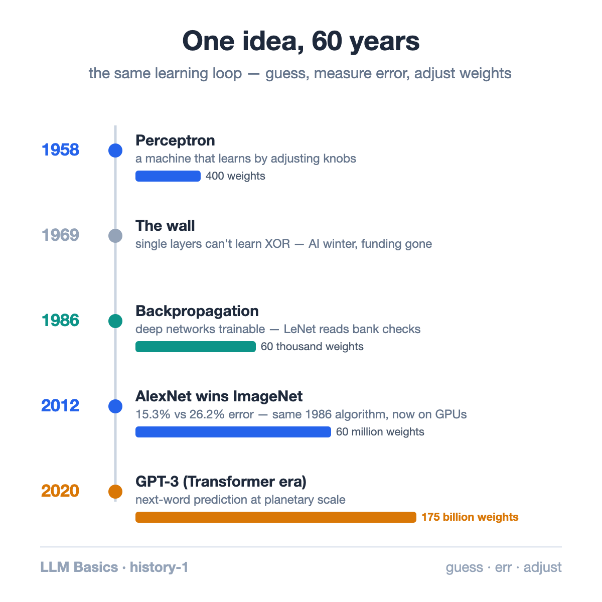
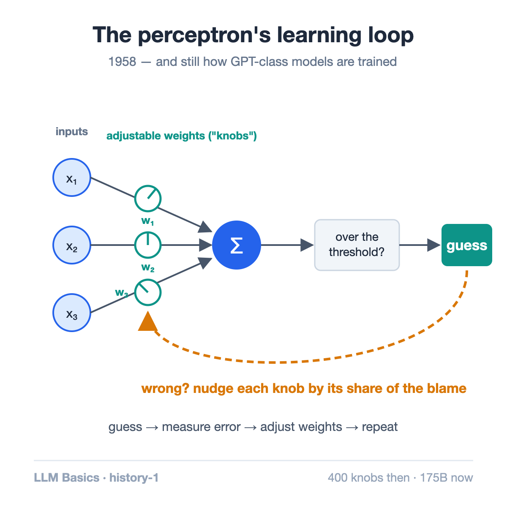
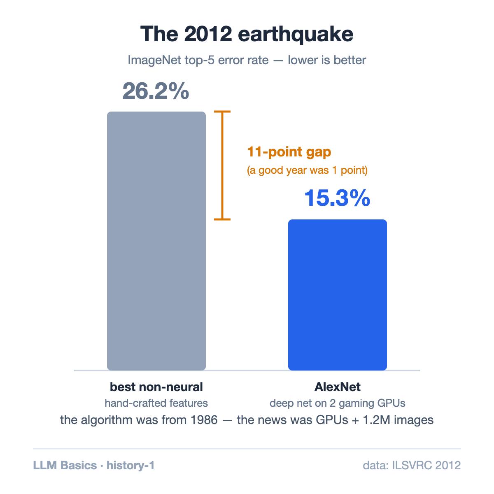

In July 1958, The New York Times told its readers about a new machine that the US Navy expected would soon "walk, talk, see, write, reproduce itself and be conscious of its existence."

The machine was Frank Rosenblatt's perceptron. It had 400 light sensors, learned by physically turning motor-driven knobs, and could tell whether a card had a mark on the left or the right. That's it. The gap between the promise and the reality took 60 years to close — and the surprising part is that the core idea never changed. The thing answering your questions in a chat window today is, mathematically, a direct descendant of that 1958 machine.

Here is that 60-year story in five turns.

## 1958: A machine that learns instead of being programmed

Every computer before the perceptron did exactly what its program said. Rosenblatt's machine was different: it made a guess, checked the answer, and adjusted itself when wrong.

The mechanism was almost embarrassingly simple. Each of the 400 sensors connects to an output through an adjustable weight (literally a potentiometer — a volume knob). The machine multiplies each input by its weight, adds everything up, and answers "yes" if the sum crosses a threshold. Wrong answer? Nudge the knobs that contributed to the mistake. Repeat a few hundred times, and the machine classifies cards it has never seen.

Guess, measure the error, adjust the weights. Hold onto that loop — it is still how GPT-class models are trained today.

## 1969: The wall

In 1969, Marvin Minsky and Seymour Papert published a book proving mathematically that a single-layer perceptron cannot learn some trivially simple patterns. The canonical example is XOR: answer "yes" when exactly one of two inputs is on. No possible setting of the knobs gets it right.

The fix — stacking layers so the network can build intermediate concepts — was already suspected. But nobody knew how to train the middle layers: when a three-layer network errs, which knob in the hidden layer do you blame? This "credit assignment problem" froze the field. Funding evaporated for over a decade — the first AI winter.

## 1986: Backpropagation answers the blame question

The thaw came from a 1986 paper by David Rumelhart, Geoffrey Hinton, and Ronald Williams. Backpropagation is, at heart, an accounting method: starting from the output error, use calculus to compute exactly how much each weight — in every layer — contributed to the mistake, then adjust each one in proportion to its blame.

Suddenly deep (multi-layer) networks were trainable. Yann LeCun's LeNet used the technique to read millions of handwritten digits on US bank checks in the 1990s — the first neural network with a real job.

Then progress stalled again. Networks big enough to be interesting needed more data and more compute than the 1990s could supply. For a stretch, simpler statistical methods beat neural nets on most benchmarks, and "neural network" became a phrase you avoided in grant applications.

## 2012: The hardware finally catches up

The 2012 ImageNet competition asked programs to recognize objects across 1.2 million photos. A team led by Hinton's students Alex Krizhevsky and Ilya Sutskever entered a deep network trained on two consumer gaming GPUs.

Their model, AlexNet, scored a 15.3% top-5 error rate. The best non-neural competitor: 26.2%. In a field where a one-point gain was a good year, an 11-point gap was an earthquake.

The pivotal detail: AlexNet's learning algorithm was essentially the one from 1986. What changed was scale — a thousand times more training data and GPUs that could do the arithmetic fast enough. The algorithm had been waiting 26 years for the hardware.

Everything after followed that lesson. AlphaGo beat Lee Sedol at Go in 2016. And by OpenAI's estimate, the compute used in the largest training runs grew more than 300,000-fold between 2012 and 2018.

## 2017–today: Attention, and the era of scale

One architecture built for that lesson won the decade. The 2017 paper "Attention Is All You Need" introduced the Transformer, designed so that training parallelizes almost perfectly across thousands of GPUs (a full article on this is coming later in the series).

Feed a Transformer a simple objective — predict the next word — plus most of the internet and months of GPU time, and you get GPT. GPT-1 (2018) had 117 million weights. GPT-3 (2020) had 175 billion. Those "weights" are the same quantity Rosenblatt's knobs stored; there are just 400 million times more of them, adjusted by the same loop of guess, measure error, assign blame, update.

## What actually changed in 60 years

Strip away the branding and the history compresses cleanly:

- **The idea (1958)**: machines can learn weights from examples instead of following hand-written rules.
- **The unlock (1986)**: backpropagation lets that idea work through many layers.
- **The fuel (2012→)**: GPUs and internet-scale data let the same two ideas run at a scale where startling abilities emerge.

Modern AI was not one recent invention. It was a 60-year wait for hardware to catch up with an idea — plus the engineering to run that idea at planetary scale. That engineering, from GPU memory layouts to the tricks that serve billions of requests, is what the rest of this blog digs into.

## Takeaway

- An LLM is a direct descendant of the 1958 perceptron: weighted sums, a threshold, and error-driven weight updates.
- The two real breakthroughs were backpropagation (1986) and scale (2012 onward). The core learning loop never changed.
- When AlexNet won ImageNet by 11 points in 2012, it used a 26-year-old algorithm — the GPUs were the news.

## Sources

- Rosenblatt, F. (1958). ["The Perceptron: A Probabilistic Model for Information Storage and Organization in the Brain"](https://doi.org/10.1037/h0042519), *Psychological Review* · [NYT coverage, July 8, 1958](https://www.nytimes.com/1958/07/08/archives/new-navy-device-learns-by-doing-psychologist-shows-embryo-of.html)
- Minsky, M. & Papert, S. (1969). [*Perceptrons*](https://mitpress.mit.edu/9780262630221/perceptrons/), MIT Press
- Rumelhart, D., Hinton, G., Williams, R. (1986). ["Learning representations by back-propagating errors"](https://doi.org/10.1038/323533a0), *Nature*
- Krizhevsky, A., Sutskever, I., Hinton, G. (2012). ["ImageNet Classification with Deep Convolutional Neural Networks"](https://proceedings.neurips.cc/paper/2012/hash/c399862d3b9d6b76c8436e924a68c45b-Abstract.html), *NeurIPS*
- Vaswani, A. et al. (2017). ["Attention Is All You Need"](https://arxiv.org/abs/1706.03762), *NeurIPS*
- OpenAI (2018). ["AI and Compute"](https://openai.com/research/ai-and-compute)
- Brown, T. et al. (2020). ["Language Models are Few-Shot Learners"](https://arxiv.org/abs/2005.14165) (GPT-3), *NeurIPS*

---

*Part of the **Fundamental of LLM** series. Next up: the decade everything changed — ImageNet to AlphaGo to GPT.*
