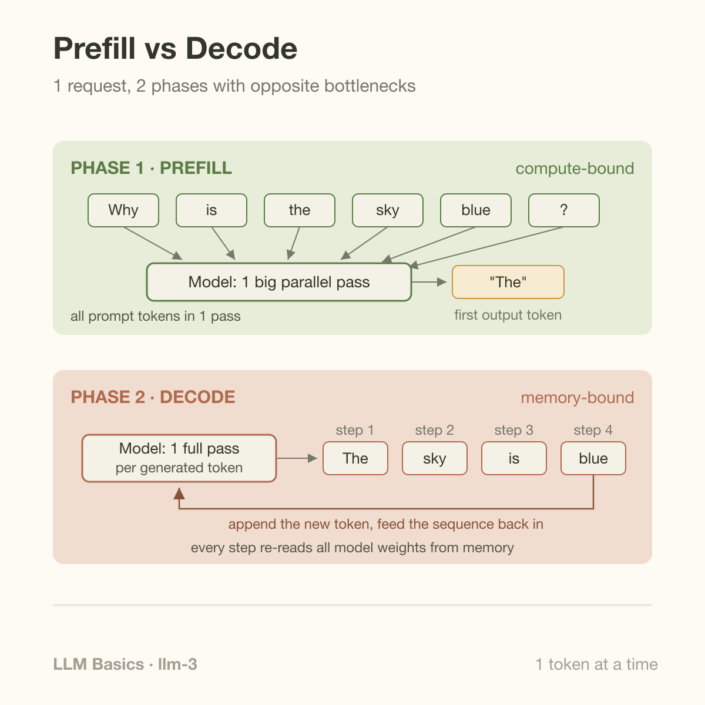
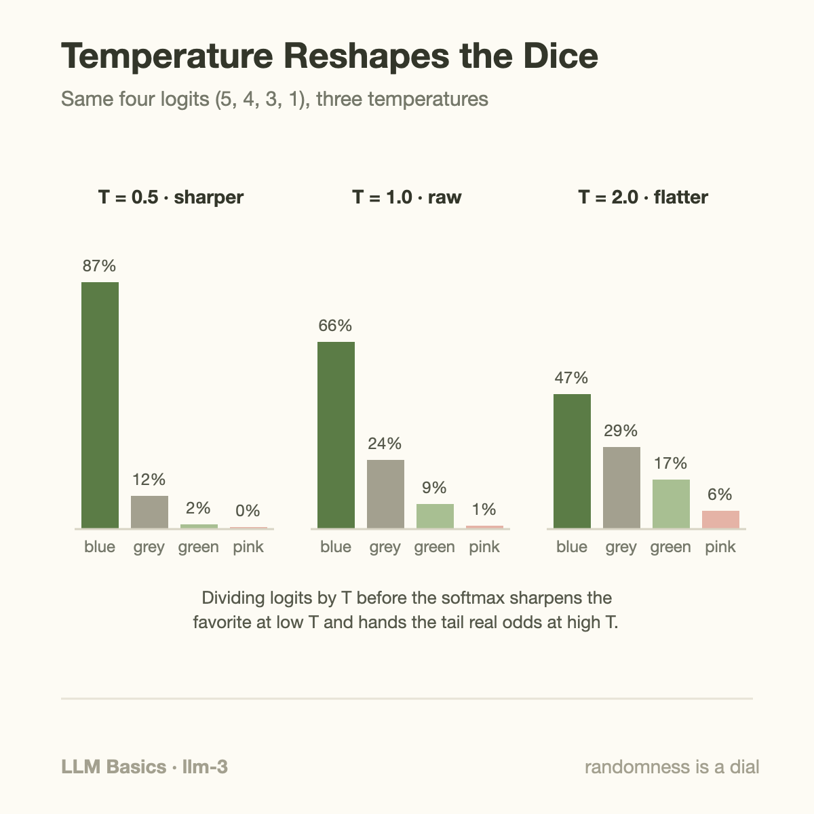

A 7-billion-parameter model stores about 14 GB of weights, and it reads essentially all of them to produce a single token — roughly 2 bytes of text. Generate a 300-token answer and the GPU has streamed more than 4 terabytes through its memory system to hand you a paragraph. That lopsided ratio explains almost everything about how LLM inference feels: why the first word takes a moment, why the rest trickle out at a steady rhythm, and why the world's fastest matrix engines spend most of their time waiting.

This article walks through what actually happens between pressing Enter and seeing an answer. No training, no fine-tuning; just the generation loop. It splits into 2 phases with completely different personalities, and once you can tell them apart, a lot of later material (KV caches, batching, latency metrics) stops being mysterious.

## 1 loop, run over and over

A language model does exactly 1 thing: given a sequence of tokens, it outputs a score for every token in its vocabulary, expressing how plausible each one is as the *next* token. A token is a chunk of text from a fixed vocabulary, typically 30,000 to 200,000 entries; common words are 1 token, rarer words get split into pieces. The model never outputs a sentence. It outputs 1 probability distribution, once per forward pass.

Generation is therefore a loop:

1. Feed the sequence so far into the model.
2. Take the output distribution for the next position.
3. Pick one token from it (more on *how* below).
4. Append that token to the sequence and go back to step 1.

Repeat until the model emits a special end-of-sequence token or hits a length limit. This is called **autoregressive** generation: each output becomes part of the next input. The model that wrote token 57 has no memory of "planning" tokens 58 through 90. Whatever coherence the answer has emerges from the fact that each step conditions on everything before it.

The loop hides an asymmetry, though. Your prompt might be 1,000 tokens long, and the model needs to process all of them before it can propose token 1,001. Does it loop 1,000 times first? No — and that shortcut is the whole story of phase 1.

## Prefill: the prompt in 1 gulp

Recall from [the Transformer architecture](/blog/transformer-architecture-in-one-picture/) that a Transformer processes all positions of its input in parallel. There is no recurrence, no left-to-right crawl; [attention](/blog/attention-in-plain-words/) lets every token look at every earlier token inside 1 big batch of matrix multiplications.

So when your 1,000-token prompt arrives, the model runs *1* forward pass over all 1,000 positions at once. This is **prefill**. The GPU gets served exactly the meal it was built for: enormous, dense matrix multiplications with plenty of work per byte of weights fetched. Each weight matrix is loaded from memory once and applied to 1 thousand token positions. Arithmetic dominates; we call this **compute-bound**. Prefill ends when the model produces the distribution for the first new token. The time you wait for that is the **time to first token (TTFT)**, and it grows with prompt length, because a longer prompt simply means more math.

## Decode: 1 token per pass

Then the model faces a wall it cannot parallelize around. Token 1,002 depends on token 1,001, which doesn't exist until the model picks it. Generation from here on is strictly sequential: 1 forward pass, 1 token, append, repeat. This is **decode**.

Each decode step does only a sliver of arithmetic — the new work is for a single token position — yet it still has to read the *entire* set of model weights out of GPU memory, because every layer's matrices participate in every pass. The GPU's multipliers finish their tiny job almost instantly and then idle while the memory system hauls in the next layer's weights. Decode is **memory-bandwidth-bound**: the speed limit is bytes per second, not floating-point operations per second. The steady rhythm of tokens appearing on your screen is, quite literally, the cadence of 14 GB of weights being re-read from memory, over and over.

That is why an LLM's speed is quoted as 2 numbers, not 1: TTFT for prefill, and time per output token (often called TPOT or inter-token latency) for decode. They are limited by different hardware resources and optimized by different tricks.

## A worked example you can do by hand

Take a 7B-parameter model in 16-bit precision on a single NVIDIA A100. 3 published numbers are all we need: the weights occupy 7B × 2 bytes = **14 GB**; the A100 moves about **2 TB/s** from its HBM memory; and its dense FP16 peak is about **312 TFLOP/s** (NVIDIA's datasheet figures, so treat them as best-case vendor numbers).

**Decode step.** A forward pass costs roughly 2 FLOPs per parameter per token (1 multiply, 1 add), so 1 new token needs about 2 × 7B = **14 GFLOPs**. At 312 TFLOP/s that is 14 × 10⁹ / 312 × 10¹² ≈ **0.045 ms** of arithmetic. But the pass must also read all 14 GB of weights: 14 GB / (2,000 GB/s) ≈ **7 ms**. Memory traffic outweighs compute by a factor of ~150. The compute units are working well under 1% of the time; the realistic ceiling is 1 token every ~7 ms, or about **140 tokens per second** for a single request — and real systems land below that.

**Prefill step.** Now push a 1,000-token prompt through in 1 pass. Compute scales up a thousandfold to ~14 TFLOPs, while the weights are still read essentially once. Even at an optimistic 50% of peak compute, that is 14 × 10¹² / 156 × 10¹² ≈ **90 ms** of math against ~7 ms of weight traffic. The ratio has flipped: arithmetic now dominates by more than 10×.

Same model, same GPU, same request. 1 phase saturates the multipliers; the other saturates the memory bus. Hold onto the 7 ms number — it is also why serving systems batch many users' decode steps together, sharing 1 14 GB weight read across dozens of requests.

## From scores to words: sampling and temperature

Each pass ends with 1 raw score per vocabulary entry, called **logits**. A softmax turns them into probabilities: exponentiate every logit, then divide by the sum so they total 1. Then the system must pick one token. Always taking the highest-probability token is **greedy decoding**; it's deterministic but often flat and repetitive, so most systems **sample**, drawing randomly according to the probabilities.

**Temperature** is a single knob applied before the softmax: divide every logit by a number T. Concretely, suppose the model scores 4 candidate next words at logits 5, 4, 3, and 1. At T = 1 (untouched), softmax gives roughly 66%, 24%, 9%, and 1%. At T = 0.5 every logit doubles before the softmax, and exponentials amplify gaps viciously: the split becomes about 87%, 12%, 2%, and 0.03%. At T = 2 the logits are halved and the distribution flattens to about 47%, 29%, 17%, and 6% — the long shot got 200 times more likely than at T = 0.5. Low temperature sharpens the distribution toward the model's favorite; high temperature gives the tail a real chance. As T approaches 0, sampling collapses into greedy decoding.

In practice temperature is combined with a tail-trimming rule such as **top-p (nucleus) sampling**: keep only the smallest set of tokens whose probabilities sum to p (say 0.9) and renormalize, so the model can be creative among plausible options without ever picking garbage from the far tail. Holtzman et al. introduced this after showing that pure sampling wanders into incoherence while greedy decoding loops and repeats.

1 subtlety worth internalizing: sampling happens once per token, and each choice changes all subsequent distributions. Randomness compounds. 2 runs at temperature 0.8 can diverge at token 3 and produce entirely different, equally fluent answers.

## Temperature rescales relative probabilities

For logits $$z_i$$ and positive temperature $$T$$, sampling probabilities are

$$
p_i(T)=\frac{\exp(z_i/T)}{\sum_j\exp(z_j/T)}.
$$

Logits are relative scores, not calibrated confidence in factual correctness. Subtracting their maximum before exponentiation preserves this distribution and prevents numerical overflow. The ratio between 2 token probabilities is exponential in their logit difference divided by temperature.

For logits 5, 4, 3, and 1, temperature 1 gives probabilities approximately 0.6572, 0.2418, 0.0889, and 0.0120. Temperature 2 gives 0.4740, 0.2875, 0.1744, and 0.0641. Larger temperature makes this distribution flatter. The 0-temperature limit concentrates on maximum logits; ties need a separate selection convention.

Compared with always selecting the largest logit, sampling creates alternate continuations without changing model weights. Top-k or top-p filtering adds another policy by removing candidates and renormalizing. Those changes affect reproducibility and output length, which can affect serving measurements too. Record sampling settings when comparing speed and quality. A cache avoids recomputing earlier key/value projections, but each new query still consumes accessible history; it does not eliminate attention's context-dependent work.

## Going deeper: the KV cache, or the work you never redo

There's a problem hiding in the loop as described. At step 500, the input is the original prompt plus 500 generated tokens. Attention needs each new token to compare against *all* previous positions. Naively, every decode step would reprocess the whole sequence from scratch, making step n cost O(n) full-sequence work and the whole generation quadratic. Nobody does that.

The fix rests on a property of the Transformer: the attention **key** and **value** vectors computed for a token depend only on that token and its predecessors. Once computed, they never change. So the system saves them. During prefill, the keys and values for every prompt token are computed and stored in GPU memory; each decode step computes the query, key, and value for just the 1 new token, attends against the stored keys and values, and appends its own pair to the store. This store is the **KV cache**: generation's memory of work already done.

It isn't free. For a Llama-2-7B-shaped model (32 layers, hidden size 4,096, 16-bit values), each token's keys and values occupy 2 × 32 × 4,096 × 2 bytes = **512 KB**. A 4,000-token conversation holds about 2 GB of cache per request, alongside the 14 GB of weights, and the decode pass must read the cache too, so long contexts slow decoding down. Managing this memory well is its own engineering discipline — the vLLM project's PagedAttention showed that simply allocating cache in small pages instead of 1 contiguous slab can multiply serving throughput. The cache deserves (and will get) its own article.

## Common misconceptions

**"The model plans the whole answer, then types it out."** There is no draft buffer. The model emits 1 probability distribution per step and never sees its own future. What looks like planning is conditioning: an essay's opening sentence constrains the distribution of every later token. This is also why a model can start a list of "three reasons," get sampled into a tangent, and gracefully deliver 4.

**"Temperature 0 makes the model accurate."** Temperature 0 makes the model *greedy*, which is a different thing. It always picks the highest-probability token, so if the model's distribution puts its mode on a wrong fact, greedy decoding states that wrong fact with full confidence, every time. Temperature controls variability, not truthfulness. (Even at T = 0, serving-side effects like batching and floating-point reduction order can produce occasional run-to-run differences.)

**"Generation is slow because the model has too much math to do."** For decode, almost the opposite: our worked example showed ~0.045 ms of arithmetic hiding behind ~7 ms of memory traffic per token. The multipliers are idle over 99% of the time. This is why inference optimization obsesses over bytes — quantizing weights to 8 or 4 bits speeds up decoding roughly in proportion to the shrunken memory footprint, something that would make no sense if arithmetic were the bottleneck.

## Where this sits in the bigger picture

The prefill/decode split is the seam along which the entire inference stack is organized. Serving frameworks schedule the 2 phases differently, batch decode steps from many users to amortize weight reads, and report their health through phase-specific metrics; that framing connects directly to [Goodput vs Utilization](/blog/goodput-vs-utilization/), where "the GPU is 90% busy" turns out to say very little about tokens usefully delivered. The memory-bound nature of decode is also why accelerator roadmaps chase bandwidth as hard as FLOPs — the arithmetic in [the Blackwell-to-Rubin memory math](/blog/blackwell-to-rubin-memory-math/) is this article's 7 ms bottleneck projected across hardware generations. And if the "why can't decode parallelize?" question nags at you, [RNN and LSTM](/blog/rnn-lstm-and-the-wall/) tells the prehistory: Transformers banished sequentiality from training, and autoregressive generation quietly brought it back at inference time.

Next in this series, the KV cache gets a full treatment: how it's laid out, why it fragments, and how paging fixed that.

## Takeaway

- Generation is a loop: prefill processes the whole prompt in 1 parallel, compute-bound pass (that's your time-to-first-token), then decode produces 1 token per full forward pass, bound by memory bandwidth, not math.
- On a 7B/A100 back-of-envelope, a decode step needs ~0.045 ms of arithmetic but ~7 ms of weight reads, capping single-stream speed near 140 tokens/s; batching and quantization attack the bytes, not the FLOPs.
- Sampling turns per-step scores into text: temperature rescales logits before the softmax (low = sharper, high = flatter), top-p trims the tail, and the KV cache saves each token's keys and values so prior key/value projections need not be recomputed; new queries still attend over retained history.

## Sources

- Vaswani et al., "Attention Is All You Need," NeurIPS 2017. https://arxiv.org/abs/1706.03762
- Holtzman et al., "The Curious Case of Neural Text Degeneration," ICLR 2020. https://arxiv.org/abs/1904.09751
- Pope et al., "Efficiently Scaling Transformer Inference," MLSys 2023. https://arxiv.org/abs/2211.05102
- Kwon et al., "Efficient Memory Management for Large Language Model Serving with PagedAttention," SOSP 2023. https://arxiv.org/abs/2309.06180
- vLLM documentation (serving metrics: TTFT, TPOT/ITL). https://docs.vllm.ai/
- NVIDIA A100 Tensor Core GPU datasheet (peak FLOP/s and memory bandwidth; vendor-reported figures), NVIDIA Corporation, 2020.

*Part of the [LLM Foundations & Mathematics](/series/llm-basics/) learning path. Browse its Beginner, Intermediate, and Advanced topics and planned articles.*
