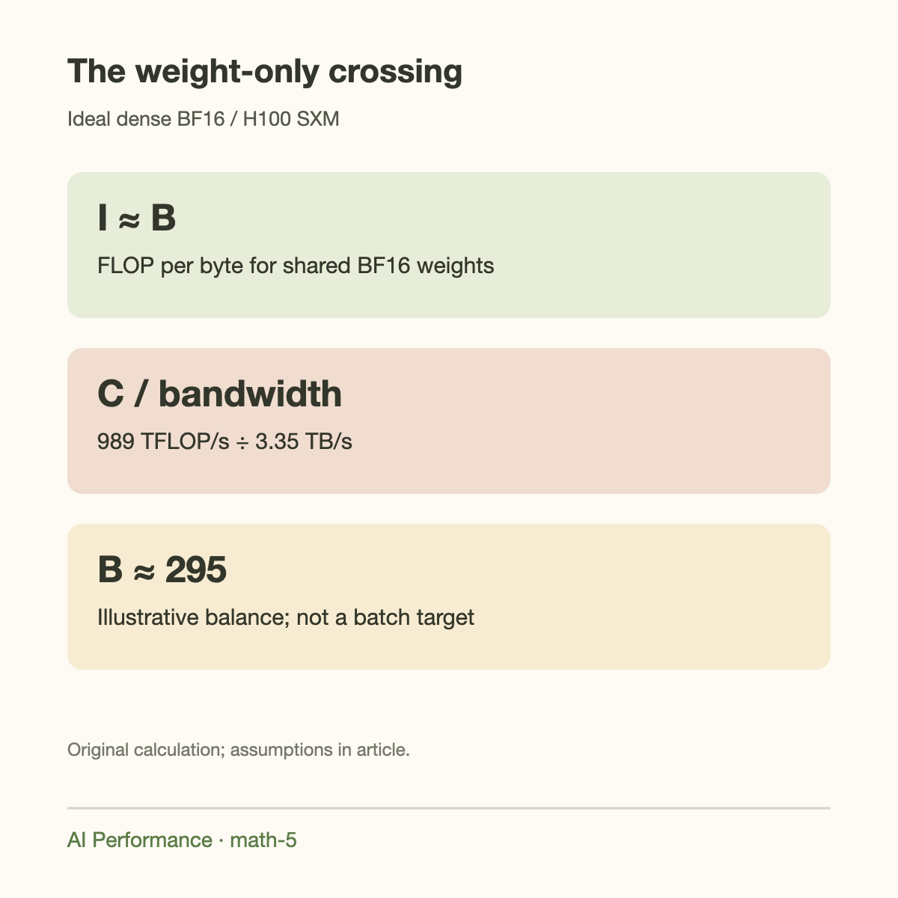
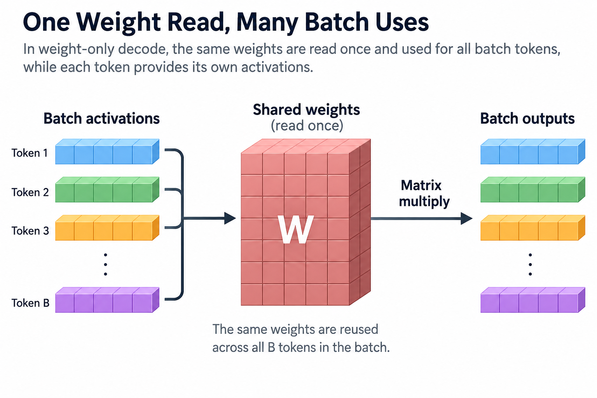
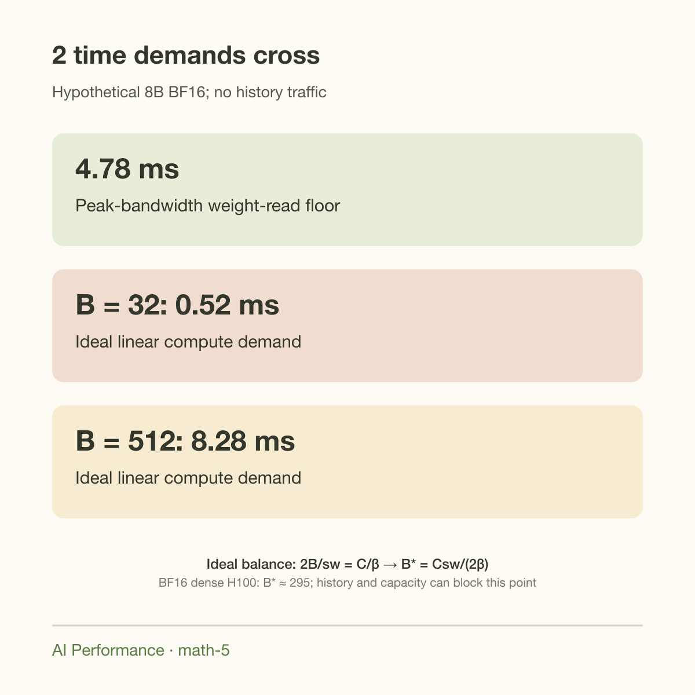
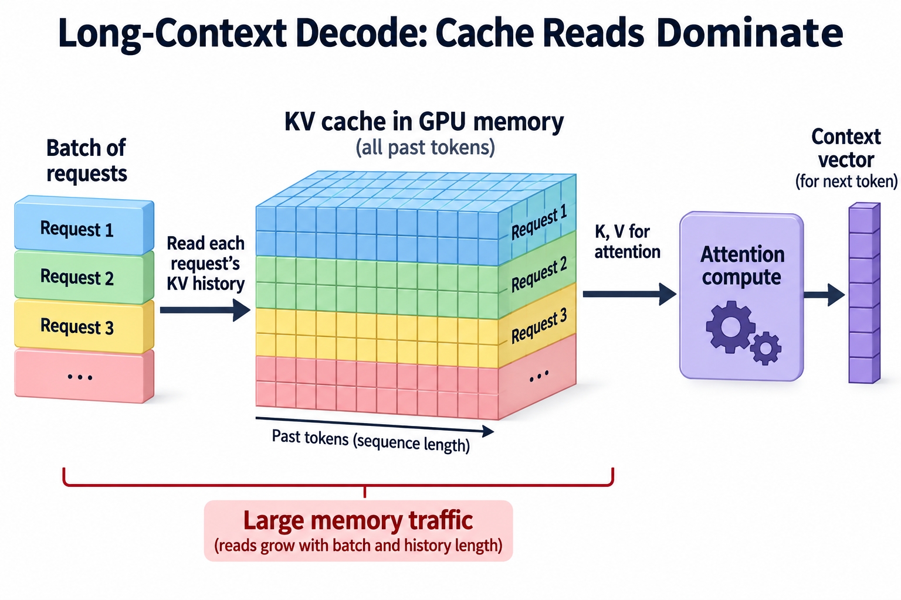
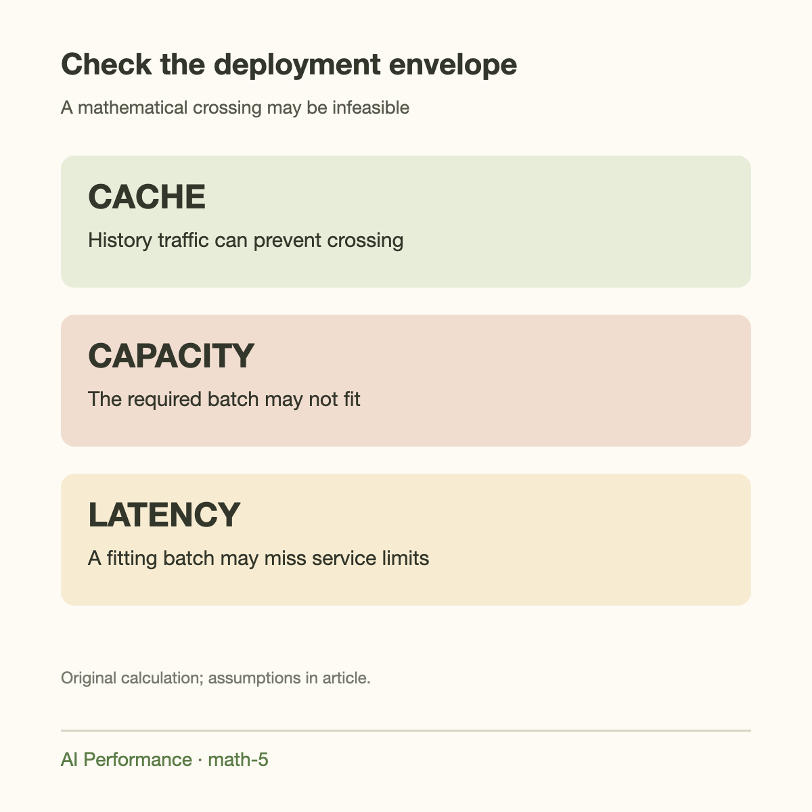

About 295 active token rows is the ideal weight-only batch at which BF16 dense arithmetic balances H100 SXM peak memory bandwidth and dense Tensor Core compute. That is an illustrative roofline crossing, not a recommended serving batch and not a measured transition.

The number becomes much less useful if its assumptions disappear. Long-context cache reads grow with batch size. A 70B BF16 model does not fit 1 80 GB H100. A quantized kernel may use a different arithmetic path. Real GEMMs need suitable shapes to approach the advertised rate. A mathematical crossing can sit outside every deployable configuration.

This final GPU Math article derives the result carefully, adds history traffic, and explains what profiling must confirm. The aim is a reusable model: identify bytes moved, operations performed, and attainable resource rates, then check both memory capacity and latency.

## Arithmetic intensity connects work to traffic

Arithmetic intensity is useful operations divided by bytes transferred across the memory interface being modeled:

$$
I=\frac{F}{D}\quad\mathrm{FLOP/byte}.
$$

If the GPU can sustain compute rate $$C$$ and memory bandwidth $$\beta$$, the ideal roofline rate is

$$
\mathrm{performance}\le\min(C,\beta I).
$$

Below the balance point, memory cannot deliver bytes fast enough to feed peak arithmetic. Above it, peak arithmetic is the stronger bound. The balance intensity is

$$
I_* = \frac{C}{\beta}.
$$

This is a resource model, not a binary label that explains every kernel. Launch overhead, dependencies, communication, and imperfect occupancy can keep a workload below both ceilings. A kernel can also contain stages with different bottlenecks.

NVIDIA's matrix-multiplication guide uses this same operations-to-bytes reasoning and notes practical limitations. It is the right starting point for estimating whether batching creates enough reuse, provided the chosen memory interface and compute format match the execution.

## Count GEMM operations explicitly

For multiplying an $$M\times K$$ matrix by a $$K\times N$$ matrix, the result has $$MN$$ elements. Each output is a dot product of length $$K$$. Counting 1 multiply and 1 add as 2 operations gives

$$
F\approx2MKN.
$$

For a decode linear layer, $$M$$ can represent active token rows, often approximately the number of active sequences. The weight matrix has $$KN$$ values, while input and output contain $$MK$$ and $$MN$$ values.

If all are stored as 2-byte elements and each is read or written once across HBM, a basic traffic estimate is

$$
D\approx2(KN+MK+MN).
$$

Ignoring output accumulation details and extra workspace,

$$
I\approx\frac{MKN}{KN+MK+MN}.
$$

When $$M$$ is small relative to large weight dimensions, the $$KN$$ term dominates and intensity is approximately $$M$$ FLOP/byte. As $$M$$ grows, activation traffic becomes less negligible. The simple linear increase is therefore an approximation, not an unlimited law.

## Derive the weight-only batch crossing

For a rounded dense model with $$P$$ active parameters, linear-layer work per step is approximately $$2PB$$ operations. If weights use $$b_w$$ bytes each and 1 model read is shared across the batch, traffic is approximately $$Pb_w$$.

Then

$$
I\approx\frac{2PB}{Pb_w}=\frac{2B}{b_w}.
$$

The rounded parameter count cancels. In the ideal weight-dominated regime, precision and batch determine arithmetic intensity, while model size determines absolute time and whether the model fits.

Equate intensity to the hardware balance:

$$
\frac{2B_*}{b_w}=\frac{C}{\beta},
\qquad B_*\approx\frac{Cb_w}{2\beta}.
$$

For BF16 weights, $$b_w=2$$, so $$B_*\approx C/\beta$$. NVIDIA's current H100 SXM table gives BF16 Tensor Core throughput with a sparsity qualification. Dense arithmetic uses approximately half that sparse figure, around 989 trillion operations per second, rather than the approximately 1,979 trillion sparse rate.

With peak bandwidth $$3.35\times10^{12}$$ bytes per second,

$$
B_*\approx\frac{989\times10^{12}}{3.35\times10^{12}}\approx295.
$$

This is the origin of the opening number. It assumes ideal dense BF16 execution and weight-dominated traffic. The rounded 70B model's BF16 weights exceed 1 H100's capacity, so do not report this as a feasible 1-GPU 70B benchmark.

## A smaller model makes the timing example feasible

Use a hypothetical dense 8B model with BF16 weights and ignore history for the moment. Its weight payload is 16 GB. At peak bandwidth, 1 weight read takes at least 4.78 ms.

At batch 32, approximate linear work is $$2\times8\times10^9\times32=512\times10^9$$ operations. At the ideal dense compute rate, that takes about 0.518 ms. Memory service is much larger, so the weight-only model predicts a memory-bound step.

At batch 512, work is about 8.192 trillion operations, requiring at least 8.28 ms at that compute ceiling. Weight traffic still requires 4.78 ms. The model now predicts a compute-bound step.

These numbers omit cache, activations, non-linear operations, and overhead. A sufficiently large set of short requests may fit the smaller model's memory budget, but the exact checkpoint geometry and engine allocations must establish that. The example isolates how the 2 time curves cross.

Per-request streaming depends on step duration. Raising batch from 32 to 512 does not preserve individual speed once compute dominates. Aggregate rate approaches a plateau while each user's token interval grows. A service may reject that tradeoff well before hardware throughput stops increasing.

## Quantized weights change 1 side of the equation

An illustrative 4-bit format with metadata can use 0.53125 bytes per weight. If, purely for comparison, its useful arithmetic rate remained the dense BF16 rate, the weight-only crossing would be

$$
B_*\approx\frac{989\times0.53125}{2\times3.35}\approx78.4.
$$

Smaller weight traffic raises intensity at a smaller batch. This explains why quantization can expose compute constraints sooner. It does not establish that a real 4-bit kernel becomes compute-bound at batch 78.

Weight-only quantization kernels may unpack integer values into a supported arithmetic representation, with conversion overhead and shape-specific efficiency. Other kernels use different instructions. The applicable $$C$$ must reflect that path, preferably from measured GEMMs. An advertised INT8, FP8, or sparse TFLOPS number cannot be chosen just because it makes the estimate look favorable.

The metadata term also belongs in traffic. A nominal 0.5-byte estimate yields a different crossing from 0.53125. If scales remain in cache or are repeatedly fetched, the measured traffic may differ again. Use the actual format layout and profiling evidence.

## Add cache traffic to the crossing

Let each request retain $$S$$ tokens, with logical cache bytes per retained token $$c$$. Under an ideal full-history read model,

$$
D\approx Pb_w+BcS.
$$

For now retain the approximate linear work $$F\approx2PB$$. Attention itself adds operations, so this simplified calculation isolates how cache bytes weaken the weight-reuse benefit.

The arithmetic intensity is

$$
I(B)\approx\frac{2PB}{Pb_w+BcS}.
$$

Unlike the weight-only expression, this has a finite large-batch limit:

$$
\lim_{B\to\infty}I(B)=\frac{2P}{cS}.
$$

If that limit is below $$C/\beta$$, increasing batch cannot make this simplified workload compute-bound. Cache bytes grow along with useful rows and prevent unlimited intensity gains.

Solving the equality gives

$$
B_*\approx\frac{CPb_w}{2P\beta-CcS},
$$

provided the denominator is positive. A 0 or negative denominator means there is no positive finite crossing under these assumptions. This is a meaningful mathematical result, not a numerical error to be fixed by forcing a larger batch.

## A worked long-history comparison

Use the 70B GQA geometry from preceding articles, where $$c=327{,}680$$ bytes per retained token. At $$S=8{,}192$$, each request contributes about 2.684 GB of logical history reads per step.

The large-batch intensity limit for approximate linear work is

$$
\frac{2\times70\times10^9}{327{,}680\times8{,}192}
\approx52.2\ \mathrm{FLOP/byte}.
$$

That is far below the ideal dense BF16 balance near 295 FLOP/byte. The simplified model predicts no compute-bound transition from batching alone at that history length. Long-context cache traffic prevents the weight-only crossing.

At $$S=1{,}024$$, each request's logical cache reads are about 0.336 GB and the large-batch intensity limit is approximately 417 FLOP/byte. A crossing becomes mathematically possible. Keeping the illustrative quantized weight footprint and hypothetical dense arithmetic ceiling yields a crossing around batch 268, much larger than the weight-only estimate near 78.

But batch 269 at 1,024 cached tokens needs about 90.3 GB of BF16 cache payload, before weights and runtime. It does not fit 1 80 GB H100. The resource crossing exists algebraically but is outside the one-GPU capacity envelope.

This is why a batch recommendation must include [the memory budget](../does-llama-70b-fit-on-one-h100/) and [the cache geometry](../how-much-kv-cache-for-128k-context/). Roofline math alone cannot identify a deployable operating point.

## Attention adds arithmetic too

Full-context attention evaluates query-key products and uses attention weights to combine values. For a rough decode count, its leading work across layers is approximately

$$
F_{\mathrm{attention}}\sim4BLH_qdS,
$$

where $$H_q$$ is query heads. This counts the 2 main dot-product-like stages and omits softmax and other operations. Unlike cache storage, which depends on KV heads, attention work also reflects query heads.

Adding this term raises total operations. However, attention kernels need not achieve the same effective compute rate as large Tensor Core GEMMs. Treating all attention FLOPs as if they execute at dense BF16 peak can be optimistic. A better model separates GEMM, attention, and miscellaneous kernels, with appropriate traffic and effective rates for each.

Consequently, “the model is compute-bound” may hide mixed behavior: projection GEMMs can be compute-bound while attention remains bandwidth-bound. The end-to-end bottleneck is the sum of those kernel times plus scheduling and communication. Profile at the intended history distribution.

## Going deeper: shape and parallelism

A large arithmetic intensity does not guarantee full compute occupancy. Matrix dimensions determine tile count, Tensor Core eligibility, and wasted work in partial tiles. NVIDIA documents tile quantization: a small increase in a matrix dimension can require another mostly empty tile, producing a sudden throughput drop.

Wave quantization also matters. If the number of blocks only slightly exceeds 1 full wave of streaming multiprocessors, a nearly empty second wave can extend duration. That creates plateaus and discontinuities rather than the smooth curve predicted by a continuous roofline model.

Tensor parallelism changes local matrix dimensions and adds collectives. Smaller shards can reduce per-device GEMM efficiency, while communication introduces another bandwidth path. Per-device weight traffic may decrease, but the crossing cannot be inferred by multiplying 1-GPU throughput by device count.

Graph capture and fused kernels reduce launch overhead for supported shapes. They can improve the region below both resource ceilings, especially at small batch. They do not change the amount of useful model work, and their retained memory can shrink the available cache pool.

## Use attainable rates after the first estimate

Replace peak compute and bandwidth with measured effective rates for representative kernels. If attainable compute falls proportionally more than attainable bandwidth, the balance intensity decreases and the crossing occurs earlier. If bandwidth falls more, the crossing occurs later.

Do not assume 1 universal efficiency percentage. A short-context projection GEMM and a long-context attention kernel can have different rates and different limiting resources. Measure several batch sizes while keeping checkpoint, cache dtype, and retained lengths controlled.

Plot step time, aggregate output rate, individual token interval, and memory occupancy together. A plateau in aggregate rate with rising step time is compatible with compute saturation, but profiling must exclude scheduler stalls or communication. A memory-capacity failure is not evidence of reaching the compute ceiling.

## Common misconceptions

**A batch near 295 is universally optimal.** It is 1 ideal BF16 weight-only crossing for selected peak rates. History, precision, shapes, and service requirements change the answer.

**More batch always raises arithmetic intensity without limit.** Cache and activation traffic grow with batch. The cache-aware expression can saturate below the hardware balance.

**Sparse TFLOPS apply to an ordinary dense checkpoint.** The advertised sparsity-qualified rate requires the applicable sparse execution conditions. Use the dense or measured path.

**Compute-bound means faster individual responses.** Aggregate throughput can plateau while each request waits longer between tokens. Optimize within latency requirements, not solely for total rate.

Use the predicted crossing to choose measurement points on both sides, not to set a production batch directly. Include intermediate batches because tile and wave effects can make nearby shapes behave differently. If the crossing cannot fit within cache capacity, report that constraint explicitly rather than extrapolating an unattainable throughput plateau.

## Takeaway

Derive the weight-only crossing to understand reuse, then add cache bytes, attention work, and measured kernel efficiency. Reject crossings that lie outside memory capacity or service latency limits.

For the illustrative H100 rates, BF16 weight-only arithmetic balances near batch 295. Long histories can eliminate that crossing, and quantized deployments can encounter cache capacity before reaching it. The most useful batch is the measured compliant operating point, whose cost can be calculated with [the preceding cost article](../cloud-gpu-price-to-cost-per-million-tokens/).

## Sources

- [NVIDIA matrix-multiplication performance guide](https://docs.nvidia.com/deeplearning/performance/dl-performance-matrix-multiplication/index.html): FLOP counting, arithmetic intensity, tiling, and wave effects.
- [NVIDIA H100 specifications](https://www.nvidia.com/en-us/data-center/h100/): peak bandwidth and sparsity-qualified compute table.
- [Meta Llama 3.1 model card](https://huggingface.co/meta-llama/Llama-3.1-70B-Instruct): GQA family and context support.
- [vLLM paged-attention design](https://docs.vllm.ai/en/latest/design/paged_attention/): history access and physical cache organization.
