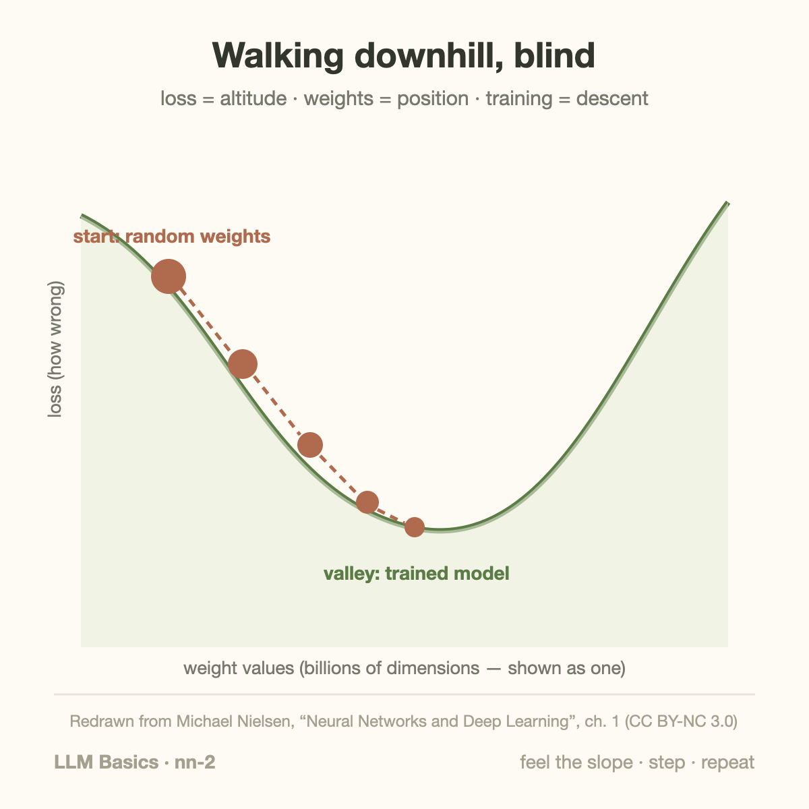
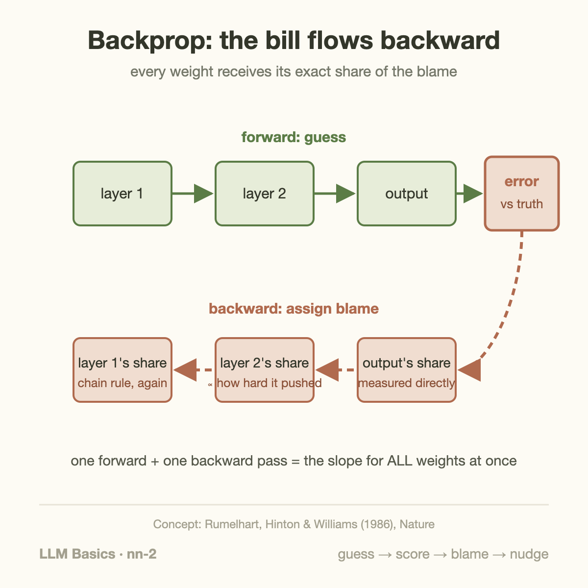

GPT-3 has 175 billion adjustable weights. Nobody set a single one of them by hand.

[Last article](/blog/what-is-a-neural-network/) established that a network's entire knowledge is its list of weight values. This one answers the obvious follow-up: how do those values get found? The answer is two ideas — one you can picture as walking downhill, one that is pure bookkeeping — and together they train everything from digit readers to ChatGPT.

## First: give the network a score

Training starts by defining failure numerically. Show the network an example whose answer you know, compare its output to the truth, and compute a **loss** — one number measuring how wrong it was. Zero means perfect; big means bad.

Now imagine a strange landscape. Each possible setting of the weights is a location; the loss at that setting is the altitude. Somewhere in this landscape are low valleys — weight settings where the network is usually right. Training is a search for them.

The catch: for a real model the landscape has billions of dimensions and you can't see any of it. You only know the altitude *where you're standing*.

## Gradient descent: walking downhill blind

Here's what you *can* do while blind on a hillside: feel which way the ground slopes under your feet, and step downhill. Repeat.

That is the entire algorithm, called **gradient descent**. The "slope under your feet" is the *gradient* — for each of the billions of weights, the answer to one question: *if I nudged this weight slightly, would the loss go up or down, and how steeply?* Take a small step for every weight in its downhill direction, and the loss decreases. Do it millions of times, and a network that started as random noise becomes a digit reader — or a language model.

The step size (the *learning rate*) is a genuine tuning art: too small and training takes forever; too large and you overshoot valleys entirely. But the concept stays this simple.

## Backprop: the bill for every mistake

One question remains, and it's the one that froze the field for 17 years: how do you *compute* that slope for a weight buried deep in the middle of the network? When the final answer is wrong, which of the 175 billion knobs is to blame, and by how much?

The answer is **backpropagation** — introduced for neural networks in a [1986 paper by Rumelhart, Hinton, and Williams](https://doi.org/10.1038/323533a0). Strip the calculus away and it is an accounting procedure:

1. Start at the output, where the error is directly measurable
2. Split that error backward through the last layer: each contributing neuron receives blame in proportion to how strongly it pushed the wrong answer
3. Repeat, layer by layer, until every weight in the network holds its exact share of the bill

The mathematical engine is the chain rule from first-year calculus, applied systematically. The result is remarkable: **one forward pass plus one backward pass prices every weight's blame simultaneously** — 175 billion gradient values for roughly the same compute as running the network twice. Without this trick, you'd have to nudge weights one at a time to see what happens; at billions of weights, that's not a slow method, it's an impossible one.

## The loop, assembled

Put the pieces together and training is a four-beat loop:

> **guess** (forward pass) → **score** (loss) → **assign blame** (backward pass) → **nudge** (gradient step)

Run it on one batch of examples, then the next, millions of times. That loop is what a "training run" is — and why training costs what it costs: every beat touches every weight, and frontier models run the loop over trillions of words. When headlines say a model took months on thousands of GPUs, they're describing this loop, executed at industrial scale.

It's also why the field cares so much about training *efficiency*: shave 20% off the loop's cost and you've shaved 20% off one of the largest compute bills in industry. That thread — same loop, run cheaper — is exactly where this blog's [performance series](/blog/what-does-an-ml-performance-engineer-do/) picks up.

## Takeaway

- Training = minimizing a loss by walking downhill in weight-space: feel the slope, step, repeat. That's gradient descent.
- Backprop is the accounting trick that computes every weight's slope in one backward pass — the 1986 breakthrough that made deep networks trainable at all.
- Everything about a training run's cost follows from the loop: guess → score → blame → nudge, times every weight, times trillions of examples.

## Sources

- Rumelhart, Hinton, Williams (1986). ["Learning representations by back-propagating errors"](https://doi.org/10.1038/323533a0), *Nature*
- Michael Nielsen — [*Neural Networks and Deep Learning*](http://neuralnetworksanddeeplearning.com/chap1.html), ch. 1–2 (CC BY-NC 3.0; the gradient-descent figure is redrawn from it)
- Kaplan et al. (2020). ["Scaling Laws for Neural Language Models"](https://arxiv.org/abs/2001.08361) (why the loop gets run at ever-larger scale)

---

*Part of the **Fundamental of LLM** series. Previous: [What is a neural network, really?](/blog/what-is-a-neural-network/) Next: CNNs — how machines learned to see.*
