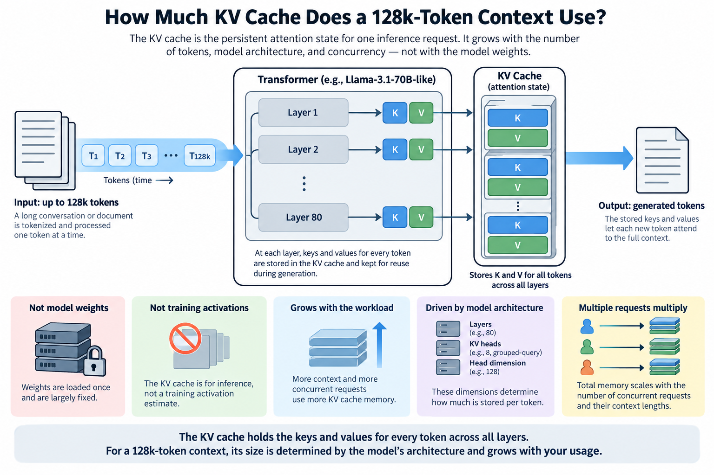
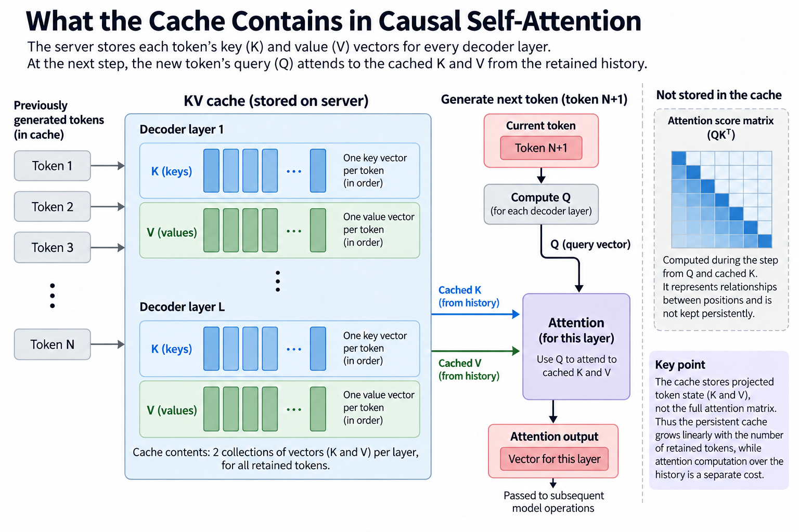
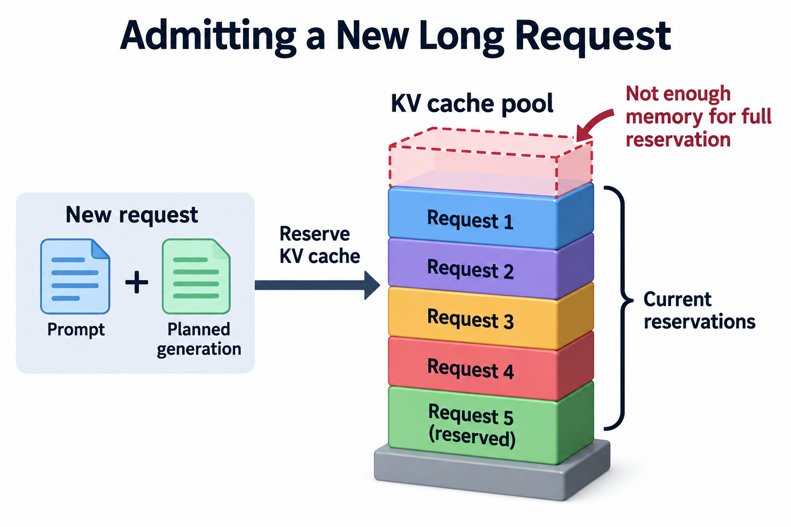
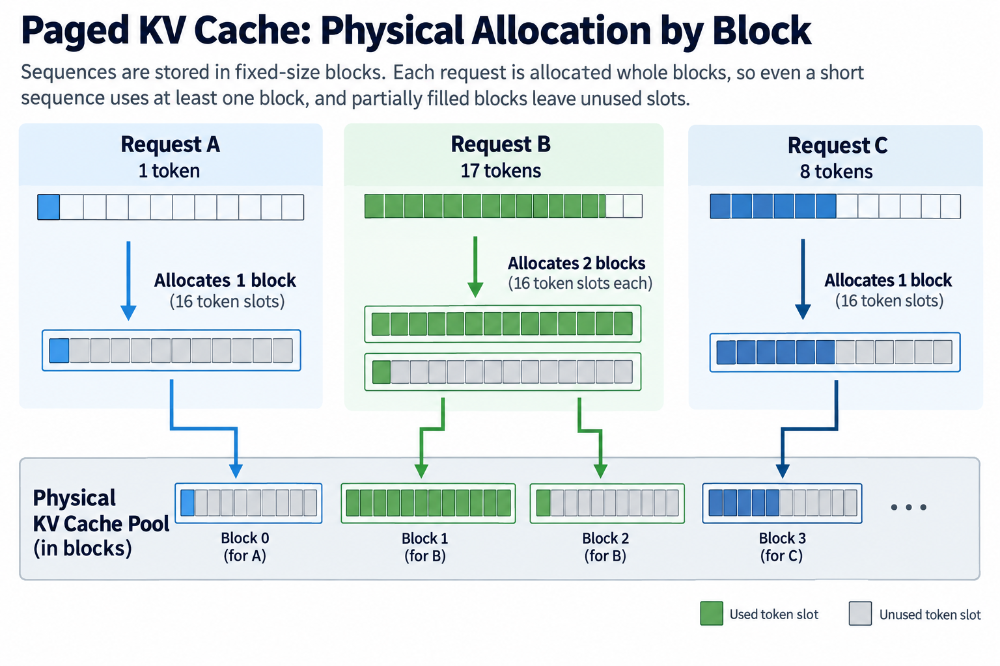
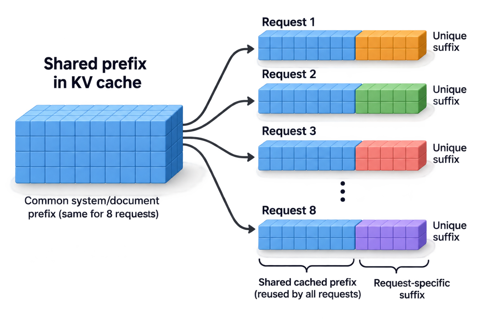

## Overview

40 GiB is the logical BF16 key-value cache for 1 131,072-token history in the 70B grouped-query geometry used throughout this subtopic: not a training activation estimate and not the model's weight footprint, but persistent attention state for a single inference request.

That distinction matters because the cache grows with the workload. Weight memory is largely fixed after loading; attention state grows as requests arrive and generate tokens. A server configured for short conversations can run out of memory on a small number of long documents even when its checkpoint has not changed.

Here we derive the capacity, explain which architecture choices affect it, and connect storage to decode traffic. We use a Llama-3.1-70B-like example with 80 layers, 8 KV heads, and head dimension 128. Those dimensions are explicit model assumptions; verify the exact checkpoint configuration before applying the result. Meta's model card confirms that the family uses grouped-query attention and supports a 128k context window.

## Deep dive

### What the cache contains

In causal self-attention, a new token's query attends to keys and values from its retained history. Previous tokens' key and value projections do not need to be recomputed at every decode step, so the server stores them. The cache contains 2 collections of vectors per decoder layer: K and V.

It does not normally store the full attention score matrix persistently, because that matrix represents relationships between positions while the cache represents projected token state, and confusing those objects leads to the false claim that persistent inference cache must grow quadratically with context length.

For ordinary full-context attention, persistent KV payload grows linearly with retained tokens. Computation over the history still grows with length, and prefill has its own attention complexity. Storage complexity and arithmetic complexity describe different objects.

### Derive the formula from tensor dimensions

Let $$B$$ be independent requests, $$S$$ their common retained length, $$L$$ decoder layers, $$H_{kv}$$ KV heads, $$d$$ dimensions per head, and $$b$$ bytes per cached element. The logical payload is

$$
M_{KV}=2BSLH_{kv}db.
$$

The factor 2 is K plus V, every layer has its own attention projections so you multiply by layer count, each retained token has 1 vector per KV head so you multiply by heads and head dimension, and the dtype converts element count to byte count.

For unequal request lengths, replace $$BS$$ with their sum:

$$
M_{KV}=2LH_{kv}db\sum_i S_i.
$$

This is a more useful serving equation because live batches are rarely uniform. Requests enter and leave continuously, and their prompts differ. Concurrency alone is insufficient: 16 1k histories and 16 64k histories have the same request count but radically different memory demands.

For our example,

$$
2\times80\times8\times128\times2=327{,}680
$$

bytes per cached token. Dividing by 1,024 gives 320 KiB. That unit is convenient because powers-of-2 contexts give clean binary results.

### What does “128k” mean?

For this article, 128k means $$128\times1{,}024=131{,}072$$ tokens. A casually written 128,000-token context is slightly smaller. Check the model configuration and serving maximum instead of guessing from the abbreviated label.

Multiply the per-token bytes by 131,072:

$$
M_{KV}=42{,}949{,}672{,}960\ \mathrm{bytes}=40\ \mathrm{GiB}.
$$

In decimal units, that is about 42.95 GB. A product specification's GB label and a framework's GiB output should not be compared as though they were identical. Our broader deployment examples conservatively treat advertised capacity as decimal bytes and tell readers to measure actual allocatable capacity.

The context counts prompt plus retained generated output. A 120,000-token prompt followed by 10,000 output tokens occupies approximately 130,000 positions. A server can reject that request if its maximum context includes the output allowance, even though the prompt alone is below the limit.

### Grouped-query attention changes storage

Multi-head attention gives each query head its own K and V head, multi-query attention shares 1 K/V pair across all query heads, and grouped-query attention lies between those designs, with several query heads sharing 1 KV head.

Our example has 64 query heads and 8 KV heads. Persistent storage uses 8. If the otherwise identical model used 64 KV heads, the 128k BF16 cache would be 8 times larger: 320 GiB instead of 40 GiB. With 1 KV head it would be 5 GiB.

These are controlled geometry comparisons, not claims that changing only head count leaves model quality or checkpoint compatibility unchanged. Attention architecture is trained into the model. You cannot simply edit a configuration field and expect an existing checkpoint to become a valid smaller-cache model.

The distinction also affects kernel implementation. Query heads sharing KV state can reuse loaded data, but actual traffic depends on how the kernel schedules that reuse. The logical payload formula predicts capacity; it does not guarantee the minimum possible HBM reads.

### Context and concurrency multiply

At BF16, 1 8,192-token history uses 2.5 GiB, 1 32,768-token history uses 10 GiB, and 1 full 131,072-token history uses 40 GiB, so 4 32k histories have the same logical cache payload as 1 128k history.

This equality is useful for capacity planning, but those workloads are not equivalent computationally. Their attention matrix shapes, scheduling behavior, and per-request latency differ. The number of output tokens emitted per decode step also differs: 4 requests can emit 4 tokens, while 1 request emits 1.

Suppose the serving engine has a 30 GiB usable cache pool. The arithmetic permits 12 independent 8k histories or 3 32k histories. It cannot hold 1 full 128k BF16 history. Those counts ignore block rounding and sharing; treat them as maximum logical allocations before measuring engine overhead.

The same 30 GiB pool with an ideal 1-byte cache would hold twice as many token states. At 128k, logical payload becomes 20 GiB. At half a byte per element, it would become 10 GiB before metadata and packing. Support for those representations is implementation-specific, and reduced precision must be evaluated for attention quality, not only memory savings.

### A mixed-length worked example

Consider 4 active requests at retained lengths 4,096, 8,192, 16,384, and 32,768. Their total is 61,440 tokens. The cache payload is

$$
61{,}440\times327{,}680=20{,}132{,}659{,}200\ \mathrm{bytes}
=18.75\ \mathrm{GiB}.
$$

Now admit a fifth request with a 40,000-token prompt and permit it to generate up to 8,000 tokens. Reserving only prompt state adds about 12.21 GiB; budgeting its full 48,000 retained positions adds about 14.65 GiB. The latter brings the maximum planned payload to roughly 33.40 GiB.

A 30 GiB pool cannot support that full combination without releasing other state, reducing admitted output, or using another cache policy. Waiting until the fifth request's generation approaches the limit creates a preventable failure. Admission control should reason about the intended reservation policy and available blocks.

Not every server reserves each request's maximum future output immediately. Some allocate incrementally and rely on scheduler policies such as preemption. That can improve utilization but changes the meaning of “admitted safely.” Document whether the service guarantees completion or may later pause, recompute, or reject work under pressure.

### Going deeper: physical allocation

Paged cache systems divide state into blocks and map logical token positions to physical storage. For block size $$q$$ and independent histories,

$$
T_{\mathrm{physical}}=q\sum_i\left\lceil\frac{S_i}{q}\right\rceil.
$$

With 16-token blocks, a 1-token request still occupies at least 1 block. A 17-token request occupies 2. The unused tail is bounded by fewer than 16 token slots per independent sequence, but many short sequences can make the aggregate waste meaningful.

Block metadata and allocator structures add further memory. Prefix sharing can reduce duplication by allowing several requests to reference common blocks. The actual savings depend on identical tokenized prefixes, supported cache semantics, and block alignment. Distinct documents about the same topic do not share state merely because their words are similar.

Cache reuse also has a lifecycle. A completed request's prefix may remain available for future reuse, consuming capacity until eviction. A “live requests only” spreadsheet may underestimate the engine's resident pool if cached prefixes survive completion. Inspect whether the engine allocates a fixed pool and how it prioritizes blocks.

### Prefix sharing as a controlled example

Suppose 8 requests share an identical 8,192-token system/document prefix and each has a distinct 1,024-token suffix. Without physical sharing, total logical state is $$8\times9{,}216=73{,}728$$ tokens, or 22.5 GiB in our geometry.

With ideal full-prefix sharing, physical token state becomes

$$
8{,}192+8\times1{,}024=16{,}384,
$$

or 5 GiB. The saving is 17.5 GiB. This assumes the entire common prefix is reusable and aligned appropriately; engine metadata and tail-block behavior still matter.

Storage savings do not mean 8 requests' attention computation disappears. Each new query has its own output and may need to access the shared history. Some kernels or cache hierarchies can exploit read reuse, but the capacity calculation alone does not establish that bandwidth benefit.

Prefix sharing therefore deserves separate measurements: physical cache occupancy, prompt reuse rate, prefill time saved, and decode traffic. 1 hit-rate percentage cannot explain all 4.

Block rounding puts a precise bound on allocation overhead. Let $$k$$ be cache bytes per token, $$q$$ tokens per block, and $$s_i>0$$ the cached length of request $$i$$. With no prefix sharing,

$$
M_{\mathrm{physical}}=kq\sum_i\left\lceil s_i/q\right\rceil,\qquad
0\le M_{\mathrm{physical}}-k\sum_i s_i<kqB.
$$

Here $$B$$ is the number of requests. The strict upper bound follows because each nonempty request wastes fewer than 1 complete block through rounding. With $$k=327680$$ bytes, $$q=16$$, and a 17-token request, allocation is 32 token slots, or 10,485,760 bytes. Useful state is 5,570,560 bytes, leaving 4,915,200 bytes of rounded capacity. A 16-token request has no rounding waste.

Paging improves a full-window-reservation baseline by allocating only blocks currently needed, while this small-request example shows that percentage waste can still be large for an individual short sequence. Paper-level average waste figures describe a workload, not every request. Prefix sharing changes physical ownership and requires reference tracking; allocation is then not simply the sum over independently stored requests. Check actual block counts, growth during generation, and eviction under load. Cache compression or quantization changes $$k$$ and can add metadata, so substitute the engine's layout rather than reusing an uncompressed formula. Capacity savings matter only if the resulting execution preserves the required model quality and latency.

### Long context turns capacity into traffic

For ordinary full-context decode, the next token attends over retained K and V. 1 128k BF16 history contains about 42.95 GB of logical state in our example. Reading that once through a 3.35 TB/s interface takes at least about 12.82 ms, even before reading weights or performing arithmetic.

Add the illustrative 37.1875 GB quantized weight representation from [the 1-H100 budget](../does-llama-70b-fit-on-one-h100/). Weight-plus-cache traffic is approximately 80.14 GB, giving a peak-bandwidth step lower bound of about 23.92 ms and a streaming ceiling near 41.8 tokens per second.

This full-context combination exceeds that article's 1-GPU capacity budget with BF16 cache. The traffic example is therefore a resource calculation for a hypothetical configuration with sufficient storage, not a feasible benchmark prediction. If cache precision or sharding changes to make it fit, update traffic as well.

The lesson remains: a representation that solves capacity does not automatically solve latency. Long-context serving must budget both bytes resident and bytes moved per emitted token.

### Architecture exceptions

A true sliding-window attention layer retains only the state it can still attend to, subject to implementation details. A model mixing global and local layers needs a sum over each layer's retained length rather than 1 common $$S$$.

Other architectures may compress attention state or use recurrent state with different dimensions. Multi-head latent attention, for example, requires its own representation-specific accounting. Applying the ordinary GQA equation to every model because each is called a transformer can produce incorrect estimates.

Likewise, tensor-parallel sharding may split KV heads across devices or replicate them at particular parallel degrees. Compute per-device state from the engine's layout. Dividing the total blindly by GPU count can understate the busiest device's memory requirement.

### Common misconceptions

**KV storage grows quadratically.** Persistent K/V vectors grow linearly in retained length for this architecture. Attention scores and attention arithmetic are separate quantities.

**The number of query heads determines cache size.** KV heads determine stored state. GQA is exactly the reason those counts differ.

**Weight quantization halves every memory term.** Weight and cache precision are independent. Workspaces and runtime pools may use still other representations.

**Prefix caching makes long documents free.** It can reduce duplicate storage and repeated prefill. Requests still compute their own continuations, and the shared prefix occupies memory until eviction.

## Conclusion

Write down layer count, KV heads, head dimension, cache dtype, and total retained tokens. Those 5 inputs produce the logical cache budget. Add physical block behavior and runtime reservations before treating it as deployable capacity.

For our 70B GQA geometry, full 128k BF16 state is 40 GiB per independent request. Continue with [bandwidth-derived throughput](../theoretical-tokens-per-second-from-bandwidth/) to connect that storage to decode speed, and [cost per million tokens](../cloud-gpu-price-to-cost-per-million-tokens/) to turn a measured service rate into an operating estimate.

### Sources

- [Meta Llama 3.1 model card](https://huggingface.co/meta-llama/Llama-3.1-70B-Instruct): context window and GQA family.
- [Meta model SKU registry](https://github.com/meta-llama/llama-models/blob/main/models/sku_list.py): geometry to verify for an exact deployment.
- [vLLM paged-attention design](https://docs.vllm.ai/en/latest/design/paged_attention/): physical block organization and attention access.
- [NVIDIA H100 specifications](https://www.nvidia.com/en-us/data-center/h100/): bandwidth input for the traffic illustration.
