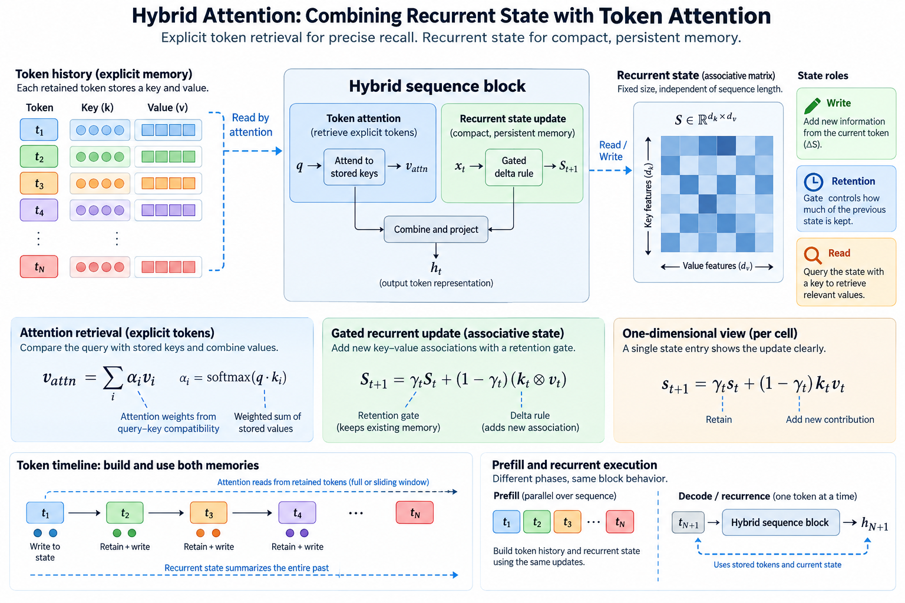
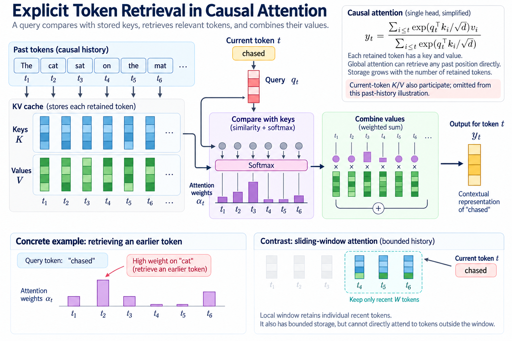
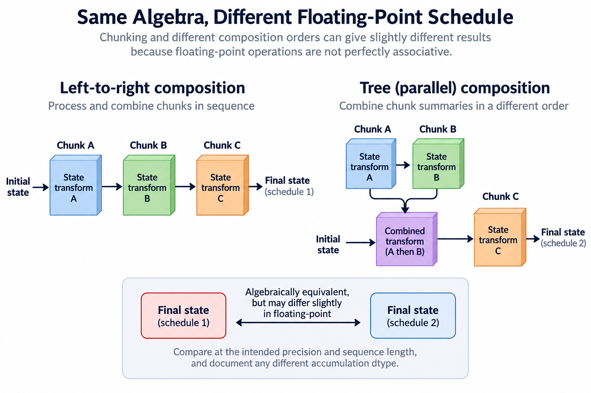

A hybrid language model combines more than one mechanism for using previous tokens. Some layers retain explicit key-value history and perform token attention. Other layers update a recurrent state whose size does not grow with the number of processed tokens. The combination aims to preserve useful long-range modeling while changing memory and execution costs.

The word “linear” can be misleading here. It often refers to how a mechanism scales with sequence length, not to the absence of nonlinear gates or learned projections. A recurrent layer is also not equivalent to ordinary attention with a magically compressed lossless cache. Its state update defines a different computation, with different representational tradeoffs.

## 1. Start from explicit token retrieval

*Overview of the article’s core mechanism. The following sections explain the objects, relationships, equations, assumptions, and worked examples shown here.*

Conventional causal attention compares a query with stored keys and combines the corresponding values. Its state preserves a representation for each retained position. Global attention can address an old position directly through its key, subject to the learned compatibility function.

$$
y_t=\frac{\sum_{i\le t}\exp(q_t^\top k_i/\sqrt{d})v_i}{\sum_{i\le t}\exp(q_t^\top k_i/\sqrt{d})}.
$$

This description is single-headed and omits positional transformations for clarity. Storage grows with retained tokens. A dense decode step also evaluates the relevant history, although optimized kernels can change traffic and materialization behavior.

Sliding-window attention keeps a bounded recent history instead. That is another independent choice: a local window retains individual recent tokens, whereas a recurrent state aggregates updates. Both can have bounded storage without implementing the same mathematical function.

## 2. Build an associative state

Consider an illustrative state matrix S mapping key features to value features. A simple additive recurrence stores outer products, and a query reads the matrix. Its dimensions are fixed by key and value feature widths rather than context length.

$$
S_t=S_{t-1}+v_tk_t^\top,\qquad y_t=S_tq_t.
$$

For value width d_v and key width d_k, state contains their product in elements. The recurrence replaces explicit token storage with superposed associations. Distinct updates can interfere because they share a fixed-dimensional matrix.

This simplified equation is not a complete normalized linear-attention model or an exact specification of every DeltaNet implementation. It isolates the idea of recurrent associative memory. Actual layers can include feature transformations, normalization, gates, output modulation, and head organization.

## 3. Introduce the delta rule

An additive update writes a new association without considering what the state already predicts. A delta-style update instead computes the current prediction for a key and writes a correction proportional to the difference from the desired value.

$$
\widehat v_t=S_{t-1}k_t,\qquad
S_t=S_{t-1}+\beta_t(v_t-\widehat v_t)k_t^\top.
$$

The coefficient beta controls update strength. With a unit-norm key and beta equal to one, multiplying the new state by that same key yields the target value in this simplified formulation. For nonunit keys or other normalization conventions, the identity changes; the assumption is part of the derivation.

The update is therefore more selective than simply adding another outer product. It can correct an existing association. It still uses finite state and can interfere with associations involving overlapping keys. The method trades explicit history for a learned state-management rule rather than preserving every past value exactly.

## 4. Add gated retention

Gated DeltaNet introduces a retention mechanism alongside the delta update. A conceptual formulation first attenuates the previous state, then applies a correction using that retained state. The primary paper specifies the actual parameterization and efficient algorithms.

$$
\widetilde S_t=\alpha_tS_{t-1},\qquad
S_t=\widetilde S_t+\beta_t(v_t-\widetilde S_tk_t)k_t^\top.
$$

Here scalar gates illustrate the idea; implementations can use richer structure. Alpha controls persistence, while beta controls writing. Conflating them loses the distinction between forgetting older state and correcting the current key's association.

If alpha is consistently less than one, repeated retention produces decay. A useful memory can still persist through learned updates or gate behavior, but bounded state alone is not evidence of unlimited exact recall. Evaluate long-context tasks rather than claiming context length and effective memory are interchangeable.

## 5. Work through a one-dimensional update

Let the state initially be two, the key one, and the new value five. With no decay and update strength 1/2, the prediction is two and the correction is 1/2 times three. The new state becomes three and a half. A second identical update moves it to four and a quarter.

This trace shows iterative correction rather than an overwrite when beta is below one. If retention first halves the old state, the intermediate prediction changes and the correction starts from a different baseline. Gate order matters.

In higher dimensions, keys pointing in similar directions interact. A new association can modify predictions for another key because their inner product is nonzero. Orthogonal keys reduce that particular interference in the simplified model, but learned features and finite dimensions do not make all real-token keys orthogonal.

## 6. Calculate hybrid state capacity

Suppose a hybrid model has L_A explicit-attention layers and L_R recurrent layers. A simple memory estimate adds token-history storage and recurrent-state storage rather than applying one cache formula to every layer.

$$
M\approx 2BL_AnH_{KV}d_hs_{KV}+BL_RH_Rd_kd_vs_R.
$$

The recurrent term uses a representative matrix per recurrent head. Actual head sharing, extra convolution state, gates, and implementation buffers require additional accounting. The formula is a model, not a substitute for reading the configuration and runtime state shapes.

The explicit component still grows with context length. A hybrid with some global-attention layers therefore does not have entirely constant cache storage. Conversely, applying the full Transformer cache formula to every hybrid layer can substantially overestimate state. Count each family separately.

## 7. Separate prefill and recurrence

A recurrence naturally processes tokens one at a time, which suits decode. Naively doing that during prefill can underuse parallel hardware. Research on linear and delta-rule attention develops chunked or parallel algorithms that exploit structure while preserving the intended recurrence.

These algorithms introduce block summaries, intermediate products, and numerical considerations. “Constant decode state” does not imply zero prefill workspace or trivial parallelization. Training must also compute gradients through the state evolution.

Measure prefill and decode separately. A hybrid can improve one phase while experiencing another bottleneck in the other. Sequence length, chunk size, batch size, state precision, and the proportion of explicit-attention layers all affect the observed result.

## 8. Place attention layers deliberately

Explicit attention can provide direct token retrieval at selected depths, while recurrent layers provide another form of sequence mixing. Their arrangement is an architectural choice requiring training evidence. Alternating families and grouping several recurrent layers between attention layers are not automatically equivalent.

The verified Qwen3.6-35B-A3B card describes 40 layers arranged as 10 groups of three Gated DeltaNet blocks and one Gated Attention block, each followed by MoE. That gives thirty recurrent-family blocks and ten attention-family blocks. Those counts support state accounting but do not alone establish a quality or speed comparison.

The attention and recurrent heads can also have different widths. Reusing 1 head-width field across all layers is a configuration-reading error. The dedicated Qwen article follows these distinctions through its published dimensions.

## 9. Preserve positions and state identity

An explicit key-value cache associates stored entries with token positions and sequence identity. A recurrent state also belongs to a particular processed prefix. Mixing state between unrelated sequences changes the computation even if its tensor dimensions match.

Reset state at the correct sequence boundary. For packed training data, establish whether the implementation resets or masks recurrent updates between examples. A token mask appropriate for ordinary attention does not automatically implement recurrent-state reset semantics.

Prefix reuse needs compatible model weights, input representations, position policy, and state generation. A saved recurrent state can avoid reprocessing a prefix under supported conditions, but its validity follows from the computation that produced it, not from the prefix's textual label alone.

## 10. Test recurrent and chunked paths together

A useful small reference executes the recurrence 1 token at a time. Compare its outputs and final state with the optimized chunked implementation for short sequences. Test lengths smaller than a chunk, exact chunk multiples, and partial final chunks.

Exercise gates near their supported extremes, repeated keys, orthogonal illustrative keys, and reset boundaries. Compare gradients when training is part of the contract. Floating-point association can create differences between sequential and parallel formulations, so define precision-appropriate tolerances.

Also test prefill followed by decode against processing the complete sequence through the reference. This catches state handoff and position errors at the phase boundary. Final output agreement alone can miss incorrect intermediate state that affects later tokens.

## 11. Evaluate memory quality separately

Long nominal context support is a configuration and execution capability. Useful retention of information across that context is a behavioral property. A model can accept many tokens yet fail to retrieve a particular old fact, whether it uses recurrent state or explicit attention.

Evaluate tasks with controlled distance, distractors, and required relationships. A simple needle test captures one retrieval behavior, while reasoning across several distant facts tests another. State capacity, training data, and inference policy can all influence results.

Avoid attributing every quality difference to 1 layer family when models differ in training, total parameters, experts, and post-training. Compare evidence within controlled experiments when available, and state the missing controls otherwise.

## 12. Examine numerical state behavior

A recurrent matrix is updated repeatedly. Its accumulation precision and normalization affect error over long sequences. Storing state in a low precision can change behavior differently from quantizing a collection of independently retained cache entries.

Monitor nonfinite values, state magnitude, and output differences across sequence lengths. A short test can pass while a long recurrence drifts. Gates that reduce old state can help manage magnitude but also change retention; numerical stabilization and representational behavior interact.

When comparing kernels, keep the mathematical gate order, state dtype, and reset rules fixed. A faster path using another state precision is a combined numerical and performance change, requiring corresponding quality evidence.

## 13. Build an architecture-aware serving estimate

List explicit-attention layers, their window or global policy, their key-value dimensions, and stored precision. List recurrent layers, their state tensors, auxiliary history, and precision. Add temporary workspace and allocator overhead separately.

Benchmark the real mixture of prompt lengths and generated-token counts. A fixed recurrent state can improve capacity at long contexts while explicit-attention layers remain the limiting component. Expert dispatch or weight bandwidth can dominate before either state mechanism does.

The equations here are explanatory models, not GPU measurements. Hybrid architectures are best understood as a composition of distinct state machines. Reading each update rule and counting each retained state gives a more reliable infrastructure picture than labeling the entire model simply “attention” or “linear.”

## 14. Distinguish associativity from an identical floating-point schedule

Parallel recurrence algorithms exploit a structured composition of state transformations. A transformation can often be summarized and combined with another transformation to describe the effect of a larger token interval. That algebraic composition explains how chunking can preserve the real-number recurrence without processing every token strictly serially.

Floating-point operations do not have perfect real-number associativity. Combining summaries in another order can introduce numerical differences even when the algebra is valid. Compare outputs and gradients at the intended precision and sequence length, and document any different accumulation dtype. An exact symbolic derivation is necessary evidence about the algorithm; it is not by itself evidence of bitwise runtime equivalence.

This distinction also helps debugging. Large or structured differences can indicate wrong gate order, missing reset, or incorrect chunk boundaries. Small differences that grow gradually can instead reflect accumulation order. Establish the reference and tolerance before declaring either pattern harmless.

## 15. Connect dynamics to scan execution

The affine composition perspective helps explain how a content-dependent recurrence can expose whole-sequence parallelism while retaining a state for incremental generation. It also makes the assumptions visible: the transition representation must support affordable composition, temporal order must be preserved, and chunk boundaries must carry the correct initial state.

Study [state-space dynamics and discretization](/blog/state-space-models-dynamics-discretization/) for the continuous-to-discrete foundation, then [scans, recurrence, and hybrids](/blog/state-space-execution-scans-recurrence-hybrids/) for execution. These foundations do not make every recurrent rule identical to Mamba or establish equal task quality. They explain which algebraic structure and state-management contract need verification before a backend comparison.

## Sources

- [Gated Delta Networks: Improving Mamba2 with Delta Rule](https://arxiv.org/abs/2412.06464).
- [Official Qwen3.6-35B-A3B model card](https://huggingface.co/Qwen/Qwen3.6-35B-A3B).
- [Attention Is All You Need](https://arxiv.org/abs/1706.03762).
