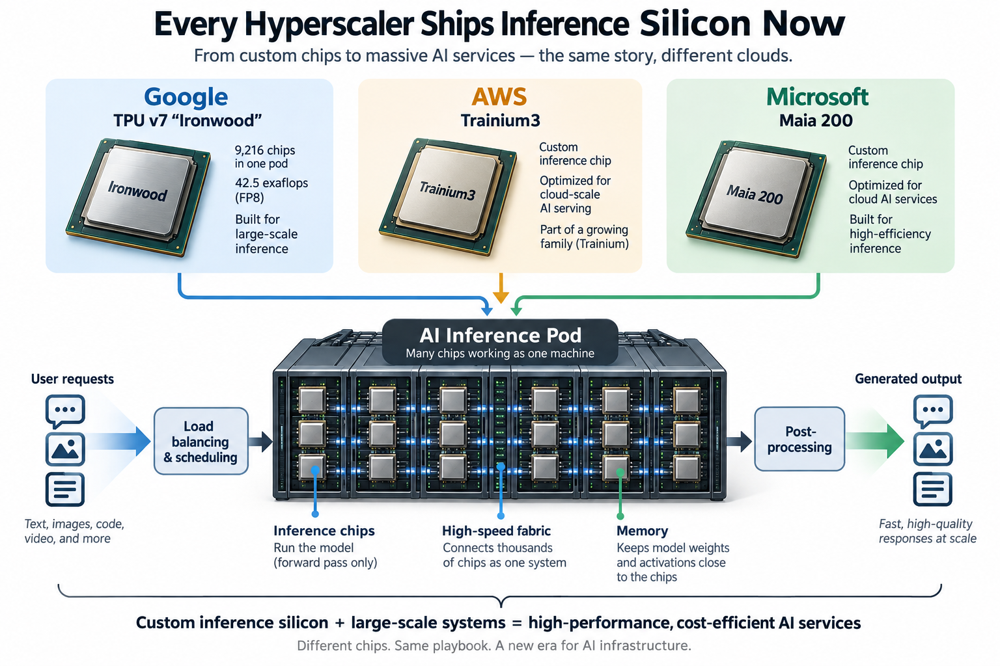
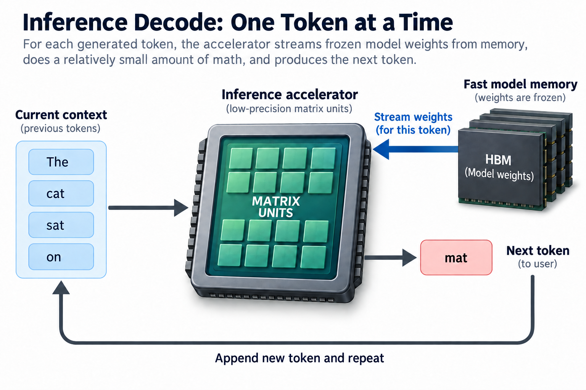
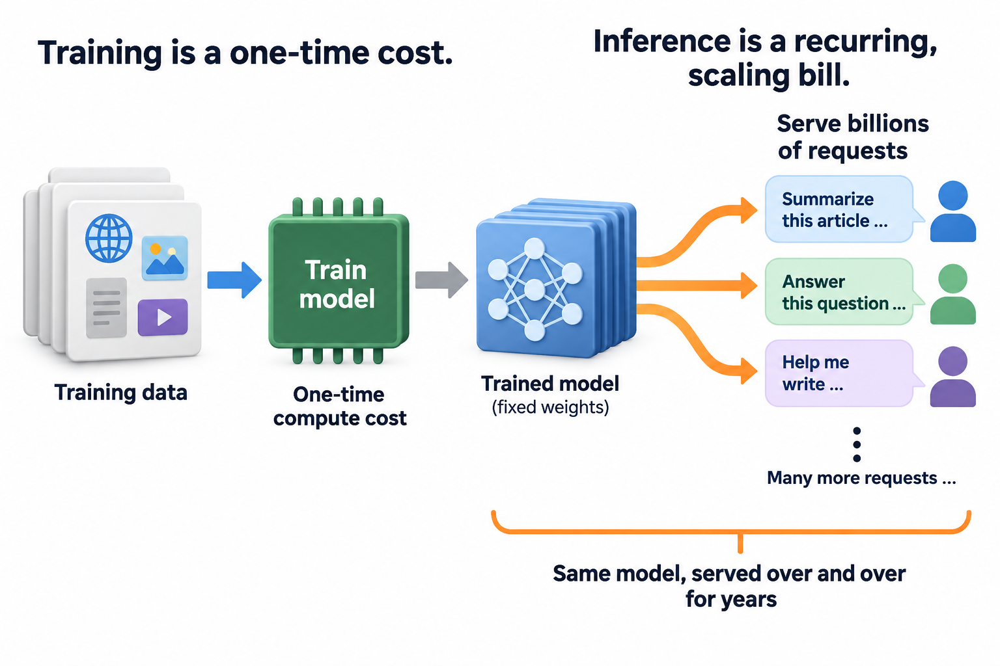
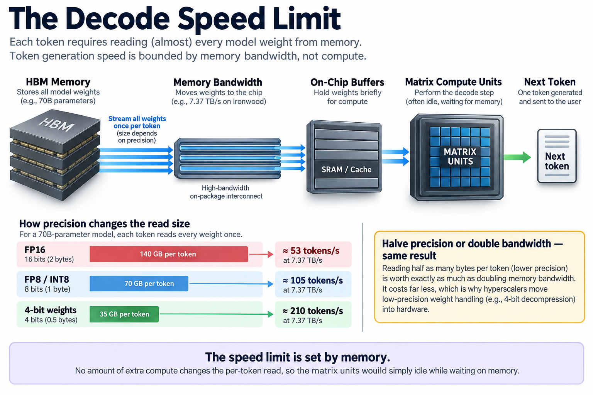

## Overview

Google's newest TPU pod wires 9,216 chips into a single machine that delivers 42.5 exaflops of FP8 compute. That is 1 pod — Google plans many — and the chip inside it, TPU v7 "Ironwood," is the seventh generation of a program that started as a hedge and became a strategy. As of early 2026, all 3 major clouds ship their own inference accelerator: Google has Ironwood, AWS has Trainium3, and Microsoft has Maia 200. 10 years ago, exactly 0 of them designed chips. Something flipped, and the flip has a logic worth understanding.

## Deep dive

### What "inference silicon" means

A quick vocabulary check. *Training* is the phase where a model learns its weights from data; it runs for weeks on thousands of chips and tolerates restarts. *Inference* is everything after: the model's weights are frozen, and the job is to answer requests — billions of them, around the clock, under latency deadlines. The 2 phases stress hardware differently. Training wants enormous raw compute and fast gradient exchange between chips. Inference, especially the token-by-token *decode* phase of a large language model, mostly wants memory bandwidth: for each generated token, the chip streams the model's weights out of memory, does a comparatively modest amount of arithmetic, and moves on.

An "inference accelerator" is a chip whose budget was allocated for that second profile. Less silicon spent on graphics heritage or double-precision math, more on matrix units at low precision, big fast memory, and the interconnect needed to spread 1 model across many chips.

For a decade the answer to "should a cloud build its own?" was mostly no. NVIDIA's GPUs were better, arrived sooner, and came with a software ecosystem nobody could match. Google was the lone exception, and even Google's TPUs were long viewed as an internal curiosity. The 2025–2026 generation is different in kind, not just degree. These are no longer hedges; they are volume products with named external customers, and each one is aimed squarely at inference.

The 3 designs, in 1 breath. **Ironwood** (Google, TPU v7): 4,614 TFLOPS of FP8 per chip, 192 GB of HBM at 7.37 TB/s, scaled to pods of 9,216 chips, with Google claiming roughly 2× performance per watt over the previous generation — a doubling it says it has sustained each generation, compounding to about 30× since 2018. **Trainium3** (AWS): the headline feature is not a FLOPS number but a hardware *W4A8* path — weights stored at 4 bits, activations at 8 — that doubles the effective rate at which weights stream from memory, with no software tricks required; UltraServers scale it to 144 chips. **Maia 200** (Microsoft): more than 10 PFLOPS at FP4, 216 GB of HBM3e in a 750 W package, and the most contrarian fabric choice of the 3 — scale-up over standard Ethernet, to domains of 6,144 chips.

1 caveat before any comparison shopping: every number in the previous paragraph comes from the vendor selling the chip. Microsoft claims Maia 200 has 3× Trainium3's FP4 compute and 30% better performance per dollar than "the latest hardware in our fleet"; those comparisons pit differently-specced parts at different precisions and none of them have been through a neutral referee. Treat all cross-vendor claims in this article as self-reported, because they are.

### Why buy-vs-build flipped

The economics of custom silicon are brutal. A modern accelerator costs several hundred million dollars to design, the software stack costs as much again, and if you guess the workload wrong the chip is a very expensive space heater. That calculus kept everyone but Google out for years. 3 things changed it.

**Inference became the dominant bill.** When models were research artifacts, training was most of the cost. Once ChatGPT-scale services arrived, the ratio inverted: a model is trained once but served billions of times. Recurring, predictable, growing spend is exactly what justifies fixed engineering investment. Nobody sensible tapes out a chip to save money on a 1-off; everybody sensible considers it when the same workload will run for years.

**The workload froze.** Custom silicon's great fear is that the target moves. But since roughly 2020, serving has meant 1 thing: transformer decode. The kernel mix — matrix multiplies, attention, collective communication — is stable enough to design against, and I sketched that architecture in [the transformer in 1 picture](/blog/transformer-architecture-in-one-picture/). Better still, a hyperscaler serving its *own* models controls both sides of the contract. Google compiles a handful of internal model families for Ironwood; it does not need to run arbitrary CUDA code from the internet. That collapses the hardest part of the problem, the software surface, by orders of magnitude.

**The margin arbitrage got too large to ignore.** NVIDIA's data-center gross margins are famously in the 70%+ range. At hyperscaler volume — hundreds of thousands of accelerators a year — even a custom chip that is merely *competitive* on performance per watt wins on cost, because you are paying foundry prices instead of foundry prices plus NVIDIA's markup. And with datacenter power now the binding constraint industry-wide, performance per watt is the metric that decides how many tokens a fixed megawatt budget can sell. Ironwood's pitch is not "fastest chip"; it is 2× perf/watt per generation, aimed at exactly that constraint.

### A worked example: the decode speed limit

Here is the arithmetic that explains why every one of these chips obsesses over memory bandwidth and low-precision weights. You can follow it with a pencil.

Take a 70-billion-parameter dense model generating text for a single user. During decode, producing each token requires reading essentially every weight from memory once. The size of that read depends on precision:

- **FP16** (16 bits = 2 bytes per weight): 70B × 2 B = **140 GB per token**
- **FP8/INT8** (1 byte per weight): 70B × 1 B = **70 GB per token**
- **4-bit weights** (0.5 bytes per weight): 70B × 0.5 B = **35 GB per token**

Now divide the chip's memory bandwidth by that figure. Ironwood moves 7.37 TB/s, so the ceilings are:

- FP16: 7,370 / 140 ≈ **53 tokens/s**
- FP8: 7,370 / 70 ≈ **105 tokens/s**
- 4-bit: 7,370 / 35 ≈ **210 tokens/s**

No amount of extra compute changes these numbers; the matrix units would simply idle while waiting on memory. (Real systems land below the ceiling — attention's KV cache adds reads, and no chip sustains 100% of peak bandwidth — but the proportions hold.) Notice what the arithmetic implies: halving weight precision is worth exactly as much as doubling memory bandwidth, and it costs a lot less. That is Trainium3's W4A8 path in a nutshell — AWS moved 4-bit weight decompression into hardware so the doubling comes free of software overhead, while activations stay at 8 bits where accuracy is more fragile. Maia 200's FP4-first spec sheet is the same bet stated differently.

1 more back-of-envelope check, this time at pod scale. Multiply Ironwood's per-chip 4,614 TFLOPS by 9,216 chips: 4,614 × 9,216 ≈ 42.5 million TFLOPS, which is the advertised 42.5 exaflops — the pod number is just the chip number times the chip count, no marketing multiplier hiding in it. Google puts a pod at roughly 10 MW, which works out to about 4.25 TFLOPS of FP8 per watt, chips and interconnect included. Numbers like that, tokens per megawatt more than tokens per second, are what hyperscaler procurement now optimizes.

### Write down the buy-versus-build threshold

Let fixed design and software investment be $$F$$ dollars, and let cost per million acceptable tokens be $$c_g$$ on purchased GPUs and $$c_a$$ on the custom system. Under a constant workload and equal service requirements, the number of million-token units needed to recover investment is

$$
Q_* = \frac{F}{c_g-c_a},\qquad c_g>c_a.
$$

For an illustrative investment of 200 million dollars and a 10-cent saving per million tokens, the threshold is 2 billion million-token units: 2 quadrillion delivered tokens. That is a scenario, not a disclosed hyperscaler budget. If savings disappear after workload changes, the threshold ceases to describe the investment.

This exposes why owning sustained demand changes the decision. The baseline rents flexibility in a general platform; custom silicon concentrates investment on known execution patterns and integration. Its benefit depends on software migration, utilization, availability reserves, and quality-compatible output, not merely a cheaper die. Include ongoing compiler and model-support costs in the fixed or operating terms consistently. Quantization formats, attention variants, and model sizes continue changing, so a reusable compiler and enough architectural headroom can be as valuable as optimizing today's matrix shapes. Specialization pays only if the fleet delivers enough comparable useful work before its assumptions expire.

### Going deeper: the fabric is the real design choice

Squint past the FLOPS and the 3 chips differ most in how they *connect*. That is not an implementation detail. Modern serving splits 1 model across many chips — mixture-of-experts routing, tensor parallelism, and disaggregated prefill/decode all shuffle activations and KV-cache state between accelerators mid-request — so the size and speed of the *scale-up domain* (the set of chips that can talk at near-memory speeds) determines what you can serve efficiently.

Google's answer is the most exotic: TPU pods link chips in a 3D torus stitched together by optical circuit switches — literally mirrors that reconfigure the light paths, so the fabric can be rewired around failed racks or resized per job without packet switching in the middle. It is proprietary from end to end, which Google can afford because it is also the only customer.

Microsoft went the opposite way. Maia 200's scale-up network runs on *standard Ethernet* — commodity switches, custom transport protocol on top — in a 2-tier topology reaching 6,144 chips. The bet is that Ethernet's ecosystem (multiple switch vendors, mature tooling, huge volumes) compounds faster than any proprietary fabric can, and that a transport layer in silicon can paper over Ethernet's traditional latency sins. If that bet pays off, it commoditizes the most locked-in layer of the NVIDIA stack, NVLink, which is precisely the point.

AWS sits in the middle: NeuronLink inside a 144-chip UltraServer, its existing EFA networking beyond. Smaller scale-up domain than the others, but AWS ships more different instance types to more external customers than anyone, and 144 chips comfortably holds today's largest open-weight models.

The quiet common thread: none of the 3 fabrics is InfiniBand and none is NVLink. Whatever else these programs achieve, they have already ended the assumption that frontier interconnects must come from 1 company.

### Common misconceptions

**"Hyperscaler silicon means NVIDIA is in trouble."** The same week Microsoft announced Maia 200, it was deploying massive GB300 NVL72 clusters for OpenAI. Every custom-chip cloud remains one of NVIDIA's largest customers, because demand exceeds what either source can supply and because frontier *training* still overwhelmingly happens on GPUs. Custom silicon changes NVIDIA's position at the margin — it caps pricing power and absorbs the most predictable inference traffic — but 2026 capex plans show these clouds buying more NVIDIA than ever, not less. Both things are true at once.

**"These chips are basically cheaper GPUs."** Architecturally they are not GPUs at all. A GPU is thousands of general-purpose cores with a memory system designed for irregular parallel work; these accelerators are built around large systolic matrix engines with software-managed memory, closer in spirit to a factory conveyor than a crowd of workers. The trade is severe: they run a narrow set of blessed model architectures brilliantly and everything else poorly or not at all. That trade only works because the owner controls the workload. Buy 1 expecting CUDA-era flexibility and you will be disappointed; that inflexibility is where the perf/watt comes from.

**"The spec sheets tell you which chip is fastest."** They cannot, even in principle. Ironwood's headline is FP8; Maia's is FP4; peak TFLOPS at different precisions are not comparable numbers. Vendor comparisons cherry-pick the precision, sparsity setting, and baseline that flatter them — Microsoft's "3× Trainium3" compares its FP4 against a chip AWS specs differently, and Google's 42.5 EF pod figure is often set against supercomputers measured at FP64, a comparison that means nothing. The only neutral arena is a refereed benchmark like MLPerf with a latency SLA attached, and custom-cloud parts are conspicuously rare there. Until they show up, "which is fastest" has no honest answer — which is itself informative.

### What it means for the rest of us

For NVIDIA, the threat is not displacement but commoditization of specific layers: if Ethernet scale-up works and 4-bit serving becomes routine, the premium attached to NVLink and to raw FLOPS erodes, which is exactly why NVIDIA's own roadmap now segments into specialized parts — see the memory math in [Blackwell to Rubin](/blog/blackwell-to-rubin-memory-math/), where bandwidth, not capacity, is the axis of progress. For buyers of cloud AI, the flip shows up as price pressure and as choice: committed inference traffic on a known model family is increasingly cheapest on custom silicon, while experimental and training work stays on GPUs.

For engineers, it is a reminder that the scarce skill is seeing through the numbers. A 42.5-exaflop pod that streams weights at the wrong precision serves fewer tokens than a smaller machine doing the bandwidth math right, the same way a busy GPU can hide an idle pipeline — the gap between [goodput and utilization](/blog/goodput-vs-utilization/). Reasoning from workload to silicon and back is the daily work of an [ML performance engineer](/blog/what-does-an-ml-performance-engineer-do/), and this generation of chips is that reasoning cast in metal.

## Conclusion

- Buy-vs-build flipped for inference because the workload froze (transformer decode), the bill became recurring and enormous, and hyperscalers serving their own models can shrink the software problem to a size a custom chip can handle.
- The decode arithmetic rules everything: tokens per second ≈ memory bandwidth ÷ weight bytes, which is why Ironwood leads with 7.37 TB/s of HBM, Trainium3 puts W4A8 in hardware, and Maia 200 leads with FP4.
- Every cross-vendor number in this space is self-reported at hand-picked precisions; until these parts appear in refereed benchmarks, compare architectures and constraints, not spec sheets.

### Sources

- Google Cloud — [Ironwood TPU: built for the age of inference](https://blog.google/products/google-cloud/ironwood-tpu-age-of-inference/)
- AWS — [Trainium official page](https://aws.amazon.com/ai/machine-learning/trainium/) (Trainium3, W4A8, UltraServer specs)
- Microsoft — [Maia 200: the AI accelerator built for inference](https://blogs.microsoft.com/blog/2026/01/26/maia-200-the-ai-accelerator-built-for-inference/)
- MLCommons — [MLPerf Inference v5.1 results](https://mlcommons.org/2025/09/mlperf-inference-v5-1-results/)
- Jouppi et al., "TPU v4: An Optically Reconfigurable Supercomputer for Machine Learning" — [arXiv:2304.01433](https://arxiv.org/abs/2304.01433)
- Microsoft Azure — [First large-scale GB300 NVL72 cluster for OpenAI workloads](https://azure.microsoft.com/en-us/blog/microsoft-azure-delivers-the-first-large-scale-cluster-with-nvidia-gb300-nvl72-for-openai-workloads/)

*Part of the [Efficient AI & Co-Design](/series/efficient-ai/) learning path. Browse its published articles by topic.*
