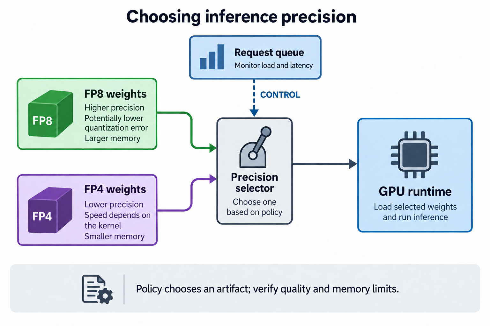
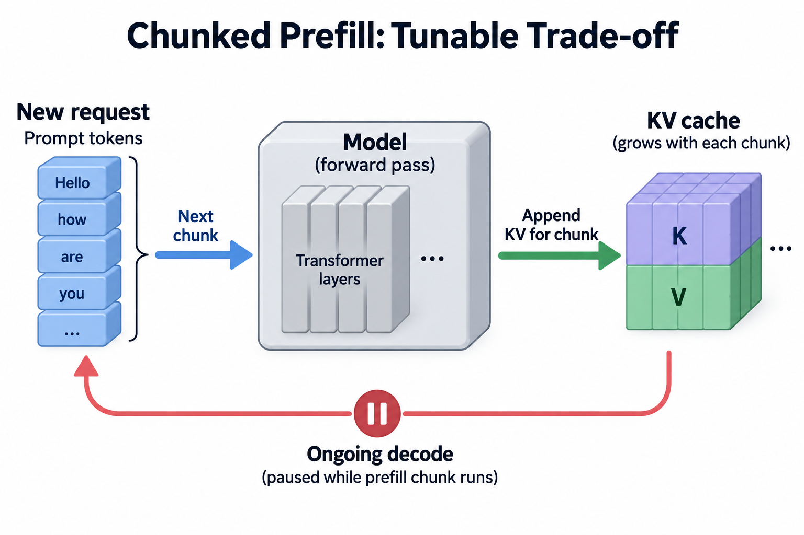

The same 8 H100s serving the same 70B model can decode roughly 16,000 tokens per second under 1 configuration and 37,000 under another. Nothing about the hardware changes between those 2 numbers; what changes is the weight precision, the KV cache format, and the concurrency cap, and which configuration is *right* depends on what the traffic looks like at that hour. Traffic refuses to hold still. Production LLM APIs routinely swing 5x between the 4 a.m. trough and the lunchtime peak, and the prompt mix shifts underneath the volume curve: short chat turns in the morning, long RAG contexts at midday, agent sessions with 30k-token histories in the evening.

Most serving stacks handle this the way we handled it in 2023: benchmark once, pick a tensor-parallel degree, a precision, a scheduler budget, and ship that config for months. The config is correct for exactly the traffic snapshot it was benchmarked on. Every other hour of the day it is leaving something on the table, and on a large fleet "something" is measured in millions of dollars. The frontier of inference at scale is treating the serving stack as a control system: measure goodput continuously, compare it to the SLO, and actuate the knobs that close the gap.

If goodput is a fuzzy term for you, [the goodput article](/blog/goodput-vs-utilization/) covers it; the one-line version is *throughput that actually meets the latency SLO*, typically defined over TTFT and TPOT targets ([basics here](/blog/ttft-and-tpot/)). Adaptive engines optimize goodput per dollar, not utilization, and that distinction drives everything below.

## The 4 knob families

An adaptive serving stack has, broadly, 4 families of actuators. They differ enormously in how fast they act and how much they cost to move.

**Precision switching (FP8 ↔ FP4).** Decode is bandwidth-bound: every generated token requires streaming the weights and the active KV cache through HBM. Halving the weight bytes with NVFP4 roughly halves the weight-streaming floor. The trick is that you do not quantize at runtime; you keep 2 pre-quantized, pre-calibrated copies of the checkpoint, with the inactive 1 staged in host RAM, and swap the resident copy when load crosses a threshold. Quality deltas are measured offline on your evals; the runtime decision is a deliberate quality-for-capacity trade, taken only when the alternative is queueing or shedding requests. (The formats themselves are covered in [NVFP4 vs MXFP4](/blog/nvfp4-vs-mxfp4-the-4bit-format-war/).)

**Parallelism reshaping (TP ↔ PP, and the P/D ratio).** Tensor parallelism aggregates memory bandwidth across GPUs, which cuts per-token latency, but pays an all-reduce every layer. Pipeline parallelism communicates far less and yields better throughput per GPU, but adds pipeline latency and bubbles. Interactive daytime traffic wants TP; overnight batch backfill tolerates PP happily. In disaggregated stacks the analogous knob is the prefill-to-decode worker ratio: NVIDIA's Dynamo ships a Planner component that watches TTFT and inter-token latency against SLO targets and rebalances or scales prefill and decode workers accordingly. Reshaping is the slowest actuator, since it requires draining in-flight requests from the affected group.

**Scheduler knobs.** Continuous-batching engines expose a surprising number of dials: the chunked-prefill token budget, the max concurrent sequences, preemption and swap thresholds, prefix-cache eviction policy. These act in milliseconds and cost nothing to move, which makes them the natural playground for learned controllers; recent work applies bandit and RL policies to exactly these dials, because the state space (traffic mix × knob settings → goodput) is too messy for hand-written rules and too cheap to explore for it to matter when the policy occasionally probes a bad setting.

**KV cache placement.** HBM is the scarcest resource in the box, and a lot of KV cache sitting in it is cold. An agent session waiting 20 seconds on a tool call parks gigabytes of KV in HBM doing nothing. Adaptive engines tier KV across HBM, CPU DRAM, and NVMe: vLLM can swap preempted sequences to CPU, SGLang layers a hierarchical cache under its radix tree, and Mooncake (the engine behind Kimi) is built around a disaggregated KV pool spanning the DRAM and SSD of the whole cluster. On systems using CUDA managed memory, `cudaMemAdvise` hints (`SetPreferredLocation`, `SetAccessedBy`) let the engine steer cold pages toward host RAM without hard-failing when they are touched, so an offload mistake costs a page migration rather than a crash.





## A worked example: 1 day, 1 node

Numbers make this concrete. Take a dense 70B model on 1 8×H100 node, TP8. The relevant hardware constants: 8 × 80 GB = 640 GB of HBM, and 8 × 3.35 TB/s = 26.8 TB/s of aggregate bandwidth. FP8 weights are 70 GB; NVFP4 weights are 35 GB. With 80 layers, 8 KV heads, and head dimension 128, the KV cache costs 80 × 8 × 128 × 2 × 2 bytes = 320 KB per token at FP16, or 160 KB at FP8.

A decode step must stream the weights once plus every active sequence's KV, so a useful floor is:

```
step time ≈ (weight bytes + total KV bytes) / 26.8 TB/s
```

This is a roofline-style bound; real engines land within about 1.3–2x of it once kernel overheads and all-reduces are counted. The *ratios* between configurations survive that gap, which is what the controller cares about.

**03:00, the trough.** 10 interactive streams. Even naively, step bytes are 70 GB + 10 × 2,000 tokens × 160 KB ≈ 73 GB, a 2.7 ms TPOT floor. Latency is free at night. A static config stops there; an adaptive 1 notices the SLO headroom, raises the batch cap, and pulls from the backfill queue (evals, summarization jobs, cache warming). At 300 backfill streams averaging 2k context: 70 + 96 = 166 GB per step, a 6.2 ms floor, about 48,000 tok/s of otherwise-free batch work. If the trough is long and deep enough, it reshapes to PP to shed the all-reduce tax entirely.

**09:00, the ramp.** Chat traffic, short prompts, TTFT-sensitive. The engine is back in TP8 and the contested knob is the chunked-prefill budget: a bigger chunk finishes a new request's prefill sooner (better TTFT) but stalls the decode of every ongoing stream for longer (worse TPOT). There is no statically correct value, because the right trade depends on the arrival rate and prompt-length mix of the current minute. This is the knob a controller retunes continuously.

**13:00, the peak.** 2 hundred concurrent streams at 4k average context, FP8 weights, FP16 KV: 70 + 200 × 4,000 × 320 KB = 70 + 256 = 326 GB per step. That is a 12.2 ms TPOT floor and about 16,400 tok/s, and the queue is growing. The engine swaps in the FP4 weight copy and switches new sessions to FP8 KV. At the same 200 streams that would be 35 + 128 = 163 GB and 6.1 ms, but the controller does not want lower latency; it wants to stop shedding load. So it holds the 12 ms SLO and doubles admission: 400 streams × 4k × 160 KB = 256 GB, plus 35 GB of weights, is 291 GB per step, a 10.9 ms floor, roughly 37,000 tok/s. Same node, same model family, 2.2x the goodput, paid for with a quality delta that was measured and signed off before the switch was ever armed.

**20:00, the agents.** Volume is moderate but contexts are long and bursty. A single agent session with a 30k-token history holds 30,000 × 320 KB ≈ 9.6 GB of FP16 KV, and it spends much of its wall-clock time idle, waiting on tool calls. 60 such sessions would be 576 GB, nearly the whole node's HBM, mostly cold. The engine offloads idle-session KV to CPU DRAM over PCIe Gen5 (~64 GB/s per direction): about 0.15 s out and 0.15 s back for that 9.6 GB, invisible next to a multi-second tool call, and it frees HBM for streams that are actually decoding. Hot shared prefixes stay pinned; see [the KV cache article](/blog/kv-cache-explained/) for why prefix reuse is worth protecting.





## Going deeper: it really is a control system

Once you draw the loop, classical control problems show up on schedule.

**Sense.** The signal is per-SLO-class goodput plus leading indicators: queue depth, KV occupancy, prefill backlog. Utilization is explicitly not in the loop; a node can sit at 95% utilization while goodput collapses, and a controller that optimizes utilization will happily drive you there.

**Decide.** In practice there is a maturity ladder. Rule-based thresholds with hysteresis come first. Then forecasting: diurnal traffic is highly predictable, so the controller can begin a 2-minute parallelism reshape *before* the ramp instead of reacting mid-ramp. Learned policies come last, and mostly for the cheap, reversible knobs.

**Actuate, respecting cost.** The actuators form a hierarchy. Scheduler knobs move in milliseconds and are free. KV migration costs seconds of PCIe traffic. A precision swap costs seconds of weight streaming from host RAM. A TP↔PP reshape costs tens of seconds to minutes of drained capacity, which means the controller must forecast that the new shape will repay the transition before it commits. Cheap knobs absorb noise; expensive knobs follow trends.

**Stay stable.** A controller that flips FP8→FP4 at 70% load and back at 69% will oscillate, and every oscillation costs a weight swap. Hysteresis bands, minimum dwell times, and rate limits on expensive actuators are not optional engineering polish; they are the difference between a control system and a self-inflicted incident generator.


## A controller must repay the transition

Let a new configuration improve acceptable output rate by $$\Delta G$$ tokens per second, remain useful for $$t_d$$ seconds, and lose $$C_t$$ acceptable tokens while draining or converting state. A necessary transition test is

$$
\Delta G\,t_d>C_t.
$$

If switching loses 10 seconds of a 10-thousand-token-per-second baseline, the lost output is 1 hundred thousand tokens. A gain of 2 thousand per second needs more than 50 seconds at the new workload to repay that loss. This is an illustrative opportunity-cost model; actual transition billing and delayed users can impose additional costs.

Compared with a static configuration, adaptation exploits changing load, but it creates a state migration problem. Precision changes may require different resident weights and cache representations; they are not necessarily pointer swaps. A device without native support for a 4-bit format cannot be assumed to realize its advertised arithmetic gain. Scheduler settings also vary in whether they can change safely during a running engine.

Use hysteresis and a minimum dwell time, include transition cost in the objective, and constrain the decision by quality and tail latency. Compare the controller against a stable baseline on replayed load, then verify actual recovery after a wrong prediction. More knobs can increase flexibility while making control slower, noisier, and less reliable.

## Common misconceptions

**"This is just autoscaling with extra steps."** Autoscaling adds or removes replicas on a timescale of minutes, gated by provisioning and multi-minute weight loads, and it cannot change what any individual replica *is*. The knobs above act inside a fixed hardware footprint, in milliseconds to seconds, and they change the shape of the service: its precision, its parallel layout, its memory tiering. You need both; they are different layers of the same control stack, operating at different frequencies.

**"Dynamic precision means quantizing on the fly, so quality is unpredictable."** No production design re-quantizes at runtime. Both checkpoint copies are produced offline with proper calibration, evaluated on the team's quality suite, and the FP4 copy is only armed if that eval passes. The runtime component is a pointer swap plus a weight stream from host RAM. The quality difference is real but it is a known, measured constant, chosen deliberately over the alternative of shedding user requests at the peak.

**"Our GPUs are at 100% utilization, so there is nothing left to retune."** High utilization tells you the SMs are busy, not that the work is useful or that SLOs are being met. The peak-hour example above goes from 16,400 to 37,000 tok/s at essentially the same utilization; the win comes from moving fewer bytes per token, not from filling idle cycles. If utilization is your control signal, you cannot even see this improvement, which is precisely [the goodput argument](/blog/goodput-vs-utilization/).

## Where this sits, and an honest caveat

Adaptive serving is the natural next step of a story this series has been tracking. Disaggregation split prefill from decode so each could be provisioned separately ([the disaggregation story](/blog/the-prefill-decode-disaggregation-story/)); once the split exists, the P/D ratio becomes a runtime variable, and Dynamo's Planner already treats it as 1. Hardware is moving the same direction, with prefill-specialized parts like [Rubin CPX](/blog/prefill-gets-its-own-chip-rubin-cpx/) making the fleet mix itself a tunable. The through-line is that every boundary that used to be fixed at deployment time is becoming a control variable.

The caveat: most teams should not build any of this yet. If you have not exhausted static tuning, so a properly benchmarked TP degree, precision, and scheduler config for your *actual* traffic mix, plus plain replica autoscaling, you will capture the large majority of the available win with a fraction of the complexity. Every runtime actuator is also a new failure mode, and a buggy controller is an outage with a feedback loop. The adaptive frontier pays off where fleets are large enough that a recovered 20% is millions of dollars a year and where an infra team can own a control system as a product. Everyone else should read this as a preview of what their serving framework will eventually do for them; the vLLM, SGLang, and Dynamo roadmaps all point here.

## Takeaway

- Traffic swings 5x daily and shifts its prompt mix underneath; a static config is correct for one snapshot of that curve and wasteful for the rest. The fix is a control loop: measure goodput against SLOs, then actuate.
- The actuators form a cost hierarchy, from scheduler knobs (milliseconds, free) through KV migration and precision swaps (seconds) up to parallelism reshapes (minutes, requires draining), and a well-designed controller absorbs noise with cheap knobs while committing expensive ones only on forecasted trends.
- The byte math is what makes runtime precision switching powerful: at a 200-stream peak, moving from FP8 weights + FP16 KV to FP4 + FP8 KV cuts per-step traffic from 326 GB to 163 GB, letting the same node hold its TPOT SLO at double the concurrency.

## Sources

- Zhong et al., *DistServe: Disaggregating Prefill and Decoding for Goodput-optimized Large Language Model Serving* (OSDI 2024) — https://arxiv.org/abs/2401.09670
- Qin et al., *Mooncake: A KVCache-centric Disaggregated Architecture for LLM Serving* — https://arxiv.org/abs/2407.00079
- NVIDIA Dynamo (Planner, KV block manager) — https://github.com/ai-dynamo/dynamo
- vLLM (chunked prefill, preemption and CPU swap, prefix caching) — https://github.com/vllm-project/vllm
- SGLang (radix cache, hierarchical KV caching) — https://github.com/sgl-project/sglang
- CUDA C++ Programming Guide, unified memory and `cudaMemAdvise` — https://docs.nvidia.com/cuda/cuda-c-programming-guide/

*Part of the [LLM Inference & Serving](/series/llm-serving/) learning path. Browse its published articles by topic.*
