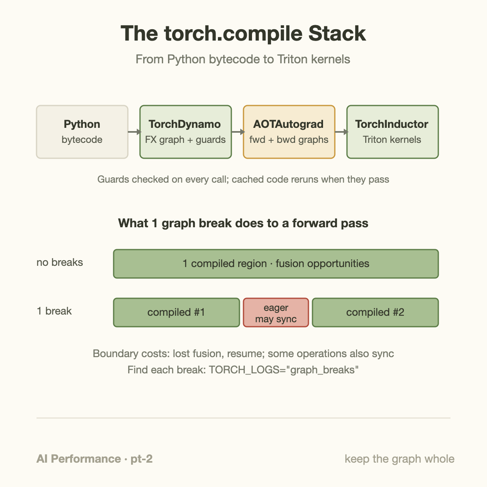
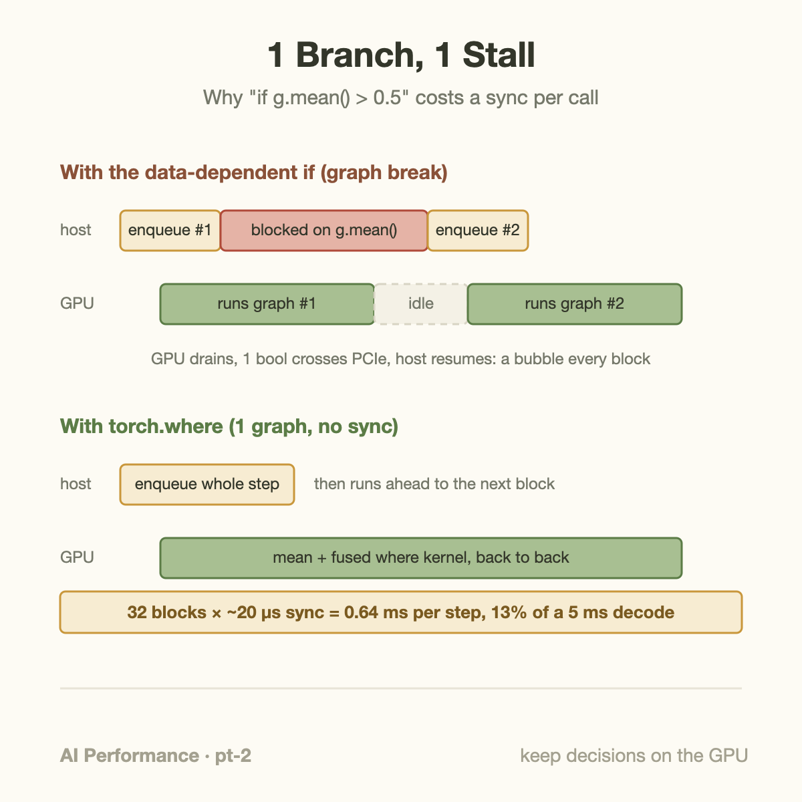

Across 180+ real-world models in the PyTorch benchmark suites, `torch.compile` posts a 2.27x geometric-mean inference speedup on an A100, and 1.41x for training. Those are the headline numbers from the PyTorch 2 paper at ASPLOS 2024, and they hold up. They are also conditional: they assume the compiler gets to see your model as a small number of large graphs. 1 `print(f"loss={loss.item()}")` in the training step, or a single `if` that branches on a tensor value, splits the captured graph in 2, forces a round trip through the Python interpreter, and can stall the GPU on every iteration. These splits are called graph breaks, and the distance between "we turned on torch.compile" and "we got the paper numbers" is usually measured in them.

## The stack: Dynamo captures, Inductor generates

`torch.compile` is not 1 compiler. It is a pipeline of 3 components, and knowing which one does what tells you where breaks come from and where speed comes from.

**TorchDynamo** is the capture layer. It hooks CPython's frame evaluation API (PEP 523), so the first time a Python function runs under `torch.compile`, Dynamo intercepts its bytecode before the interpreter executes it. It symbolically walks that bytecode, extracts every sequence of tensor operations into an [FX graph](https://pytorch.org/docs/stable/fx.html) (a graph IR of `torch` calls), and attaches *guards*: runtime checks on tensor shapes, dtypes, and the identity of Python objects the trace depended on. Next call, if all guards pass, the cached compiled code runs directly. No tracing, no Python-level dispatch.

**AOTAutograd** sits in the middle. For training, it traces the forward graph *ahead of time* through autograd to produce a matching backward graph, so your backward pass gets compiled too, not just the forward.

**TorchInductor** is the backend. It takes the graph and generates code: [Triton](https://openai.com/index/triton/) kernels for GPU, C++/OpenMP for CPU. Matmuls mostly still route to cuBLAS or Triton templates; Inductor's big wins are fusion and scheduling. A chain of elementwise ops and reductions that eager mode would run as 5 kernels, each reading and writing all its tensors through HBM, becomes 1 kernel that reads inputs once and writes the output once. For memory-bound code (most of a transformer outside the matmuls) that is the whole game, the same arithmetic we walked through in [the memory wall](/blog/the-memory-wall-latency-numbers/).

The design decision that makes all of this practical is also the one that bites you: when Dynamo hits Python it cannot trace, it does not give up. It compiles the graph it has so far, hands control back to the regular interpreter for the untraceable part, then starts capturing a fresh graph afterward (the continuation is compiled as a "resume function"). Supported execution can continue through eager fragments, but compilation and backend errors still require correctness checks. It just runs as compiled fragments stitched together with eager Python. Each stitch point is a graph break.



## What actually breaks a graph

The common causes, roughly in order of how often I see them in real codebases:

- **Data-dependent control flow.** `if tensor.max() > 0:` needs a concrete Python `bool`, which means the host must know the tensor's value, which means a device-to-host copy and a break.
- **Value extraction.** `.item()`, `.tolist()`, `.numpy()`, printing a tensor, formatting 1 into a log string. All of these materialize values on the host.
- **Unsupported constructs.** Calls into C extensions Dynamo cannot see through, some third-party libraries, exotic Python features.
- **Side effects on Python state** in the middle of the hot path: appending to a global list, logging frameworks, callbacks.

And what a break costs, beyond "some code stays eager":

1. **Lost fusion across the boundary.** Inductor can only fuse ops that live in the same graph. A break is a fusion firewall.
2. **A device sync**, if the break came from reading a tensor's value. The host blocks until the GPU catches up, which drains the async pipeline you rely on to hide launch latency.
3. **Per-call overhead.** Every fragment boundary re-enters CPython, checks guards for the next fragment, and dispatches again.
4. **No whole-graph tricks.** `mode="reduce-overhead"` wraps compiled regions in CUDA graphs; a fragmented model gives it fragments to wrap, and the eager glue between them still pays full launch overhead.

Finding breaks is mercifully easy. Run your job with `TORCH_LOGS="graph_breaks"` and PyTorch prints each break with the Python line and the reason. `torch._dynamo.explain(fn)(*args)` gives a summary count. And for code you control end to end, `torch.compile(model, fullgraph=True)` turns any break into a hard error, which is the right setting for a serving path: you want to *know*.

## Worked example: 1 if-statement

Here is a gated residual block, the kind of thing that looks completely innocent in review:

```python
class GatedBlock(nn.Module):
    def forward(self, x):            # x: [8, 2048, 4096], fp16
        g = torch.sigmoid(self.gate(x))
        if g.mean() > 0.5:           # <-- graph break
            return x * g + x
        return x * (1 - g) + x
```

Compile it and run with `TORCH_LOGS="graph_breaks"` and you get a message pointing at the `if` line, with a reason along the lines of *data-dependent branching on a tensor (Tensor.__bool__)*. Dynamo captured graph #1 (the gate matmul, the sigmoid, the mean), then had to stop: the branch needs `g.mean() > 0.5` as a Python bool. The comparison result lives on the GPU. So at that point, every single forward call, the host blocks, the GPU finishes everything queued, 1 bool crosses the PCIe bus, and only then does the host start enqueueing the branch body (which Dynamo compiles as graph #2).

Put numbers on it. A host-device sync of this shape costs on the order of 10 to 20 microseconds even when the GPU is already done, just in driver and transfer latency; if the GPU still has queued work, you wait for that too, and you have destroyed the host's ability to run ahead. Say your model has 32 of these blocks and you are decoding with a 5 ms per-token budget:

- 32 breaks x ~20 us of sync latency = **0.64 ms per step**
- 0.64 / 5.0 = **13% of the token budget**, spent shipping 32 booleans

and that is the assumed exposed boundary cost, before counting lost fusion and the eager glue. The fix is to keep the decision on the GPU:

```python
class GatedBlock(nn.Module):
    def forward(self, x):
        g = torch.sigmoid(self.gate(x))
        keep = (g.mean() > 0.5)          # stays a GPU tensor
        return torch.where(keep, x * g + x, x * (1 - g) + x)
```

`torch.where` computes both branches and selects elementwise. That sounds wasteful, but both branch bodies are cheap elementwise math, and Inductor fuses the whole tail (both muls, both adds, the select) into a single Triton kernel that reads `x` and `g` once. At `[8, 2048, 4096]` in fp16, `x` is 134 MB; the fused kernel moves roughly 400 MB total, about 120 us on an H100's 3.35 TB/s HBM. No sync, no break, `fullgraph=True` passes, and the host enqueues the entire step and moves on.

When the branches are genuinely expensive (say, 2 different subnetworks), computing both is not acceptable; that is what `torch.cond` is for, a structured control-flow op that keeps both branches inside the graph as subgraphs and defers the choice to runtime without breaking capture.




Break removal is worthwhile when avoided boundary cost exceeds newly introduced device work. Let $$q$$ be hot-path break count, $$h$$ average exposed synchronization and interpreter cost per break, $$f$$ traffic-and-launch cost saved by restored fusion, and $$e$$ extra work introduced by a branchless rewrite. A simplified time comparison is

$$
T_{\mathrm{old}}-T_{\mathrm{new}}\approx qh+f-e.
$$

All terms are elapsed-time contributions on the measured critical path, not the total duration of overlapping events. With 32 exposed boundaries at 20 microseconds, $$qh=640$$ microseconds. If the rewrite adds 200 microseconds and saves no additional fusion time, net time falls by 440 microseconds: 8.8% of an original 5 ms step. If evaluating the unused branch costs 1 ms, the same rewrite instead loses 360 microseconds.

This explains the method choice: `where` trades host control for device selection when both expressions are cheap and valid to evaluate. It may be inappropriate for expensive branches or expressions with side effects and invalid intermediate values. Structured conditional control can preserve branch selection, subject to supported operators and version constraints. Verify outputs and gradients as well as graph capture. A graph break alone does not imply synchronization; the expensive synchronization in this example comes from a Python decision requiring a device value. Warmup and recompilation are separate costs and should be measured separately from steady-state boundary overhead.


## Going deeper: guards, recompiles, and caches

Removing breaks is half the discipline. The other half is recompiles.

Every compiled graph is protected by its guard set: input shapes and dtypes, module identity, relevant globals and closure variables. When a guard fails, Dynamo does not fall back to eager, it *recompiles* a new specialized version for the new situation and caches that too. The first compile of a shape specializes on exact static sizes; if PyTorch then sees the same code with a different size, automatic dynamic shapes kick in and it recompiles once more with symbolic dimensions. That is fine during warmup. It is a disaster in steady state: a compile can take seconds to minutes, and a serving path that recompiles on live traffic (because sequence lengths keep hitting new values, or someone rebuilds a module per request) has latency spikes that no dashboard will forgive. There is also a cap, `torch._dynamo.config.recompile_limit` (default 8): blow past it and that frame silently falls back to eager forever.

The operating rules that follow:

- **Expect 0 recompiles after warmup.** Verify with `TORCH_LOGS="recompiles"`, which prints exactly which guard failed and why. Mark genuinely variable dimensions up front with `torch._dynamo.mark_dynamic(tensor, dim)` so you compile the dynamic version once instead of stumbling into it.
- **Cache across runs.** Inductor's FX graph cache persists compiled artifacts on disk, and `torch.compiler.save_cache_artifacts()` / `load_cache_artifacts()` (the "mega-cache") lets you ship warm caches to a fleet, so process restarts do not pay cold-compile time again. For a big model that is minutes saved per restart.
- **Warm up on representative shapes** before taking traffic, deliberately covering the shape buckets you serve.

1 more depth level on the capture itself: Dynamo is a *symbolic bytecode interpreter*. It executes your function's bytecode against fake tensors that carry shape and dtype but no data, which is how it can trace through arbitrary Python (loops, dict tricks, closures) that `torch.jit.trace` never could, and why anything requiring real *values* (a bool, an `.item()`) is precisely where symbolic execution must stop. The graph break is not a bug or a missing feature; it is the boundary of what can be known without running your data.

## Common misconceptions

**"A graph break means torch.compile failed."** No. Every fragment on both sides of the break is still compiled and still fused internally, and a model with a handful of breaks often keeps most of its speedup. The failure mode is quantitative, not binary: each break adds boundary overhead, and a break that syncs adds a pipeline stall per call. Count them with `torch._dynamo.explain`, then decide which ones sit on the hot path and are worth fixing. 10 breaks in a once-per-epoch validation function: irrelevant. 1 sync per layer per decode step: emergency.

**"Logging is harmless."** A `print` of a tensor, an f-string with `loss.item()`, a metrics call that reads a value: each is both a graph break *and* a host-device sync. The classic version is a progress bar or loss log inside the compiled training step that costs more than it tells you. Move value reads out of the compiled region, batch them (log every N steps), or use the profiler instead of prints. The same `.item()` pattern also silently serializes eager PyTorch, so this habit pays off even before you compile.

**"My compiled model is still slow, time to hand-write Triton."** Inductor already emits Triton; a hand-written kernel starts from the same language and the same hardware limits. Before writing 1, check the cheaper explanations in order: graph breaks on the hot path, recompiles in steady state, and whether the time is actually in matmuls that no elementwise fusion will touch. Hand-written kernels earn their maintenance cost only for a bottleneck the profiler has convicted and the compiler demonstrably handles badly, the FlashAttention-and-friends tier. That is the same bar DeepSeek cleared when [a custom kernel cut their API prices](/blog/when-a-kernel-cuts-api-prices/), and it is a high bar; the [KernelBench results](/blog/a-year-of-kernelbench/) show even frontier models struggle to beat well-compiled baselines on most kernels.

## The bigger picture

Graph breaks are a specific instance of the trade that defines [ML performance engineering](/blog/what-does-an-ml-performance-engineer-do/): moving work from run time to ahead of time. Eager PyTorch decides everything per op at run time and pays dispatch and memory traffic for the flexibility; `torch.compile` freezes the decidable parts into fused kernels and guards, and the graph break marks exactly where your code forced a run-time decision back into the picture. Once you see it that way, the optimization is not "make the compiler happy," it is "stop asking questions mid-flight that you could answer ahead of time, and keep the ones you must ask on the GPU."

That lens also explains why this matters more every hardware generation. Compute grows faster than memory bandwidth, so the fraction of a model that is memory-bound (and therefore fusion-hungry) keeps growing, and the CPU-side overhead a break reintroduces gets relatively more expensive as GPU kernels get shorter. The compiled path is becoming the default assumption of the whole serving stack; the models that hit paper numbers are the ones whose authors treated `fullgraph=True` passing as a merge requirement.

## Takeaway

- `torch.compile`'s speedup comes from large unbroken graphs that Inductor can fuse; every graph break re-enters eager Python and leaks part of the win. Hunt them with `TORCH_LOGS="graph_breaks"` and enforce `fullgraph=True` on paths you own.
- Data-dependent Python branches and value reads (`.item()`, prints) are the expensive breaks because they also sync the device; rewrite with `torch.where` for cheap branches and `torch.cond` for expensive ones, and move logging off the hot path.
- Steady state means 0 recompiles: verify with `TORCH_LOGS="recompiles"`, mark dynamic dims explicitly, persist compile caches across restarts, and reserve hand-written Triton for bottlenecks the profiler has convicted.

## Sources

- [PyTorch official common graph breaks, data-dependent operations and supported alternatives](https://docs.pytorch.org/docs/stable/torch.compiler_troubleshooting.html)

- Ansel et al., "PyTorch 2: Faster Machine Learning Through Dynamic Python Bytecode Transformation and Graph Compilation," ASPLOS 2024. https://dl.acm.org/doi/10.1145/3620665.3640366
- PyTorch documentation, "torch.compiler". https://pytorch.org/docs/stable/torch.compiler.html
- PyTorch documentation, "torch.compile troubleshooting". https://pytorch.org/docs/stable/torch.compiler_troubleshooting.html
- Tillet, Kung, Cox, "Triton: an intermediate language and compiler for tiled neural network computations," MAPL 2019. https://dl.acm.org/doi/10.1145/3315508.3329973
- OpenAI, "Introducing Triton: Open-source GPU programming for neural networks". https://openai.com/index/triton/

*Part of the **AI Performance Engineering** series. Previous: [A Year of KernelBench](/blog/a-year-of-kernelbench/) put compiler-versus-human kernel quality in context; next we point the PyTorch profiler at the syncs this article taught you to fear.*
