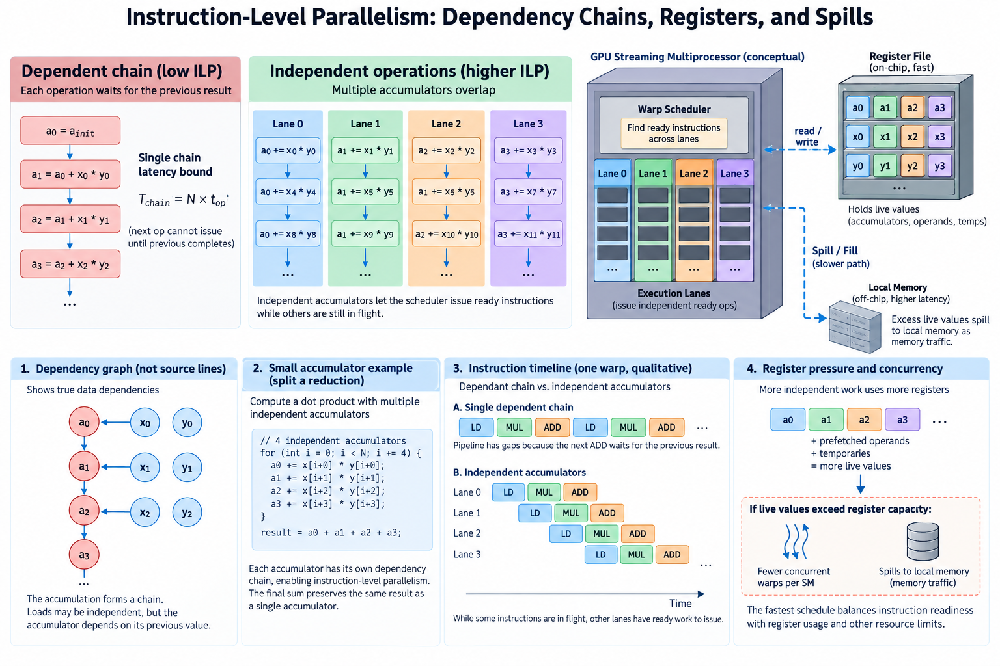
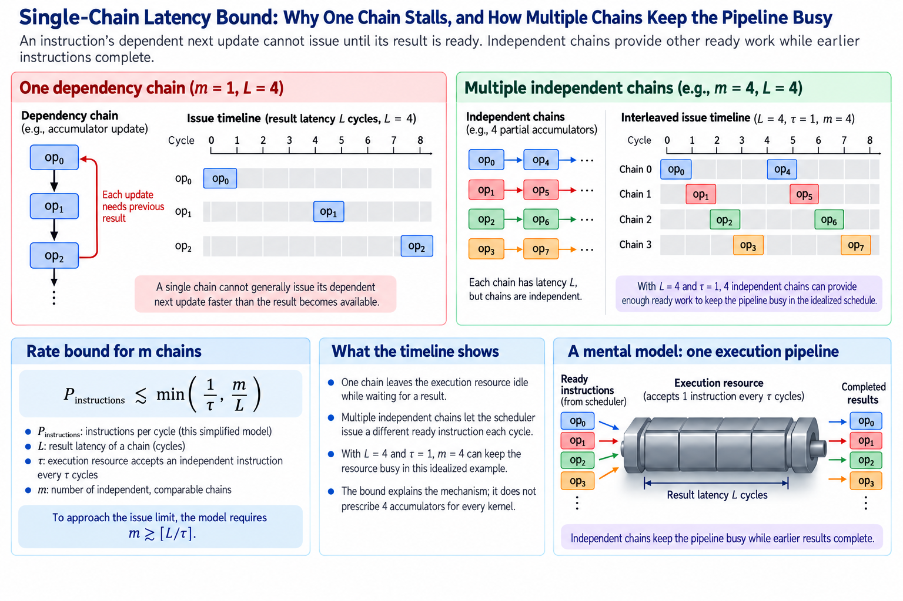
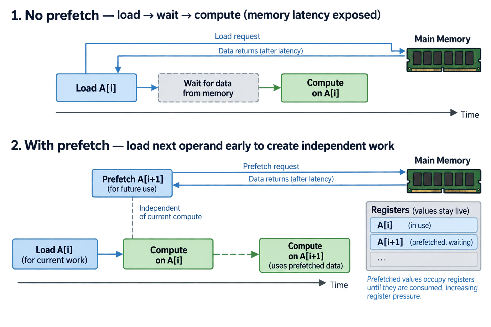
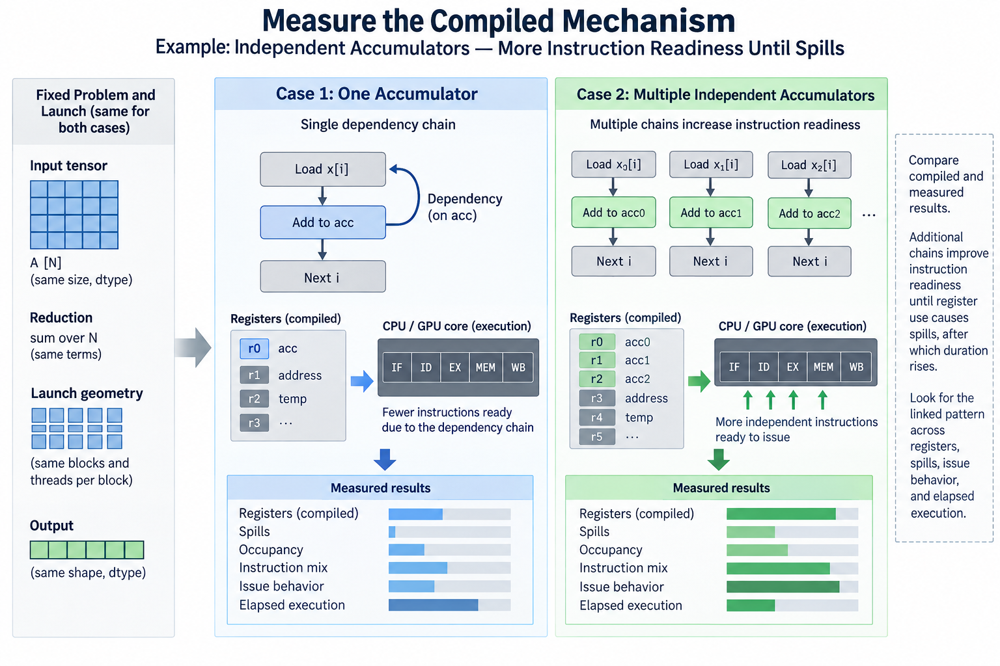
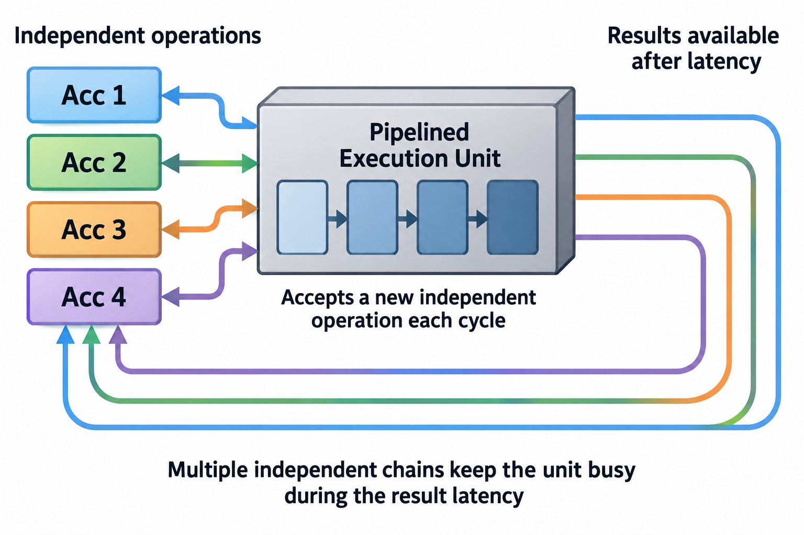

## Overview

A kernel can have plenty of arithmetic yet fail to keep an execution pipeline busy because its next instruction depends on an unfinished result. Adding more operations to the source does not solve that dependency. Instruction-level parallelism exposes independent work that a scheduler can issue while earlier operations complete.

The tradeoff is live state. Independent accumulators, prefetched operands, and unrolled iterations consume registers. Higher register use can reduce concurrent warps or cause spills. The fastest schedule balances instruction readiness with storage and other resource limits.

We will derive a simple chain model, connect it to warp concurrency, and examine measured register pressure. Cycle counts and resource budgets below are illustrative, not claims about a particular GPU. Actual instruction and scheduling behavior should be checked through current documentation and compiled evidence.

## Deep dive

### 1. Draw a dependency graph rather than counting source lines

Consider a dot-product loop updating one accumulator. Each update needs the previous accumulator value, creating a chain. Input loads may have independent addresses, but the accumulation itself retains a dependency through every iteration.

A compiler can transform or schedule operations, so the source graph is only the starting point. Inspect the generated path when a performance hypothesis depends on instruction order. A long source expression can become several independent instructions or one serialized sequence.

Distinguish data dependencies from ordering imposed by synchronization or memory semantics. A required barrier limits scheduling differently from a register dependency. Removing a semantic dependency is not an implementation optimization if it changes the result or ownership contract.

Keep useful work constant during comparison. A shorter loop, fewer reduction terms, or lower-precision method can appear faster for reasons unrelated to ILP. Report any changed mathematical or numerical contract explicitly.

### 2. Derive the single-chain latency bound

Let an instruction chain have result latency L cycles and an execution resource accept an independent instruction every tau cycles. A single chain cannot generally issue its dependent next update faster than the result becomes available.

For m independent comparable chains, an explanatory rate bound is

$$
P_{\mathrm{instructions}}\lesssim\min(1/\tau,m/L).
$$

The units are instructions per cycle under this simplified resource model, not floating-point operations per second. Actual issue width, instruction mix, register access, and scheduling can change the result.

To approach the issue limit, the model requires roughly

$$
m\gtrsim\lceil L/\tau\rceil.
$$

For illustrative latency 4 cycles and interval 1 cycle, 4 independent chains can provide enough ready work in the idealized schedule. This calculation explains the mechanism; it does not prescribe 4 accumulators for every kernel or instruction.

### 3. Split a reduction into independent accumulators

A dot product can use several partial accumulators assigned different terms, then combine them. The exact real-arithmetic result remains the sum of all required products:

$$
s=\sum_{j=0}^{m-1}s_j,\qquad s_j=\sum_{k:\,k\bmod m=j}a_kb_k.
$$

Each partial chain can progress independently of the others. Loads and address calculations can also be arranged to expose useful independent work, subject to the compiler and supported memory behavior.

Floating-point ordering changes. Combining partial sums can differ from sequential accumulation, so validate the numerical contract with a suitable reference. The algebraic identity does not imply bitwise equality in finite precision.

Handle the final terms correctly when the reduction length is not divisible by m. An unrolled loop needs supported boundary handling or a valid remainder path. Aligned benchmark lengths can hide a missing tail contribution.

### 4. Work a small accumulator example

For products 1 through 8 and m=2, one partial sum contains 1, 3, 5, 7 and equals 16. The other contains 2, 4, 6, 8 and equals 20. Combining them gives 36, the same real-arithmetic result as the complete sum.

This example proves term ownership and coverage, not hardware speed. The two chains can offer independent updates, but loads, compiler transformations, and other instructions still influence readiness.

A deterministic test should include a reduction length such as 7 as well as 8. The ownership rule then assigns 4 terms to one chain and 3 to the other. The final combination must include both correctly.

Use cancellation and scale variation to evaluate rounding behavior. A change that improves timing while exceeding the required numerical tolerance is a method tradeoff that needs explicit evaluation, not automatically a valid implementation replacement.

### 5. Separate ILP from thread-level latency hiding

Other ready warps can issue while one warp waits for a dependency. This thread-level concurrency complements independent work within a warp. A kernel can rely on both rather than treating ILP and occupancy as mutually exclusive strategies.

A conceptual aggregate readiness bound can use W ready-capable warps with m independent chains each, but it must remain compatible with the scheduler and execution-resource model. Multiplying W and m is not a prediction of unrestricted issue throughput.

High occupancy is useful only when the additional warps supply relevant ready work and fit the limiting resources. A kernel with lower occupancy can still perform well if ILP, reuse, and instruction efficiency are strong. Conversely, a register-heavy design can lose enough concurrency to expose latency elsewhere.

Measure dependency stalls, issue activity, and kernel duration alongside occupancy. A single occupancy percentage does not identify the limiting mechanism or prove that raising it will improve useful work.

### 6. Budget register-limited concurrency

Let R_SM be an illustrative register capacity, R_thread registers per thread, and T_block threads per block. A simplified register-only block limit is

$$
B_{\mathrm{register}}\le\left\lfloor\frac{R_{\mathrm{SM}}}{R_{\mathrm{thread}}T_{\mathrm{block}}}\right\rfloor.
$$

Hardware allocation granularity and other limits also apply. Query supported properties and inspect compiler resource usage for the target device rather than using this expression as a complete occupancy calculator.

For a hypothetical pool of 65536 registers and 256-thread blocks, 32 registers per thread gives a register-only limit of 8 blocks; 64 gives 4. These are arithmetic illustrations. Thread, block, shared-memory, and scheduling limits can lower either result.

Independent chains add accumulators, but the complete liveness budget also includes operands, addresses, predicates, and temporary values. Source-level variable count is not the compiler's allocated register count.

### 7. Understand spills as memory traffic

When values cannot remain in allocated registers under the compiled design, the implementation can spill them through local-memory storage. Local in CUDA's terminology does not mean on-chip shared memory; the resulting accesses can involve the device memory hierarchy.

Spills can add reads and writes to an operation that previously looked compute-focused. Caches can serve some traffic, but that does not make the cost disappear. Inspect generated loads and stores and the appropriate profiler evidence.

A forced register cap can raise apparent occupancy while increasing spills. The net kernel can become slower despite a favorable occupancy chart. Measure useful duration and actual traffic before adopting the cap.

Likewise, more unrolling can expose independent arithmetic while lengthening live ranges. Compare several controlled levels and preserve correctness. The maximum source-level unroll factor is not an optimization objective by itself.

### 8. Prefetching exposes another independence tradeoff

Loading future operands while current arithmetic executes can create independent work and hide some memory latency. The prefetched values must remain live until consumed, adding storage pressure. Address computation and memory ordering also remain part of the schedule.

Do not assume that issuing many loads guarantees overlap or improved bandwidth. The access pattern, outstanding-work capacity, cache behavior, and dependency chain determine the result. Excess prefetch can increase pressure or fetch data too early to remain useful.

For tiled kernels, asynchronous staging can provide a different movement path, but its ownership and completion rules must be preserved. Register prefetch and a supported shared-memory pipeline have different state and synchronization budgets.

Use the traffic and readiness model to propose a small experiment. If arithmetic waits on operands, prefetch is a plausible hypothesis. If the kernel is already bandwidth-saturated, extra outstanding work may not improve sustained useful throughput.

### 9. Measure the compiled mechanism

Keep input population, dtype, reduction terms, launch geometry, and output requirements fixed. Compare one relevant change at a time: independent accumulators, unrolling, operand scheduling, or register policy.

Record compiled registers, spills, occupancy, instruction mix, issue behavior, and elapsed execution. Profile only where evidence is needed to distinguish mechanisms, and compare profiled behavior with ordinary timing because instrumentation can perturb execution.

Sweep representative sizes. A small kernel can be launch-sensitive, while a large reduction can expose sustained dependencies or storage pressure. A candidate that wins one aligned case may lose on partial or irregular work.

A useful report can show that additional chains improved instruction readiness until register use caused spills, after which duration rose. That linked pattern supports a balanced choice. A report containing only an occupancy percentage and final speedup does not establish the same mechanism.

### 10. Preserve the mathematical and ownership contract

Test term coverage, tails, supported layouts, numerical tolerance, and buffer lifetime. ILP changes the schedule and often reduction ordering, so correctness evidence should exercise the exact transformed path.

A small reference can assign each term an identifier and verify that every required term contributes once. The hardware measurement then tests compilation and timing. Separating coverage from performance prevents a missing-tail bug from looking like an ILP improvement.

Revisit the balance after architecture, compiler, dtype, or surrounding fusion changes. Instruction latency, allocated registers, and available ready work can change. A historically optimal accumulator count is not a universal constant.

For an illustrative tuning record, compare 1, 2, 4, and 8 chains with the same reduction population. Record numerical differences, registers, spills, and time for each. If 4 improves readiness without spills while 8 increases memory traffic and loses time, the evidence supports 4 for that tested case. It does not establish that another kernel with different operands or launch geometry should use the same value.

Instruction-level parallelism is a readiness strategy constrained by live state. Draw the dependency graph, expose independent useful work, budget registers and concurrency, and measure the compiled result. The objective is a valid faster schedule, not maximum unrolling or maximum occupancy in isolation.

### 11. Distinguish latency from reciprocal throughput

An instruction can accept a new independent operation before an earlier operation finishes. Latency measures the delay until a dependent consumer may use a result. Reciprocal throughput measures the spacing between accepted operations under the relevant resource conditions. Substituting one for the other changes the predicted number of useful chains. A long latency does not necessarily mean that the execution unit handles only one operation at a time.

Consider an illustrative unit accepting an operation every cycle with a dependent result available after four cycles. One accumulator supplies an operation, then waits for its result. Four independent accumulators can supply four successive operations before returning to the first. This sketch assumes adequate operands, compatible issue resources, and no other bottleneck; it is a dependency explanation rather than a statement about a particular GPU instruction.

Now assume the same unit accepts an operation only every two cycles. Two chains can already cover a four-cycle result latency. Adding two more chains cannot double the unit's acceptance rate. It may still affect surrounding loads or address arithmetic, but that is another mechanism requiring separate evidence. The simple diagram therefore explains why latency alone cannot select an unroll factor.

The compiled loop may also contain shared address calculations. Several accumulators do not help if every useful update waits for one serial pointer recurrence or one sequential load. Draw edges for operands, addresses, and control, not only for floating-point accumulation. A compiler can transform these edges through strength reduction or scheduling, making inspection of the generated result valuable.

## Conclusion

Finally compare end-to-end work. If the reduction is a small part of a larger application, an improved arithmetic loop can produce a modest application gain. Record the fraction of time attributable to the changed region before translating local results into a system claim. This prevents a sound kernel optimization from receiving an unsupported application speedup.

### Sources

- [CUDA advanced kernel programming and hardware execution](https://docs.nvidia.com/cuda/cuda-programming-guide/03-advanced/advanced-kernel-programming.html).
- [CUDA compiler documentation](https://docs.nvidia.com/cuda/cuda-programming-guide/02-basics/nvcc.html).
- [Nsight Compute profiling guide](https://docs.nvidia.com/nsight-compute/ProfilingGuide/index.html).
