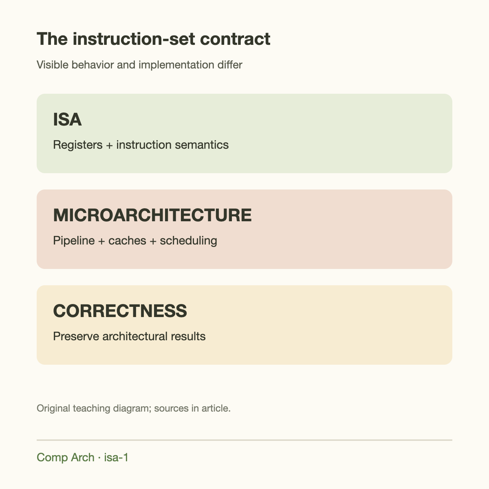
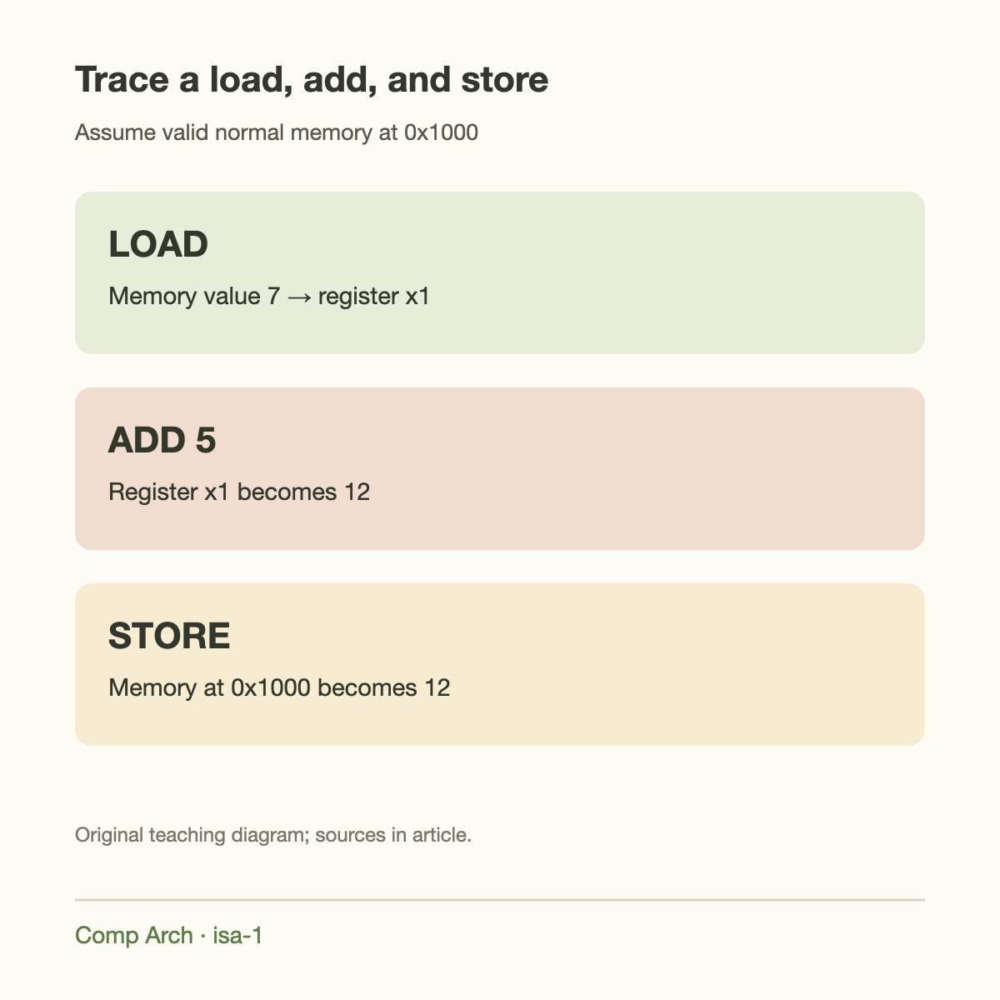
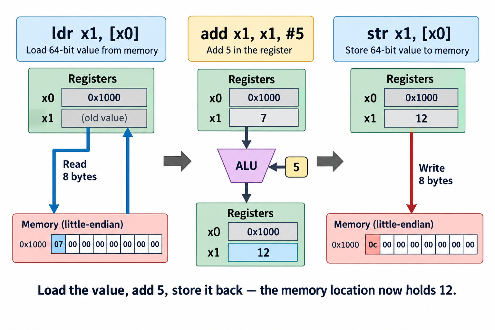
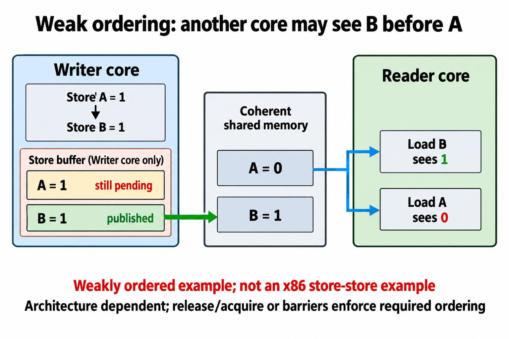
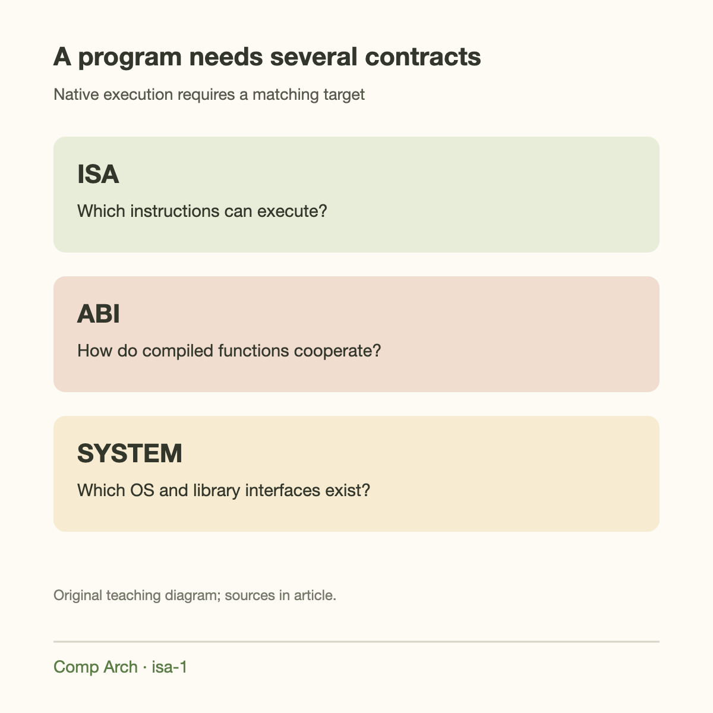

The same 4-line calculation can execute on processors with very different pipelines. 1 core may run instructions in order, another may speculate far ahead, and both can produce the same architecturally correct result. The agreement between software and hardware is the instruction set architecture, usually shortened to ISA.

After [the fetch-decode-execute introduction](../what-a-cpu-actually-does/), this is the next foundation. Fetch supplies instruction bits; decode interprets them according to an ISA; execution implements their defined effects. Understanding that boundary makes Arm, RISC-V, and x86-64 easier to compare without reducing each family to a marketing slogan.

We will trace a small integer calculation, distinguish architecture from microarchitecture, and introduce the other contracts needed to run a real program. The goal is to read a few assembly instructions meaningfully before studying branch prediction and out-of-order execution.

## What the ISA promises

An ISA defines the machine state visible to software and how instructions change it. That state includes registers, memory effects, control flow, and the conditions under which an instruction raises an exception. A register is a small named storage location directly operated on by instructions. Memory is a much larger addressable collection of bytes.

An instruction's specification describes operands and results. An integer addition might read 2 registers and write their sum to a third. A load reads bytes at an address and places a value in a register. A branch chooses the address of the next instruction according to a condition.

The ISA also defines encodings: the bit patterns that identify operations and operands. Assembly is a human-readable representation of those patterns. The processor consumes machine code, not the text string `add`. An assembler translates the text into bytes, while a disassembler interprets bytes as instructions.

A programmer can rely on the defined behavior, but cannot infer execution time from the mnemonic alone. A load from nearby cache and a load from DRAM have the same architectural meaning while taking very different amounts of time.



## What the ISA leaves to implementation

Microarchitecture is the machinery that implements the contract. Pipeline depth, issue width, execution units, cache sizes, branch prediction, and instruction scheduling are implementation choices. 2 processors with the same ISA can make different choices and have very different performance.

Suppose instructions first compute a value and then store it. An out-of-order core may overlap independent work or execute speculatively, but it must preserve the required architectural results and exceptions. The software-visible sequence is not a literal diagram of every internal event.

This freedom explains compatibility. A binary can continue to work on a newer processor implementing the needed architecture even if the new core's pipeline is redesigned. Extensions complicate that promise: a binary using an optional vector instruction requires support for that instruction, or a valid fallback.

The ISA is therefore a behavioral contract rather than a complete chip blueprint. A processor additionally contains interconnects, memory controllers, power management, and often accelerators. Those systems may have their own interfaces and are not explained by the CPU's integer instruction list.

## 3 basic kinds of instructions

Data-processing instructions transform register values. Examples include addition, subtraction, bitwise AND, shifts, and comparison. Some operations affect condition flags, while other architectures encode comparisons into branch instructions directly.

Load/store instructions transfer data between registers and memory. The instruction specifies the access width and an address calculation. Loading a 32-bit integer is different from loading 8 bytes, even when the base address is identical. Alignment, access permissions, and memory type can also affect whether the operation is valid.

Control-flow instructions change which instruction executes next. Conditional branches support loops and decisions. Calls and returns support functions, usually with help from an ABI. System instructions manage privileged behavior, synchronization, or architectural controls, subject to the execution environment.

The categories are useful for learning, but some instructions combine roles. An x86 arithmetic instruction may read a memory operand. An AArch64 load can update its base pointer. An instruction set's precise rules matter more than a rigid classification.

## A worked load-add-store example

Imagine a memory location at hexadecimal address `0x1000` containing the unsigned 64-bit integer 7. A register holds that address. We want to load the value, add 5, and write it back. A compact AArch64 example is:

```asm
ldr x1, [x0]       // x0 contains the address 0x1000
add x1, x1, #5
str x1, [x0]
```

The load reads 8 bytes because `x1` names a 64-bit register operand. After it completes architecturally, `x1` holds 7. The addition updates `x1` to 12. The store writes the 64-bit representation of 12 to the same address.

Under a little-endian memory convention, the initial 8 bytes are `07 00 00 00 00 00 00 00`. After the store they are `0c 00 00 00 00 00 00 00`. Endianness describes byte order in memory, not whether the mathematical value is 7 or 12.

For this trace, assume mapped normal memory, appropriate access permissions, and no competing writer. A real system must establish those conditions. The ISA defines the instructions, while the execution environment determines whether address `0x1000` is accessible to this program.




The load-add-store example has a compact state specification. Let $$a$$ be the byte address, $$M[a]$$ the initially stored unsigned 64-bit value, and $$v$$ the addend. For a completed sequence without faults,

$$
M'[a]=(M[a]+v)\bmod2^{64}.
$$

Assume the location is valid, the access width is 64 bits, and no other agent modifies it during the sequence. With $$M[a]=7$$ and $$v=5$$, the result is 12. With $$M[a]=2^{64}-1$$ and $$v=1$$, it is 0. This states modular machine arithmetic rather than a source-language promise about signed overflow.

The method is to describe architectural effects independently of the internal schedule. Register renaming, forwarding, and speculative execution may change when operations run, but a correct implementation preserves the specified visible result. The concurrency assumption matters: ordinary separate load and store instructions do not make an increment atomic. If 2 threads both load 7 before either stores, both may store 12 and lose an intended increment. An ISA's atomic operation or a correctly implemented synchronization protocol is needed for that different contract. Memory ordering and atomicity are related but distinct; a barrier can constrain ordering without converting this entire sequence into an indivisible update. Architectural reasoning starts by stating which shared-memory guarantee the program requires.




## Why width and signedness matter

A 64-bit integer register can represent bit patterns from 0 through $$2^{64}-1$$ when interpreted as unsigned. The same bits can represent signed 2's-complement values. Many operations act on bits identically regardless of interpretation; signedness becomes decisive for comparisons, division, and extension into a larger width.

Ordinary fixed-width integer addition retains the low bits of the result. For unsigned 64-bit arithmetic, adding 1 to the all-ones pattern produces 0 modulo $$2^{64}$$. A programming language can impose different rules: signed integer overflow in C is not simply a promise to wrap in every optimized program.

The compiler must translate language semantics into instructions correctly. Seeing a wrapping hardware addition does not permit a C programmer to assume every signed overflow behaves that way. This is another reason to distinguish the source-language contract from the ISA contract.

Loads can sign-extend or zero-extend a smaller memory value. A byte `ff` becomes 255 under unsigned extension and minus 1 under signed extension. The opcode and operand width determine the hardware behavior; the source type guides the compiler's choice.

## Registers are named roles, not ordinary RAM

An instruction usually encodes register indices in a limited number of bits. AArch64 exposes 31 general-purpose integer registers, while base RISC-V exposes 32 integer register names with register 0 hardwired to 0. Those counts do not describe every physical register inside a modern core.

Register renaming can map architectural registers to a larger internal collection. Software still names the architectural register. The processor uses the larger collection to avoid unnecessary dependencies while preserving visible behavior.

Registers also have conventions imposed by an ABI. 1 register may carry a function argument, another may need preservation across calls. Those conventions are not the same as an instruction's fundamental ability to add or load the register. The next article develops AArch64's register model and calling convention.

## The ABI is a second contract

An application binary interface describes how compiled pieces cooperate. It defines matters such as argument passing, return values, stack alignment, and which registers a called function must preserve. Object-file format and linking conventions belong to the broader binary environment.

2 functions can use the same ISA and still fail to cooperate if they disagree on the ABI. If a caller passes an argument in 1 register while the callee expects another, instruction execution can be individually correct while the program's result is wrong.

For AArch64, Arm's AAPCS64 uses `x0` through `x7` for initial integer/pointer parameter and result roles under its detailed rules. Other architectures and operating systems have their own conventions. Do not infer the x86-64 argument registers merely from knowing that the processor supports 64-bit instructions.

Operating-system interfaces add another layer. System-call numbers, executable loading, libraries, and permissions depend on the platform. “Supports the ISA” is necessary for a native binary, but not sufficient to run an executable built for a different operating system.

## Going deeper: memory ordering

A single-thread trace is not a complete account of concurrent software. Different architectures allow different observable orderings of memory operations. A processor may buffer stores or overlap loads, while coherence and memory-model rules constrain what other observers can see.

A plain load-add-store sequence is not an atomic increment. 2 threads can both load 7, both compute 12, and both store 12. The final value can lose 1 update. An atomic read-modify-write operation or a correctly synchronized critical section is needed when the intended behavior requires indivisibility.

Memory ordering and atomicity are related but distinct. An operation can be atomic while offering weak ordering for unrelated accesses. Acquire/release semantics describe synchronization relationships, and barriers can constrain ordering under specific rules. Learn the language-level atomic model together with the architecture's implementation.

This subject becomes especially important when a CPU communicates with an accelerator or memory-mapped device. Normal cached memory and device memory may have different access rules. A convenient integer pointer is not a substitute for the platform's required device-access API.




## Privilege and the system boundary

A useful computer must isolate applications and manage resources. Privileged architecture defines facilities for address translation, exceptions, interrupts, and protected control state. Ordinary application code cannot freely change every register merely because the ISA documents it.

A virtual address is translated through structures managed by the operating system and hardware. A valid-looking numeric pointer can still fault because no mapping exists or permissions prohibit access. The ISA and system architecture define the fault behavior; the operating system decides how to respond.

Interrupts and exceptions also expose the difference between instruction semantics and system behavior. An arithmetic instruction may complete quickly, but the program can be interrupted before the next instruction. Timing measurements therefore include execution context as well as instruction costs.

We will not memorize privilege registers here. The useful mental boundary is that user instructions operate within an environment established by more privileged software. Booting a processor and running a normal function involve different architectural responsibilities.

## This matters for AI chips

AI workloads still need CPUs for scheduling, preprocessing, networking, and operating-system services. The CPU ISA influences the software toolchain and available vector instructions, but the accelerator's matrix throughput is not determined by whether its host CPU uses Arm or x86.

A GPU kernel usually targets a separate device execution model and instruction system. A runtime bridges the host program to that accelerator. Changing the host ISA can require recompiling libraries or replacing binaries without changing the mathematical model being served.

Custom instructions and vector extensions can accelerate parts of inference, but they require compiler and library support. A hardware capability has little practical value if the application never emits its instructions. Connect this foundation to [SIMD](../simd-one-instruction-many-numbers/) and the AI Performance series when evaluating optimized kernels.

## Common misconceptions

**The ISA tells you the pipeline.** It tells you visible behavior. Pipeline organization is a microarchitectural choice, which is why compatible processors can have different speeds.

**Assembly lines measure work directly.** Instructions can represent different amounts of computation and expand into different internal operations. Count useful work and measure time.

**A 64-bit processor always uses 64-bit values.** It can support several operand widths. Pointer size and source types also depend on the chosen ABI.

**ISA compatibility guarantees executable compatibility.** Required extensions, ABI, operating system, and libraries also have to match.



## Takeaway

Read an instruction as a defined change to architectural state. Then ask separately how a particular core implements it and how the surrounding ABI and operating system make it part of a program.

Continue with [Arm and AArch64](../arm-aarch64-registers-and-ecosystem/), then [RISC-V](../riscv-small-base-extensible-system/). With those examples in place, comparisons between architectures become concrete rather than ideological.

## Sources

- [Arm A64 Instruction Set Architecture Guide](https://documentation-service.arm.com/static/674d8b61c7fc0d1f211dc776): instruction classes and AArch64 operand semantics.
- [Arm AAPCS64](https://github.com/ARM-software/abi-aa/blob/main/aapcs64/aapcs64.rst): register model and procedure-call conventions.
- [RISC-V RV32I specification](https://docs.riscv.org/reference/isa/unpriv/rv32.html): architectural state, encodings, and integer operations.
- [Intel software developer manuals](https://www.intel.com/content/www/us/en/developer/articles/technical/intel-sdm.html): x86 architectural and system interfaces.
