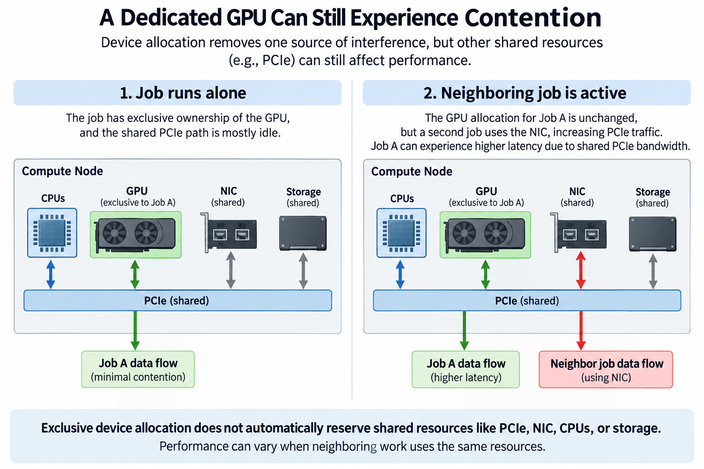
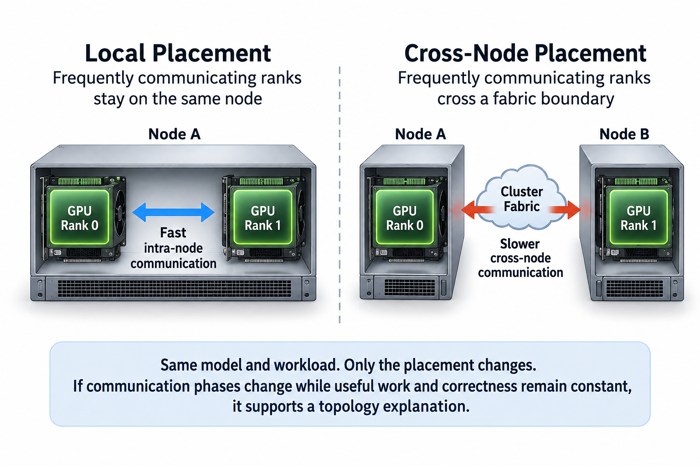

## Overview

An AI job needs more than a number of GPUs. Data workers need CPU capacity and host buffers need memory. Communication needs suitable adapter paths, and distributed process groups need a coherent placement. A scheduler such as Kubernetes or Slurm can allocate the requested devices correctly while the job still gets an inefficient execution topology.

Kubernetes and Slurm express and manage resources through different models. Their policies can support device allocation and local binding, but the exact guarantees depend on configuration and integration. Do not treat a resource request or a topology label as a promise of measured application throughput.

We will model job feasibility, separate local from cross-node topology, and build a verification method for the resources actually received. Numerical examples are illustrative. Current scheduler and device-plugin documentation from Kubernetes, Slurm, and NVIDIA defines the supported policy behavior.

## Deep dive

### 1. Represent demand as several resources and communication groups

For a job component i, record 4 demands: GPU g_i, CPU c_i, host memory m_i, and relevant device memory. Also record its role in the process mesh. Tensor, pipeline, expert, context, and data-parallel groups can have different communication locality requirements.

A node n with capacities G_n, C_n, and M_n has simplified feasibility constraints

$$
\sum_{i:a(i)=n}g_i\le G_n,\qquad\sum_{i:a(i)=n}c_i\le C_n,\qquad\sum_{i:a(i)=n}m_i\le M_n.
$$

The assignment a maps components to nodes, and these inequalities ignore 4 real effects, device topology, allocation granularity, reservations, and runtime overhead, so satisfying them matters only within the simplified model and is not a complete deployment certificate.

Physical GPU memory also matters, because a logical GPU allocation does not guarantee that a model's 4 memory consumers, weights, activations, workspace, and cache, all fit, and shared-device and partitioned-device mechanisms have their own capacity and isolation semantics, which must be included explicitly.

### 2. Understand declared requests and effective allocations

Kubernetes and Slurm use declared resources to make decisions under their policy. A job may declare only GPU demand while large CPU or memory work goes unaccounted for. The placement is then feasible in the scheduler's model and overloaded in practice.

Requests, limits, exclusive allocations, and shared entitlements are 4 different concepts, and Kubernetes CPU policy, QoS behavior, and device allocation depend on specific conditions and configuration, while Slurm resource accounting and binding also depend on cluster configuration and requested options.

Record 5 facts about the allocation actually visible to each worker: GPU identifiers, allowed CPU masks, memory-node permissions, quotas where relevant, and mounted resources. Host totals do not show what one job can use.

Keep these effective values in performance reports, because a container or launcher can change visibility and binding inside a Kubernetes or Slurm allocation, and comparing application configuration alone can miss the resource difference that caused a regression.

### 3. Device allocation is not complete performance isolation

A device plugin or GPU resource mechanism identifies allocatable accelerator resources, and the allocation may be 1 of 3 things, a whole device, a hardware partition, or a provider-defined sharing arrangement, each of which gives different memory, compute, and interference behavior.

Do not infer a fractional performance guarantee from a logical shared-device count. Time sharing and hardware partitioning are 2 different mechanisms, and neither automatically reserves external network or host-memory bandwidth. Check the actual plugin and platform contract.

Even a whole GPU can share 5 resources with other jobs, PCIe paths, NIC capacity, CPUs, storage, and cooling, so exclusive accelerator ownership removes 1 contention source while leaving the others, and an application can see variable performance under otherwise correct device allocation.

Measure neighboring-load sensitivity where the deployment shares resources. Keep the sharing mode and topology in the record. Otherwise a workload on isolated hardware gets quietly compared with one in a different contention environment.

A useful isolation experiment runs the same request population first alone and then with representative neighboring work. Record which of 5 resources the neighbor shares: accelerator compute, host CPUs, memory bandwidth, adapter ports, or storage. If device allocation is unchanged but latency grows only when the shared adapter is busy, the evidence points to that boundary rather than the accelerator resource count. This comparison also clarifies the scope of any promised isolation. A guarantee about one physical partition does not automatically extend to components outside that partition.

### 4. Local topology policies coordinate resources within a node

Kubernetes Topology Manager uses topology information from participating resource managers under supported policies and scope, and part of its job is coordinating local resource alignment, while the exact admission and alignment behavior follows the configured policy and available hints.

CPU and memory management have separate conditions and mechanisms, so do not assume a Kubernetes topology policy alone provides exclusive CPUs or moves every host page: the relevant managers, resource declarations, and supported options must all line up.

Slurm generic-resource configuration and binding can describe device and CPU relationships. Correct Slurm configuration helps the allocation and launcher fit the physical machine. You still need to verify actual application affinity and buffer placement.

Check all 4 local relationships after launch: CPU, memory, GPU, and adapter. A successful admission event shows the scheduler's configured rules were satisfied; it is not a measured GPU-to-NIC bandwidth result.

### 5. Cross-node placement is a separate communication problem

Local NUMA alignment does not decide which servers a distributed job gets or which fabric cuts its traffic crosses. The 3 group kinds here, tensor-parallel groups, pipeline stages, and expert owners, can benefit from different inter-node layouts.

For traffic D_cut crossing a required physical boundary with available capacity B_cut, a basic bound is

$$
T_{\mathrm{communication}}\ge D_{\mathrm{cut}}/B_{\mathrm{cut}}.
$$

Use the actual process mesh and collective schedule to count traffic, because aggregate cluster bandwidth does not raise the capacity of 1 constrained cut, and placement labels are useful only when they match physical relationships and policies the scheduler actually uses.

Spreading replicas can improve resilience for a serving workload, while packing tightly communicating ranks can improve locality for training, so the right policy follows the workload and failure objective, and a generic preference to spread or pack every AI job ignores that distinction.

### 6. Coherent group allocation prevents useless partial startup

A distributed operation needs its participating ranks, so if only part of a multi-worker job starts, those workers may hold resources while waiting for unavailable peers, and the scheduler and job controller need supported behavior for 3 stages: group allocation, startup, and failure.

Do not assume that scheduling one pod or component proves the whole group is available. Verify the cluster's gang, co-scheduling, reservation, or equivalent job-allocation mechanism where the workload needs it.

Slurm jobs and Kubernetes controllers organize startup differently, and integrations can add their own policies. Record the actual behavior; a generic scheduler name is not proof of all-or-nothing admission.

Bound startup waiting and record the reason for failure, because a job waiting for resources is different from a job whose communicator initialized and then stalled, and that distinction tells you whether the next action belongs to 1 of 3 places: scheduling, launch configuration, or communication diagnosis.

### 7. Fragmentation can strand apparently free accelerators

Take an illustrative cluster with 2 nodes, each holding 8 GPUs and 16 available CPU units. An 8-GPU job consists of 2 groups requiring 4 GPUs and 12 CPU units each. Both groups cannot share one node under the CPU constraint, so placing one group per node uses 24 CPU units total.

The cluster then has 8 free GPUs but only 8 free CPU units, split across nodes. Another group requiring 4 GPUs and 12 CPU units cannot fit under this model. A GPU-only capacity chart would show available accelerators while the complete resource model explains the queue.

The example does not prove that Kubernetes or Slurm fragments resources wrongly, but it shows why admission and capacity planning need the full demand vector, and different grouping, CPU requirements, or node capacities can produce a different feasible placement.

Record queued demand alongside free resource vectors. The number of free devices is not enough to explain whether a waiting job can run. Topology and granularity can strand capacity even when aggregate sums look adequate.

### 8. Priority and preemption need a recovery contract

A higher-priority workload may displace lower-priority work under supported policy, which can improve urgent service while throwing away training progress or triggering restart costs, so the operational value depends on what state survives and how fast useful work resumes.

For training, 3 behaviors define the recovery boundary, checkpoint capture, durability, and restore, and a model-weight file alone may not keep optimizer and input progress, while for serving, interrupted requests need explicit cancellation or retry semantics.

A simplified preemption cost is

$$
C_{\mathrm{preempt}}=C_{\mathrm{cleanup}}+C_{\mathrm{restart}}+C_{\mathrm{restore}}+C_{\mathrm{lost\ work}}.
$$

Some components overlap, and the expression is only accounting, so measure useful recovered progress instead of stopping the evaluation when replacement workers start, and weigh both urgent-work benefit and displaced-work cost in any policy decision.

Do not treat every queued job as a candidate for immediate preemption without the cluster's intended fairness and recovery policy. The scheduler's supported mechanism supplies enforcement; the service objectives supply the reason to use it.

### 9. Verify placement with a workload-sensitive test

After launch, capture 6 facts: rank-to-GPU, rank-to-node, adapter mapping, effective CPU masks, memory placement, and relevant resource limits. Compare these with the intended process mesh and local topology.

Run minimal correctness and representative communication cases, then the full application. A healthy local pair does not prove cross-node collective efficiency. A healthy collective does not prove input or optimizer capacity.

Measure 4 signals: stage timing, useful tokens or accepted requests, queueing, and slow-rank behavior. If performance changes with placement while kernels stay similar, topology or host resources become stronger hypotheses. Keep the mapping so the result can be reproduced.

A controlled placement experiment can keep the model and group dimensions fixed while changing whether a frequently communicating group crosses a fabric boundary, and if the expected communication phase changes while useful work and correctness stay constant, the result supports the locality explanation, but also check startup and memory feasibility, because a communication-local placement that cannot fit the state is not an operational solution.

Calibrate CPU demand from the complete job, not only the main process. All 5 of data workers, communication progress, compilation, logging, and storage handling can consume different amounts over time. Keep startup and steady-state observations separate, and include burst behavior when it affects launch or request latency. An allocation that covers average use but keeps throttling a critical progress thread can still be unsuitable. Reserving too much CPU capacity, on the other hand, can hurt cluster packing without improving the tested application. The right declaration follows measured useful behavior and the policy's resource semantics.

### 10. Connect scheduling policy to capacity planning

Track 6 quantities: offered job demand, admitted allocations, queue time, startup time, useful execution, and termination outcomes. A policy can keep admitted jobs fast by leaving more demand queued, so both populations should stay visible.

For a stable population with consistent boundaries, Little's law relates average queued jobs L, arrival rate lambda, and average queue time W:

$$
L=\lambda W.
$$

The relationship in Little's law uses means and stationarity assumptions. It does not predict tail queue time, and it does not apply unchanged while the queue grows during overload. Workload heterogeneity and multidimensional feasibility need extra evidence.

Keep a versioned policy record with 6 entries: resource definitions, device sharing mode, local topology configuration, inter-node placement rules, group-startup behavior, and recovery semantics. Revisit it after hardware and workload changes.

## Conclusion

Kubernetes and Slurm can organize supported resource allocation, but useful AI performance depends on the placement the job actually gets, so describe complete demand, align local resources, map communication groups across the fabric, and verify useful execution, because a resource guarantee becomes meaningful only when its scope is explicit and its application consequences are measured.

### Sources

- [Kubernetes Topology Manager](https://kubernetes.io/docs/tasks/administer-cluster/topology-manager/).
- [Kubernetes CPU management policies](https://kubernetes.io/docs/tasks/administer-cluster/cpu-management-policies/).
- [Slurm generic resources](https://slurm.schedmd.com/gres.html).
- [NVIDIA Kubernetes device plugin](https://github.com/NVIDIA/k8s-device-plugin).
