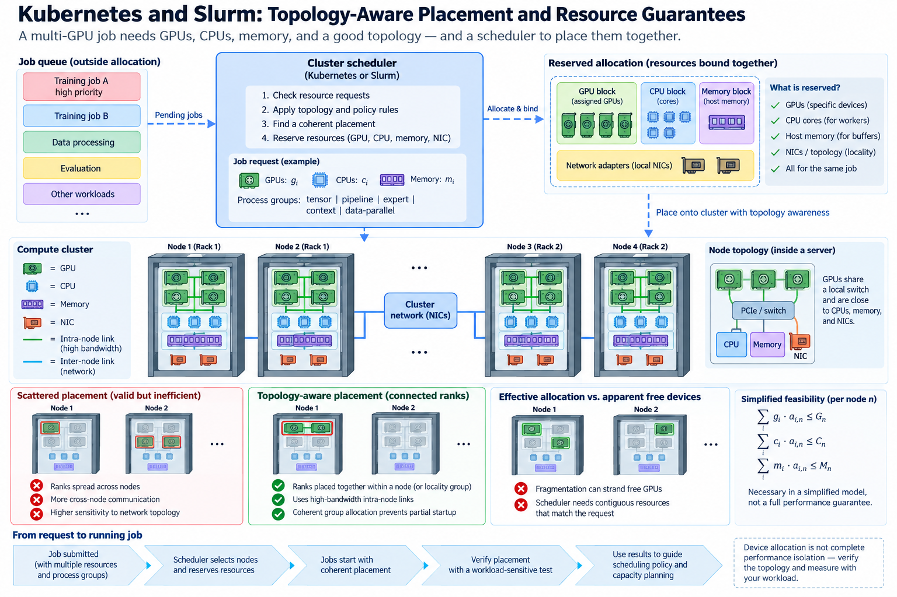
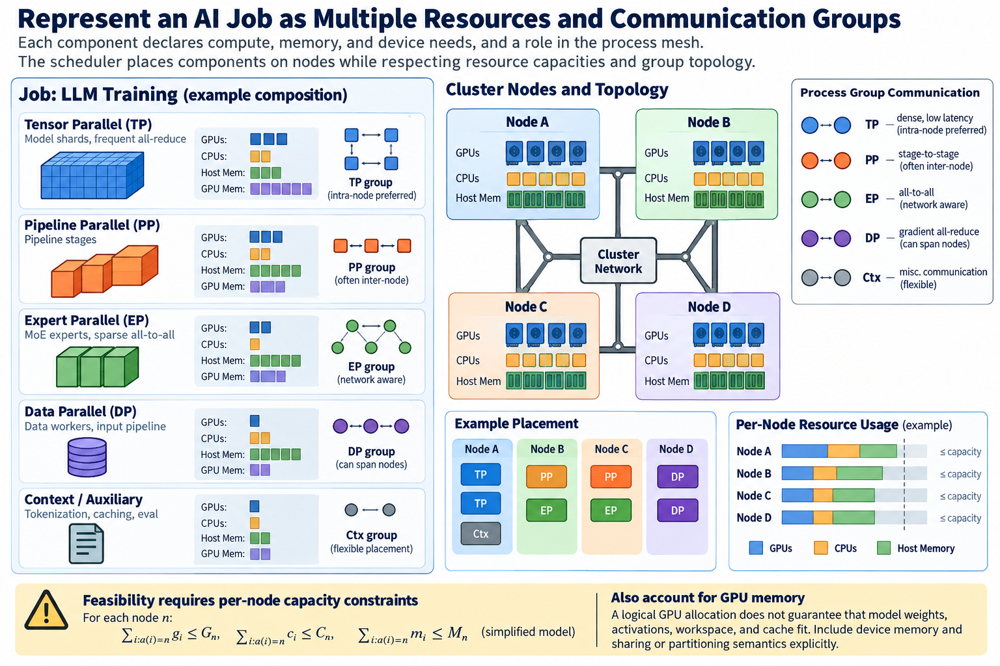

An AI job needs more than a number of GPUs. Data workers need CPU capacity, host buffers need memory, communication needs suitable adapter paths, and distributed process groups need a coherent placement. A scheduler can allocate the requested devices correctly while the job still receives an inefficient execution topology.

Kubernetes and Slurm express and manage resources through different models. Their available policies can support device allocation and local binding, but the exact guarantees depend on configuration and integration. Neither a resource request nor a topology label should be treated as a promise of measured application throughput.

We will model job feasibility, distinguish local from cross-node topology, and build a verification method for the resources actually received. Numerical examples are illustrative. Current scheduler and device-plugin documentation defines the supported policy behavior.

## 1. Represent demand as several resources and communication groups

*Overview of the article’s core mechanism. The following sections explain the objects, relationships, equations, assumptions, and worked examples shown here.*

For a job component i, record GPU demand g_i, CPU demand c_i, host-memory demand m_i, and relevant device-memory needs. Also record its role in the process mesh: tensor, pipeline, expert, context, or data-parallel groups can have different communication locality requirements.

A node n with capacities G_n, C_n, and M_n has simplified feasibility constraints

$$
\sum_{i:a(i)=n}g_i\le G_n,\qquad\sum_{i:a(i)=n}c_i\le C_n,\qquad\sum_{i:a(i)=n}m_i\le M_n.
$$

The assignment a maps components to nodes. These inequalities omit device topology, allocation granularity, reservations, and runtime overhead, so satisfying them is necessary only within the simplified model, not a complete deployment certificate.

Physical GPU memory also matters. A logical GPU allocation does not guarantee that a model's weights, activations, workspace, and cache fit. Shared-device or partitioned-device mechanisms have their own capacity and isolation semantics that must be included explicitly.

## 2. Understand declared requests and effective allocations

Schedulers use declared resources to make decisions under their policy. If a job declares only GPU demand while substantial CPU or memory work remains unaccounted for, the placement can be feasible in the scheduler's model and overloaded in practice.

Requests, limits, exclusive allocations, and shared entitlements are different concepts. Kubernetes CPU policy, QoS behavior, and device allocation depend on specific conditions and configuration. Slurm resource accounting and binding also depend on cluster configuration and requested options.

Record the allocation actually visible to each worker: GPU identifiers, allowed CPU masks, memory-node permissions, quotas where relevant, and mounted resources. Host totals do not establish what one job can use.

Preserve these effective values in performance reports. A container or launcher can change visibility and binding within a scheduler allocation. Comparing application configuration alone can miss the resource difference that caused a regression.

## 3. Device allocation is not complete performance isolation

A device plugin or GPU resource mechanism identifies allocatable accelerator resources. The allocation may represent a whole device, a hardware partition, or a provider-defined sharing arrangement. Those choices provide different memory, compute, and interference behavior.

Do not infer a fractional performance guarantee from a logical shared-device count. Time sharing and hardware partitioning are distinct mechanisms, and neither automatically reserves external network or host-memory bandwidth. Consult the actual plugin and platform contract.

Even a whole GPU can share PCIe paths, NIC capacity, CPUs, storage, and cooling with other jobs. Exclusive accelerator ownership removes one contention source while leaving others. An application can therefore experience variable performance under otherwise correct device allocation.

Measure neighboring-load sensitivity where the deployment shares resources. Preserve the sharing mode and topology in the record so a workload on isolated hardware is not compared silently with one receiving a different contention environment.

A useful isolation experiment runs the same request population first alone and then with representative neighboring work. Record which resources the neighbor shares: accelerator compute, host CPUs, memory bandwidth, adapter ports, or storage. If device allocation is unchanged but latency grows only when the shared adapter is busy, the evidence points toward that boundary rather than the accelerator resource count. This comparison also clarifies the scope of any promised isolation. A guarantee about one physical partition cannot be extended automatically to components outside that partition.

## 4. Local topology policies coordinate resources within a node

Kubernetes Topology Manager uses topology information from participating resource managers under supported policies and scope. Its purpose includes coordinating local resource alignment. The exact admission and alignment behavior follows the configured policy and available hints.

CPU and memory management have separate conditions and mechanisms. A topology policy alone should not be assumed to provide exclusive CPUs or relocate every host page. The relevant managers, resource declarations, and supported options must align.

Slurm generic-resource configuration and binding can describe device and CPU relationships. Correct configuration helps the allocation and launcher fit the physical machine, but actual application affinity and buffer placement still need verification.

Inspect local CPU, memory, GPU, and adapter relationships after launch. A successful admission event is evidence that the scheduler's configured rules were satisfied; it is not a measured GPU-to-NIC bandwidth result.

## 5. Cross-node placement is a separate communication problem

Local NUMA alignment does not determine which servers a distributed job receives or which fabric cuts its traffic crosses. Tensor-parallel groups, pipeline stages, and expert owners can benefit from different inter-node layouts.

For traffic D_cut crossing a required physical boundary with available capacity B_cut, a basic bound is

$$
T_{\mathrm{communication}}\ge D_{\mathrm{cut}}/B_{\mathrm{cut}}.
$$

Use the actual process mesh and collective schedule to count traffic. Aggregate cluster bandwidth does not increase the capacity of one constrained cut. Placement labels are useful only when they correspond to physical relationships and policies that the scheduler actually uses.

Spreading replicas can improve resilience for a serving workload, while concentrating tightly communicating ranks can improve locality for training. The correct policy follows the workload and failure objective. A generic preference to spread or pack every AI job ignores this distinction.

## 6. Coherent group allocation prevents useless partial startup

A distributed operation requires its participating ranks. If only part of a multi-worker job starts, those workers may occupy resources while waiting for unavailable peers. The scheduler and job controller need supported behavior for group allocation, startup, and failure.

Do not assume that successful scheduling of one pod or component establishes availability of the entire group. Verify the cluster's gang, co-scheduling, reservation, or equivalent job-allocation mechanism where the workload requires it.

Slurm jobs and Kubernetes controllers organize startup differently, and integrations can add their own policies. Record the actual behavior rather than presenting a generic scheduler name as proof of all-or-nothing admission.

Bound startup waiting and preserve the reason for failure. A job waiting for resources is different from a job whose communicator initialized and then stalled. The distinction guides whether the next action belongs to scheduling, launch configuration, or communication diagnosis.

## 7. Fragmentation can strand apparently free accelerators

Consider an illustrative cluster with 2 nodes, each holding 8 GPUs and 16 available CPU units. An 8-GPU job consists of 2 groups requiring 4 GPUs and 12 CPU units each. Both groups cannot share one node under the CPU constraint, so placing one group per node uses 24 CPU units total.

The cluster then has 8 free GPUs but only 8 free CPU units, split across nodes. Another group requiring 4 GPUs and 12 CPU units cannot fit under this model. A GPU-only capacity chart would show available accelerators while the complete resource model explains the queue.

The example does not prove that a particular scheduler fragments resources incorrectly. It shows why admission and capacity planning need the full demand vector. Different grouping, CPU requirements, or node capacities can produce a different feasible placement.

Record queued demand alongside free resource vectors. The number of free devices is insufficient to explain whether a waiting job can run. Topology and granularity can strand capacity even when aggregate sums look adequate.

## 8. Priority and preemption need a recovery contract

A higher-priority workload may displace lower-priority work under supported policy. That can improve urgent service while discarding training progress or triggering restart costs. The operational value depends on what state survives and how quickly useful work resumes.

For training, checkpoint capture, durability, and restore behavior define the recovery boundary. A model-weight file alone may not preserve optimizer and input progress. For serving, interrupted requests need explicit cancellation or retry semantics.

A simplified preemption cost is

$$
C_{\mathrm{preempt}}=C_{\mathrm{cleanup}}+C_{\mathrm{restart}}+C_{\mathrm{restore}}+C_{\mathrm{lost\ work}}.
$$

Some components overlap, and the expression is only accounting. Measure useful recovered progress instead of stopping the evaluation when replacement workers start. Policy decisions should include both urgent-work benefit and displaced-work cost.

Avoid treating every queued job as a candidate for immediate preemption without the cluster's intended fairness and recovery policy. The scheduler's supported mechanism supplies enforcement; the service objectives supply the reason to use it.

## 9. Verify placement with a workload-sensitive test

After launch, capture rank-to-GPU, rank-to-node, adapter mapping, effective CPU masks, memory placement, and relevant resource limits. Compare these with the intended process mesh and local topology.

Run minimal correctness and representative communication cases, then the full application. A healthy local pair does not establish cross-node collective efficiency, and a healthy collective does not establish input or optimizer capacity.

Measure stage timing, useful tokens or accepted requests, queueing, and slow-rank behavior. If performance changes with placement while kernels remain similar, topology or host resources become stronger hypotheses. Preserve the mapping so the result can be reproduced.

A controlled placement experiment can keep the model and group dimensions fixed while changing whether a frequently communicating group crosses a fabric boundary. If the expected communication phase changes while useful work and correctness remain constant, the result supports the locality explanation. Also inspect startup and memory feasibility, because a communication-local placement that cannot fit the state is not an operational solution.

CPU demand should be calibrated from the complete job rather than only the main process. Data workers, communication progress, compilation, logging, and storage handling can consume different amounts over time. Preserve startup and steady-state observations separately, and include burst behavior when it affects launch or request latency. An allocation that covers average use but repeatedly throttles a critical progress thread can still be unsuitable. Conversely, reserving excessive CPU capacity can reduce cluster packing efficiency without improving the tested application. The appropriate declaration follows measured useful behavior and the policy's resource semantics.

## 10. Connect scheduling policy to capacity planning

Track offered job demand, admitted allocations, queue time, startup time, useful execution, and termination outcomes. A policy can keep admitted jobs fast by leaving more demand queued, so both populations should remain visible.

For a stable population with consistent boundaries, Little's law relates average queued jobs L, arrival rate lambda, and average queue time W:

$$
L=\lambda W.
$$

The relationship uses means and stationarity assumptions. It does not predict tail queue time or apply unchanged while the queue grows during overload. Workload heterogeneity and multidimensional feasibility require additional evidence.

Maintain a versioned policy record with resource definitions, device sharing mode, local topology configuration, inter-node placement rules, group-startup behavior, and recovery semantics. Revisit after hardware and workload changes.

Kubernetes and Slurm can organize supported resource allocation, but useful AI performance depends on the placement the job actually receives. Describe complete demand, align local resources, map communication groups across the fabric, and verify useful execution. Resource guarantees become meaningful when their scope is explicit and their application consequences are measured.

## Sources

- [Kubernetes Topology Manager](https://kubernetes.io/docs/tasks/administer-cluster/topology-manager/).
- [Kubernetes CPU management policies](https://kubernetes.io/docs/tasks/administer-cluster/cpu-management-policies/).
- [Slurm generic resources](https://slurm.schedmd.com/gres.html).
- [NVIDIA Kubernetes device plugin](https://github.com/NVIDIA/k8s-device-plugin).
