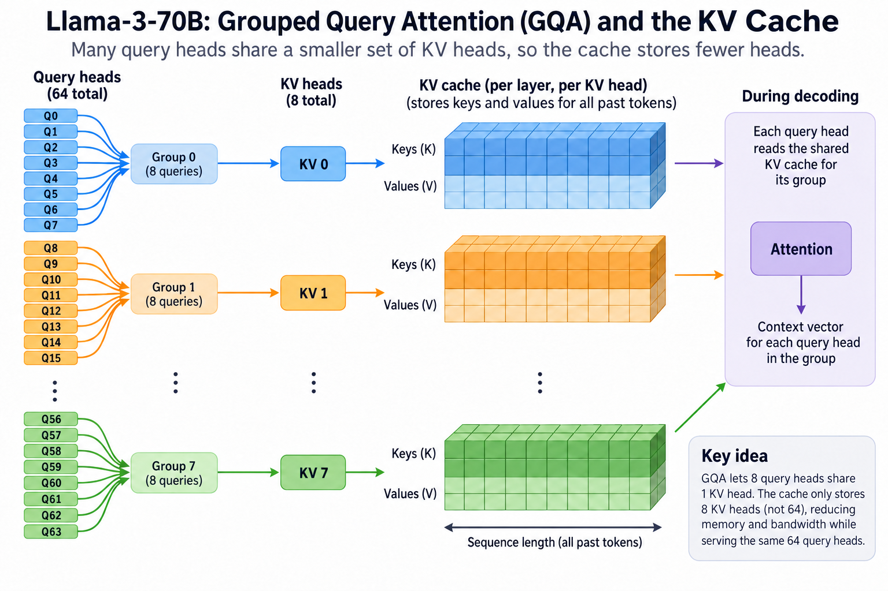
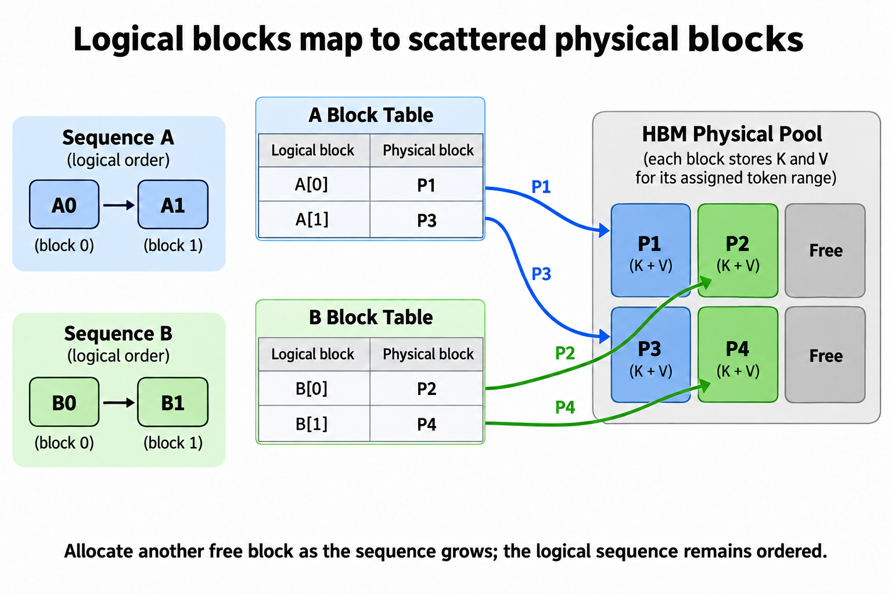

Every token that Llama-3-70B keeps in its context costs exactly 327,680 bytes of GPU memory. Hold an 8k-token conversation and the model is dragging 2.5 GiB of state behind it, per sequence, before it generates a single new word. Serve 16 of those conversations at once and you have parked 40 GiB of HBM, half a modern accelerator, on data that is not weights, not activations, but pure memorized history: the KV cache.

If you work on inference performance, this structure is your job. Weights are fixed at load time; activations are transient. The KV cache is a major state tensor in the serving stack that grows with every token, every user, and every passing second, and its size arithmetic decides your batch size, your context limit, and ultimately your cost per million tokens. This article builds the whole thing from first principles: why it must exist, how to size it by hand, and the 3 ideas (grouped-query attention, PagedAttention, latent compression) that have each improved its storage or effective allocation.

## Why attention forces you to keep the past


*Overview of the article’s core mechanism. The following sections explain the objects, relationships, equations, assumptions, and worked examples shown here.*


A transformer generates text autoregressively, 1 token per forward pass. (If prefill vs. decode is fuzzy, the [basics article on generation](/blog/how-an-llm-generates-text/) covers it; here we assume it.) Inside every attention layer, the new token's query vector is compared against the **key** vectors of all previous tokens, and the resulting weights blend their **value** vectors. That is the mechanism: to produce token *n+1*, attention needs K and V for tokens 1 through *n*, in every layer.

Here is the crucial observation. The key and value vectors for token 17 are a function of token 17's layer input and the fixed projection matrices. They do not change when token 200 is generated. So you have 2 options:

1. **Recompute them.** Every decode step re-runs the K and V projections over the entire prefix. Step *n* does O(n) redundant projection work, so generating *T* tokens costs O(T²) recomputation. At 8k tokens that is roughly 33 million token-level projection computations to produce 8k outputs, a ~4,000x overhead on attention-side compute.
2. **Cache them.** Compute each token's K and V once, append them to a per-sequence buffer, and let every later step read instead of recompute. Decode step *n* now does O(1) new projection work plus an O(n) *memory read*.

Every serving system on earth picks option 2. But notice what the trade actually is: you have not eliminated the O(n) term, you have converted it from FLOPs into bytes. And on modern GPUs, bytes are the scarcer currency. That single design decision is why decode is memory-bandwidth-bound and why the [memory wall](/blog/the-memory-wall-latency-numbers/) is the defining constraint of LLM inference.


## The size formula

The cache stores, for every token, 1 key vector and 1 value vector per layer, per KV head. Its size is a straight product:

```
KV bytes = 2 × n_layers × n_kv_heads × head_dim × bytes_per_elem × seq_len × batch
```

The leading 2 is for K and V. Note which term is `n_kv_heads`, not `n_heads`: queries are never cached (each query is used once, at its own decode step, then discarded), so only the key/value head count matters. That distinction is exactly the lever that multi-query attention (MQA, Shazeer 2019) and grouped-query attention (GQA, Ainslie et al. 2023) pull. In MQA all query heads share 1 K/V head; in GQA they share a small group of them. The model quality cost is small and recoverable with brief uptraining; the cache saving is the ratio of head counts, and it falls straight out of the formula.

## Worked example: Llama-3-70B at 8k context

Llama-3-70B has 80 layers, 64 query heads, 8 KV heads (GQA with groups of 8), and head_dim 128. Run the formula for 1 token in FP16 (2 bytes per element):

```
2 × 80 × 8 × 128 × 2 bytes = 327,680 bytes  ≈ 320 KiB per token
```

Now scale it up:

- **1 8k sequence:** 320 KiB × 8,192 = **2.5 GiB**
- **Batch of 16:** 2.5 GiB × 16 = **40 GiB** in FP16
- **Same batch, FP8 KV cache** (1 byte per element): **20 GiB**

For calibration, the FP16 weights of the model itself are ~140 GB. On a 4x H100 node (320 GB HBM total), weights take 140 GB, and the FP16 cache for this modest workload takes another 40 GB. Push to 32 concurrent 8k sequences and the cache (80 GB) is more than half the size of the weights. The cache scales with traffic; the weights do not. This is why "will it fit" questions in serving are really KV cache questions.

Now the counterfactual that shows what GQA bought. If Llama-3-70B used classic multi-head attention, `n_kv_heads` would be 64 instead of 8: **2.5 MiB per token**, 20 GiB per 8k sequence, **320 GiB** for the batch of 16. That does not fit on the node at all. GQA's 8x reduction is the difference between this workload existing and not existing.


The cache does not just occupy memory, it consumes bandwidth. Each decode step must read the sequence's entire cache once per layer sweep. At batch 16 and 8k context, 1 step reads ~40 GiB of KV plus ~140 GB of weights: call it 180 GB. Across 8 H100s (~3.35 TB/s each, 26.8 TB/s aggregate), that is a hard floor of ~6.7 ms per step even at perfect bandwidth utilization, about 150 tokens/s per sequence, before any compute or communication cost. Longer contexts push the KV term past the weight term, and your [TPOT](/blog/ttft-and-tpot/) degrades with context length even though per-token FLOPs barely change.

Use a capacity equation that permits variable-length requests and exposes implementation assumptions. With layer count L, KV heads H_kv, head width d, bytes per cache element b_kv, and retained lengths S_i:

$$
m_{\mathrm{token}}=2LH_{\mathrm{kv}}d b_{\mathrm{kv}},\qquad
M_{\mathrm{logical}}=m_{\mathrm{token}}\sum_i S_i.
$$

For 80 layers, 8 KV heads, width 128, and 2-byte elements, m_token is 327680 bytes. 16 histories of 8192 tokens require exactly 42949672960 bytes, or 40 GiB. That is approximately 42.95 GB, so adding 140 GB of weights yields about 182.95 GB rather than exactly 180 GB. At 26.8 TB/s aggregate bandwidth the ideal traffic term is 6.83 milliseconds, assuming perfectly balanced shards and a single cache sweep.

Paged allocation rounds each unshared length up to a block boundary. Prefix sharing can subtract duplicate physical blocks, while quantization changes bytes per element and adds scales. MLA changes what representation is stored at all. These are distinct methods: improved allocation is not compression, and learned compression requires an architecture trained to use it. Validate per-rank physical cache allocation, particularly when tensor-parallel degree exceeds KV-head count and heads may be replicated. Then measure attention traffic and quality separately; a fitting cache is not necessarily a fast or accurate cache.




## Going deeper: fragmentation, sharing, and compression

**PagedAttention.** Knowing the size is not enough; you also have to allocate it. Before vLLM, serving systems reserved 1 contiguous buffer per request, sized for the maximum possible output length, because attention kernels wanted contiguous tensors. Requests rarely hit their maximum, so most of the reservation sat idle, and differing request lengths left unusable holes between buffers. The vLLM paper (Kwon et al., SOSP 2023) measured that existing systems held only 20-38% actual token state in their KV memory; the rest was internal fragmentation, external fragmentation, and over-reservation. Their fix is a direct transplant of OS virtual memory: chop the cache into fixed-size blocks (16 tokens each by default), let a per-sequence block table map logical positions to physical blocks scattered anywhere in HBM, and allocate blocks on demand as sequences grow. Waste drops to under 4%, batch sizes rise accordingly, and the paper reports 2-4x throughput over the systems of the day. Every major engine (vLLM, TensorRT-LLM, SGLang) now serves out of paged KV memory.

**Prefix caching.** Block tables enable something better than tight packing: sharing. If a 1000 requests start with the same 2,000-token system prompt, their first 125 blocks are byte-identical, so the block tables can all point at 1 physical copy, copy-on-write style. vLLM ships this as automatic prefix caching; SGLang's RadixAttention (Zheng et al., 2023) generalizes it with a radix tree over token prefixes so partial overlaps are found and reused automatically. For agentic workloads that re-send a growing conversation on every turn, prefix reuse also converts most of the prefill compute into a cache lookup, which is a TTFT win as much as a memory 1.

**Latent compression.** GQA shrinks the cache by deleting heads. DeepSeek's multi-head latent attention (MLA, DeepSeek-V2 paper, 2024) shrinks it by changing what gets stored: instead of full K and V vectors, the model learns to project each token into a compact latent vector (512 dims, plus 64 shared dims for positional information) from which per-head keys and values are reconstructed on the fly. Per token per layer that is 576 cached elements versus 2,048 for a Llama-70B-style GQA layer, a further 3.6x, while keeping 128 effective attention heads. The paper's self-reported figure is a 93.3% cache reduction versus their MHA baseline. The lesson generalizes: the cache is a learned representation, and you can architect the model so that representation is small.

**Cache quantization** stacks on all of the above. FP8 KV is supported in many engines, with quality depending on model, scales, and workload; INT4 KV cache with per-channel scaling is common at the aggressive end. Note that this is a separate decision from weight quantization; engines expose them as independent knobs because they trade off differently.





## Common misconceptions

**"The KV cache is an optimization you could turn off."** It is not an optional speed-up layered on a working system; the uncached alternative is O(T²) recomputation that makes long generations computationally absurd. The cache is better understood as a structural trade, compute for memory, that *creates* the modern serving problem: decode became memory-bound the moment we adopted it. You cannot opt out, you can only manage the memory it demands.

**"Cache size scales with the model's attention head count."** Llama-3-70B has 64 attention heads, but its cache is sized by its 8 KV heads. Queries are consumed at the step that produces them and never stored. This is why GQA cuts the cache 8x with no change to layer count or head_dim, and why 2 models with identical parameter counts can have wildly different serving footprints. Always check `num_key_value_heads` in the config, not `num_attention_heads`.

**"I quantized the model, so memory is handled."** Weight-only quantization (GPTQ, AWQ) does not touch the KV cache; it is a separate tensor with its own dtype. Take our worked example on a budget: quantize weights to 4-bit (~35 GB) and the FP16 cache at batch 16 is now *larger* than the model. Under high concurrency or long context, the cache, not the weights, is the dominant term, and it needs its own plan: GQA/MLA at architecture time, paging and prefix sharing at runtime, FP8/INT4 KV at the margin.

## Where this sits in the bigger picture

Almost every headline inference technique of the last 3 years is a KV cache story in disguise. Continuous batching works because paged memory lets sequences of different lengths coexist without fragmentation. [Prefill/decode disaggregation](/blog/the-prefill-decode-disaggregation-story/) exists because prefill builds the cache compute-bound while decode reads it bandwidth-bound, and shipping the cache between specialized pools beats forcing 1 GPU to do both. Long-context pricing tiers on every API map directly onto the per-token byte cost you computed above. Even scheduling policy is cache policy: which sequence to evict, which prefix to keep warm, when to offload cold blocks to CPU memory.

The formula is the tool to keep. 6 numbers multiplied together tell you, before you provision anything, whether a workload fits, what batch size survives, and which lever (heads, bytes, blocks, or architecture) is cheapest to pull next.

## Takeaway

- The KV cache removes repeated projection work while a full generation can still incur O(T²) cumulative history reads; that trade is mandatory, and it is why decode is bandwidth-bound rather than compute-bound.
- Size it by hand: `2 × layers × kv_heads × head_dim × bytes × seq × batch`. For Llama-3-70B that is 320 KiB per token, 2.5 GiB per 8k sequence, 40 GiB for batch 16 in FP16, and half that in FP8.
- 3 distinct levers improve different parts of the budget: fewer KV heads (MQA/GQA, 8x), paged allocation with prefix sharing (vLLM, ~2-4x effective capacity), and latent compression (MLA, ~3.6x beyond GQA). They stack.

## Sources

- Kwon et al., *Efficient Memory Management for Large Language Model Serving with PagedAttention* (vLLM), SOSP 2023 — [arxiv.org/abs/2309.06180](https://arxiv.org/abs/2309.06180)
- Ainslie et al., *GQA: Training Generalized Multi-Query Transformer Models from Multi-Head Checkpoints*, 2023 — [arxiv.org/abs/2305.13245](https://arxiv.org/abs/2305.13245)
- Shazeer, *Fast Transformer Decoding: One Write-Head Is All You Need* (MQA), 2019 — [arxiv.org/abs/1911.02150](https://arxiv.org/abs/1911.02150)
- DeepSeek-AI, *DeepSeek-V2: A Strong, Economical, and Efficient Mixture-of-Experts Language Model* (MLA), 2024 — [arxiv.org/abs/2405.04434](https://arxiv.org/abs/2405.04434)
- Grattafiori et al., *The Llama 3 Herd of Models*, 2024 — [arxiv.org/abs/2407.21783](https://arxiv.org/abs/2407.21783)
- vLLM documentation, automatic prefix caching and paged KV memory — [docs.vllm.ai](https://docs.vllm.ai)

*Part of the [LLM Inference & Serving](/series/llm-serving/) learning path. Browse its published articles by topic.*
