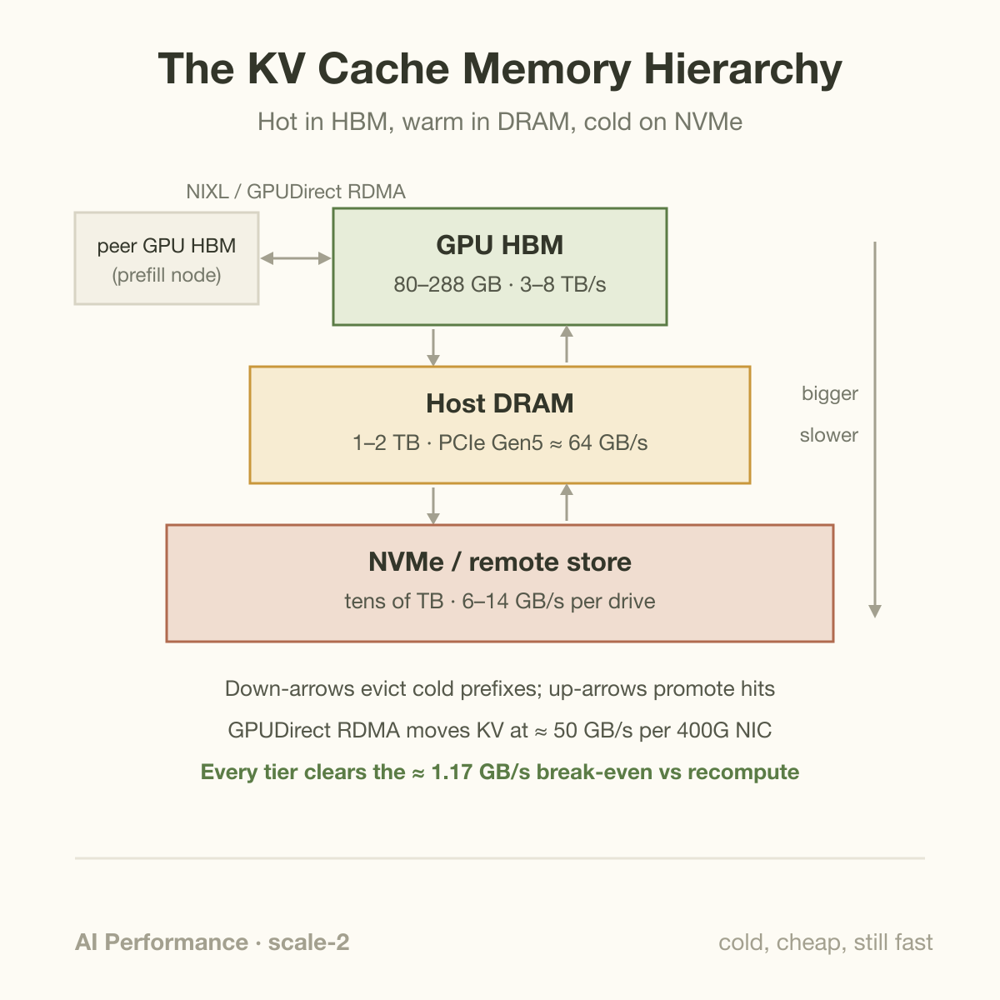
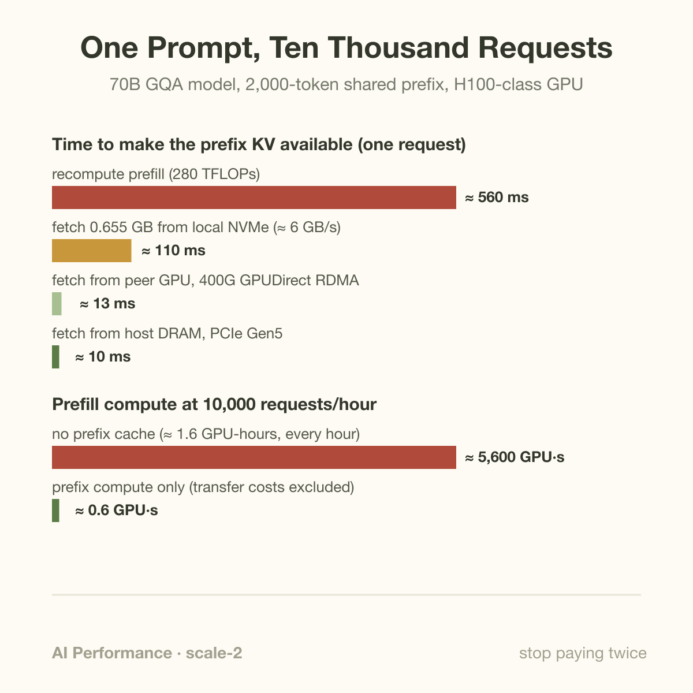
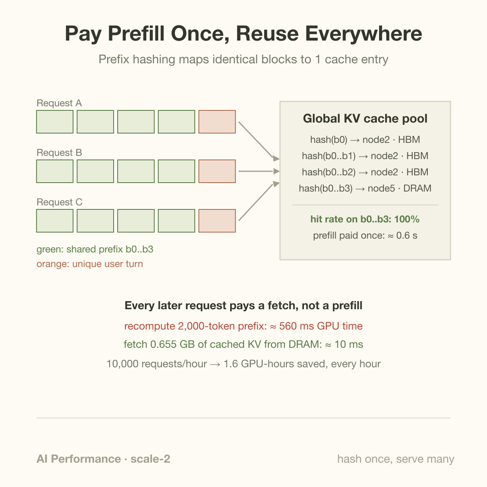

Model-specific cached-input discounts on [public provider price sheets](https://developers.openai.com/api/docs/pricing) are a commercial signal of a systems shift: the KV cache stopped being a throwaway buffer inside a serving process and became infrastructure. It now has a global namespace, a storage hierarchy, a network transfer layer, and attention kernels designed around its on-disk-style layout rather than the other way around.

If you need a refresher on what the cache actually holds and why decode cannot live without it, start with [The KV Cache, Explained for Engineers](/blog/kv-cache-explained/) and [How an LLM Generates Text](/blog/how-an-llm-generates-text/). This article is about what happened once serving systems noticed that the most expensive bytes in the datacenter were being computed, used once, and thrown away.

## From scratch buffer to storage system

Circa 2022, every serving engine treated KV state the same way: allocate a contiguous region per request, fill it during prefill, append to it during decode, free it when the request ends. vLLM's PagedAttention broke the "contiguous" part in 2023, chopping the cache into fixed-size blocks managed through a page table. That was a memory-allocator fix, but it quietly created the primitive everything since has been built on: once the engine adds reusable identities to paged KV blocks, blocks can be shared, evicted, migrated, and stored anywhere.

3 moves turned that primitive into infrastructure.

**Global pools with prefix hashing.** vLLM hashes each block of tokens together with the hash of its prefix chain, so 2 requests that begin with the same tokens map to the same cache entries. SGLang does the equivalent with RadixAttention, a radix tree over token sequences that finds the longest shared prefix at schedule time ([Zheng et al., 2023](https://arxiv.org/abs/2312.07104)). The consequence is easy to state and large in practice: prefill is paid once per unique prefix, not once per request. A system prompt, a RAG template, a few-shot preamble, yesterday's turns of a long conversation, all of it becomes a cache key.

**Tiered offload.** HBM is the scarcest resource in the building, so hot KV lives there and everything else moves down. Mooncake, the serving platform behind Moonshot's Kimi, was the loudest statement of this design: a "KVCache-centric" architecture that pools the spare DRAM and SSD of the entire cluster into 1 cache, with prefill and decode nodes checking the pool before computing anything ([Qin et al., FAST'25 best paper](https://arxiv.org/abs/2407.00079)). Moonshot's self-reported numbers: up to 525% throughput gains in long-context simulations and 115% more requests served on real workloads under latency SLOs. LMCache does the same job as a pluggable layer for vLLM, decoupling KV storage from the engine entirely ([LMCache](https://github.com/LMCache/LMCache)). The [DistServe retrospective](https://haoailab.com/blogs/distserve-retro/) puts it flatly: inference became a storage-systems problem.



**A transfer layer.** Once KV blocks live on other machines, moving them must be cheap, and for years every stack hand-rolled its own transport. NIXL, the transfer library underneath NVIDIA's Dynamo, gives 1 API across NVLink, InfiniBand and RoCE with GPUDirect RDMA, PCIe, and local SSD, and picks the fastest available path per transfer ([NIXL](https://github.com/ai-dynamo/nixl)). With GPUDirect RDMA, KV moves NIC-to-HBM without staging through host memory; a 400 Gb/s NIC sustains roughly 50 GB/s, so gigabyte-scale cache entries move in tens of milliseconds while the GPU keeps decoding other requests. This is the same plumbing that carries prefill-to-decode handoffs in disaggregated serving, which is no accident: a cache with a wire format is what made [disaggregation](/blog/the-prefill-decode-disaggregation-story/) practical at all.

## Worked example: 1 system prompt, 10 1000 requests

Numbers make the case better than architecture diagrams. Take a 70B-parameter GQA model with Llama-3.1-70B's shape: 80 layers, 8 KV heads, head dimension 128, FP16 cache. KV bytes per token:

```
2 (K and V) × 80 layers × 8 heads × 128 dims × 2 bytes = 327,680 bytes/token ≈ 0.328 MB/token
```

Your chatbot has a 2,000-token system prompt (persona, tools, policies, output format) shared by every request, and it takes 10,000 requests per hour. The prompt's KV footprint is 2,000 × 0.328 MB ≈ **0.655 GB**.

**Cost to recompute it.** Prefill FLOPs are roughly 2 × parameters × tokens = 2 × 70×10⁹ × 2,000 = 280 TFLOPs. An H100 sustains around 500 TFLOP/s of BF16 at realistic utilization, so that is **~0.56 seconds of GPU time** per request, before a single user token is processed. Tensor parallelism spreads it across GPUs but the GPU-seconds total is the same.

**Without prefix caching**, you pay it 10,000 times: 5,600 GPU-seconds every hour, which is about **1.6 GPUs running flat out doing nothing but recomputing a prefix that never changes**. Your users also each eat ~560 ms of [TTFT](/blog/ttft-and-tpot/) for it.

**With a prefix-cache hit**, you pay a memory move instead:

- from host DRAM over PCIe Gen5 x16 (~64 GB/s): 0.655 GB → **~10 ms**
- from a peer GPU over 400G GPUDirect RDMA (~50 GB/s): **~13 ms**
- from local NVMe (~6 GB/s): **~110 ms**
- from HBM on the same GPU: effectively free; the kernel just reads it

Even the cold NVMe tier beats recomputation by about 5x, and it avoids the projection FLOPs, while transfer and metadata handling still consume resources, so the compute units stay free for decode. The hot paths are roughly 40 to 55 times faster. Per hour, the fleet-level bill drops from 5,600 GPU-seconds to 1 prefill (0.56 s) plus 10,000 fetches. At 10 ms each, those fetches total about 100 transfer-seconds and 6.55 TB of traffic per hour; overlap can hide some latency but does not remove bandwidth or capacity costs. In this hypothetical example, the prefix component of TTFT shrinks; total TTFT still includes scheduling, the uncached suffix, and transfer overhead.



The general break-even rule falls out of the same arithmetic. Recompute costs ~0.28 ms per token at these rates; reload costs (bytes per token) ÷ bandwidth. For this model, any tier faster than about **1.17 GB/s** wins. That threshold is why offload tiers keep getting colder: nearly every storage technology in the datacenter clears it.



Reload-versus-recompute is a latency decision only after accounting for the state contract. For m cache bytes per prefix token, S prefix tokens, delivered tier bandwidth beta, transfer startup a, and recompute cost c seconds per token:

$$
t_{\mathrm{reload}}\approx a+\frac{mS}{\beta},\qquad
t_{\mathrm{recompute}}\approx cS,\qquad
\beta>\frac{mS}{cS-a}.
$$

The break-even exists only when cS exceeds startup a. Ignoring startup, m equal to 327680 bytes and c equal to 0.00028 seconds imply 1.17 GB/s. For 2000 tokens at 64 GB/s, payload transfer takes 10.24 milliseconds, compared with 560 milliseconds of recomputation. These are assumed delivered rates; peak link speed and realized storage throughput differ.

Reuse also requires matching weights, adapters, tokenizer, positional treatment, and prefix content. Paged allocation alone does not create content-addressed identity; the engine's hashing or radix index adds that layer. Admission and eviction should consider expected future hits against retained-byte cost. A large cold entry can displace many smaller hot prefixes, so hit count alone is an incomplete objective. Measure avoided GPU work, transfer traffic, tier occupancy, and actual first-token latency together before choosing a cache policy.

## Going deeper: kernels shaped by the cache

Decode attention is, mechanically, a read of the KV cache: every generated token scans every cached K and V for its sequence. When the cache became paged, shared, and variable-length, the kernels had to follow, and 2025's fastest decode kernels are recognizable by what they accept as arguments: page tables, not contiguous tensors.

DeepSeek's **FlashMLA** is the sharpest example. MLA (multi-head latent attention) compresses each token's KV state into a 576-dimensional latent per layer instead of full per-head K and V; for DeepSeek-V3's 61 layers that is ~70 KB per token in BF16, roughly 4.7x smaller than our 70B GQA example. FlashMLA is a decode kernel built specifically for that compressed, paged cache (64-token blocks, variable-length batches), and DeepSeek's own benchmarks report up to ~3 TB/s of memory throughput on H800, which is essentially the HBM roofline; the kernel's whole job is reading the cache at wire speed ([FlashMLA](https://github.com/deepseek-ai/FlashMLA)). Stanford's Hazy Research group then showed the remaining waste was scheduling, not arithmetic: ThunderMLA fuses the whole decode pipeline into 1 persistent "megakernel" whose internal scheduler packs ragged batches, reporting 20 to 35% gains over FlashMLA on variable-length workloads. PyTorch generalized the pattern with FlexAttention and its FlexDecoding inference path, which compile user-defined attention variants against paged KV so you get a cache-aware kernel without writing CUDA ([PyTorch blog](https://pytorch.org/blog/flexattention/)).

The direction of design authority has reversed. Kernels used to dictate memory layout and the serving layer coped; now the cache's layout is the stable interface, close to an ABI, and kernels compete on how fast they can traverse it.

## Common misconceptions

**"Prefix caching only helps when requests arrive back-to-back on the same GPU."** That was true of early implementations, where reuse meant catching a warm buffer before eviction. Pooled designs remove both constraints: Mooncake's pool spans the cluster's DRAM and SSD, so a prefix computed on 1 node hours ago serves a request landing on another node now. Popular system prompts stay warm for as long as the eviction policy keeps them, which for a 0.655 GB entry earning thousands of hits per hour depends on measured reuse and competing working sets.

**"Offloading KV to DRAM or SSD is too slow to be worth it."** Run the break-even: reload beats recompute whenever tier bandwidth exceeds bytes-per-token divided by recompute-time-per-token, about 1.17 GB/s for a 70B GQA model. PCIe DRAM clears it by about 55x, a single NVMe drive by about 5x, and the gap widens for MoE models where recompute is relatively cheap per byte only if you ignore that the FLOPs displace revenue-earning decode work. The slow-tier objection also assumes the fetch sits on the critical path; in practice engines prefetch during scheduling, before the request reaches a GPU.

**"A cache hit is free."** Provider discounts vary by model and cache policy; a cached-input discount is a price signal, not evidence that reuse consumes no resources. A hit still pays transfer bandwidth and, more importantly, the entry pays memory rent the entire time it sits in the pool: 0.655 GB of HBM held for a prefix that never gets a second hit is strictly worse than not caching. That is why real systems have admission policies, TTLs, and tier demotion rather than "cache everything," and why cache hit rate is now a first-order capacity-planning metric alongside [goodput](/blog/goodput-vs-utilization/).

## The bigger picture

Once you see the KV cache as infrastructure, several 2025-2026 storylines snap into 1 frame. Prefill/decode disaggregation is a KV pipeline: the prefill fleet is a cache producer, the decode fleet a cache consumer, and NIXL is the conveyor belt between them. [Rubin CPX](/blog/prefill-gets-its-own-chip-rubin-cpx/) hardens that boundary into silicon, and the CPX-to-Rubin KV handoff is the contract the whole rack design is built around. Meanwhile HBM capacity is staying flat at 288 GB from Blackwell Ultra to Rubin while contexts and concurrency keep growing ([the memory math](/blog/blackwell-to-rubin-memory-math/)), which makes the hierarchy not an optimization but the only way the working set fits. Even model architecture is responding: MLA, sparse attention, and Mamba hybrids are all, from this angle, attempts to shrink the bytes the cache system has to carry.

The professional consequence is worth stating plainly. "KV cache management" used to be a paragraph in a serving engine's README. It is now a storage system with hit-rate dashboards, eviction policies, replication decisions, and its own kernels, and the engineers who reason about it with storage-systems instincts, working sets, admission control, tiering economics, are the ones who find the next 2x.

## Takeaway

- The KV cache is now shared, tiered, network-attached infrastructure: prefix hashing gives it a global namespace, Mooncake/LMCache-style pools give it HBM→DRAM→NVMe tiers, and NIXL with GPUDirect RDMA gives it a fast wire format.
- The economics are stark: a 2,000-token system prompt on a 70B model costs ~0.56 GPU-seconds to recompute but ~10 ms to fetch from DRAM; at 10,000 requests/hour, caching avoids approximately 1.6 GPUs of repeated prefix work in this hypothetical workload. Any tier above ~1.17 GB/s beats recompute.
- Kernels follow the cache now, not the reverse: FlashMLA, ThunderMLA, and FlexDecoding all take paged, shared KV layouts as their input contract, and compete on reading them at HBM line rate.

## Sources

- Qin et al., "Mooncake: Trading More Storage for Less Computation — A KVCache-centric Architecture for Serving LLM Chatbot," FAST'25 best paper. https://arxiv.org/abs/2407.00079
- Zheng et al., "SGLang: Efficient Execution of Structured Language Model Programs" (RadixAttention). https://arxiv.org/abs/2312.07104
- Hao AI Lab, "DistServe: 18 Months Later" retrospective. https://haoailab.com/blogs/distserve-retro/
- DeepSeek, FlashMLA repository (self-reported H800 benchmarks). https://github.com/deepseek-ai/FlashMLA
- NVIDIA Dynamo, NIXL transfer library. https://github.com/ai-dynamo/nixl
- OpenAI API pricing (model-specific cached-input prices). https://developers.openai.com/api/docs/pricing
- Hazy Research (Stanford), "ThunderMLA" blog post, 2025 (megakernel decode scheduling).

*Part of the [LLM Inference & Serving](/series/llm-serving/) learning path. Browse its Beginner, Intermediate, and Advanced topics and planned articles.*
