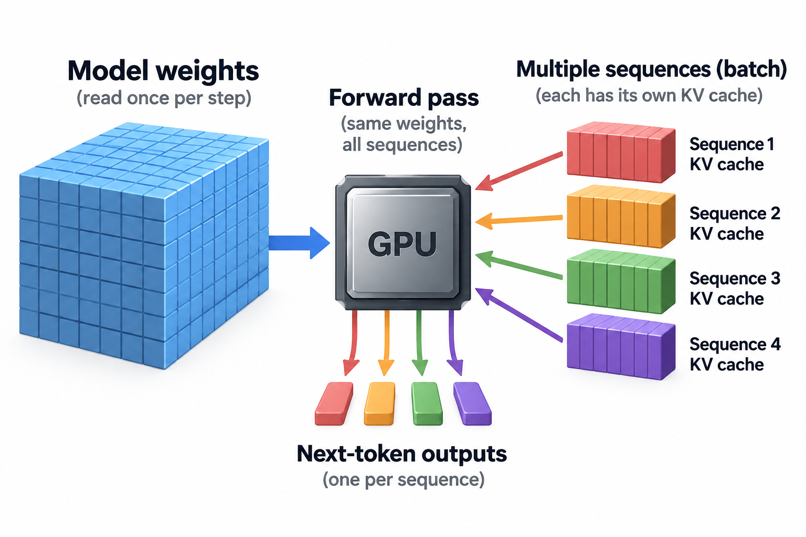
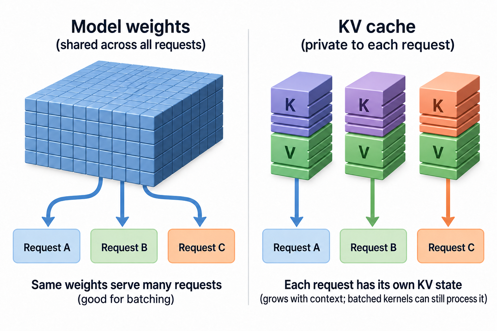

To generate a single token, a 7-billion-parameter model in 16-bit precision has to stream all 14 GB of its weights from GPU memory into the compute units. Every token, every time. On a GPU with 1,000 GB/s of memory bandwidth, that read alone takes 14 milliseconds, which caps 1 lonely request at about 71 tokens per second no matter how many teraflops the chip advertises.

That 1 fact explains most of what you observe when you use an LLM service: why some endpoints feel snappy and others feel like molasses, why providers sell discounted "batch" tiers, and why an ML performance engineer can honestly say "we made the system 5x faster" while your chat session got slightly slower. Latency and throughput are 2 different clocks, and the knob that improves 1 usually taxes the other. This article is about that knob.

## 2 clocks, not 1

First, vocabulary. When people say an LLM is "fast," they might mean 4 different things, and serving teams measure all 4.

**Time to first token (TTFT)** is how long you stare at a blank screen after hitting enter. It is dominated by the *prefill* phase: the model ingests your entire prompt in 1 large parallel pass and builds up its working memory (the KV cache — the stored keys and values that attention will reuse for every later token). Prefill is compute-heavy, because thousands of prompt tokens are processed at once.

**Time per output token (TPOT)**, also called inter-token latency, is the gap between tokens once they start streaming. It is set by the *decode* phase: the model produces tokens 1 at a time, each new token requiring another full pass through the weights. Decode is memory-heavy, for the reason in the opening paragraph — the work per token is small, but the weight traffic is enormous.

**Request latency** is TTFT plus TPOT times the number of tokens generated. It's what a user actually experiences.

**Throughput** is the system's aggregate output: total tokens generated per second across *all* users sharing the hardware. This is the provider's clock. It determines how many customers 1 very expensive GPU can serve, and therefore what 1 million tokens costs.

Here is the crux: latency is a per-user clock and throughput is a per-system clock, and on the same hardware you can trade 1 for the other over roughly an order of magnitude. The lever that moves you along that curve is batching.

## The kitchen with 1 oven

Picture a restaurant kitchen with 1 industrial oven. A tray takes 14 minutes to bake, and the oven fits 8 trays.

The latency-obsessed kitchen bakes 1 tray at a time. The first customer gets their dish in exactly 14 minutes. Wonderful. But the kitchen finishes 4 trays an hour, 7-eighths of the oven sits empty, and the restaurant loses money on every service.

The throughput-obsessed kitchen refuses to start the oven until all 8 slots are full. Once it runs, it produces 8 trays per bake — nearly 34 an hour. But the first customer of a slow evening might wait 20 minutes just for the oven to *start*, because the kitchen is holding their tray hostage until 7 more orders arrive.

The oven is the GPU's memory system. The 14-minute bake is the 14 GB weight read. The insight that makes LLM serving economics work at all is this: **the oven costs the same to run whether it holds 1 tray or 8.** When the GPU streams the weights through its compute units for a decode step, those weights can be applied to 1 request's next token or to 8 requests' next tokens for almost the same cost. The weight read is shared; only the small per-request math is duplicated.

## A worked example you can check by hand

Let's put real numbers on the kitchen. Take our 7B model (14 GB of weights in FP16) on a GPU with 1,000 GB/s of usable memory bandwidth and, say, 300 TFLOPS of 16-bit compute. Round numbers, deliberately.

**Batch size 1.** Each decode step reads 14 GB of weights:

- Memory time: 14 GB ÷ 1,000 GB/s = **14 ms per step**
- Compute per token: a forward pass costs about 2 FLOPs per parameter, so 2 × 7×10⁹ = 14 GFLOPs. At 300 TFLOPS that's **0.05 ms**.
- The step is utterly memory-bound: the compute units are idle about 99.7% of the time, waiting for weights to arrive.
- Per-user speed: 1 token / 14 ms ≈ **71 tokens/s**. System throughput: also 71 tokens/s.

**Batch size 8.** 8 requests decode in lockstep. The weights are read *once* per step and applied to all 8 sequences:

- Memory time: still ~14 ms for weights, plus reading 8 KV caches instead of 1. For modest context lengths call it **16 ms per step**.
- Compute: 8 × 14 GFLOPs = 112 GFLOPs ≈ **0.37 ms**. Still buried under the memory time.
- Per-user speed: 1 token / 16 ms ≈ **62 tokens/s**. Each user is about 14% slower.
- System throughput: 8 tokens / 16 ms = **500 tokens/s**. The system is **7x** more productive.

Read that pair of numbers again, because it is the entire economics of LLM inference: going from batch 1 to batch 8 multiplied revenue-per-GPU by 7 while costing each user 2 milliseconds per token. In the memory-bound regime, batching is very close to a free lunch. A provider serving at batch 1 would need 7 times the hardware — and would charge you accordingly.

So why not batch 64? Or 512? Because the lunch stops being free.

## Concurrency is not the same unit as token rate

For a stable service, Little's law relates time-average requests in the system $$L$$, completed request rate $$\lambda$$, and mean request residence time $$\mathbb E[T]$$:

$$
L=\lambda\mathbb E[T].
$$

Residence includes waiting and execution under the selected boundary. If the service completes 1 request per second and each spends 2 seconds inside, average concurrency is 2. If requests each deliver 5 hundred outputs, aggregate output can be 5 hundred tokens per second; substituting that token rate for request rate would incorrectly predict 1 thousand requests.

The identity does not select an optimal batch. A snapshot of occupied slots is not a time average, and a configured capacity limit is not measured concurrency. Use consistent request populations and intervals.

Compared with maximizing aggregate throughput in isolation, this accounting connects throughput to the population experiencing latency. Raising batching can reduce weight traffic per token while extending residence and consuming more history memory. The practical method is to sweep admission and batching policies at a fixed workload, plot completed rate and tail latency together, and stop where the service objective fails. A faster kernel can move this boundary; a longer queue merely stores more waiting users and can make a saturated system look busy.

## Going deeper: where the free lunch ends

Whether a step is limited by memory or by compute comes down to **arithmetic intensity**: FLOPs performed per byte fetched. Our GPU can do 300 TFLOPS against 1,000 GB/s, so it needs roughly 300 FLOPs per byte to keep its compute units fed. Batch-1 decode delivers about 1 FLOP per byte (2 FLOPs per parameter, 2 bytes per parameter). It is starved by a factor of ~300.

Batching raises arithmetic intensity almost linearly: the same bytes support batch-times more FLOPs. Follow that line and around batch ~300 (in this idealized model) compute finally catches up with memory. Past that crossover, each extra request lengthens the step in proportion, so per-user latency starts climbing steeply while throughput flattens. You've hit the roofline, and the curve bends.

In practice the bend arrives much earlier than the naive weight-only math suggests, for 2 reasons.

First, the **KV cache doesn't batch**. Weights are shared across requests, but each request's attention keys and values are private, and every decode step must read all of them. A 7B model can accumulate roughly 0.5 MB of cache per token of context; 1 request at 8,000 tokens of context drags ~4 GB along, and 32 such requests drag ~128 GB — suddenly the cache, not the weights, dominates memory traffic *and* GPU memory capacity. This is why long-context requests are disproportionately expensive and why so much serving research (PagedAttention in vLLM, grouped-query attention, cache quantization) attacks exactly this term.

Second, real traffic is ragged. Requests arrive at random times with different prompt lengths and stop at different points. Naive *static* batching — the oven that waits for 8 trays — forces short requests to sit idle until the longest 1 in the batch finishes. **Continuous batching** (introduced by the Orca system in 2022 and now standard in vLLM, TensorRT-LLM, and every serious serving stack) fixes this by rebuilding the batch at every decode step: a finished sequence exits, a queued 1 slides into its slot mid-flight. The oven never waits and never holds a finished tray. Anyscale's measurements found over 20x throughput gains versus static batching at comparable latency — the vendor's own benchmark, but the direction matches what everyone running these systems observes.

Even with continuous batching, though, the fundamental dial remains. Admit more concurrent requests and aggregate throughput climbs while each user's TTFT and TPOT drift upward; admit fewer and users get crisp responses from a mostly idle, mostly wasted GPU. Every serving team picks a point on that curve, usually stated as a service-level objective like "p95 TTFT under 500 ms and p95 TPOT under 40 ms," then tunes the scheduler to squeeze maximum throughput inside those limits.

You can see providers' chosen points from the outside. Interactive chat endpoints sit on the low-batch, latency-protected end. Batch APIs — the ones offering roughly half price for results within 24 hours — are the same hardware run at the throughput end of the curve, soaking up off-peak capacity where per-request wait is irrelevant. The discount isn't generosity. It's the curve, priced.

## Common misconceptions

**"A GPU with more TFLOPS will make my tokens stream faster."** For decode at low batch sizes, mostly no. The example above showed compute occupying under 1% of a batch-1 decode step; the other 99% is waiting on memory. Per-user token speed is governed by memory bandwidth and model size, which is why spec-sheet comparisons of inference chips lead with GB/s (and why HBM capacity and bandwidth are the axis of the current hardware race). Extra FLOPS mainly buy you faster prefill and a later roofline crossover, meaning better throughput at high batch — a real benefit, but not the one this claim imagines.

**"Batching helps the provider and hurts the user, so latency-sensitive services shouldn't batch."** The worked example says otherwise: batch 8 cost each user 2 ms per token and bought 7x system throughput. In the memory-bound regime, moderate batching is nearly invisible to users, and refusing it just means burning 7 GPUs to do 1 GPU's work — a cost that lands back on users as price. Batching only "hurts" once you push toward the compute-bound region or let queues build; the sin isn't batching, it's overbatching against your latency target.

**"The service does 10,000 tokens per second, so my request will be blazing fast."** That's the system clock, not yours. Aggregate throughput is *summed across the batch*: 10,000 tokens/s might be 200 users each receiving 50 tokens/s. Per-user decode speed rarely exceeds the batch-1 bandwidth limit and generally degrades as the operator raises concurrency. When you evaluate an endpoint, ask for TTFT and per-request TPOT at realistic load; a single "tokens/sec" number without saying whose tokens is marketing, not measurement.

## The bigger picture

Latency versus throughput is the first genuinely *systems* trade-off you meet after learning what a transformer is, and it's worth seeing how it hooks into the rest of the stack. The reason decode exists as a 1-token-at-a-time loop in the first place is the autoregressive structure we covered in [The Transformer Architecture](/blog/transformer-architecture-in-one-picture/); the reason each step must touch every weight traces back to what a forward pass through [a neural network](/blog/what-is-a-neural-network/) actually computes. The reason memory bandwidth, not compute, sets the batch-1 floor is the same memory-wall arithmetic explored in [Blackwell to Rubin memory math](/blog/blackwell-to-rubin-memory-math/). And the discipline of choosing a point on the curve, defending it with SLOs, and measuring what users actually receive rather than what the hardware nominally did is precisely the territory of [Goodput vs Utilization](/blog/goodput-vs-utilization/) — a GPU pinned at 95% utilization serving a batch so large that every request blows its deadline has splendid throughput and 0 goodput.

Once you internalize the curve, provider behavior stops looking arbitrary. Speculative decoding, quantization, multi-token prediction, disaggregated prefill: nearly every inference technique you'll read about is an attempt to move the whole curve outward — more throughput at the same latency, or less latency at the same throughput — rather than to escape it. Nothing escapes it. The trade-off is arithmetic, and arithmetic doesn't negotiate.

## Takeaway

- Latency (TTFT, TPOT) is the user's clock; throughput (aggregate tokens/s) is the provider's clock. On fixed hardware, batching trades between them — in our worked example, batch 8 bought 7x throughput for a 14% per-user slowdown.
- Small-batch decode is memory-bandwidth-bound: streaming 14 GB of weights takes ~14 ms while the math takes ~0.05 ms. Batching is nearly free until KV-cache traffic and the compute roofline end the discount.
- Judge serving systems by the operating point, not 1 number: aggregate tokens/s without per-request TTFT and TPOT under load tells you almost nothing about what users will feel.

## Sources

- Kwon et al., "Efficient Memory Management for Large Language Model Serving with PagedAttention" (vLLM), SOSP 2023 — [arxiv.org/abs/2309.06180](https://arxiv.org/abs/2309.06180)
- Yu et al., "Orca: A Distributed Serving System for Transformer-Based Generative Models," OSDI 2022 — [usenix.org/conference/osdi22/presentation/yu](https://www.usenix.org/conference/osdi22/presentation/yu)
- Pope et al., "Efficiently Scaling Transformer Inference," MLSys 2023 — [arxiv.org/abs/2211.05102](https://arxiv.org/abs/2211.05102)
- Databricks Engineering, "LLM Inference Performance Engineering: Best Practices" — [databricks.com/blog/llm-inference-performance-engineering-best-practices](https://www.databricks.com/blog/llm-inference-performance-engineering-best-practices)
- NVIDIA Technical Blog, "Mastering LLM Techniques: Inference Optimization" — [developer.nvidia.com/blog/mastering-llm-techniques-inference-optimization](https://developer.nvidia.com/blog/mastering-llm-techniques-inference-optimization/)
- Anyscale Engineering, "How Continuous Batching Enables 23x Throughput in LLM Inference" (vendor benchmark)

*Part of the [LLM Foundations & Mathematics](/series/llm-basics/) learning path. Browse its published articles by topic.*
