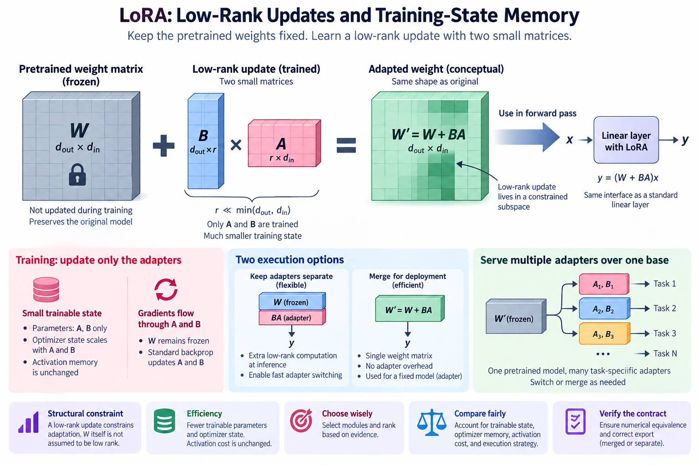
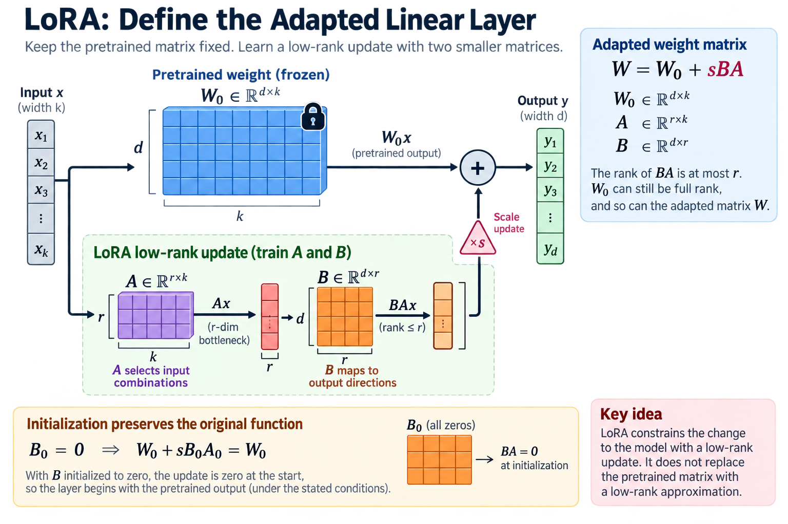
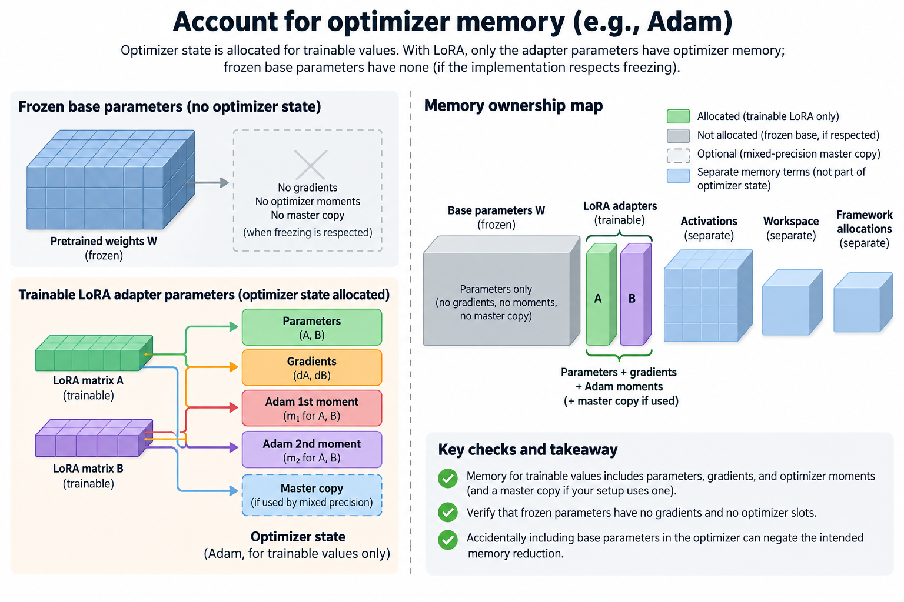
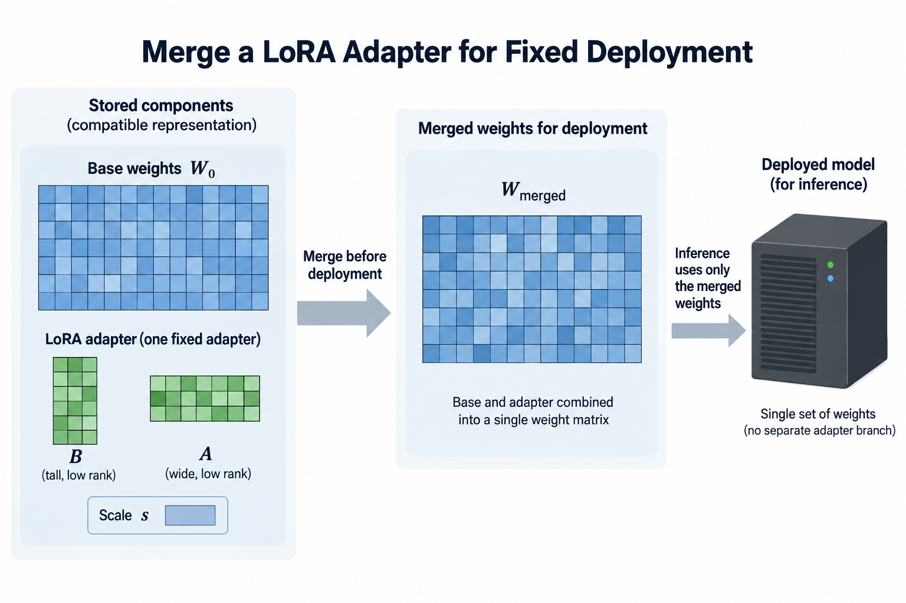
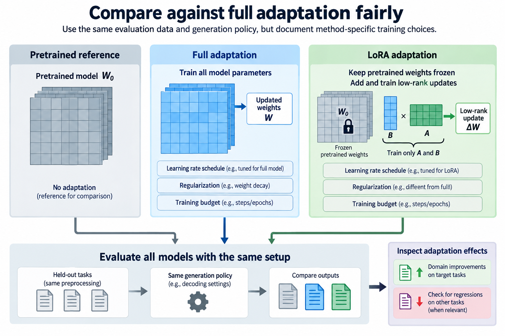
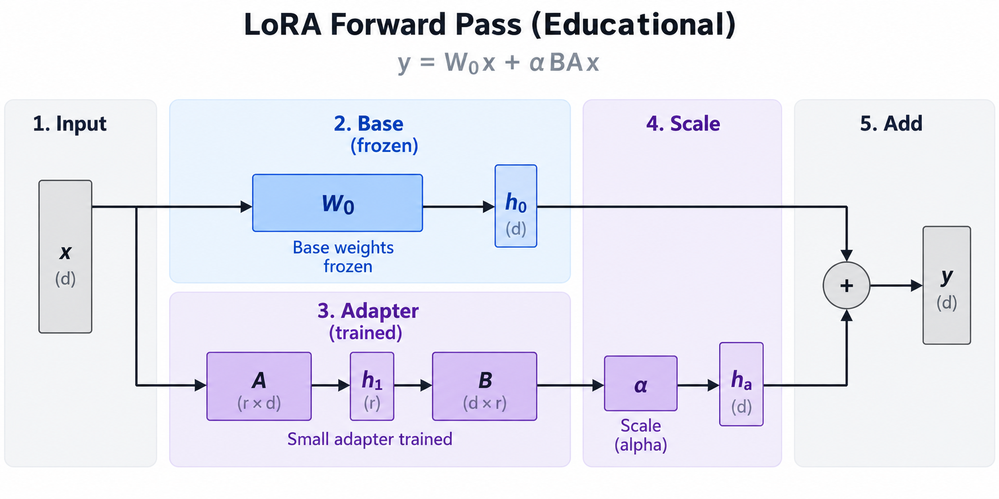

## Overview

Low-rank adaptation changes which parameters are trained. LoRA keeps a pretrained weight matrix fixed and learns an additive update represented by 2 smaller matrices. The central efficiency benefit is reduced trainable state, with an execution tradeoff that depends on whether adapters remain separate or are merged for deployment.

This article derives the matrix geometry, initialization, gradients, and memory accounting. A low-rank update is a structural constraint on adaptation, not a claim that the pretrained matrix itself has low rank. That distinction explains both the method's usefulness and the limitations of parameter-count comparisons.

*An original conceptual illustration. Numerical plots and examples are illustrative unless explicitly identified as measured evidence.*

## Deep dive

### 1. Define the adapted linear layer

Let W_0 be a pretrained matrix mapping an input of width k to an output of width d. LoRA freezes that matrix and represents the learned update with factors A and B of rank dimension r.

$$
W_0\in\mathbb R^{d\times k},\quad A\in\mathbb R^{r\times k},\quad B\in\mathbb R^{d\times r},\qquad W=W_0+sBA.
$$

The scalar s controls the update scale. The original LoRA paper uses alpha divided by r under its stated convention. Implementations and variants can change scaling, so record the actual expression.

The rank of BA is at most r. W_0 can still be full rank, and so can the adapted matrix W. LoRA constrains the change to the model rather than replacing the whole pretrained mapping with a low-rank approximation.

### 2. Count trainable parameters

Full adaptation of this matrix trains d times k values. LoRA trains r times the sum of d and k, excluding any additional trainable biases or modules under the selected recipe.

$$
N_{\mathrm{full}}=dk,\qquad N_{\mathrm{LoRA}}=r(d+k),\qquad \eta=\frac{r(d+k)}{dk}.
$$

For an illustrative square matrix with width 4,096 and rank 16, the full matrix contains 16,777,216 weights. The factors contain 131,072 values, or approximately 0.781 percent as many trainable parameters for this matrix.

That fraction does not describe complete training memory. The frozen base still occupies storage, and backward computation can require activations. Count every selected matrix and any trainable embedding, normalization, output head, or bias before reporting the whole-model trainable fraction.

### 3. Interpret low-rank update geometry

The product BA maps the input through an r-dimensional intermediate space before returning to the d-dimensional output. A selects combinations of input directions, while B maps those combinations into output directions.

This bottleneck limits the update's matrix rank. It does not require the adapted model's useful information to fit into only r dimensions globally, because the pretrained mapping remains available and several layers can receive independent adapters.

Increasing r expands the possible update space while adding state and computation. The useful rank depends on the task, chosen layers, data, and optimization. A rank selected for one checkpoint or domain should not be treated as a universal prescription for every adaptation problem.

### 4. Preserve the original function initially

The original LoRA setup initializes A randomly and B to zero. Their product is therefore zero at initialization, and the adapted layer begins with the original pretrained output under the stated conditions.

$$
B_0=0\quad\Longrightarrow\quad W_0+sB_0A_0=W_0.
$$

This is useful because adaptation starts from a known reference function. If both factors were initialized to zero, the bilinear parameterization would produce zero gradients for both under the ordinary loss derivative at that point.

Dropout, scaling, and additional trained modules can affect the complete recipe. Verify reference agreement with the actual inference and training modes rather than assuming the matrix identity establishes equality of every surrounding operation.

### 5. Derive gradients through the factors

Let G be the derivative of the task loss with respect to the effective matrix W. Matrix calculus gives the factor gradients under the chosen orientation.

$$
\frac{\partial\mathcal L}{\partial B}=sGA^\top,\qquad \frac{\partial\mathcal L}{\partial A}=sB^\top G.
$$

At initialization with B equal to zero, the gradient of A is zero while B can receive a nonzero gradient because A is random. After B changes, A can also learn. This asymmetry explains why the initialization avoids the all-zero dead point.

The formulas describe the ideal differentiable parameterization. Actual training includes optimizer state, finite precision, batching, and potentially dropout. A tiny numerical gradient check can verify shapes and scaling without establishing the quality of a complete adaptation run.

### 6. Explain parameterization nonuniqueness

For any invertible r-by-r matrix R, the factors BR and R inverse A represent the same update. The effective matrix depends on their product, not on a unique set of factor coordinates.

$$
BA=(BR)(R^{-1}A).
$$

Optimization still acts on the factors, so equivalent products need not follow identical training trajectories under different initializations and optimizer settings. Factor scale affects gradient magnitudes and conditioning.

This is one reason rank and alpha do not fully specify a LoRA recipe. Initialization, learning rates, regularization, selected modules, and precision all influence training. Compare actual configurations under consistent data and evaluation rather than interpreting factor coordinates as a unique learned explanation.

### 7. Account for optimizer memory

An optimizer such as Adam commonly maintains moment estimates for each trainable value. Some mixed-precision setups also maintain a wider-precision master parameter copy. Freezing base parameters avoids corresponding optimizer state for those parameters under an implementation that respects freezing.

$$
M_{\mathrm{trainable}}\approx N_{\mathrm{trainable}}(b_p+b_g+b_{m_1}+b_{m_2}+b_{\mathrm{master}}).
$$

Here each b denotes bytes per value for parameters, gradients, moments, and any master copy. Omit the master term only when the implementation does not allocate it. This accounting expression is configuration-dependent, not a fixed byte rule for all libraries.

The frozen base, activations, workspace, and framework allocations remain separate terms. Verify that gradients and optimizer slots are absent for frozen tensors. Accidental inclusion of base parameters in the optimizer can undermine the intended memory reduction.

### 8. Do not erase activation cost

Training A and B requires signals from layer inputs and backward propagation through the surrounding graph. Freezing W_0 does not mean the entire network can run without storing or recomputing activations.

Long sequences and large batches can make activation memory substantial even when trainable parameter state is small. Activation checkpointing trades stored activations for recomputation, with its own execution cost. LoRA and checkpointing address different memory categories and can be combined deliberately.

Measure peak allocation for the actual sequence length, batch, checkpoint policy, and precision. A trainable-parameter percentage is useful structural information but cannot establish that a training job fits. Preserve the complete memory model when comparing full adaptation and parameter-efficient alternatives.

### 9. Compute separate adapter execution

For one input vector, the adapter path computes A x followed by B times that intermediate. Its dense multiply-add count is proportional to r times k plus d.

$$
C_{\mathrm{adapter}}\approx2r(k+d),\qquad C_{\mathrm{base}}\approx2dk.
$$

These operation counts omit dispatch, memory traffic, dropout, and additions. Small matrix operations can have unfavorable execution efficiency, so the parameter ratio should not be presented as a latency ratio.

For batches or sequences, the matrix shapes change and supported fused paths can matter. Measure the actual backend with the intended adapters active. An adapter that adds little arithmetic can still introduce visible overhead in a small-batch decode workload.

### 10. Merge for a fixed deployment

When the base is stored in a compatible representation and the deployment uses one fixed adapter, the effective weight can be materialized before inference. This eliminates the separate low-rank branch in the mathematical linear layer.

$$
W_{\mathrm{merged}}=W_0+sBA.
$$

Real-number equivalence does not imply bitwise equality after finite-precision arithmetic. Compare merged and unmerged outputs under defined tolerances. Quantized bases require additional care because dequantization, addition, and requantization can change the numerical artifact.

A merge also changes operational flexibility. Switching adapters now involves selecting or rebuilding a merged checkpoint, while separate adapters can share one base. Choose the deployment arrangement from workload and support rather than assuming merging is always the best service architecture.

### 11. Serve several adapters over one base

A shared base plus separate adapter sets can reduce duplicated storage across tasks. If each adapter contains N_a values, K adapters add roughly K times their parameter bytes rather than K full copies of the base, before runtime overhead.

Serving multiple adapters introduces scheduling and kernel considerations. Requests can select different updates, and batching across adapters may require specialized execution or grouping. The resulting throughput depends on the workload's adapter distribution and backend support.

Report whether memory includes all resident adapters and whether the comparison batches compatible requests. A single-adapter benchmark does not establish the behavior of a service switching among many adapters. Shared storage and efficient mixed-adapter execution are related but separate engineering results.

### 12. Select modules and rank with evidence

Adapting attention projections, feed-forward matrices, or another subset changes the available update space. A small adapter placed in the right modules can outperform a larger but poorly chosen arrangement for a particular task.

Use a transparent baseline and vary module selection and rank under a controlled data budget. Track quality, trainable state, preparation time, and exported execution. Rank alone is not a sufficient comparison variable when the number and shapes of adapted matrices differ.

Also inspect retained trainable modules outside LoRA. Training an output head or embeddings can materially change the parameter and memory totals. State those choices alongside the factor ranks so the reported efficiency is reproducible.

### 13. Compare against full adaptation fairly

Full adaptation and LoRA optimize different parameter spaces. Their learning-rate schedules, regularization, and suitable training budgets may differ. A comparison should document these choices rather than forcing an arbitrary identical recipe and declaring one method universally superior.

Evaluate on held-out tasks with the same preprocessing and generation policy. Include the pretrained reference so that readers can identify the actual adaptation gain. Inspect whether domain improvements accompany regressions elsewhere when that matters to deployment.

No model adaptation or GPU timing was performed for this article. The numerical parameter example and compute formulas are illustrative accounting. The original paper provides experiments under its configurations; a new task needs evidence from its own checkpoint, data, and backend.

### 14. Connect LoRA to statistical constraints

Restricting updates to a low-rank product can act as an inductive constraint on adaptation. It reduces the number of free trainable values and may be useful when the available task data does not justify unconstrained changes to every base weight.

That interpretation does not guarantee improved generalization. A low rank can underfit, while several adapters across many layers can still provide substantial capacity. Regularization, data quality, and task structure remain important.

LoRA's innovation is a concrete factorized update that preserves the pretrained mapping while reducing trainable state. Its deployment benefit depends on memory accounting and merge or adapter execution. Keep those mechanisms distinct from a broad claim that every low-rank training recipe is automatically cheaper in every phase.

### 15. Verify the numerical and export contract

A small diagnostic should compare the direct effective matrix with the separate adapter branch on nontrivial inputs. Include a nonunit scale so that a missing alpha-over-r factor is visible. Verify the initial zero update and check factor gradients against finite differences in a small wider-precision example.

The exporter must preserve the selected modules, factor orientation, scale, and any trained bias. A checkpoint containing A and B without its base identity is not a self-contained description of the adapted function. Store the exact base revision and preprocessing settings with the adapter artifact.

## Conclusion

For deployment, compare merged and separate outputs under the intended numerical policy and inspect that training-only operations are disabled. Then measure the complete inference path rather than relying on the adapter's operation count. These checks connect the elegant low-rank equation to a usable artifact without confusing algebraic equivalence with implementation correctness or measured speed.

### Sources

- [LoRA: Low-Rank Adaptation of Large Language Models](https://arxiv.org/abs/2106.09685).
- [QLoRA: Efficient Finetuning of Quantized LLMs](https://arxiv.org/abs/2305.14314).
- [DoRA: Weight-Decomposed Low-Rank Adaptation](https://arxiv.org/abs/2402.09353).
