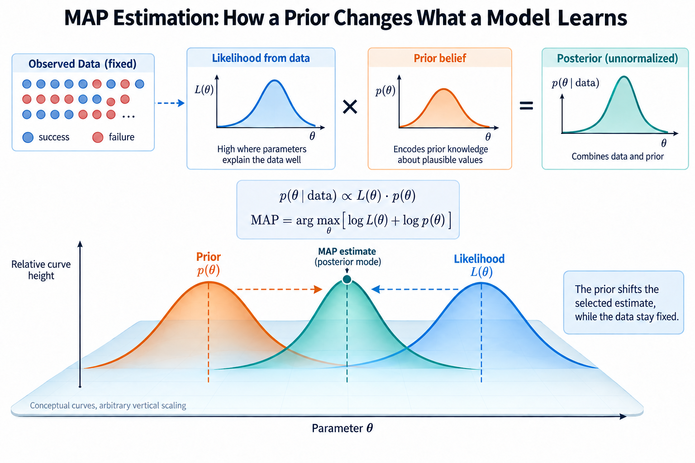
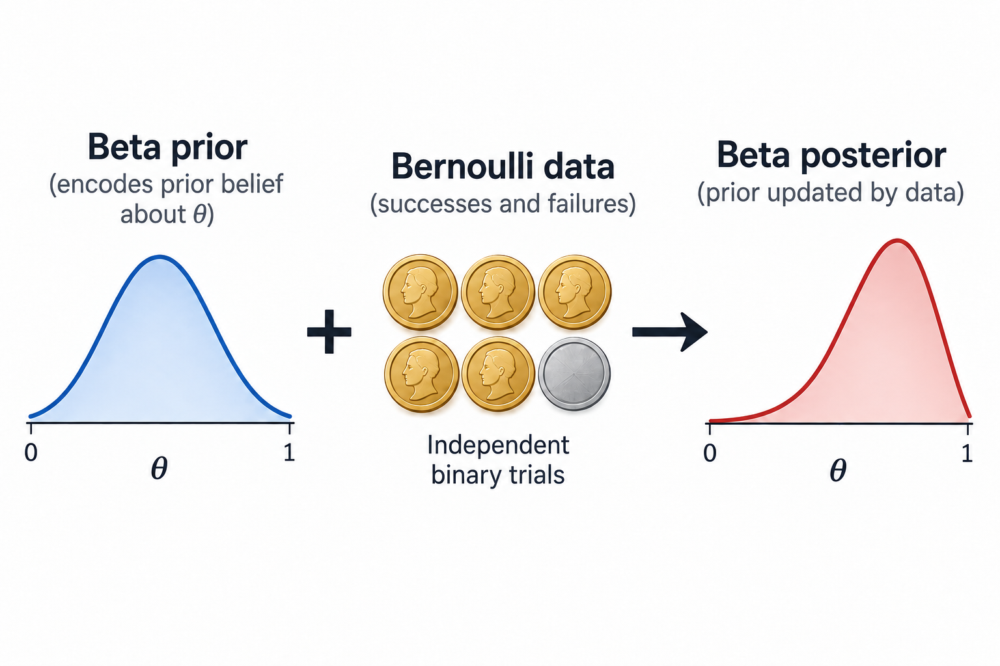
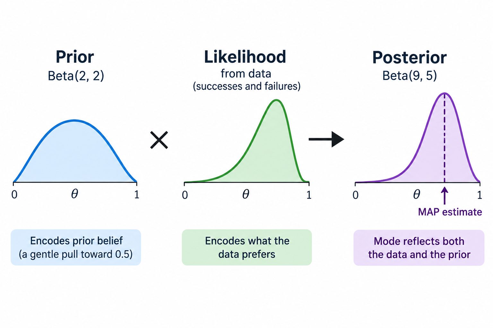

7 successes in 10 trials give a maximum likelihood estimate of 0.7. But 10 observations may be too few to justify acting as though 70% were a settled fact. What if we also have a defensible expectation that the probability should usually stay near 1 half?

Maximum a posteriori estimation, abbreviated MAP, combines the likelihood of the observations with a prior distribution over parameters. It then chooses the parameter value where the posterior density is largest. This gives a precise way to describe how assumptions influence a fitted model, and it connects probability theory directly to regularization in machine learning.

We will derive a small Beta–Bernoulli example, distinguish the posterior mode from its mean, and show exactly when a Gaussian prior becomes an L2 penalty. The aim is to understand the assumptions behind familiar training objectives, rather than treating regularization as a mysterious correction added after training goes wrong.

## Bayes' rule separates 3 ingredients



*Overview of the article’s core mechanism. The following sections explain the objects, relationships, equations, assumptions, and worked examples shown here.*


Let $$D$$ denote the recorded dataset and $$\theta$$ the parameter we want to estimate. Bayes' rule gives

$$
p(\theta\mid D)=\frac{p(D\mid\theta)p(\theta)}{p(D)}.
$$

The likelihood $$p(D\mid\theta)$$ describes the observations under a candidate parameter. The prior $$p(\theta)$$ expresses a distribution over plausible parameter values before using this dataset. The posterior $$p(\theta\mid D)$$ is the updated distribution after combining those ingredients.

The denominator, called the evidence or marginal likelihood, normalizes the posterior. It is obtained by integrating the product of likelihood and prior over the parameter space. For a fixed model and dataset, it does not depend on the candidate theta. We can therefore ignore it when locating the posterior's maximum, although we cannot ignore normalization when computing actual posterior probabilities or comparing different models through evidence.

A prior is part of the model. It can encode physical knowledge, previous measurements, constraints, or a deliberately weak default. Calling it a prior does not make it automatically trustworthy. Its suitability depends on how it was chosen and whether its assumptions match the application.

## MAP selects a mode, not an entire distribution

The MAP estimate is

$$
\hat\theta_{\mathrm{MAP}}=\operatorname*{arg\,max}_{\theta}\,p(D\mid\theta)p(\theta).
$$

Taking natural logarithms turns the product into a sum. Minimization software usually works with the equivalent objective

$$
\hat\theta_{\mathrm{MAP}}=\operatorname*{arg\,min}_{\theta}\left[-\log p(D\mid\theta)-\log p(\theta)\right].
$$

The first term rewards explaining the data. The second penalizes parameter settings the prior regards as implausible. This additive form is why MAP resembles regularized maximum likelihood.

For a continuous parameter, the estimate maximizes a density, not the probability mass of a single point. Any exact point ordinarily has 0 probability mass. A posterior mode also need not equal a posterior mean or median. These summaries answer different questions, and the appropriate decision depends on the loss associated with the action we take.


## A Beta prior for a Bernoulli probability

Return to independent binary trials with a common success probability theta. If $$k$$ of $$n$$ trials succeed, the likelihood is proportional to theta raised to k times 1 minus theta raised to n minus k.

A convenient prior for a probability is the Beta distribution. Its parameters $$\alpha$$ and $$\beta$$ are positive numbers, and its density on the interval from 0 to 1 is proportional to

$$
p(\theta)\propto\theta^{\alpha-1}(1-\theta)^{\beta-1}.
$$

A Beta(1,1) prior is uniform in this parameterization. Beta(2,2) favors interior values around 1 half while still allowing a broad range. Other choices express different assumptions. The 2 shape parameters should be justified or tested for sensitivity, not tuned to conceal inconvenient observations.

Multiplying the Beta prior by the Bernoulli likelihood adds the exponents. The posterior is therefore

$$
\theta\mid D\sim\operatorname{Beta}(\alpha+k,\beta+n-k).
$$

This is called conjugacy: the posterior stays in the same distribution family as the prior. It makes this example analytically simple. Neural-network posteriors generally have no such convenient closed form, so the example teaches the structure of Bayesian updating rather than promising an equally easy calculation for every model.




## Deriving the posterior mode

For an interior mode, differentiate the log posterior. Constants independent of theta can be omitted:

$$
\log p(\theta\mid D)=(k+\alpha-1)\log\theta+(n-k+\beta-1)\log(1-\theta)+C.
$$

Setting the derivative to 0 gives

$$
\hat\theta_{\mathrm{MAP}}=\frac{k+\alpha-1}{n+\alpha+\beta-2}.
$$

This formula applies when both posterior shape parameters exceed 1, so the density has an interior mode. Boundary cases require separate treatment. A Beta posterior can have a boundary maximum, multiple boundary modes, or a flat density; mechanically substituting into the interior formula can produce a misleading answer.

With 7 successes, 3 failures, and a Beta(2,2) prior, the posterior is Beta(9,5). Its mode is 8 divided by 12, or approximately 0.6667. The prior moves the estimate toward 1 half compared with the MLE value 0.7.

The amount of movement depends on sample size. With 70 successes out of 1 hundred trials and the same prior, MAP is 71 divided by 1 hundred 2, approximately 0.6961. The likelihood provides more information, so this fixed prior has less influence. That intuition requires reasonable model assumptions; more observations from a misspecified process do not automatically produce reliable conclusions.




## Posterior mean and predictive probability are different

For a Beta distribution with shape parameters a and b, the mean is a divided by a plus b. Our Beta(9,5) posterior has mean 9 divided by 14, approximately 0.6429. This differs from the MAP mode 0.6667.

The probability of success on the next Bernoulli trial, after integrating over parameter uncertainty, is

$$
p(y_{\mathrm{next}}=1\mid D)=\int_0^1\theta\,p(\theta\mid D)\,d\theta=\frac{\alpha+k}{\alpha+\beta+n}.
$$

It equals the posterior mean in this specific model because the success probability conditional on theta is theta itself. Plugging the MAP estimate into the Bernoulli model instead gives 0.6667. These are 2 different prediction procedures.

This distinction becomes more consequential in nonlinear models. Evaluating a prediction function at the mean parameter generally does not equal averaging that function over the posterior. A single fitted weight vector is not a substitute for an uncertainty distribution merely because its objective has a Bayesian interpretation.


## An arithmetic check and a sensitivity test

The following script reproduces the estimates and compares a weak prior with a stronger symmetric prior. It uses exact formulas rather than sampling.

```python
successes, trials = 7, 10
for alpha, beta in ((1, 1), (2, 2), (10, 10)):
    posterior_a = alpha + successes
    posterior_b = beta + trials - successes
    mode = (posterior_a - 1) / (posterior_a + posterior_b - 2)
    predictive = posterior_a / (posterior_a + posterior_b)
    print(alpha, beta, mode, predictive)
```

Beta(1,1) gives mode 0.7 and predictive probability approximately 0.6667. Beta(2,2) gives 0.6667 and 0.6429. Beta(10,10) gives mode approximately 0.5714 and predictive probability approximately 0.5667. The stronger symmetric prior pulls the fitted probability more strongly toward 1 half.

A sensitivity analysis asks whether a decision changes under plausible prior choices. If a small dataset produces very different operational conclusions under reasonable alternatives, report that dependence. Hiding it behind a single decimal estimate creates confidence the evidence does not support.

## Gaussian priors produce quadratic penalties

Now let $$w$$ be a vector of model weights with d components. Suppose the components have independent 0-mean Gaussian priors with variance $$\tau^2$$. The prior density is proportional to the exponential of negative squared weight norm divided by 2 times that variance.

Its negative log density, dropping constants independent of w, is

$$
-\log p(w)=\frac{1}{2\tau^2}\lVert w\rVert_2^2+C.
$$

The MAP objective therefore becomes summed data NLL plus a quadratic penalty. Larger weights are less plausible under this prior, and smaller prior variance makes the penalty stronger. A prior with nonzero mean penalizes distance from that mean rather than distance from 0. Correlated Gaussian components introduce a covariance-weighted quadratic form instead of a simple sum of squares.

This is a modeling interpretation of L2 regularization. It does not imply that every real training configuration exactly implements Bayesian inference. The optimizer, normalization conventions, excluded parameters, and implementation of weight decay all matter.

## Track the scale when using mean loss

If the training objective uses mean NLL, divide the entire summed MAP objective by n. The penalty coefficient then changes too:

$$
\mathcal J(w)=\frac1n\sum_i-\log p(y_i\mid x_i,w)+\frac{1}{2n\tau^2}\lVert w\rVert_2^2.
$$

If we write the penalty as lambda over 2 times the squared norm, then lambda equals 1 divided by n times tau squared. Keeping lambda fixed while changing n does not correspond to keeping the same prior variance under this convention.

For Gaussian regression with fixed observation variance $$\sigma^2$$, the summed objective is squared residuals divided by 2 times sigma squared plus squared weight norm divided by 2 times tau squared. Multiplying everything by 2 times sigma squared yields a ridge-style penalty coefficient sigma squared divided by tau squared. State the exact loss convention before interpreting a coefficient numerically.

In standard gradient descent, adding an L2 penalty contributes a gradient proportional to the weights. Decoupled weight decay in adaptive optimizers applies shrinkage separately from the gradient update and is generally not algebraically identical to adding that penalty. The shared intuition does not erase the implementation difference.

## MAP depends on parameterization

MLE transforms naturally under a 1-to-1 parameter change: the parameter representing the maximizing model distribution changes coordinates along with the estimate. Posterior density modes behave differently because densities include a Jacobian under a coordinate transformation.

A mode computed for a probability theta need not transform into the mode computed for its log-odds. Probability mass assigned to corresponding regions remains consistent, but density per unit coordinate changes. This is 1 reason to avoid presenting a MAP point as an uniquely privileged expression of uncertainty.

The practical lesson is modest: specify the parameterization and prior together. A “flat prior” in 1 coordinate system is generally not flat in another. When a scientific or operational decision depends on uncertainty, posterior intervals or predictive integration may be more informative than a mode alone.

## Avoid counting the same evidence 2 times

A prior based on previous experiments can be reasonable when those experiments are distinct from the dataset now entering the likelihood. If the same observations are used to construct a highly informative prior and then included again in the likelihood, their influence is counted 2 times. An apparently concentrated posterior can then reflect duplicated evidence rather than genuine information.

When documenting a prior, record where it came from, which observations were already used, and whether any hyperparameters were selected using the current training or validation data. Empirical Bayes methods estimate prior-related quantities from data deliberately; they need their own interpretation and uncertainty treatment rather than being described as an independently supplied prior.

## Check the Gaussian scale numerically

For mean negative log-likelihood over 1 hundred observations and a 0-mean independent Gaussian prior with variance 4, the coefficient multiplying half the squared weight norm is $$\lambda=1/(n\tau^2)=0.0025$$. At 2 hundred observations with the same prior variance, it becomes 0.00125. Holding the coefficient fixed instead strengthens the implied prior relative to this convention. This numerical check matters when comparing a summed training loss with a library's mean reduction: the same printed regularization setting can represent different assumptions. Compare held-out predictions as well as fitted weight norms, because a consistent Bayesian interpretation does not itself establish an appropriate prior.

## Common misconceptions

**“A uniform prior always makes Bayesian prediction equal to MLE.”** A uniform Beta prior gives the same interior posterior mode as Bernoulli MLE. Its posterior mean and integrated predictive probability can still differ. Posterior uncertainty also remains present.

**“The prior is fake data.”** Pseudocounts are a useful interpretation in certain conjugate models, but they are not a universal definition of priors. Gaussian covariance assumptions or structural parameter constraints are not literally extra recorded examples.

**“MAP prevents overfitting automatically.”** A prior can discourage some parameter settings, but a poorly chosen prior or a very flexible model can still generalize badly. Validate on appropriate held-out data and examine performance under deployment conditions.

## Takeaway

MAP maximizes posterior density by combining data likelihood with a prior. In a Beta–Bernoulli model, that produces an explicit shift from the observed success fraction. A Gaussian weight prior yields a quadratic penalty, provided its scale is matched to the data-loss convention.

Keep the mode, mean, and posterior predictive distribution distinct. Define priors and parameterizations explicitly, test their influence when data are scarce, and use equations to expose assumptions rather than to make a fitted point appear more certain than it is.

## Sources

- Goodfellow, Bengio, Courville, [Deep Learning, Chapter 5](https://www.deeplearningbook.org/contents/ml.html), Bayesian statistics and MAP estimation.
- Goodfellow, Bengio, Courville, [Regularization for Deep Learning](https://www.deeplearningbook.org/contents/regularization.html), parameter norm penalties.
- Loshchilov and Hutter, [Decoupled Weight Decay Regularization](https://arxiv.org/abs/1711.05101), distinction between L2 regularization and decoupled weight decay.
