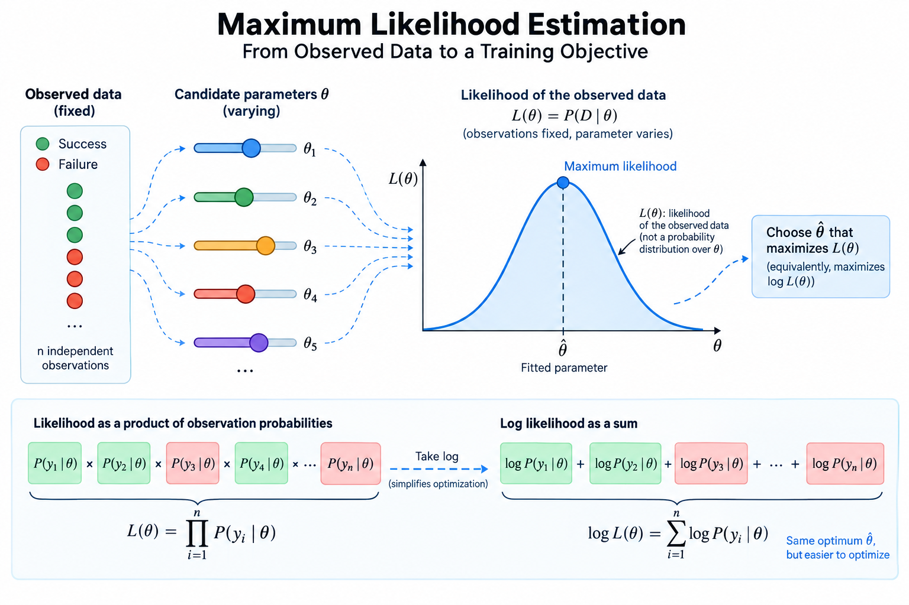
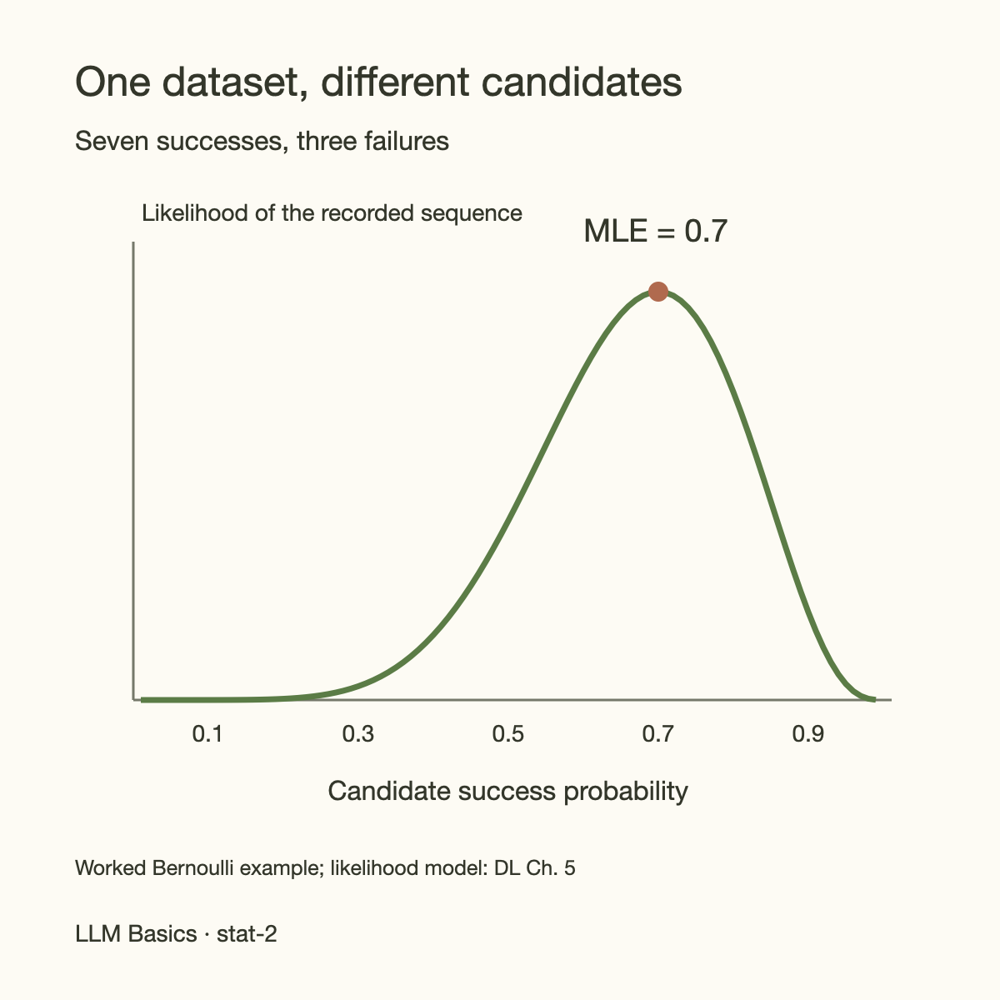
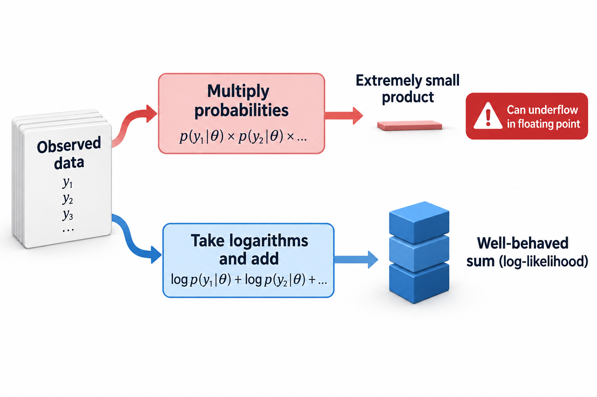
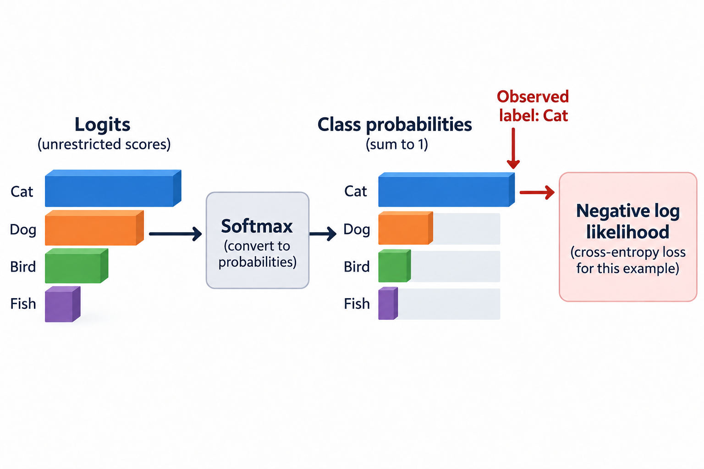
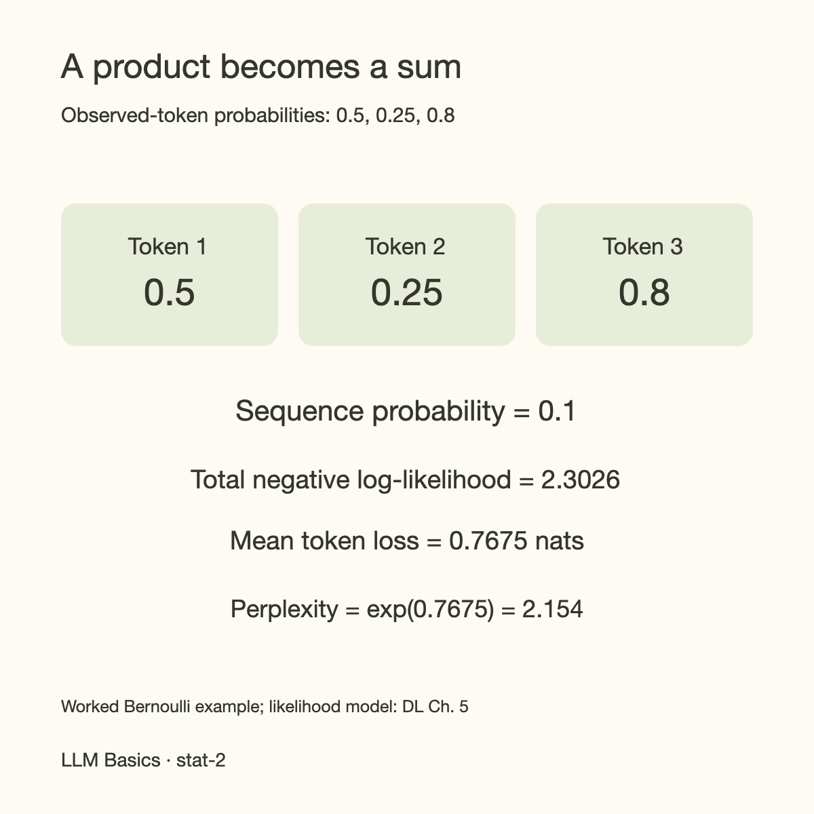

7 successes in 10 trials suggest a success probability near 70%. That familiar estimate already contains a complete machine-learning principle: choose model parameters that make the observations most plausible under a stated probabilistic model.

Maximum likelihood estimation, usually abbreviated MLE, turns this principle into a training objective. It explains why classification models use log loss, why linear regression often uses squared error, and why language models learn by increasing the probabilities of observed tokens. It also makes the assumptions behind those objectives visible. A loss function is a modeling decision, not just a number passed to an optimizer.

This article starts with a tiny Bernoulli experiment, derives the estimate by hand, and then follows the same reasoning into regression and next-token prediction. You need only basic algebra; the derivatives are explained as they appear.

## A model tells us how observations could arise



*Overview of the article’s core mechanism. The following sections explain the objects, relationships, equations, assumptions, and worked examples shown here.*


Suppose we record whether 10 requests succeed. Each outcome $$y_i$$ is either 1 for success or 0 for failure. Our model assumes an unknown, fixed success probability $$\theta$$ between 0 and 1. It further assumes that outcomes are independent and identically distributed, often written i.i.d. Independence means that knowing 1 outcome does not change the modeled probability of another. Identically distributed means the same parameter applies to all 10 trials.

For one observation, a Bernoulli model assigns probability

$$
p(y_i\mid\theta)=\theta^{y_i}(1-\theta)^{1-y_i}.
$$

When the outcome is 1, the expression becomes theta. When it is 0, it becomes 1 minus theta. The compact formula handles both cases without a separate branch.

These assumptions can fail. Requests during an outage are correlated, and success probabilities can change after a deployment. MLE can still optimize the chosen model, but a precise mathematical answer does not make an inappropriate model accurate. Always state what the parameter is supposed to summarize and which observations belong in the dataset.

## Probability and likelihood ask different questions

With theta fixed, probability asks which outcomes might occur. Likelihood fixes the observed outcomes and compares candidate parameter values. The formula can be the same while its role changes.

Let the complete dataset be $$D=(y_1,\ldots,y_n)$$. Conditional independence gives the likelihood

$$
L(\theta;D)=p(D\mid\theta)=\prod_{i=1}^{n}p(y_i\mid\theta).
$$

For 7 successes and 3 failures, this becomes theta to the seventh power times 1 minus theta to the third power. It is the probability of the particular recorded sequence under the model. If we instead modeled only the count of successes, a binomial coefficient would appear. That coefficient does not depend on theta, so both formulations produce the same maximizing estimate.

Likelihood is not a probability distribution over theta. Integrating it over parameter values does not generally give 1. To obtain a posterior distribution over parameters, we need a prior and Bayes' rule, covered in [MAP estimation](/blog/map-estimation-and-priors/). Treating likelihood as a posterior silently introduces assumptions that should be explicit.



## Why training uses logarithms

Products of many probabilities become extremely small. Even if every observation has probability 0.9, multiplying 1 million such terms can underflow ordinary floating-point arithmetic. Computing the logarithm of each probability and adding the results is much more stable.

Because the natural logarithm is strictly increasing, maximizing a positive likelihood is equivalent to maximizing its logarithm. The log-likelihood is

$$
\ell(\theta;D)=\sum_{i=1}^{n}\log p(y_i\mid\theta).
$$

This transformation preserves the maximizing parameter values. It also turns a product into a sum, which makes derivatives and minibatch computation convenient. A parameter assigning 0 probability to an observed event has log-likelihood negative infinity; implementations avoid accidental zeros through stable log-probability computations rather than pretending impossible events are harmless.

Most optimization software minimizes objectives. We therefore minimize negative log-likelihood, abbreviated NLL. Dividing by the number of examples gives mean NLL. Summed and averaged NLL have the same unregularized minimizer for a fixed dataset, although their gradients differ by a scale factor. That matters when choosing learning rates or combining the data term with regularization.




## Deriving the Bernoulli estimate

Let $$k$$ be the number of successes among $$n$$ trials. The log-likelihood is

$$
\ell(\theta)=k\log\theta+(n-k)\log(1-\theta).
$$

A derivative measures how the objective changes as theta moves. For an interior maximum, the slope is 0:

$$
\frac{d\ell}{d\theta}=\frac{k}{\theta}-\frac{n-k}{1-\theta}=0.
$$

Multiplying through by theta times 1 minus theta gives $$k(1-\theta)=(n-k)\theta$$. Expanding both sides leaves $$k=n\theta$$, so the maximum likelihood estimate is

$$
\hat\theta_{\mathrm{MLE}}=\frac{k}{n}.
$$

For 7 successes out of 10, the estimate is 0.7. The second derivative is negative when both successes and failures are observed, confirming that this stationary point is a maximum. If all trials succeed, the maximum occurs at the boundary theta equals 1; if all fail, it occurs at 0. The interior derivative calculation alone does not cover those cases.

The estimator looks obvious because the model is simple. Its value is the reasoning: specify a distribution, write the likelihood, transform to a tractable objective, and optimize within the allowed parameter domain. The same workflow remains useful when the parameter vector contains millions of weights.

## A numerical check you can reproduce

At theta equals 0.5, the likelihood of our recorded sequence is approximately 0.0009766. At 0.7 it is approximately 0.0022236. At 0.9 it falls to approximately 0.0004783. The candidate 0.7 gives the largest likelihood among those 3 values, consistent with the analytic result.

Tiny likelihood values do not mean the model is necessarily poor: any particular long sequence can have tiny probability. Comparisons should use the same observations and measure log-likelihood differences or average log loss rather than attaching meaning to a raw product in isolation.

```python
import math

successes, trials = 7, 10
for theta in (0.5, 0.7, 0.9):
    log_likelihood = (
        successes * math.log(theta)
        + (trials - successes) * math.log1p(-theta)
    )
    print(theta, math.exp(log_likelihood), -log_likelihood / trials)
```

The mean NLL is about 0.6931, 0.6109, and 0.7645 respectively. These values are measured in nats because we used natural logarithms. Base-2 logarithms would report bits and rescale the objective without changing the maximizing parameter.

## Squared error follows a noise assumption

Now suppose the observation is a real-valued measurement rather than a binary outcome. A regression model predicts $$f_\theta(x_i)$$ from input $$x_i$$. Assume that the measured target is that prediction plus independent Gaussian noise with known, fixed variance $$\sigma^2$$:

$$
y_i\mid x_i,\theta\sim\mathcal N(f_\theta(x_i),\sigma^2).
$$

Taking the negative log-likelihood gives a sum of squared residuals scaled by 1 over 2 times the variance, plus a constant that does not depend on theta:

$$
-\ell(\theta)=\frac{1}{2\sigma^2}\sum_i(y_i-f_\theta(x_i))^2+C.
$$

Minimizing this expression is equivalent to minimizing squared error when the variance is fixed. Squared error therefore has a probabilistic interpretation: it fits a Gaussian conditional model with constant noise variance. It is not universally appropriate just because regression targets are numbers.

For targets 2, 4, and 6, a constant predictor minimizes squared error at their mean, 4. Its residual sum of squares is 8. Predicting 3 gives a residual sum of 11. A model with heavy-tailed errors or varying measurement variance may call for another likelihood or weighted objective. The modeling choice determines what kinds of deviations training penalizes most strongly.

## Classification connects likelihood to cross-entropy

A classifier produces probabilities for possible labels. For an observed label, its likelihood contribution is the probability assigned to that label. The NLL contribution is the negative logarithm of that probability.

If the correct class receives probability 0.8, the loss is about 0.2231 nats. If it receives 0.1, the loss is about 2.3026. Log loss strongly penalizes confident mistakes because assigning nearly 0 probability to an event that actually occurred is a poor probabilistic explanation.

For binary classification, this becomes the familiar expression

$$
\mathcal L=-\frac1n\sum_i\left[y_i\log q_i+(1-y_i)\log(1-q_i)\right],
$$

where $$q_i$$ is the model's predicted success probability for example i. With 1-hot multiclass targets, categorical cross-entropy similarly reduces to negative log probability of the observed class. Soft labels require an expectation over the target distribution rather than selecting only 1 label.

A neural network often emits logits, which are unrestricted scores. Softmax converts those scores into class probabilities. Stable training computes log-softmax directly using the log-sum-exp identity; it avoids explicitly forming tiny probabilities and then taking their logarithms. The theory and the numerical implementation need to agree.




## Language models apply the chain rule of probability

A language model assigns a probability to a token sequence by factoring it into conditional probabilities:

$$
p_\theta(t_1,\ldots,t_T)=\prod_{j=1}^{T}p_\theta(t_j\mid t_{<j}).
$$

Here $$t_j$$ is token j and $$t_{<j}$$ denotes the preceding tokens. This factorization follows the probability chain rule. It does not assume that tokens inside a document are independent. Each conditional distribution explicitly depends on the prefix.

Training on observed sequences minimizes the sum of their next-token NLL terms. Teacher forcing supplies the actual prefix from the training document at each position. A causal attention mask prevents the model from using later target tokens while predicting earlier ones.

For a 3-token example with observed-token probabilities 0.5, 0.25, and 0.8, the sequence likelihood is 0.1. Total NLL is about 2.3026 nats and mean token NLL is about 0.7675. Exponentiating the mean gives perplexity approximately 2.154. These quantities depend on tokenization and evaluation conventions; they should not be compared across incompatible tokenizers without explanation.



## Estimation and optimization are different jobs

MLE defines which parameter setting we want under the model. Gradient descent defines 1 procedure for searching for it. [Backpropagation](/blog/how-models-learn/) computes derivatives of the chosen objective efficiently; it does not choose the probabilistic assumptions.

Our Bernoulli example has an exact solution. Neural-network objectives generally do not. Finite training time, nonconvexity, approximate arithmetic, minibatch noise, and optimizer settings can leave us with an approximate solution. Saying a model was trained with an MLE objective does not establish that a global maximum was reached.

Nor does maximizing training likelihood guarantee good future performance. A sufficiently flexible model may fit idiosyncrasies of the observed sample. Validation data, regularization, and careful evaluation address that gap. More data helps under appropriate assumptions, but no statistical procedure rescues mislabeled observations or deployment conditions outside the model's scope automatically.

## Common misconceptions

**“MLE chooses the most probable parameter.”** It chooses a parameter maximizing the probability or density of the observed data. Parameter probabilities require a prior and posterior; for continuous parameters, a point has 0 probability mass even when its density is high.

**“Negative log-likelihood measures only accuracy.”** It evaluates assigned probabilities. 2 classifiers can have identical predicted labels and different log losses because their confidence differs. Calibration and ranking are related but distinct properties.

**“Averaging the loss never changes anything.”** It preserves the unregularized minimizer on a fixed sample, but changes gradient scale and the relative strength of a separately added penalty. State whether an equation sums or averages before comparing regularization coefficients.

A useful comparison fits the same observations with a plausible alternative likelihood and evaluates held-out log loss under a consistent observation model. If residuals have strong tails or variance changes with the input, Gaussian squared error may fit the center while misrepresenting uncertainty. Modeling assumptions should be examined empirically alongside optimization convergence.

## Takeaway

MLE starts with a generative or conditional probability model, then chooses parameters making the recorded observations plausible. Logarithms give a stable, additive objective. Bernoulli models yield empirical success fractions, Gaussian regression yields squared error under fixed-variance assumptions, and categorical prediction yields log loss.

The useful habit is to ask what probability model a loss represents, which assumptions justify it, and whether those assumptions match the data you expect to see next. That prepares us to introduce priors in MAP estimation and to understand the training objectives used by modern language models.


Likelihood comparisons also depend on keeping the observation model fixed. If 2 experiments use different tokenizers, their average token losses are measured over different units. The numbers cannot be interpreted as a direct quality ranking without further normalization and a matched evaluation procedure. Even with 1 tokenizer, changing which tokens are masked changes the objective. Record the dataset, tokenizer, mask, and reduction rule next to the reported loss. These details are part of the statistical experiment, not incidental implementation settings. They allow another reader to reconstruct which observations the model was asked to explain and how their contributions were combined.

## Sources

- Goodfellow, Bengio, Courville, [Deep Learning, Chapter 5: Machine Learning Basics](https://www.deeplearningbook.org/contents/ml.html), sections on maximum likelihood and Bayesian estimation.
- Stanford CS229, [Supervised Learning notes](https://cs229.stanford.edu/notes2022fall/main_notes.pdf), probabilistic interpretations of regression and classification.
- Goodfellow, Bengio, Courville, [Probability and Information Theory](https://www.deeplearningbook.org/contents/prob.html), probability chain rule and information measures.
