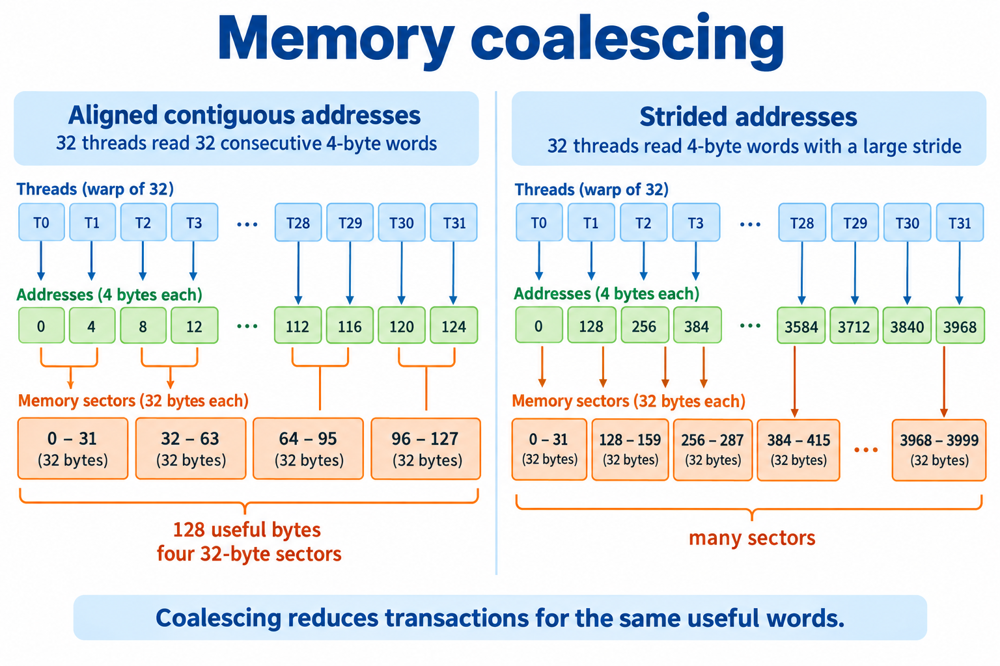
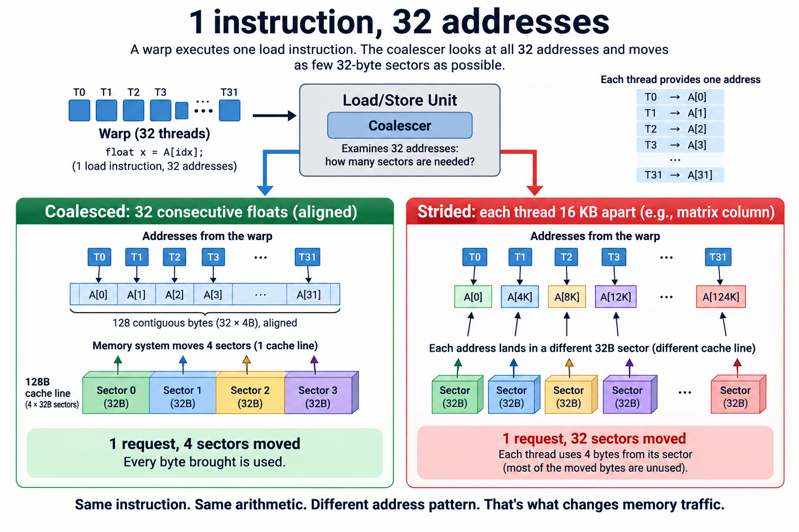
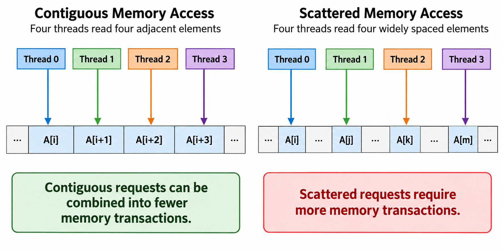
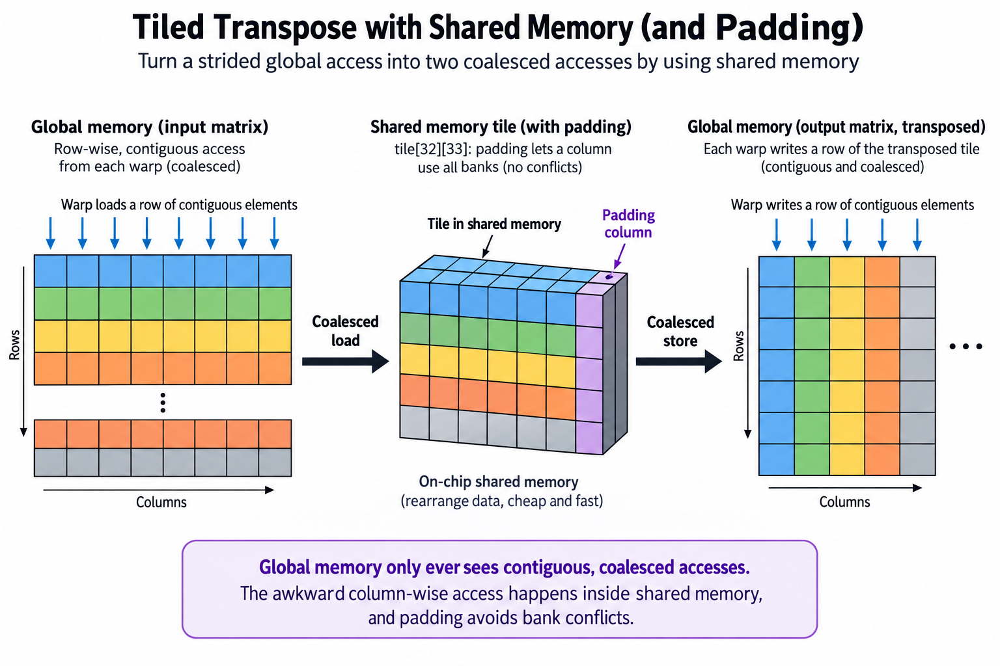

## Overview

1 load instruction can move 128 bytes or 1,024 bytes through a GPU's memory system, and both versions compute exactly the same result. The difference is which addresses the 32 threads of a warp ask for, and it is decided by something as small as the order of 2 loop indices. Get it wrong on a memory-bound kernel and you leave most of your HBM bandwidth on the table; on a matrix transpose, the naive version routinely runs several times slower than the coalesced 1 on the same silicon. This post is about that mechanism, called memory coalescing, and about how to reason through it with nothing but arithmetic.

If warps, SIMT execution, and why GPUs are throughput machines are new territory, start with [CPU vs GPU](/blog/cpu-vs-gpu-latency-vs-throughput-machines/) and come back; this article assumes that background.

## Deep dive

### 1 instruction, 32 addresses

A CUDA streaming multiprocessor does not execute threads 1 at a time. It executes *warps*: groups of 32 threads that issue the same instruction in lockstep. When a warp hits `float x = A[idx];`, the hardware sees 1 load instruction carrying 32 addresses, 1 per thread.

The memory system does not fetch individual bytes either. Global memory traffic moves in 32-byte *sectors*, and cache lines in the L1/L2 hierarchy are 128 bytes, or 4 sectors. When the warp's load reaches the load/store unit, a coalescer looks at all 32 addresses and asks: how few sectors can service this request?

The best case: 32 threads read 32 consecutive 4-byte floats, aligned to a 128-byte boundary. That is exactly 128 contiguous bytes, 4 sectors, 1 cache line. 1 request, 4 sectors moved, every byte used. Nsight Compute reports this as the `sectors/request` ratio, and 4.0 is the ideal for 4-byte accesses. This is a *coalesced* access.

The worst common case: each thread reads an address 16 KB away from its neighbor's, which is what happens when adjacent threads walk down a column of a large row-major matrix. Now each of the 32 addresses lands in a different sector on a different cache line. 1 request, 32 sectors moved, and from each 32-byte sector the warp uses 4 bytes. Nsight shows 32 sectors per request, an 8x traffic amplification, and 12.5% of the moved bytes doing useful work.

Nothing about the arithmetic changed. The instruction count didn't change. Only the *shape* of the addresses did.

### A worked example you can do on paper

Take a 4096 x 4096 matrix of fp32, stored row-major. That is 64 MiB (67.109 MB); 1 row is 4096 floats, or 16 KB.

**Row-wise read (coalesced).** Thread `t` of a warp reads `A[row * 4096 + col0 + t]`. The 32 addresses are `base, base+4, base+8, ..., base+124`: a contiguous, aligned 128-byte span.

- Cache lines touched per warp load: **1**
- Bytes moved: 128. Bytes used: 128. Efficiency: **100%**
- Reading the full matrix requests 64 MiB of useful payload; physical DRAM traffic depends on cache behavior.

**Column-wise read (strided).** Thread `t` reads `A[(row0 + t) * 4096 + col]`. Adjacent threads are now 4096 floats apart, so consecutive addresses differ by 16,384 bytes.

- Cache lines touched per warp load: **32**
- Bytes moved: 32 sectors x 32 B = 1,024. Bytes used: 128. Efficiency: **12.5%**
- Summing these warp requests gives 512 MiB of sector requests for the same 64 MiB payload, before cache reuse.

Now put bandwidth numbers on it. An H100 SXM delivers about 3.35 TB/s of HBM3 bandwidth per NVIDIA's datasheet. If every requested sector reached HBM, 64 MiB at 3.35 TB/s would require about 20.03 microseconds, versus 160.26 microseconds for 512 MiB. That conditional bound does not establish actual DRAM traffic: nearby warps can reuse cache lines. Measure cache-level sectors, physical DRAM bytes, and duration separately. The arithmetic stayed the same; requested access geometry changed.

1 more paper exercise worth doing: shift the coalesced access by a single float, so the warp reads `base+4` through `base+128`. The span now straddles a line boundary and touches 5 sectors instead of 4. That misalignment penalty is real but mild (25% extra traffic), which is why alignment is a second-order concern next to stride, the thing that can cost you 8x.

### Measure useful bytes per sector at the chosen level

For a warp loading 32 4-byte values, useful payload is 128 bytes. If the access generates $$n_s$$ 32-byte sectors at the measured interface, sector efficiency is

$$
\eta=\frac{128}{32n_s}.
$$

4 sectors give efficiency 1; 32 give 0.125. A contiguous but misaligned load spanning 5 sectors gives 0.8. These counts describe the requests at a particular cache level. They do not imply identical ratios for physical HBM bytes, because cache hits and neighboring-warps' reuse can absorb traffic.

For a simplified 32-bank shared-memory layout with 4-byte words, bank selection for row r and column c is $$\operatorname{bank}(r,c)=(rp+c)\bmod32$$, where p is row pitch in words. Pitch 32 sends a column to 1 bank; pitch 33 distributes its rows across banks. This explains why padding a transpose tile changes conflicts while preserving the mathematical result. Actual instruction widths and hardware bank rules still require checking.

Compared with the strided baseline, tiling fixes global access geometry and padding fixes local shared-memory geometry. Those are distinct interventions with occupancy and synchronization costs. Verify sectors, HBM bytes, shared-bank conflicts, and unprofiled latency independently. A reduction in requested sectors supports the mechanism; only a timed complete kernel establishes the delivered speedup.

### Going deeper: the toolbox that restores coalescing

Knowing the failure mode, the classic fixes all become 1 idea: *reshape the access so that the warp's 32 addresses are contiguous when they hit DRAM, and absorb any awkward stride somewhere cheaper.*

**Vectorized loads.** If each thread reads a `float4` (16 bytes) instead of a `float`, the compiler emits a single 128-bit `LDG.128` instruction and the warp moves 512 bytes, 4 full cache lines, per load instruction. The bytes were coalesced either way; what you save is instruction issue and address-generation overhead, which matters in kernels that are instruction-bound rather than purely bandwidth-bound. NVIDIA's developer blog measured meaningful throughput gains from exactly this change in otherwise identical copy kernels. The requirement is 16-byte alignment, which `cudaMalloc` guarantees for the base pointer; your indexing has to preserve it.

**Tiling through shared memory.** Some access patterns are strided no matter how you write them; a transpose must read rows and write columns, or vice versa. The fix is to split the awkward stride across 2 memory spaces. Each thread block copies a 32 x 32 tile from global memory into shared memory with coalesced row-wise reads, synchronizes, then writes the transposed tile back with coalesced row-wise writes to the destination. The column-wise access still happens, but *inside shared memory*, which is on-chip SRAM with no notion of DRAM sectors. Global memory only ever sees contiguous 128-byte transactions in both directions.

**Padding away bank conflicts.** Shared memory has its own granularity: 32 banks, each 4 bytes wide, and a warp achieves full speed only when its 32 accesses land in 32 different banks. A `tile[32][32]` array puts every element of a column in the same bank (32 mod 32 = 0), so reading a tile column serializes into a 32-way bank conflict, 32 round trips where 1 should do. Declare the tile as `tile[32][33]` and each row starts 1 bank later than the previous row, so a column now spans all 32 banks. 1 wasted column of padding, 128 bytes per tile, buys back a 32x serialization. This exact pair of fixes is the canonical transpose optimization in NVIDIA's shared-memory material.

**TMA: hardware takes over the copy.** On Hopper and Blackwell, the Tensor Memory Accelerator is a dedicated copy engine per SM that moves multidimensional tiles between global and shared memory from a single descriptor: base address, tensor shape, tile size. 1 thread issues the copy; the TMA hardware computes all the addresses, handles out-of-bounds edges, and streams the tile asynchronously while the warps compute on the previous one. The register and instruction cost of address arithmetic, a real tax in older pipelined-copy code, drops to nearly nothing. This is coalescing as a hardware service: the descriptor tells the engine the layout, and the engine generates optimal transactions. CUTLASS and Triton lean on it heavily for Hopper-class GEMM and attention kernels.

### Common misconceptions

**"Threads must access memory in thread order for coalescing to work."** Not since the Fermi generation. The coalescer cares about which sectors the 32 addresses cover, not which thread asked for which. Thread 0 reading the last float of a 128-byte span and thread 31 reading the first coalesces into the same single line fetch as the tidy ordering. Permutations are free; *spread* is what costs.

**"The cache will absorb an uncoalesced pattern."** Caches can absorb some requests when neighboring warps revisit sectors before eviction. A matrix exceeding L2 capacity does not prove that all local reuse disappears. Execution order, working-set locality, and cache policy determine the result. Use measured DRAM bytes rather than assigning every requested sector to DRAM.

**"Coalescing is a hand-written-CUDA concern; frameworks make it irrelevant."** Data layout decides coalescing, and layout is set at the framework level. It is why PyTorch has `.contiguous()` and channels-last memory formats, why structure-of-arrays beats array-of-structures for GPU-resident data, and why a transposed weight matrix can silently change a GEMM's performance class. The kernel author may be cuBLAS, but the tensor strides that kernel receives are yours.

### Where this sits in the bigger picture

Coalescing is the [memory wall](/blog/the-memory-wall-latency-numbers/) at its finest granularity. At the datacenter scale you buy bandwidth with [HBM stacks](/blog/from-dram-to-hbm/); at the kernel scale you can waste 87.5% of it with 1 bad subscript. Modern inference workloads are dominated by memory-bound phases, so the difference between 4 and 32 sectors per request is not an academic detail; it is the same lever that made [1 kernel change move DeepSeek's API prices](/blog/when-a-kernel-cuts-api-prices/). It is also the first thing LLM-generated kernels get wrong: much of the gap that [a year of KernelBench](/blog/a-year-of-kernelbench/) measured between generated and expert kernels comes down to models that know CUDA syntax but not sector arithmetic. When you profile, this is the metric to open first. Nsight Compute's memory workload section shows sectors per request directly, and a number far above the ideal is the cheapest large speedup you will ever find: no algorithm change, no new hardware, just addresses.

The same instinct extends upward. Tiling into shared memory is the GPU cousin of [cache blocking](/blog/caches-how-locality-rescues-speed/), and TMA is the industry admitting the pattern is so universal it deserves dedicated silicon.

### Verify the improvement at the right memory level

Measure transaction efficiency and elapsed kernel time after changing the layout. Fewer sectors per request can explain an improvement, but cache hits, instruction overhead, and occupancy can also change. A reduction in requested sectors does not imply an identical reduction in bytes reaching DRAM, because the cache may satisfy some requests. Compare cache and DRAM counters rather than treating all memory traffic as 1 quantity.

Keep array shape, dtype, and work identical between versions. For a transpose, verify every output element, including edge tiles whose dimensions are not multiples of the block size. Then measure representative problem sizes. A fix that helps a large streaming matrix may have little effect on a small matrix resident in cache. The result should establish where the layout change helps and explain that behavior with counters.

## Conclusion

- A warp's load is judged by how many 32-byte sectors its 32 addresses cover: 4 sectors per request is ideal for fp32, and a large stride pushes it to 32, an 8x traffic amplification you can compute by hand before ever profiling.
- The fixes form a ladder: contiguous indexing first, `float4` vectorization for instruction efficiency, shared-memory tiling (with width-33 padding against bank conflicts) for inherently strided patterns, and TMA descriptors on Hopper/Blackwell to hand the whole problem to hardware.
- Layout is destiny even if you never write a kernel: tensor strides chosen in Python decide whether the library kernel underneath runs at 100% or 12.5% memory efficiency.

### Sources

- NVIDIA, *CUDA C++ Best Practices Guide*, memory optimization chapters — https://docs.nvidia.com/cuda/cuda-c-best-practices-guide/
- NVIDIA, *CUDA C++ Programming Guide*, device memory accesses — https://docs.nvidia.com/cuda/cuda-c-programming-guide/
- Mark Harris, "CUDA Pro Tip: Increase Performance with Vectorized Memory Access," NVIDIA Developer Blog — https://developer.nvidia.com/blog/cuda-pro-tip-increase-performance-with-vectorized-memory-access/
- Mark Harris, "Using Shared Memory in CUDA C/C++," NVIDIA Developer Blog — https://developer.nvidia.com/blog/using-shared-memory-cuda-cc/
- NVIDIA, "NVIDIA Hopper Architecture In-Depth" (TMA introduction) — https://developer.nvidia.com/blog/nvidia-hopper-architecture-in-depth/
- NVIDIA, *Nsight Compute Documentation* (memory workload analysis, sectors/request) — https://docs.nvidia.com/nsight-compute/

*Part of the [GPU Programming & Performance](/series/gpu-performance/) learning path. Browse its published articles by topic.*
