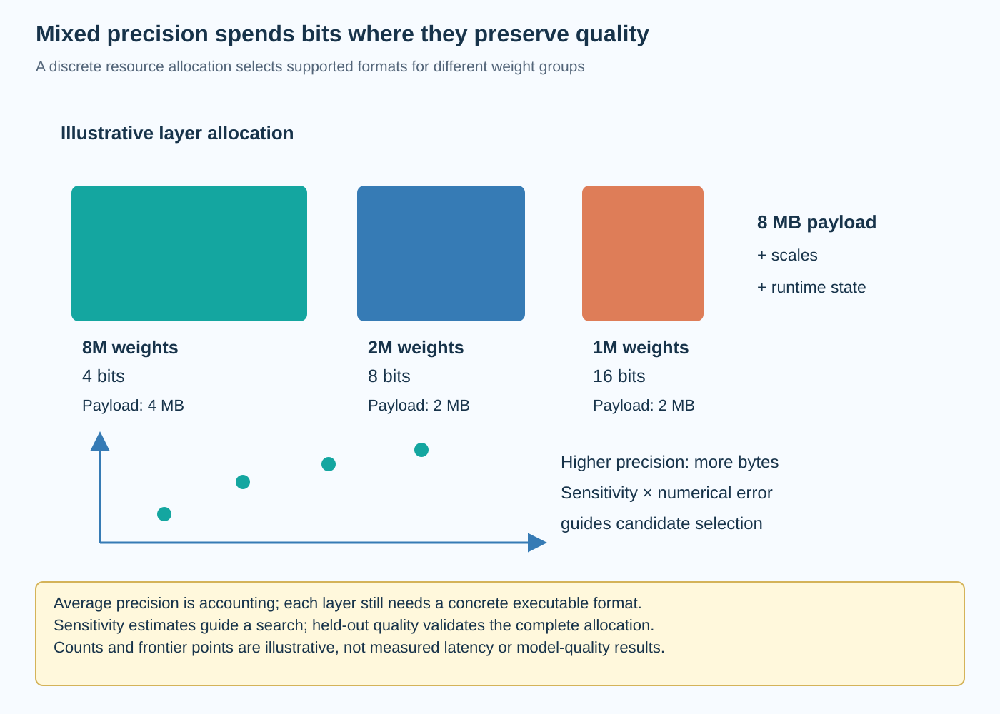

Mixed precision treats numerical representation as a resource allocation problem. Instead of assigning every layer the same number of bits, it spends precision where approximation is expensive and removes it where the model tolerates the change. The useful outcome is a deployable checkpoint that satisfies a quality requirement under an actual resource budget.

This article develops that allocation problem from layer sensitivity to memory accounting and hardware support. A low average bit width is only an intermediate result. The selected formats must still execute efficiently, preserve important behavior, and fit together in a supported graph.

*An original conceptual illustration. Numerical plots and examples are illustrative unless explicitly identified as measured evidence.*

## 1. Define the allocation variables

Consider L quantizable layers. Layer l contains n_l stored weights and receives a precision choice b_l from a supported set. For example, the set might contain 4, 8, and 16 bits, but that availability must come from the backend rather than a theoretical wish list.

$$
\mathbf b=(b_1,\ldots,b_L),\qquad b_l\in\mathcal B_l.
$$

The sets can differ by layer. An embedding, a projection, and a normalization operation need not support the same formats. Keep unsupported choices out of the search space instead of hoping an exporter will repair them afterward.

Storage precision also differs from accumulation precision. A layer can read packed weights while accumulating in a wider datatype. Record both in the configuration so that the allocation is a concrete numerical contract.

## 2. Start with complete memory accounting

Weight payload is approximately the sum of element counts multiplied by their selected bit widths. Real artifacts also contain scales, zero points, alignment padding, metadata, and any tensors retained in a wider format.

$$
M_{\mathrm{weights}}(\mathbf b)=\sum_{l=1}^{L}\frac{n_l b_l}{8}+M_{\mathrm{scales}}(\mathbf b)+M_{\mathrm{padding}}(\mathbf b).
$$

Runtime memory adds activations, cache state, temporary workspace, and framework allocations. These terms can depend on the chosen kernels as well as the workload. A payload calculation alone cannot establish that a serving process fits.

Specify whether the budget constrains serialized bytes, resident model allocation, or peak runtime allocation. All are useful, but substituting one for another produces misleading capacity claims. The relevant runtime measurement should use the intended context length and concurrency.

## 3. Define the quality constraint

Let Q denote a task-quality measure, and let Q_min be the acceptance threshold. An allocation can then minimize a resource objective while preserving acceptable behavior.

$$
\min_{\mathbf b\in\mathcal B} M(\mathbf b)\quad\text{subject to}\quad Q(\mathbf b)\ge Q_{\min}.
$$

This expression hides an expensive evaluation problem. Running a full task suite for every combination is rarely practical. Sensitivity estimates guide the search, while complete candidate evaluations decide whether the actual constraint is satisfied.

Quality can also require several conditions. Aggregate accuracy may be acceptable while long-context reasoning or a sensitive subgroup deteriorates. Express those requirements explicitly. A single scalar proxy is convenient for optimization but should not erase application-specific failures.

## 4. Derive a local sensitivity surrogate

Let delta theta be the parameter perturbation introduced by quantization. A second-order expansion of the loss gives a local model of the resulting change.

$$
\Delta\mathcal L\approx g^\top\delta\theta+\tfrac12\delta\theta^\top H\delta\theta.
$$

Here g is the loss gradient and H its Hessian at the reference parameters. Near a well-optimized point, the gradient term may be small, but that is an assumption to examine rather than a universal identity.

The quadratic term explains why identical weight errors can have different consequences. Perturbations along high-curvature directions are more costly under the local loss geometry. Hessian-aware quantization research uses this idea to allocate precision, although practical estimators and approximations vary between methods.

## 5. Understand trace-based estimates

If perturbations are modeled as approximately zero-mean with covariance Sigma, the expected quadratic contribution is one half of the trace of H Sigma. An isotropic approximation within a layer reduces this to its curvature trace multiplied by an error variance.

$$
\mathbb E[\Delta\mathcal L]\approx\tfrac12\operatorname{tr}(H\Sigma),\qquad \Sigma_l\approx\sigma_l^2 I.
$$

This motivates sensitivity scores combining numerical error with curvature. Curvature alone is insufficient: a highly sensitive layer with very small quantization error may be safer than another layer with larger error.

The assumptions are approximate. Real quantization error depends on weights, clipping, groups, and activation statistics. A trace estimate is therefore a ranking instrument, not a certificate that the final model will satisfy the quality threshold.

## 6. Measure layer perturbations directly

Another approach quantizes one layer at a time while keeping the others at reference precision. Measure held-out loss or output reconstruction to estimate the effect of each candidate format.

This is easier to interpret than an opaque importance score, but it still omits interactions. Several individually safe changes can collectively alter distributions passed to later layers. Calibration activations collected before quantization can then differ from the activations produced by the final graph.

Record the evaluation population and whether inputs come from the original or partially quantized model. Repeat selected tests under deployment-relevant conditions. Sensitivity measured on short calibration sequences should not be silently generalized to all lengths and tasks.

## 7. Formulate the discrete budget problem

Suppose e_l(b) estimates the quality cost of selecting precision b for layer l, and m_l(b) estimates its resource cost. A simplified allocation minimizes the sum of estimated errors under a memory budget.

$$
\min_{\mathbf b}\sum_l e_l(b_l)\quad\text{subject to}\quad\sum_l m_l(b_l)\le B.
$$

This resembles a multiple-choice knapsack problem: each layer contributes exactly one option. Dynamic programming, integer optimization, or a constrained heuristic can explore the tradeoff when the costs are sufficiently well modeled.

The separable objective is a surrogate. Cross-layer numerical interactions and graph execution costs can violate additivity. Keep the model useful by evaluating shortlisted allocations in the complete system rather than presenting the optimizer's score as a measured result.

## 8. Work through a small allocation

Take an illustrative model with 3 weight groups containing 8 million, 2 million, and 1 million parameters. At 8 bits each, their payload totals 11 million bytes. At 4 bits each, it totals 5.5 million bytes, before all representation overhead.

Suppose the first group tolerates 4 bits, while the second requires 8 and the third requires 16 under held-out validation. The mixed payload is 4 plus 2 plus 2 million bytes, or 8 million bytes. Its parameter-weighted average precision is approximately 5.82 bits.

That average describes payload efficiency, not an executable datatype. The checkpoint still uses 3 concrete formats. It needs compatible kernels, supported boundaries, and enough remaining memory for scales and runtime state. No quality scores or device timings are assumed in this example.

## 9. Compare marginal upgrades

A precision upgrade has a resource cost and an estimated reduction in error. Dividing the reduction by the added bytes creates a marginal benefit score that can guide a greedy search.

$$
r_l=\frac{e_l(b_{\mathrm{low}})-e_l(b_{\mathrm{high}})}{m_l(b_{\mathrm{high}})-m_l(b_{\mathrm{low}})}.
$$

This score is useful when upgrades are independent and the objective approximates the deployment requirement. It does not generally solve the discrete problem exactly. An expensive upgrade can interact with another choice, and the remaining budget may not admit the highest-ranked option.

Maintain several candidate allocations around the budget boundary. Compare them after export and full evaluation. A small surrogate advantage can disappear once packing overhead, unsupported shapes, or quality interactions are included.

## 10. Replace memory with measured latency carefully

Latency-aware allocation requires timings for supported layer configurations on the target device. The cost depends on dimensions, batch size, datatype, kernel selection, and surrounding operations.

Adding isolated layer timings can underestimate graph-level effects. Format transitions can introduce conversion, materialization, and dispatch overhead. Kernel fusion can make a pair of operations cheaper together than separately. Several allocations with identical memory can therefore have different latency.

Use measurements or a validated predictor for the search objective, then verify complete graphs. Specify whether the target is prefill throughput, decode latency, or another workload. An allocation optimized for large matrix multiplication may be unsuitable for small-batch decoding.

## 11. Treat boundaries as part of the design

Switching formats between neighboring operations can create additional work. Sometimes the conversion can be folded into a supported kernel; sometimes it requires an intermediate tensor and another launch.

Precision islands, where compatible operations share a representation, can simplify execution. This changes the allocation unit from an individual layer to a block or graph segment. The search space becomes smaller and may reflect backend behavior more accurately.

The same principle applies to residual additions and shared tensors. Branches that reconverge need compatible numerical interfaces. Verify the exported graph rather than inferring compatibility from a layer list. A mixed-precision plan is incomplete until the actual conversions and accumulators are known.

## 12. Separate selection from final evaluation

Use calibration data to estimate ranges and sensitivities, selection data to compare allocations, and held-out data to assess the chosen artifact. Repeatedly selecting on the final test population can overfit the allocation to that population.

Preserve the reference checkpoint, tokenizer, prompts, generation policy, and quality implementation. Differences in these settings can exceed the numerical effect being investigated. Run diagnostic slices as well as aggregate metrics when the application requires them.

Report the allocation explicitly, including retained high-precision components. Average bits, compressed file size, and one quality number are insufficient to reconstruct the configuration. Layer or block assignments provide the concrete evidence needed for replication.

## 13. Inspect feasibility before searching

A search can spend substantial preparation time on configurations that cannot execute. Check the backend's supported weight formats, grouping rules, shapes, and graph boundaries first. Build and run a small representative case for each admissible option.

Exclude choices that silently fall back to the reference implementation when the intended objective requires an accelerated path. Record the fallback policy because correctness and efficiency have different acceptance conditions.

Also inspect irreducible memory terms. If cache and workspace already consume most of the capacity, optimizing weight precision alone may not solve the problem. Use the full memory model to determine whether another optimization category is needed before launching an expensive allocation search.

## 14. Interpret the frontier rather than one winner

Each feasible artifact has a quality, memory, and latency operating point. A Pareto frontier contains configurations for which improving one measured objective requires sacrificing another within the tested set.

The chosen point depends on application constraints. A quality-sensitive service can spend more memory, while a capacity-limited deployment may accept a larger numerical change. The frontier should carry its dataset, hardware, workload, and uncertainty rather than appearing as a universal ranking.

Mixed precision is most informative when it connects theoretical sensitivity to concrete allocation and execution evidence. The equations explain why precision should be distributed unevenly. Only the exported artifact, held-out evaluation, and target-system measurement establish whether that distribution is useful.

## 15. Examine uncertainty in sensitivity rankings

Sensitivity estimates themselves are noisy. Changing the calibration sample can alter observed activation ranges and loss gradients, especially for rarely activated features. A trace estimate based on stochastic probes also introduces estimator variance. Two layers with nearly identical scores should therefore not be treated as reliably ordered without additional evidence.

Repeat a small number of important estimates on independent calibration subsets. Compare whether the ranking is stable and whether the selected allocations remain feasible. The purpose is to identify fragile decisions near the resource boundary, not to demand exhaustive resampling for every parameter.

A robust allocation can retain extra precision for uncertain components when the budget allows it. Alternatively, carry several candidates to full evaluation instead of trusting one precise-looking score. This connects statistical uncertainty to a practical engineering choice.

Finally, distinguish uncertainty in the quality surrogate from variability in runtime measurement. More timing repetitions will not repair a biased calibration population, and more calibration examples will not remove device scheduling noise. Report each limitation with the evidence it affects. No GPU benchmark was executed for this article; all numerical accounting examples are illustrative.

## Sources

- [HAWQ: Hessian Aware Quantization of Neural Networks](https://arxiv.org/abs/1905.03696).
- [HAWQ-V2: Hessian Aware Trace-Weighted Quantization](https://arxiv.org/abs/1911.03852).
- [HAWQ-V3: Dyadic Neural Network Quantization](https://arxiv.org/abs/2011.10680).
- [HAQ: Hardware-Aware Automated Quantization](https://arxiv.org/abs/1811.08886).
