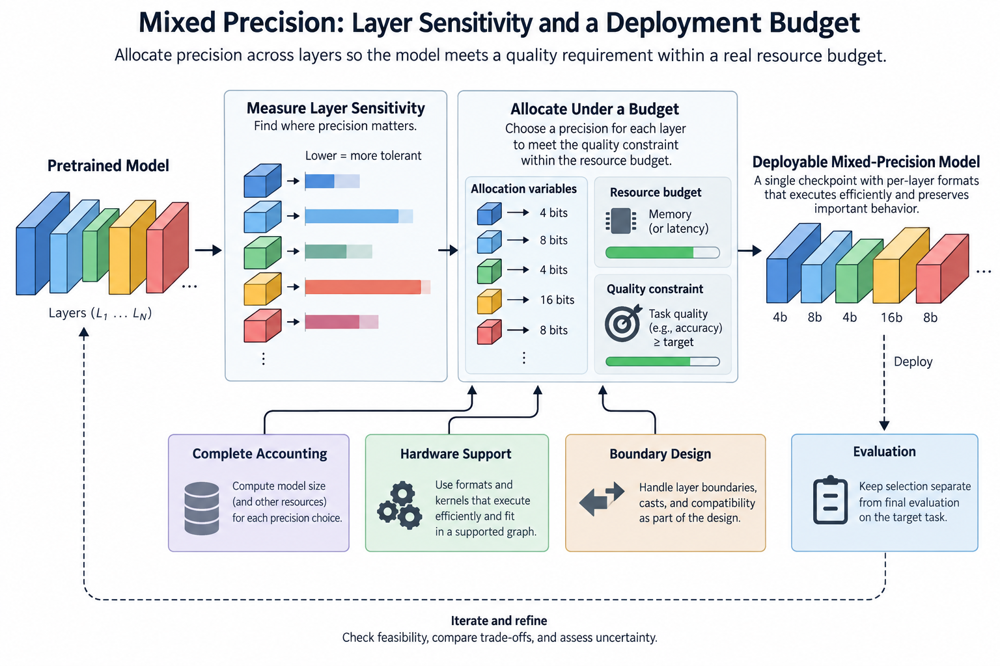
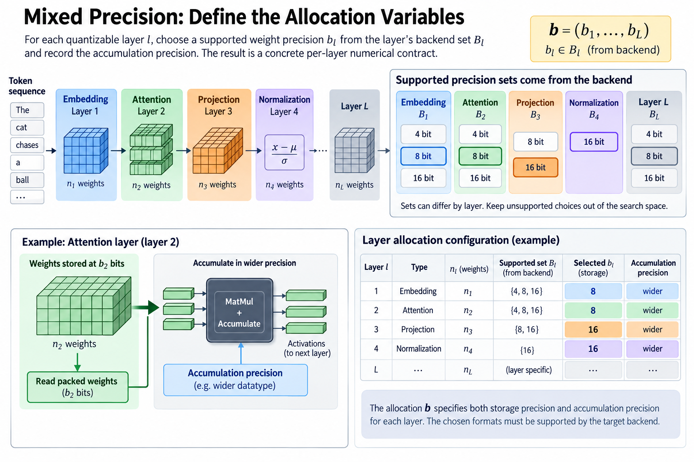
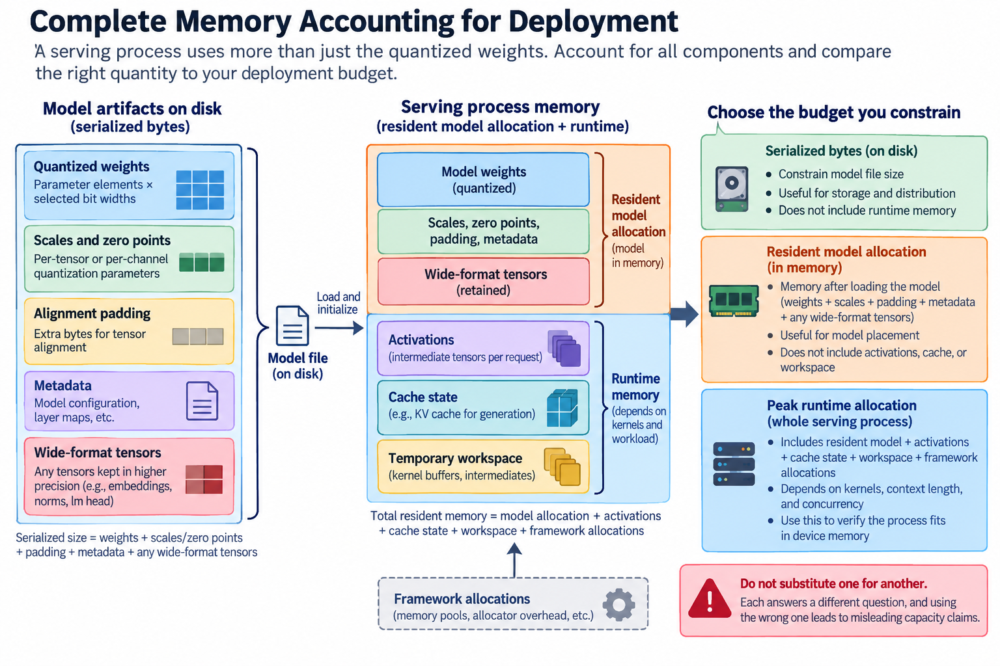
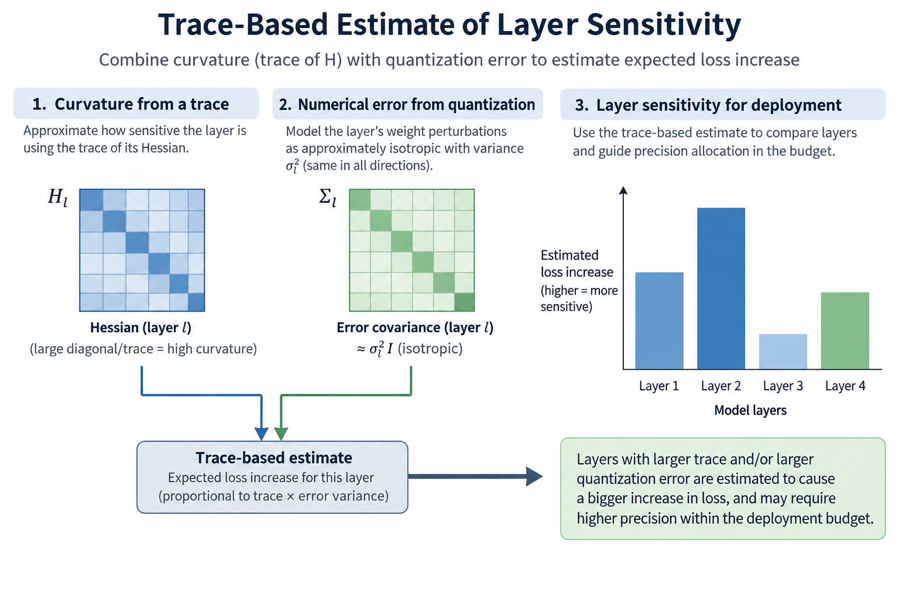
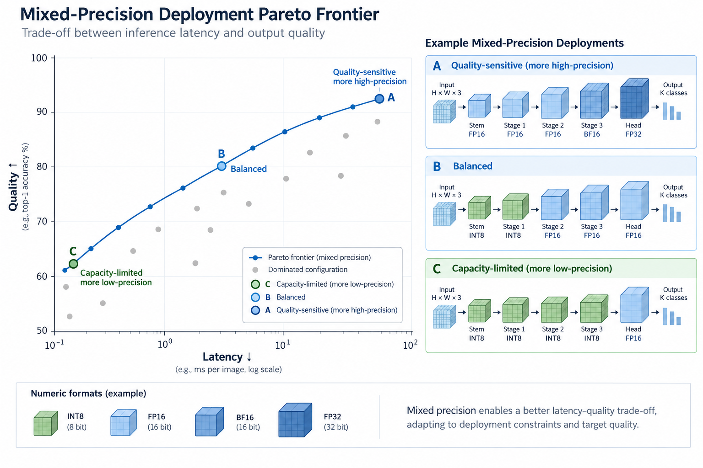
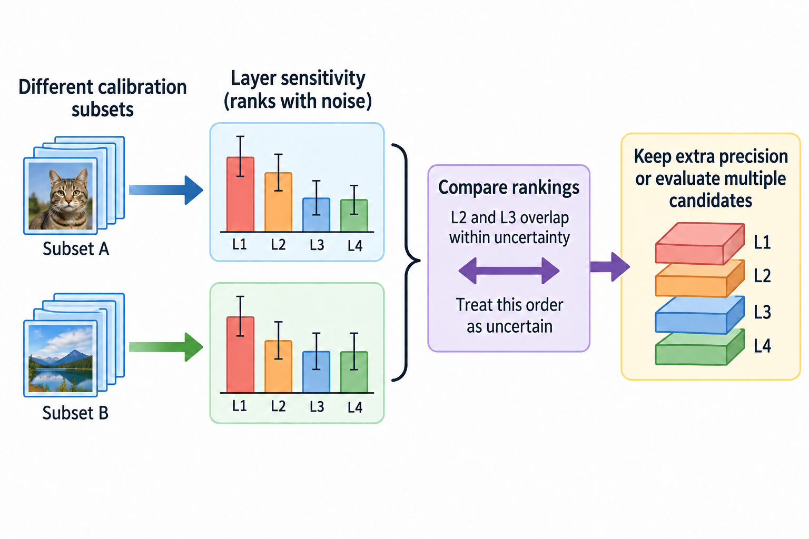

## Overview

Mixed precision treats numerical representation as a resource allocation problem, so instead of giving every layer the same number of bits it spends precision where approximation is expensive and removes it where the model tolerates the change, and the useful outcome is a deployable checkpoint that meets a quality requirement under a real resource budget.

This article builds that allocation problem up from layer sensitivity to memory accounting and hardware support, where a low average bit width is only an intermediate result, because the selected formats must still run efficiently, preserve important behavior, and fit together in a supported graph.

*An original conceptual illustration. Numerical plots and examples are illustrative unless explicitly identified as measured evidence.*

## Deep dive

### 1. Define the allocation variables

Consider L quantizable layers. Layer l holds n_l stored weights and gets a precision choice b_l from a supported set. The set might contain 4, 8, and 16 bits, but that availability must come from the backend, not a theoretical wish list.

$$
\mathbf b=(b_1,\ldots,b_L),\qquad b_l\in\mathcal B_l.
$$

The sets can differ by layer, since an embedding, a projection, and a normalization operation are 3 cases that need not support the same formats, so keep unsupported choices out of the search space instead of hoping an exporter will repair them later.

Storage precision also differs from accumulation precision. A layer can read 4-bit packed weights while accumulating in a wider datatype. Record both in the configuration, so the allocation is a concrete numerical contract.

### 2. Start with complete memory accounting

Weight payload is roughly the sum of element counts times their selected bit widths, divided by 8 to give bytes. Real artifacts also carry scales, zero points, alignment padding, metadata, and any tensors kept in a wider format.

$$
M_{\mathrm{weights}}(\mathbf b)=\sum_{l=1}^{L}\frac{n_l b_l}{8}+M_{\mathrm{scales}}(\mathbf b)+M_{\mathrm{padding}}(\mathbf b).
$$

Runtime memory adds 4 terms: activations, cache state, temporary workspace, and framework allocations. These terms can depend on the chosen kernels as well as the workload. A payload calculation alone cannot prove that a serving process fits.

Say which of 3 things the budget constrains, serialized bytes, resident model allocation, or peak runtime allocation, because all are useful but swapping one for another produces misleading capacity claims, and the runtime measurement that matters uses the intended context length and concurrency.

### 3. Define the quality constraint

Let Q be a task-quality measure and Q_min the acceptance threshold. An allocation can then minimize a resource objective while keeping acceptable behavior.

$$
\min_{\mathbf b\in\mathcal B} M(\mathbf b)\quad\text{subject to}\quad Q(\mathbf b)\ge Q_{\min}.
$$

This expression hides an expensive evaluation problem. Running a full task suite for every combination is rarely practical. Sensitivity estimates guide the search; complete candidate evaluations decide whether the actual constraint holds.

Quality can also mean several conditions at once. Aggregate accuracy can pass while long-context reasoning or a sensitive subgroup degrades. Write those requirements down. A single scalar proxy is convenient for optimization but should not erase application-specific failures.

### 4. Derive a local sensitivity surrogate

Let delta theta be the parameter perturbation quantization introduces. A second-order expansion of the loss gives a local model of the resulting change.

$$
\Delta\mathcal L\approx g^\top\delta\theta+\tfrac12\delta\theta^\top H\delta\theta.
$$

Here g is the loss gradient and H its Hessian at the reference parameters. Near a well-optimized point the gradient term may be small, but check that assumption; it is not a universal identity.

The quadratic term explains why identical weight errors can have different consequences, since perturbations along high-curvature directions cost more under the local loss geometry, and Hessian-aware quantization research uses that idea to allocate precision, though the practical estimators and approximations vary between methods.

### 5. Understand trace-based estimates

Model the perturbations as roughly zero-mean with covariance Sigma, and the expected quadratic contribution is one half of the trace of H Sigma. An isotropic approximation within a layer reduces this to its curvature trace times an error variance.

$$
\mathbb E[\Delta\mathcal L]\approx\tfrac12\operatorname{tr}(H\Sigma),\qquad \Sigma_l\approx\sigma_l^2 I.
$$

This motivates sensitivity scores that combine numerical error with Hessian curvature. Curvature alone is not enough: a highly sensitive layer with very small quantization error may be safer than another layer with larger error.

The assumptions are approximate. Real quantization error depends on 4 things: weights, clipping, groups, and activation statistics. A trace estimate is a ranking instrument, not a certificate that the final model will meet the quality threshold.

### 6. Measure layer perturbations directly

Another approach quantizes one layer at a time and keeps the others at reference precision. Measure held-out loss or output reconstruction to estimate the effect of each candidate format.

This is easier to interpret than an opaque importance score, but it still misses interactions, because several individually safe changes can together shift the distributions passed to later layers, and calibration activations collected before quantization can then differ from what the final graph actually produces.

Record the evaluation population and whether inputs come from the original or partially quantized model. Repeat selected tests under deployment-relevant conditions. Do not silently generalize sensitivity measured on short calibration sequences to all lengths and tasks.

### 7. Formulate the discrete budget problem

Suppose e_l(b) estimates the quality cost of giving layer l precision b, and m_l(b) estimates its resource cost. A simplified allocation minimizes the sum of estimated errors under a memory budget.

$$
\min_{\mathbf b}\sum_l e_l(b_l)\quad\text{subject to}\quad\sum_l m_l(b_l)\le B.
$$

This is close to a multiple-choice knapsack problem: each layer contributes exactly one option. Any of 3 methods can explore the tradeoff when the costs are modeled well enough: dynamic programming, integer optimization, or a constrained heuristic.

The separable objective is a stand-in, because cross-layer numerical interactions and graph execution costs can break additivity, so keep the model honest by evaluating shortlisted allocations in the complete system rather than by presenting the optimizer's score as a measured result.

### 8. Work through a small allocation

Take an illustrative model with 3 weight groups containing 8 million, 2 million, and 1 million parameters. At 8 bits each, their payload totals 11 million bytes. At 4 bits each, it totals 5.5 million bytes, before all representation overhead.

Suppose the first group tolerates 4 bits, while the second needs 8 and the third needs 16 under held-out validation. The mixed payload is 4 plus 2 plus 2 million bytes, or 8 million bytes. Its parameter-weighted average precision is approximately 5.82 bits.

That average describes payload efficiency rather than an executable datatype: the checkpoint still uses 3 concrete formats, and it needs compatible kernels, supported boundaries, and enough remaining memory for scales and runtime state. No quality scores or device timings are assumed in this example.

### 9. Compare marginal upgrades

A precision upgrade has a resource cost and an estimated error reduction. Divide the reduction by the added bytes and you get a marginal benefit score that can guide a greedy search.

$$
r_l=\frac{e_l(b_{\mathrm{low}})-e_l(b_{\mathrm{high}})}{m_l(b_{\mathrm{high}})-m_l(b_{\mathrm{low}})}.
$$

The score works when upgrades are independent and the objective tracks the deployment requirement, but it does not solve the discrete problem exactly, because an expensive upgrade can interact with another choice and the remaining budget may not fit the highest-ranked option.

Keep several candidate allocations near the budget boundary. Compare them after export and full evaluation. A small surrogate advantage can vanish once any of 3 things enter: packing overhead, unsupported shapes, or quality interactions.

### 10. Replace memory with measured latency carefully

Latency-aware allocation needs timings for supported layer configurations on the target device. The cost depends on 5 things: dimensions, batch size, datatype, kernel selection, and surrounding operations.

Adding up isolated layer timings can underestimate graph-level effects, because format transitions can add 3 kinds of overhead, conversion, materialization, and dispatch, while kernel fusion can make a pair of operations cheaper together than apart, so two allocations with identical memory can end up with different latency.

Use measurements or a validated predictor for the search objective, then verify complete graphs, and say whether the target is prefill throughput, decode latency, or another workload, because an allocation tuned for large matrix multiplication may be a poor fit for small-batch decoding.

### 11. Treat boundaries as part of the design

Switching formats between neighboring operations can create extra work, and 1 of 2 things happens: the conversion folds into a supported kernel, or it needs an intermediate tensor and another launch.

Precision islands, where compatible operations share a representation, can simplify execution, and they change the allocation unit from a single layer to a block or graph segment, so the search space shrinks and may match backend behavior better.

The same principle applies to residual additions and shared tensors. Branches that reconverge need compatible numerical interfaces. Verify the exported graph; do not infer compatibility from a layer list. A mixed-precision plan is incomplete until the actual conversions and accumulators are known.

### 12. Separate selection from final evaluation

Use 3 data splits: calibration data to estimate ranges and sensitivities, selection data to compare allocations, and held-out data to judge the chosen artifact. Select on the final test population often enough and the allocation overfits to it.

Keep 5 things fixed: the reference checkpoint, the tokenizer, the prompts, the generation policy, and the quality implementation. Differences in these settings can exceed the numerical effect under study. Run diagnostic slices as well as aggregate metrics when the application needs them.

Report the allocation explicitly, including the components kept at high precision. Average bits, compressed file size, and one quality number are not enough to reconstruct the configuration. Layer or block assignments are the concrete evidence replication needs.

### 13. Inspect feasibility before searching

A search can burn a lot of preparation time on configurations that cannot execute, so check 4 things about the backend first, its supported weight formats, grouping rules, shapes, and graph boundaries, and then build and run a small representative case for each admissible option.

Drop choices that silently fall back to the reference implementation when the objective requires an accelerated path. Record the fallback policy, because correctness and efficiency have different acceptance conditions.

Also inspect the irreducible memory terms, because if cache and workspace already consume most of the capacity then tuning weight precision alone may not solve the problem, so use the full memory model to decide whether another optimization category is needed before launching an expensive allocation search.

### 14. Interpret the frontier rather than one winner

Each feasible artifact has a quality, memory, and latency operating point. A Pareto frontier holds the configurations where improving one measured objective costs another, within the tested set.

Which point to pick depends on application constraints. A quality-sensitive service can spend more memory. A capacity-limited deployment may accept a larger numerical change. The Pareto frontier should carry its dataset, hardware, workload, and uncertainty, not pose as a universal ranking.

Mixed precision is most informative when it connects theoretical sensitivity to concrete allocation and execution evidence, since the equations explain why precision should be spread unevenly while only the exported artifact, held-out evaluation, and target-system measurement show whether that distribution is useful.

### 15. Examine uncertainty in sensitivity rankings

Sensitivity estimates are themselves noisy: changing the calibration sample can shift observed activation ranges and loss gradients, especially for rarely activated features, and a Hessian trace estimate based on stochastic probes adds estimator variance. Two layers with nearly identical scores are not reliably ordered without more evidence.

Repeat a small number of important estimates on independent calibration subsets, then check whether the ranking stays stable and whether the selected allocations stay feasible, because the goal is to find fragile decisions near the resource boundary rather than to resample every parameter exhaustively.

A robust allocation can keep extra precision for uncertain components when the budget allows. Or carry several candidates to full evaluation instead of trusting one precise-looking score. This turns statistical uncertainty into a practical engineering choice.

## Conclusion

Finally, keep uncertainty in the quality surrogate separate from variability in runtime measurement, because more timing repetitions will not repair a biased calibration population and more calibration examples will not remove device scheduling noise, so report each limitation with the evidence it affects. No GPU benchmark was executed for this article; all numerical accounting examples are illustrative.

### Sources

- [HAWQ: Hessian Aware Quantization of Neural Networks](https://arxiv.org/abs/1905.03696).
- [HAWQ-V2: Hessian Aware Trace-Weighted Quantization](https://arxiv.org/abs/1911.03852).
- [HAWQ-V3: Dyadic Neural Network Quantization](https://arxiv.org/abs/2011.10680).
- [HAQ: Hardware-Aware Automated Quantization](https://arxiv.org/abs/1811.08886).
