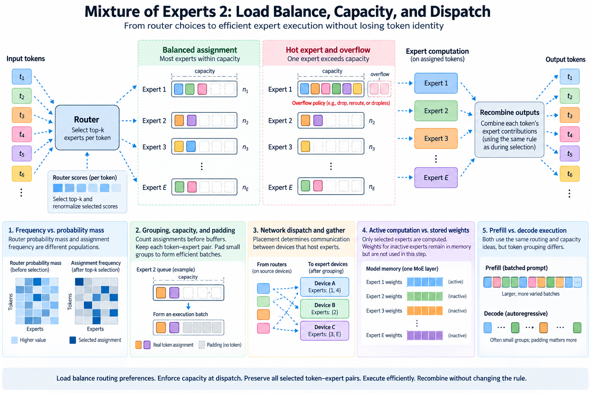
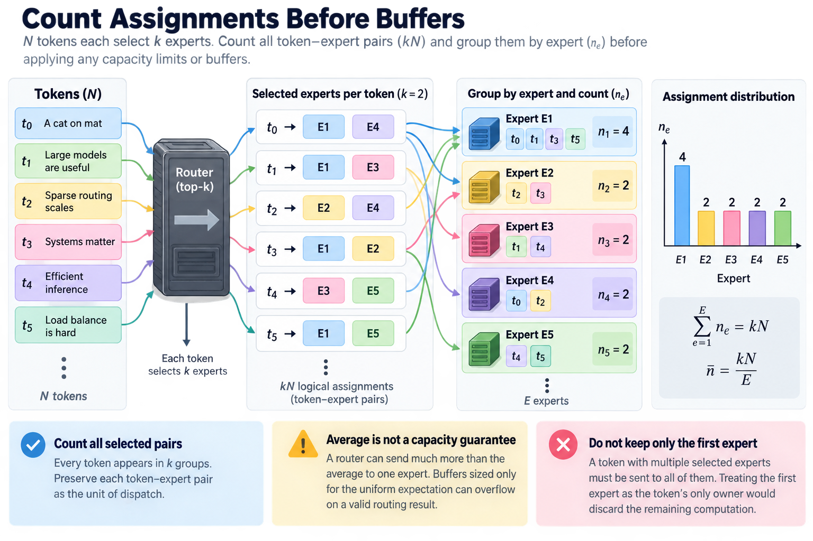
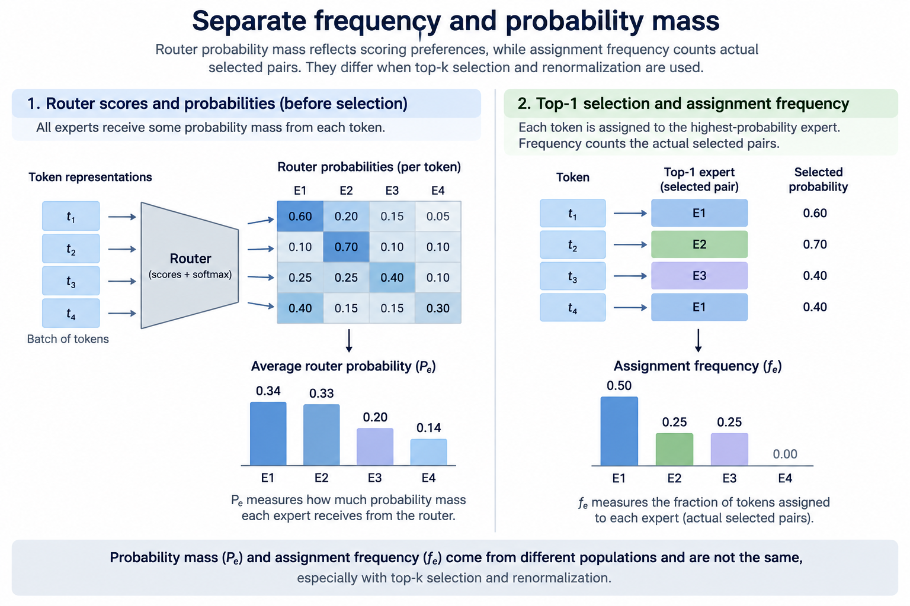
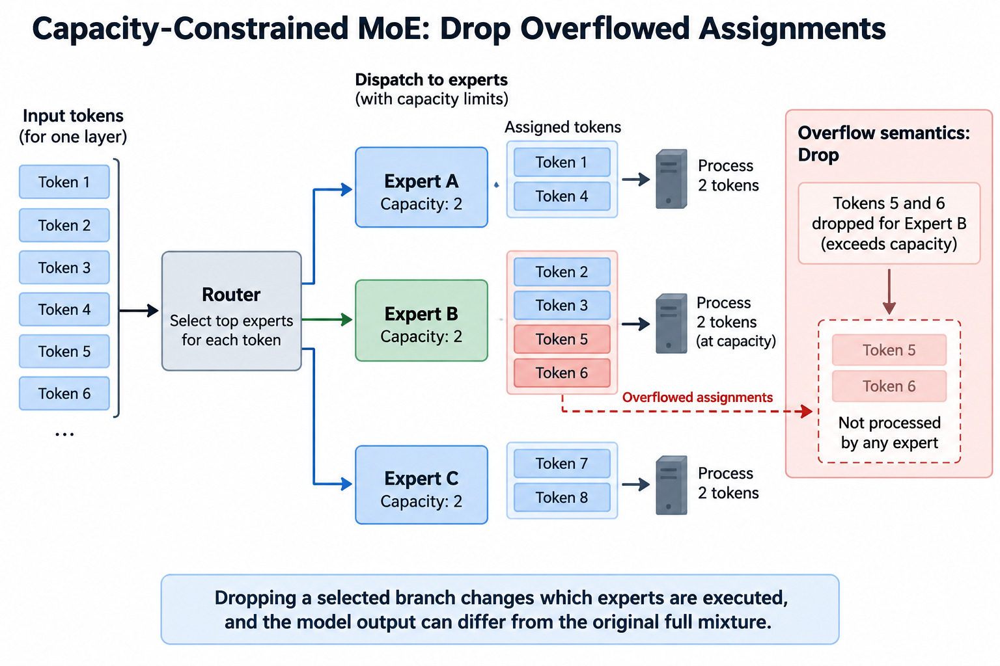
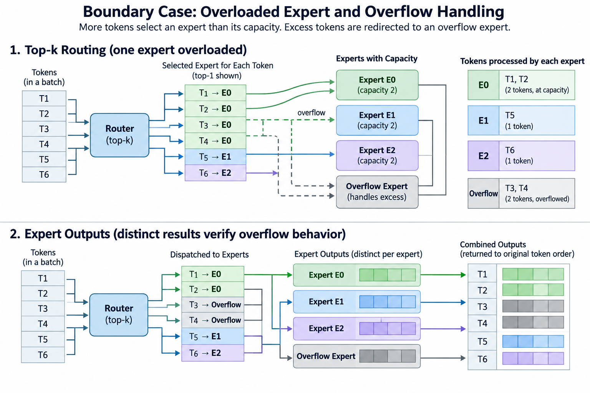
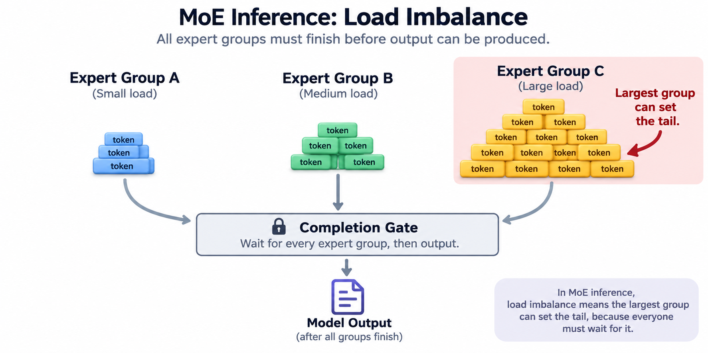

## Overview

Sparse expert routing defines which functions a token uses. The runtime must turn those choices into efficient batches without losing token identity or changing the combining rule. Uneven assignments, bounded buffers, small expert groups, and network exchanges make that transformation a substantial infrastructure problem.

This article separates training-time balancing from runtime capacity and dispatch. The Switch Transformer paper provides a primary example of a balancing objective and capacity-constrained routing. Modern implementations can use different policies, including dropless execution. Their semantics must be read explicitly rather than inferred from the shared label MoE.

## Deep dive

### 1. Count assignments before buffers

Let N tokens each select k experts from a collection of E. There are kN logical assignments when every selected pair is retained. Define n_e as the number assigned to expert e. Their sum equals the assignment population.

$$
\sum_{e=1}^{E}n_e=kN,\qquad
\overline n=\frac{kN}{E}.
$$

The average is not a capacity guarantee. A router can send much more than that average to 1 expert. A buffer sized only for the uniform expectation can overflow on a valid routing result.

A token selecting several experts appears in several groups and later receives several contributions. Preserve each token-expert pair as the logical unit of dispatch. Treating the first selected expert as the token's only owner would discard the remaining computation.

### 2. Separate frequency and probability mass

Assignment frequency measures actual selected pairs. Router probability mass measures scoring preferences before or under the selection normalization. The populations differ, especially when top-k selection and selected-score renormalization are involved.

In the top-one Switch example, define f_e as the fraction of tokens assigned to expert e and P_e as the average router probability for that expert. A representative auxiliary loss from the paper is:

$$
\mathcal L_{\mathrm{balance}}=\alpha E\sum_e f_eP_e.
$$

Use the paper's exact definitions for its setup. Generalizing the expression to top-k requires deciding how assignment frequency is normalized and which probabilities are included. Copying the equation while changing those definitions can change its scale and meaning.

The loss encourages useful distribution during training. It is not an atomic runtime allocator and does not prove that every batch fits a chosen expert buffer.

### 3. Derive capacity factor

A simple padded implementation may reserve a capacity C per expert as a multiple of average assignment load. With capacity factor c, one representative formula is:

$$
C=\left\lceil c\frac{kN}{E}\right\rceil.
$$

This is a runtime model, not a universal convention. Some systems define the factor from tokens rather than assignments, impose minimum capacities, or vary capacity by expert or device. State the actual definition.

For N equal to 1,024, k equal to 2, and E equal to 64, average load is 32 assignments. A capacity factor of 1.25 gives 40 slots per expert under this formula. An expert receiving 60 assignments still exceeds capacity. The factor buys slack; it does not eliminate skew.

### 4. Define overflow semantics

A capacity-constrained implementation must say what happens to assignments exceeding the limit. It might drop a branch, reroute, use another buffer, or execute an additional pass. These choices can change model outputs and system cost.

If a selected branch is dropped, the remaining weights may or may not be renormalized according to the trained policy. Either choice differs from executing the original full selected mixture. Dropping without disclosure is not merely a memory optimization.

Dropless implementations preserve all assignments but need flexible storage and execution. They can avoid one semantic compromise while paying different allocation, grouping, or scheduling costs. Compare the actual policy and quality evidence instead of assuming dropless means overhead-free.

### 5. Group assignments correctly

Dispatch groups token-expert pairs so each expert receives a contiguous or otherwise efficient batch. A permutation maps original assignments into grouped storage. The runtime must preserve token identity, expert identity, and combine weight through that mapping.

$$
\pi:(t,e)\mapsto\mathrm{dispatchSlot},\qquad
 y_t=\sum_{e\in S(t)}a_{t,e}F_e(x_t).
$$

The permutation changes execution order, not the mathematical pairing. Returning expert outputs requires an inverse mapping or equivalent scatter metadata. An output at a valid slot can still belong to the wrong token.

Use unique token and expert patterns in a tiny test. Verify every expected pair appears once and every returned contribution reaches its original token. These structural tests can reveal errors that random numerical comparisons obscure.

### 6. Account for padding and small groups

A padded expert batch can reserve more slots than are logically used. Matrix kernels may still perform work on padded rows unless the implementation avoids it. Logical active work and issued work therefore differ.

Dropless grouping can reduce padding but create irregular expert batch sizes. Very small groups may use matrix hardware poorly or incur disproportionate launch overhead. Grouped GEMM and fusion can help, depending on backend support and shapes.

Report the distribution of expert group sizes and padding ratio alongside throughput. A mean group size hides empty experts and a few overloaded groups. The system behavior follows the actual distribution, not only the total assignment count.

### 7. Translate placement into network traffic

Expert parallelism places complete experts on different devices. A token's activation must reach its selected expert, and the result must return or be combined under the chosen protocol. Remote assignments create communication, while local assignments can avoid some transfers.

A simplified logical dispatch volume scales with remote assignment count times activation width times element size. Return traffic adds its own width and representation. Packing metadata and collective implementation contribute further costs.

All-to-all-style exchange is common, but hierarchical, fused, or specialized strategies can change the physical traffic and synchronization pattern. Use the actual topology and implementation when estimating performance. Model expert count alone cannot determine network bytes.

### 8. Balance work rather than only counts

Equal assignment counts imply equal work only when experts and shapes have comparable costs. Different expert widths, devices, or execution conditions can make that assumption false. Communication locality also affects completion time.

One simple imbalance statistic compares maximum assignment load with the mean:

$$
I=\frac{\max_en_e}{kN/E}.
$$

It is a useful diagnostic but not a complete scheduler objective. A low value can coexist with poor expert kernel efficiency or expensive remote placement. A high value can be tolerable if the overloaded expert has more capacity or another bottleneck dominates.

Training-time bias adjustments or balancing losses can influence distribution, but runtime scheduling still needs capacity and ownership rules. Keep model selection quality and system workload balance as separate measured properties.

### 9. Explain overlap with dependencies

Dispatch must finish enough data movement before an expert reads its inputs. Expert output must be published before the combine step reads it. A buffer can be reused only after every relevant consumer finishes.

$$
\mathrm{dispatchComplete}\prec\mathrm{expertRead},\qquad
\mathrm{expertComplete}\prec\mathrm{combineRead},\qquad
\mathrm{lastUse}\prec\mathrm{bufferReuse}.
$$

Independent groups can overlap communication and computation under a correct protocol. Merely using asynchronous calls does not prove useful overlap or safe lifetimes. Resource contention can also make simultaneous operations slower.

Measure the exposed critical path and use the implementation's documented completion boundaries. A profiler timeline is evidence about one execution, while the ownership protocol establishes correctness across supported schedules.

### 10. Compare prefill and decode

Prefill can provide many token assignments at once, producing larger expert groups. Decode often supplies fewer new tokens per sequence, so group sizes depend strongly on concurrency. Small groups can expose dispatch latency and poor matrix utilization.

The routing distribution can also vary with the input population and layer depth. A benchmark using synthetic uniform assignments can establish a kernel property but does not represent every model workload.

Report phase-specific throughput and latency with real or clearly defined routing inputs. Include initialization and packing costs when they belong to the application boundary. A grouped-GEMM benchmark alone does not measure a complete MoE layer.

### 11. Test boundary and overflow cases

Exercise zero assignments, empty experts, one overloaded expert, nonmultiple group sizes, and supported capacity limits. Verify the declared overflow behavior rather than only checking that no memory error occurs.

Test top-k assignments from the same token, selected weights, shared branches, and any distributed return mapping. Distinct outputs by expert make omitted or duplicated branches visible. Compare with an explicit reference mixture.

For gradients, ensure dispatch and inverse mapping preserve association through backward as well as forward. The gradient of a correctly calculated expert output still belongs to its original token and parameter population. Forward agreement on a trivial batch does not establish backward correctness.

### 12. Read implementation evidence

Megatron's documented token-dispatcher interfaces expose dispatch and return behavior, while the original Switch paper explains a particular training and capacity design. Use each source for its stated scope. Neither defines every modern MoE runtime.

Record backend version, placement, capacity policy, numerical representation, and process topology. A performance regression can originate in router distribution, packing, communication, padding, or expert kernels. Component measurements help locate it.

No GPU benchmark was performed for this article. The equations are accounting and correctness models. Deployment evidence requires actual execution with the intended model and workload.

### 13. Work through a batch association

Take 3 tokens selecting 2 experts each. There are 6 assignments, not 3. Group them by expert, but carry each original token identifier and its selected combine weight. After execution, scatter the 6 outputs back into 3 token accumulators.

If 1 expert receives 4 assignments and another receives 2, a capacity of 3 cannot hold the first group without a declared overflow path. Padding both groups to 4 creates 8 slots while retaining 6 logical assignments. These distinctions explain how logical work, reserved capacity, and issued matrix rows can diverge.

The batch trace provides a practical review tool. Count pairs, inspect group boundaries, follow the inverse mapping, and verify each weighted contribution. Once those invariants are established, optimize communication and kernels under measured distributions. Efficient MoE infrastructure preserves the sparse equation while making its irregular assignments manageable.

### 14. Relate skew to the completion tail

A distributed expert phase often waits for the slowest required group or communication participant. The mean expert load therefore understates the tail when one group is much larger than the others. Under a simplified equal-cost model, the maximum group size is a more relevant indicator of that phase's completion than the average alone.

The simplification has limits. Larger groups can achieve better matrix efficiency, while small groups can be dominated by launch overhead. Communication can also delay an otherwise lightly loaded expert. Measure group duration and readiness rather than assuming that time is perfectly proportional to assignment count.

A useful report pairs each group's count with its measured compute time and dispatch completion. If a heavily loaded expert determines the tail, balancing or placement may help. If all expert computation is short beside an exchange delay, optimizing the router's count distribution may have little effect. These patterns point to different interventions.

Also examine correlation across layers and requests. Repeatedly selecting experts on the same device can create a placement hotspot even if each layer appears reasonably balanced in isolation. Aggregate per-device work and traffic are therefore useful alongside per-expert statistics. Do not optimize one view while ignoring the process topology.

## Conclusion

Finally compare quality before and after a routing adjustment. A locality or balancing policy can reduce system cost while changing which functions a token executes. Unless the model was trained for that policy or equivalence is established, the change needs behavioral evaluation. The runtime's efficiency objective must remain connected to the intended sparse model rather than silently replacing it.

### Sources

- [Switch Transformers](https://arxiv.org/abs/2101.03961).
- [Megatron Core token dispatcher documentation](https://docs.nvidia.com/megatron-core/developer-guide/latest/apidocs/core/core.transformer.moe.token_dispatcher.html).
