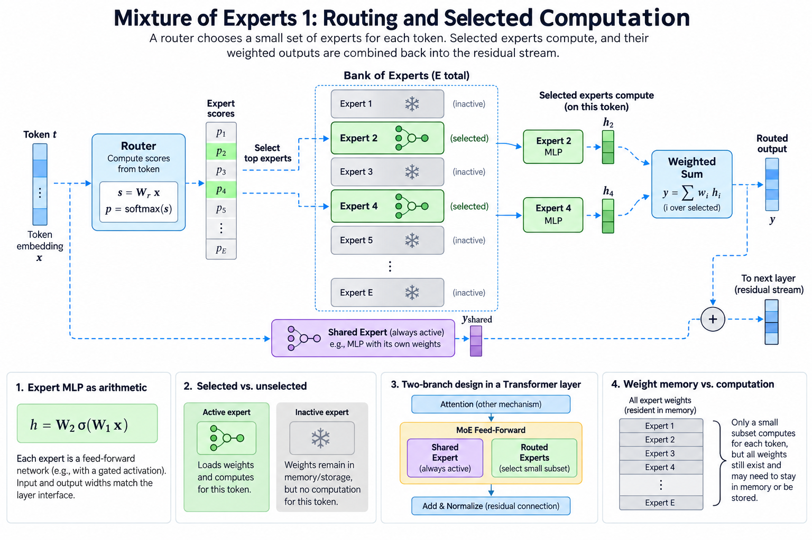
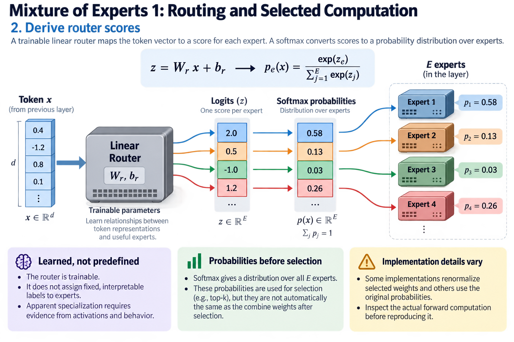

A mixture-of-experts language model increases its collection of learned functions while executing only a selected subset for each token. The central idea is conditional computation. A learned router chooses experts using the current token representation, and their outputs are combined to form a result. Infrastructure consequences follow from that choice, but they are not exhausted by an active-parameter count.

Sparse expert models can retain far more weights than they use in 1 token's arithmetic path. The unused weights may still need memory residency, storage, or a transfer policy. Distributed implementations must move token activations to the selected experts and return results. This article explains the model computation first; the second MoE article examines capacity and dispatch in more detail.

## 1. Locate the expert layer

*Overview of the article’s core mechanism. The following sections explain the objects, relationships, equations, assumptions, and worked examples shown here.*

In a common Transformer design, an MoE layer replaces an ordinary feed-forward sublayer. Attention still mixes information across positions according to its own rules. The expert functions typically operate independently on each token representation once routing is known.

An expert can be a multilayer perceptron with gated activation, but “expert” does not prescribe one architecture. Its input and output widths must match the surrounding interface. Each expert usually has independent learned weights, while normalization or routing can be shared by the layer.

The residual stream carries the layer's result forward. Sparse expert selection therefore changes a feed-forward computation within a larger architecture; it does not mean the entire model is a collection of separately selected language models.

## 2. Derive router scores

Let x be a token vector and let there be E routed experts. A linear router produces logits, and a normalization can convert them to probabilities. The particular model may add bias corrections, another scoring function, or a different selection policy, so this is a representative formulation.

$$
z=W_rx+b_r,\qquad
p_e(x)=\frac{\exp z_e}{\sum_{j=1}^{E}\exp z_j}.
$$

The router is trainable. Its scores can learn relationships between token representations and useful expert functions. It does not necessarily assign interpretable labels such as “mathematics expert” or “networking expert.” Apparent specialization requires evidence from activations and behavior, not an attractive name.

Softmax probabilities before selection and combine weights after selection are not automatically the same object. Some implementations renormalize selected weights and others use their original values. Inspect the actual forward computation before reproducing it.

## 3. Select and combine experts

Let S(x) be the selected top-k experts and let F_e be expert e's function. A representative sparse mixture is a weighted sum over the selected set. If the selected probabilities are renormalized, their weights sum to one within that set.

$$
a_e=\frac{p_e}{\sum_{j\in S(x)}p_j},\qquad
 y=\sum_{e\in S(x)}a_eF_e(x).
$$

The top-k selection is discrete. Gradients through the selected expert computations and their combine weights do not make the selection operator an ordinary smooth function everywhere. Training methods must account for routing behavior, including expert utilization and unstable score changes.

When k is greater than one, 1 token creates several expert assignments. Assignment count is therefore different from token count. This distinction affects both arithmetic and dispatch traffic and becomes important in the capacity calculations of the next article.

## 4. Separate shared and routed branches

Some architectures execute shared experts for every token alongside selected routed experts. A shared branch can provide a common computation while routed branches offer conditional capacity. Its contribution must be included in active work.

$$
y=F_{\mathrm{shared}}(x)+\sum_{e\in S(x)}a_eF_e(x).
$$

This equation illustrates one additive design; a model can use different scaling or combining rules. “1 shared expert” also does not imply the same width or parameter count as 1 routed expert. Read the configuration and weight shapes.

In the verified DeepSeek-V4.1-Flash card, each MoE layer lists 1 shared expert and 384 routed experts, with 6 routed experts active per token. Those counts describe selection, not a complete arithmetic or memory formula. Attention, routers, embeddings, and other components remain part of the model.

## 5. Count total and active parameters

Suppose the nonsparse portion has P_base parameters, a shared branch has P_shared, and each of E routed experts has P_expert. An illustrative count for that layer structure is:

$$
P_{\mathrm{total}}=P_{\mathrm{base}}+P_{\mathrm{shared}}+EP_{\mathrm{expert}},\qquad
P_{\mathrm{active}}\approx P_{\mathrm{base}}+P_{\mathrm{shared}}+kP_{\mathrm{expert}}.
$$

The active count assumes a consistent definition of what is accessed for 1 token. Routers score the expert collection, and embeddings or conditional memory can complicate accounting. Model cards may define their reported figures differently. Preserve the provider's definition instead of treating every active-count headline as comparable.

For illustrative values of 64 equal experts with two selected, the routed-expert portion activates 1/32 of its total parameter population. That ratio does not apply to the whole model, and it does not establish a 32-fold reduction in latency or memory.

## 6. Translate expert MLPs into arithmetic

A gated expert commonly applies two input projections, multiplies a nonlinear gate with another projected branch, and applies an output projection. With input width d and intermediate width m, the leading matrix work scales with three products involving those widths, subject to the exact design and multiply-add counting convention.

For N tokens and k selected experts per token, a rough dense-matrix arithmetic estimate scales with N times k times d times m. Batch organization matters: many small per-expert groups can use hardware less efficiently than one large dense matrix multiplication, even if the total arithmetic is similar.

An active-parameter count approximates selected weight involvement. It does not capture launch overhead, tile padding, expert-group size, memory traffic, or network transfers. Report actual throughput under the intended token and routing distribution.

## 7. Explain why weights still occupy memory

Sparse execution selects a subset at runtime. Unless an offload or loading policy supplies weights on demand, all experts assigned to a device may remain resident. Memory capacity therefore follows assigned total weights and their representation, not only active weights for 1 token.

Quantization can reduce stored bytes, while scales, packing, and nonquantized components add overhead. An offload scheme substitutes transfers and scheduling complexity for residency. It needs a predictive or demand-driven policy that meets the workload's latency requirement.

A model described as having a small active count can still require substantial aggregate device memory. Distinguish single-device residency, distributed residency, and per-step accessed weight bytes. These quantities answer different infrastructure questions.

## 8. Connect routing to distributed execution

Expert parallelism assigns experts to different devices. Tokens must reach the devices containing their selected weights, then return or combine their results. A token selecting several remote experts can participate in several logical assignments.

The communication pattern depends on expert placement, grouping, replication, and the process topology. All-to-all-style dispatch is common, but the implementation can fuse steps or use specialized exchange strategies. Do not infer the precise network sequence from the model's expert count alone.

Overlap can hide part of communication behind computation, but requires enough independent work and correct buffer lifetimes. Small decode batches can be especially sensitive to dispatch latency and poor expert batching. Prefill and decode therefore need separate evaluation.

## 9. Introduce balancing without oversimplifying it

A router favoring a few experts can overload their computation and leave others underused. Balancing methods encourage more useful distribution while trying to preserve model quality. The original Switch Transformer paper presents a simplified top-one routing design and an auxiliary balancing objective within its stated training setup.

Uniform expert counts are not automatically optimal. Experts can differ in cost, devices can differ in capacity, and locality can matter. A balancing policy may optimize assignment frequency, probability mass, or another statistic. Read the loss and execution policy rather than interpreting every balancing coefficient as equivalent.

Expert utilization is also not a direct quality measure. A perfectly balanced router can make poor choices. Evaluate both the model objective and the system distribution, and retain the distinction between training preferences and runtime capacity enforcement.

## 10. Test the sparse computation explicitly

A tiny reference can compute every expert output, select the intended subset, and combine only that subset. It is inefficient but makes routing and combining transparent. Give experts distinct outputs so wrong indices or weights become obvious.

Test top-k ties according to the implementation's supported behavior, selected-weight normalization, shared contributions, and output accumulation. With k greater than one, verify every selected branch contributes exactly once. Dispatch bugs can duplicate, omit, or misorder contributions without an obvious crash.

Compare gradients on a small case with stable selection away from ties. A finite-difference perturbation crossing a top-k boundary tests a nonsmooth region and should not be interpreted as ordinary derivative failure. Define the reference's routing semantics first.

## 11. Compare quality and system evidence

A fair architecture comparison needs more than total and active counts. Record training evidence, evaluation tasks, inference settings, precision, context lengths, and serving hardware. Different post-training or test-time budgets can dominate a benchmark difference that is mistakenly attributed to expert selection.

Use model-card claims with their provenance. The gpt-oss card, for example, reports MXFP4 representation for MoE weights and specific memory-fit statements. Those statements depend on the implementation and workload; they are not a generic guarantee for every sparse model with a similar active count.

An infrastructure report should show capacity, prefill throughput, decode latency, routing distribution, and relevant communication costs. Such a report connects the conditional computation to observed behavior without claiming the model architecture alone determines performance.

## 12. Work through a routed token

Take 4 experts and select two. Suppose their selected router weights after normalization are 3/4 and 1/4. If the first selected expert produces a vector with first coordinate four and the second produces a first coordinate of eight, the combined first coordinate is five. Unselected experts contribute nothing through this routed branch even if their hypothetical outputs are large.

If a shared branch contributes two in that coordinate under the additive design, the final coordinate becomes seven. This example distinguishes selected weighting from shared computation. It also shows why counting experts is insufficient to reconstruct a result: the indices, weights, expert functions, and combining rule all matter.

For a batch, group assignments by expert, execute each group, and restore the token association before combining. The permutation is execution metadata; it must not change the mathematical pairing between a token and its outputs. Use unique token identifiers in tests to detect association mistakes.

## 13. Choose the right next question

Once the sparse computation is clear, ask how assignments are batched, how much capacity each expert has, and what happens when routing exceeds that capacity. Those questions belong to the system protocol and are developed in the next article. They should not be answered by assuming a top-k equation also specifies a complete runtime.

The derivations here are illustrative and no GPU benchmark was performed in this editing environment. The architectural result is conditional computation with retained learned capacity. Its practical value depends on training quality, weight representation, and an execution system that makes the selected work efficient.

For reproducible analysis, retain the configuration and source revision alongside the counts. A later model release can change expert widths, routing normalization, or shared branches while retaining a similar family name. Recomputing the formulas from the actual weight shapes provides a stronger check than copying a headline. Also state whether embedding tables and conditional-memory modules belong to the reported total; silently adding differently defined component figures creates misleading comparisons.

## Sources

- [Switch Transformers: Scaling to Trillion Parameter Models with Simple and Efficient Sparsity](https://arxiv.org/abs/2101.03961).
- [Official DeepSeek-V4.1-Flash model card](https://huggingface.co/deepseek-ai/DeepSeek-V4.1-Flash).
- [Official gpt-oss-120b model card](https://huggingface.co/openai/gpt-oss-120b).
