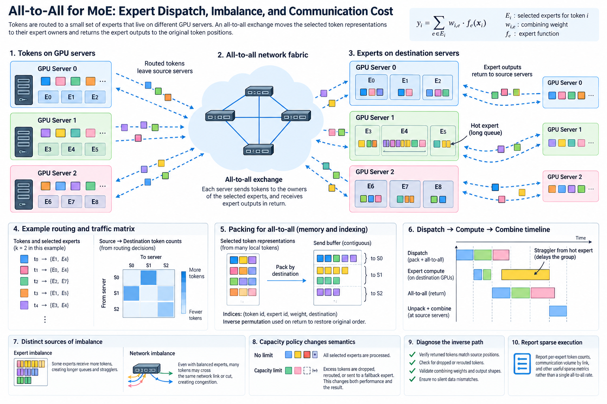
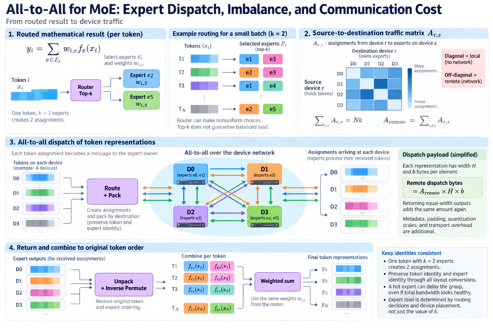
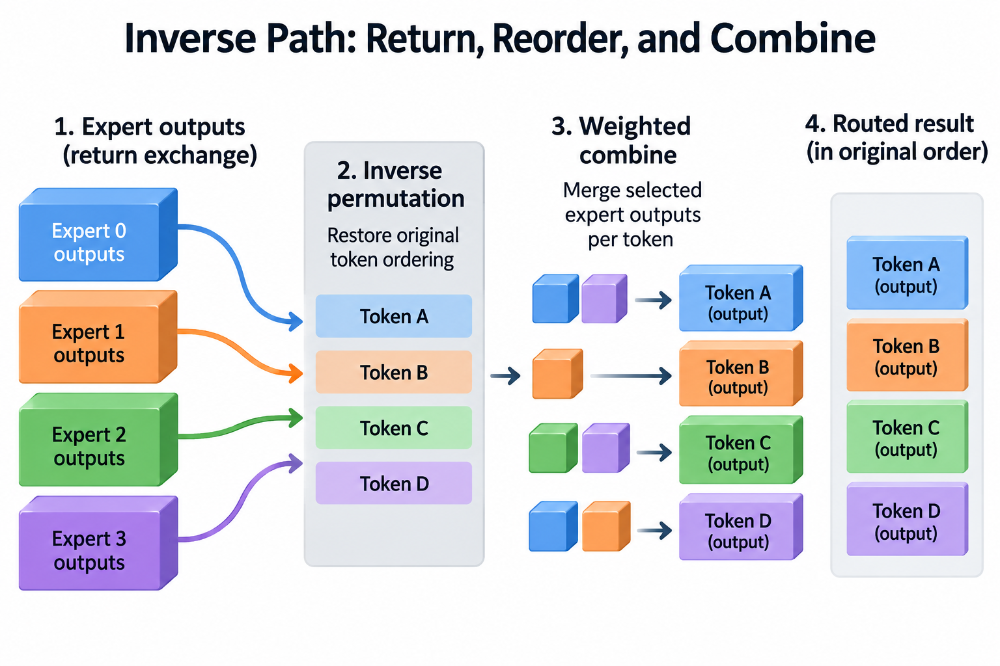

Mixture-of-experts models select a small set of expert networks for each token. When those experts live on different devices, the token representations must move to their owners and the expert outputs must return to the original token positions. The resulting communication is often described as all-to-all, but its traffic is determined by routing decisions rather than a fixed uniform matrix.

That distinction matters. A model can use few experts per token while still moving many bytes, and balanced expert selection can still stress a shared network cut. Packing and inverse permutation add memory work around the exchange. A hot expert can delay the entire group even when aggregate fabric bandwidth looks healthy.

We will derive the dispatch budget and follow the complete execution program. The examples are illustrative and use simplified equal-width expert inputs and outputs. Actual dispatchers, routing rules, and capacity policies depend on the model and implementation.

## 1. Begin with the routed mathematical result

*Overview of the article’s core mechanism. The following sections explain the objects, relationships, equations, assumptions, and worked examples shown here.*

Let x_i be token i's hidden representation. The router selects a set E_i of k experts and supplies combining weights w_i,e. With expert function f_e, the routed contribution is

$$
y_i=\sum_{e\in E_i}w_{i,e}f_e(x_i).
$$

Some models also include shared experts or additional residual structure. Their work must be counted separately. The selected set and combining weights define the required result; the dispatcher must preserve them while changing where each representation is stored and processed.

The router can make nonuniform choices across tokens, layers, and batches. Top-k identifies the number of selected experts, not a guarantee that every expert receives equal load. A destination owner's demand is the sum of assignments to the experts it holds.

Keep token identity and expert identity explicit. Preserve the same identities through every intermediate layout conversion. One token selected for 2 experts creates 2 assignments, and those outputs later combine into one token result. Treating assignments as unique original tokens can break output counts, routing weights, or inverse ordering.

## 2. Construct the source-to-destination traffic matrix

Suppose p devices participate in an expert group. Let A_r,s be the number of assignments originating on device r and targeting experts owned by device s. The matrix describes dispatch demand before counting bytes.

The total assignments and remote assignments are

$$
\sum_{r,s}A_{r,s}=Nk,\qquad A_{\mathrm{remote}}=\sum_{r\ne s}A_{r,s}.
$$

Here N is the token population in the group. These equalities assume every token has exactly k assignments and none are dropped. Capacity policies or variable routing require adjusted accounting.

If each representation has width H and b bytes per element, a simplified remote dispatch payload is A_remote times H times b. Returning equal-width outputs adds the same amount again. Metadata, padding, quantization scales, and transport overhead are additional.

The diagonal assignments are local to an expert owner and need not cross the network, although they still require layout and compute work. A uniformly balanced expert distribution does not by itself determine the remote fraction; token placement and expert placement both matter.

## 3. Derive a complete payload example

For N=8192 tokens, k=2 selected experts, H=4096, and b=2 bytes, the one-way assignment payload across all destinations is

$$
D_{\mathrm{dispatch}}=NkHb=134217728\text{ bytes}=128\text{ MiB}.
$$

Returning outputs of the same representation width brings the total logical assignment payload to 256 MiB. If an illustrative 25% of assignments are local, remote dispatch plus return is 192 MiB before overhead. This is an aggregate group budget, not automatically the bytes sent by each rank.

The calculation shows why sparse expert computation can still produce substantial communication. Increasing k multiplies assignments, while increasing hidden width increases each representation's size. The model's total parameter count does not directly determine these dispatch bytes.

Measure physical traffic as well as logical payload. A dispatcher can use intermediate gathering, padding, or different process groups that increase transferred bytes. Quantized communication can reduce payload but add scale metadata and conversion work. Identify the actual representation on the wire rather than assuming it matches stored activations.

## 4. Packing is a memory and indexing computation

The dispatcher groups assignments by destination and expert so the receiving device can execute suitable expert batches. It preserves enough indices to map returned outputs to original token positions and selected-expert slots. Combining weights must follow the same ordering.

Packing can read one original representation multiple times when k is greater than 1, or reuse it through an implementation-specific layout. It writes destination-oriented buffers and metadata. These operations consume device memory bandwidth even before the network exchange begins.

Variable destination counts require a supported exchange protocol. Participants must agree on counts, offsets, and payload interpretation. Some implementations exchange counts or use specialized dispatch machinery; a generic uniform all-to-all model does not capture every dynamic pattern.

Test the permutation independently with small deterministic inputs. Give each token a recognizable identifier and use simple expert outputs whose expected combination is obvious. An output checksum on random data can miss an incorrect pairing between values and routing weights.

## 5. Expert imbalance and network imbalance are distinct

Let N_e be assignments to expert e. A simple expert-load ratio is

$$
I_{\mathrm{expert}}=\frac{\max_eN_e}{Nk/E},
$$

where E is the expert count and the denominator is average assignments under equal total load. This ratio describes assignment imbalance, not execution time: experts can have different costs or efficiency at different batch sizes.

Device load sums assignments across owned experts. Network load additionally depends on source locations and physical cuts. A set of balanced experts concentrated behind one constrained boundary can still create a communication hotspot.

For an illustrative 8-owner group with 8192 assignments, equal owner load is 1024. If one owner receives 2048 and others share the remainder, its assignment ratio is 2. That owner can dominate expert execution or receive demand, but the exact tail depends on batching, bandwidth, and overlap.

Record expert counts, owner counts, source-destination counts, and per-rank timing separately. These observations distinguish router imbalance from placement-induced congestion and from a slow expert kernel operating on an otherwise balanced population.

## 6. Capacity policy changes semantics as well as performance

A capacity factor can define how many assignments an expert is allowed to process relative to an average-load estimate. A simplified fixed capacity is

$$
C_e=\left\lceil c\,Nk/E\right\rceil,
$$

where c is the factor. Actual models can use different capacity rules, dynamic allocations, dropless execution, or other mechanisms. This formula is an explanatory policy, not a universal MoE requirement.

If excess assignments are dropped, the mathematical output changes unless the model's training and inference design explicitly incorporates that behavior. If buffers are padded to capacity, bytes and compute can increase beyond the useful assignment population. Dropless execution preserves assignments but must accommodate variable load.

Do not present dropping or reduced k as an implementation-only speedup. They can change model behavior and quality. Performance comparisons should preserve routing semantics or report the changed method and evaluate the resulting quality explicitly.

Capacity limits can protect memory while creating different tails and failure modes. Observe overflow, padding, allocation growth, and expert timing. A low average load does not establish that a bursty destination will remain within its supported buffer budget.

## 7. Model the complete dispatch-compute-combine timeline

The execution program includes routing, packing, count coordination where required, outbound exchange, expert computation, return exchange, inverse permutation, and weighted combination. A benchmark of the exchange alone excludes several potentially important costs.

A strictly serial model is

$$
T\approx T_{\mathrm{route}}+T_{\mathrm{pack}}+T_{\mathrm{dispatch}}+T_{\mathrm{expert}}+T_{\mathrm{return}}+T_{\mathrm{combine}}.
$$

Implementations can pipeline or overlap some stages, so the actual critical path follows dependencies rather than this sum. Overlap still consumes shared resources. Expert kernels and transfers can compete for device memory or interface capacity.

Trace each stage with per-rank context and assignment counts. If packing dominates, more external bandwidth is unlikely to solve the problem. If a shared network cut dominates, optimizing one expert kernel may leave the same tail. If one owner is hot, routing or placement evidence becomes central.

Measure useful token progress and preserve numerical output. A dispatcher that appears faster because it omits assignments or misapplies weights is not an optimization of the same computation.

## 8. Account for topology and process-group layout

Expert ownership can be distributed within a server, across servers, or through hierarchical groups. Tensor parallelism can interact with expert dispatch, changing which representations or shards each participant exchanges. Define the process mesh before counting world-size factors.

For a required physical cut, a lower bound remains traffic across that cut divided by its available capacity. Use the source-destination matrix and actual ownership to estimate the traffic. Aggregate cluster bandwidth cannot substitute for the capacity of the relevant cut.

Placement can reduce remote demand or distribute destination pressure, but it also affects expert memory and other parallel dimensions. Replicating experts can change routing and state ownership, so its cost includes additional storage and consistency requirements rather than only saved network bytes.

Compare representative routing populations, not only a perfectly uniform synthetic matrix. Include realistic imbalance and concurrency when selecting a dispatcher or placement. A benchmark that balances every destination by construction can miss the model's actual communication pattern.

## 9. Test and diagnose the inverse path

The return exchange must preserve the relation between source token, selected expert, and output representation. The inverse permutation then restores the original token ordering, and the weighted combination produces the required routed result.

Use a small reference implementation that computes the selected experts locally for test inputs. Compare the distributed result with appropriate tolerances. Include repeated experts across tokens, multiple selected experts, zero-count destinations, and the supported capacity behavior.

A deterministic example can define expert e to add the scalar e to every input component. The expected token output is then its input scaled by the sum of combining weights plus the weighted sum of expert identifiers. This exposes incorrect expert association and weight ordering without requiring a realistic neural expert.

For instance, a scalar input 10 routed to experts 1 and 3 with weights 0.25 and 0.75 should produce 12.5 under that test function. Swapping the weights produces 11.5, revealing a metadata-ordering error even though both expert outputs arrived intact. Expand the test to several source ranks and tokens so the inverse exchange and token permutation are exercised together rather than only the local combining operation.

Exercise repeated buffer reuse and varying assignment counts. A dispatcher can pass one fixed-size test while failing when a destination grows or becomes empty. Preserve counts and offsets around the first failure to distinguish indexing errors from transport or visibility problems.

## 10. Report useful sparse execution rather than one exchange rate

A useful report contains model routing semantics, token population, representation width, expert ownership, assignment matrix summaries, capacity policy, actual traffic, stage timing, and end-to-end useful throughput. Label illustrative estimates separately from measured results.

Keep the full program stable when comparing alternatives. A change in k, padding, communication representation, or routing balance can explain a speedup independently of the dispatcher implementation. Identify such changes and evaluate correctness and quality where they alter the method.

MoE all-to-all is a movement of sparse assignments through a physical topology and back into the original computation. Its cost is determined by bytes, load distribution, layout work, and dependencies. Understanding the complete dispatch-compute-combine program makes it possible to optimize the actual bottleneck while preserving every selected contribution.

## Sources

- [Megatron official MoE implementation guide](https://github.com/NVIDIA/Megatron-LM/blob/main/megatron/core/transformer/moe/README.md).
- [Megatron token dispatcher API](https://docs.nvidia.com/megatron-core/developer-guide/latest/apidocs/core/core.transformer.moe.token_dispatcher.html).
- [NCCL collective operations](https://docs.nvidia.com/deeplearning/nccl/user-guide/docs/usage/collectives.html).
