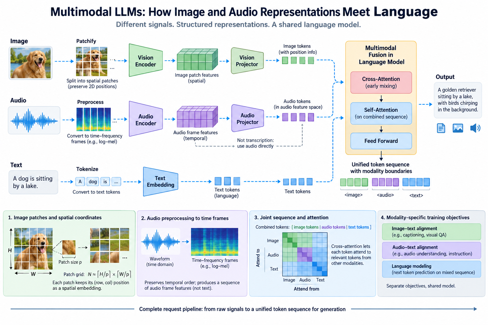
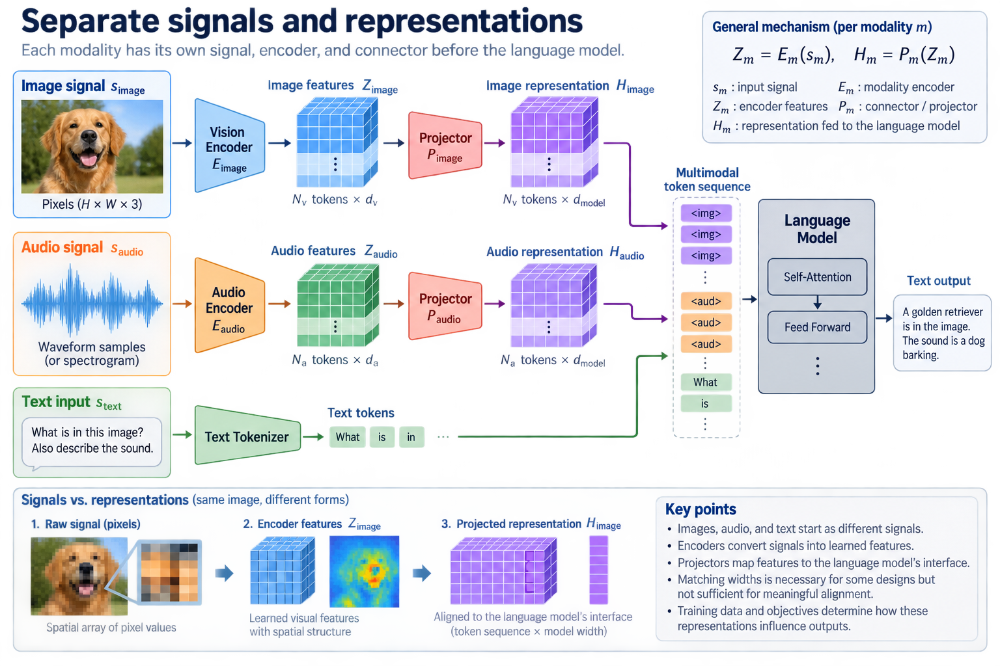
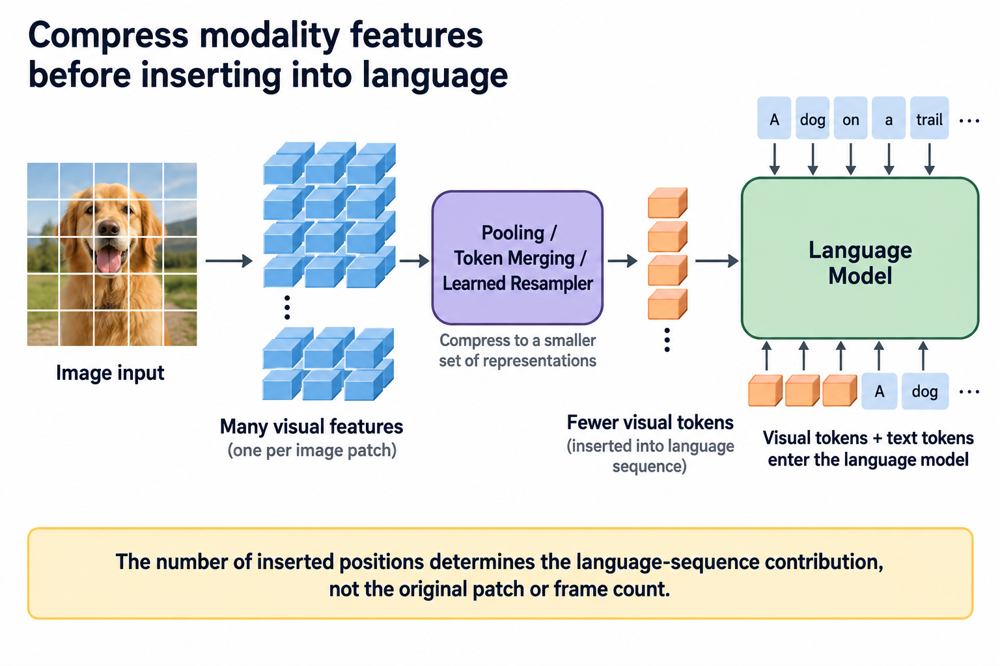

A multimodal language model needs a route from nontext signals into the computation used for language. Images and waveforms are not ordinary text tokens with another label. They have spatial or temporal structure, preprocessing requirements, and representation sizes that affect both model behavior and infrastructure cost.

Encoder-projector designs provide one common route. A modality encoder produces features, a learned connector maps them into a compatible interface, and the language model combines them with textual representations under a defined input protocol. Other architectures use cross-attention or native multimodal tokenization. The supported release, rather than a generic diagram, determines the exact path.

## 1. Separate signals and representations

*Overview of the article’s core mechanism. The following sections explain the objects, relationships, equations, assumptions, and worked examples shown here.*

An image begins as a spatial array of pixels. Audio begins as sampled waveforms or another signal representation. An encoder converts those signals into learned features. A language model consumes the resulting features through the architecture's designated interface.

$$
Z_m=E_m(s_m),\qquad H_m=P_m(Z_m).
$$

Here m identifies a modality, E its encoder, and P a connector or projector. This equation describes a family of designs, not every multimodal model. The feature count and width can change through downsampling, pooling, or learned resampling.

The connector must learn a useful relationship between encoder features and language computation. Matching widths is necessary for some interfaces but insufficient for meaningful alignment. Training data and objectives establish how those representations influence outputs.

## 2. Derive image patch counts

A simple patch encoder divides an image of height H and width W into patches of side p. With padding or ceiling-based coverage, the initial patch count is approximately the product of the two patch-grid dimensions.

$$
N_{\mathrm{patch}}=\left\lceil\frac{H}{p}\right\rceil
\left\lceil\frac{W}{p}\right\rceil.
$$

This is a hypothetical patching model. A release can resize images, use multiple crops, merge tokens, or apply another downsampling method. Read the actual processor before assigning a token count to an uploaded image.

For illustrative square inputs, doubling both dimensions produces roughly 4 times as many patches at fixed patch size. If those patches become language positions without further compression, they also increase language prefill and state. Image resolution is therefore a resource variable as well as a quality variable.

## 3. Preserve spatial coordinates

Visual features need information about where they came from. Spatial positional encoding, crop metadata, and image-boundary markers can preserve that structure. Treating patches as an unordered bag can lose relationships relevant to objects, diagrams, or text placement.

The verified DeepSeek-V4.1-Flash card describes a vision encoder with 2D rotary positioning and 3-by-3 pixel-unshuffle downsampling, followed by a 2-layer MLP projector. These are release-specific disclosures. They do not establish a generic patch size or complete visual-token formula by themselves.

Multiple images require a supported ordering and boundary protocol. A serving application should use the compatible processor rather than concatenate arbitrary features that happen to have the right width.

## 4. Follow audio preprocessing

Audio encoders often operate on frames of a transformed waveform, such as a time-frequency representation. Sample rate, channel handling, frame length, and hop determine the representation. A processor's expected sampling rate is part of the input contract.

For an illustrative signal with N samples, frame length F, and hop h, a no-padding frame count is:

$$
N_{\mathrm{frames}}=1+\left\lfloor\frac{N-F}{h}\right\rfloor\quad(N\ge F).
$$

Padding, centering, and downsampling change the actual count. A model can then compress frames before inserting features into language computation. Do not equate waveform samples, acoustic frames, and language positions.

The primary Qwen2-Audio documentation illustrates a processor-driven audio-language interface and specifies loading audio at the processor's expected sample rate. It establishes that model's contract, not the behavior of every newer multimodal release.

## 5. Distinguish direct audio from transcription

A pipeline can first transcribe speech to text and then use a text language model. Another model can consume audio-derived representations directly. These routes preserve different information and have different component costs.

Transcription can discard nonverbal sounds, speaker characteristics, timing, or prosody relevant to a task. Direct audio representations can retain other information under their trained encoder, but that does not guarantee accurate use of every signal property.

Specify whether the application needs speech content, sound analysis, speaker relationships, or another capability. Benchmark the actual route, including transcription when present. A text-only language-model timing does not measure the full audio application.

## 6. Explain early mixing and cross-attention

An encoder-projector design can insert modality features alongside text embeddings before language processing. Another design lets text-side layers cross-attend to separate modality features. These choices change state, masking, and where information mixes.

A conceptual cross-attention operation uses text queries and modality keys and values:

$$
U=\operatorname{softmax}\left(\frac{Q_{\mathrm{text}}K_m^\top}{\sqrt d}\right)V_m.
$$

This differs from simply extending the self-attention sequence with visual positions. The actual architecture can combine mechanisms. Count their retained tensors separately and follow the implemented causal and modality masks.

The DeepSeek card says visual and text embeddings are processed jointly from the start of language-model pretraining. That describes its training integration; it should not be generalized to a model trained only with a later frozen-encoder adapter.

## 7. Connect representation length to attention

If text and modality features become one dense-attention sequence, total prefill positions are the sum of their actual inserted counts and any protocol positions. Dense score work can scale quadratically with that length in a conventional mathematical description.

$$
n_{\mathrm{total}}=n_{\mathrm{text}}+n_{\mathrm{visual}}+n_{\mathrm{audio}}+n_{\mathrm{protocol}}.
$$

Optimized attention kernels can avoid materializing the score matrix without removing the underlying dense interactions. Sparse, local, or recurrent mechanisms can change the scaling, but their actual architecture must be accounted for.

A capacity report based only on text tokenizer counts can understate multimodal requests. Measure the processor's resulting representation counts and the runtime's actual state allocations.

## 8. Separate training objectives

Multimodal training can use contrastive alignment, supervised captioning or instruction examples, autoregressive prediction, or another objective. These are not interchangeable descriptions of how encoder features become useful to language.

A representative autoregressive objective conditions output tokens on modality input and text context:

$$
\mathcal L=-\sum_t\log p_\theta(y_t\mid H_m,x,y_{<t}).
$$

The equation makes conditioning explicit without claiming that every encoder is trained jointly or that this is the only release objective. A frozen encoder and trained projector produce a different optimization path from fully joint training.

For an architecture comparison, state disclosed training choices and leave undisclosed ones open. Model capability cannot be derived from projector depth alone.

## 9. Account for the complete request pipeline

Measure preprocessing, modality encoding, connector work, language prefill, and generation under the application's actual boundary. Some components can run on the CPU, another accelerator, or the same GPU. Their scheduling and transfer costs affect latency.

A cached modality representation can avoid repeated encoding for compatible inputs. Its validity depends on model and processor revisions, preprocessing settings, and the source signal. A visible filename is not a sufficient cache key.

Peak memory includes encoder workspace and language state, which may coexist. If the implementation releases encoder temporaries before prefill, the peak differs from a path keeping both live. Inspect lifetimes rather than adding unrelated peak figures.

## 10. Preserve input identity and boundaries

Multiple images or audio clips need an unambiguous association with the prompt. The processor and message format define ordering, modality markers, and any cross-references. A correct vector tensor can still be attached to the wrong input slot.

Test distinct inputs with distinguishable content and prompts asking about their order. Verify that batched processing preserves sequence identity. Padding must not let one request attend to another request's features.

For streaming audio, define how partial frames and continuation state are handled. A model supporting complete audio files does not automatically provide a low-latency streaming interface. The encoder's causality and buffering policy determine that capability.

## 11. Test modality-sensitive behavior

Use tasks requiring the intended signal rather than only language priors. For images, controlled changes can test whether a result follows visual content. For audio, compare speech content, background sounds, and timing according to the claimed capability.

Evaluate resolution or duration changes and the processor's truncation behavior. A silently shortened input can make a fast benchmark misleading and change task correctness. Report supported limits and what actually entered the model.

Also compare prefill followed by generation with the supported reference path. Tests need to cover multimodal serialization, positions, and cache reuse, not only the modality encoder in isolation.

## 12. Handle numerical and preprocessing regressions

Changing image resize policy or audio resampling can change representations even when model weights stay fixed. A processor update belongs in the versioned deployment contract. Keep representative inputs and expected behavior for regression review.

Compare numerical outputs under the intended tolerance and independently check task results. Exact feature equality can be inappropriate after allowed precision changes, while task-only agreement can hide an association bug on easy examples.

No model execution or device benchmark was performed for this article. The examples are representation and accounting models. Actual deployments require the release's supported processor and target-backend validation.

## 13. Build modality-aware capacity buckets

Text length, image resolution and count, and audio duration are separate workload variables. Bucket requests using actual encoded position counts and measured workspace where possible. A single “input size” field can hide large differences among modalities.

Measure time to first token and complete response separately, and retain modality preprocessing within the stated boundary. Concurrency can shift the bottleneck from encoding to language state or expert dispatch.

The useful architectural picture is a chain of transformations with explicit interfaces. Signals become features, features enter language computation, and that computation produces outputs. Following the chain explains both multimodal capability and the infrastructure costs that text-only estimates miss.

## 14. Examine compression before language insertion

A modality encoder can produce many features, while the connector supplies fewer positions to the language model. Pooling, token merging, or a learned resampler can make this reduction possible. The number of inserted positions, rather than the original patch or frame count alone, determines the corresponding language-sequence contribution.

Compression creates a representational tradeoff. A small set of features can reduce attention and cache costs while discarding distinctions useful to fine-grained reading or temporal analysis. More features can preserve detail but increase language work. The appropriate policy depends on training and task requirements; a smaller token count is not automatically a better multimodal design.

For a controlled experiment, vary the supported representation budget while holding the source input and task population fixed. Report quality, encoded positions, preprocessing and encoder time, prefill time, and memory. This separates a reduction in language cost from a possible increase in encoder or connector work.

Also distinguish input understanding from output generation. A model that consumes audio and returns text does not necessarily generate audio waveforms. A model that understands images does not necessarily synthesize images. Output modalities require their own representations, decoder or generation mechanism, and training evidence. Capability names should preserve that scope.

A complete system can combine separate components to provide another output modality, but the pipeline must identify them. For example, text generation followed by speech synthesis has different latency and state from a native streaming audio generator. The architecture diagram and benchmark should follow the actual route.

These distinctions keep the multimodal explanation grounded in interfaces. Count the features that really enter language computation, evaluate what compression preserves, and identify the output mechanism separately. This provides a practical basis for both article diagrams and deployment estimates.

## 15. Follow efficient vision through its spatial interface

Vision compression can act before language tokens are formed. [Patch size and position](/blog/vision-transformer-patches-position-cost/) defines the initial spatial granularity, while [token reduction](/blog/efficient-vision-token-reduction-resolution/) distinguishes discarding regions from combining representations with size metadata.

The changed vision sequence then interacts with the language insertion interface. Preserving a vision classification score does not establish unchanged multimodal question answering, especially for small objects or spatial relationships. Evaluate the complete task after compression and retain representation counts at each boundary. The [vision and generation experiment guide](/blog/vision-generation-deployment-experiment/) explains how to pair that quality evidence with complete pipeline resource measurement.

## Sources

- [Official DeepSeek-V4.1-Flash model card](https://huggingface.co/deepseek-ai/DeepSeek-V4.1-Flash).
- [Official Qwen3.6-35B-A3B model card](https://huggingface.co/Qwen/Qwen3.6-35B-A3B).
- [Qwen2-Audio implementation documentation](https://huggingface.co/docs/transformers/main/en/model_doc/qwen2_audio).
