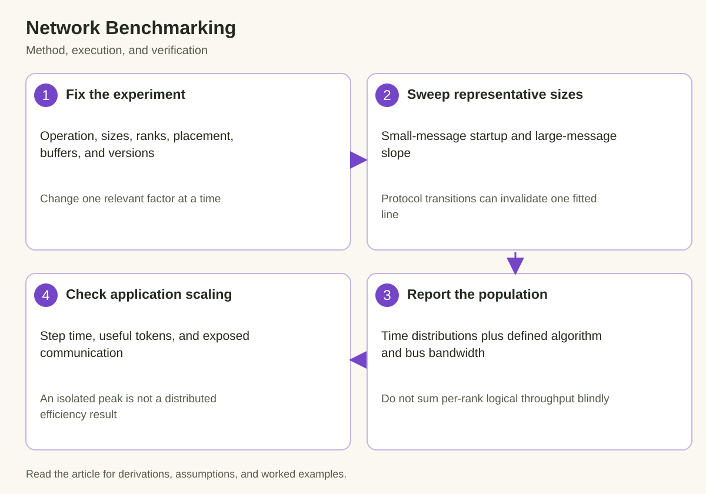

A network benchmark is valuable when it explains a workload, not merely when it produces a large bandwidth number. The same cluster can show excellent throughput for a huge all-reduce and poor performance for the smaller messages that dominate a real training schedule. Different rank placement or timing boundaries can change the result without changing the network hardware.

The correct experiment connects a defined operation to a defined topology and message population. It records actual elapsed time, identifies how derived bandwidth is calculated, and repeats under the concurrency conditions relevant to the job. Application scaling then tests whether that communication behavior matters to useful progress.

This article develops that experiment from pair tests through multi-node collectives. Numerical examples are illustrative calculations. Tool options and exported fields should be checked against the benchmark version actually installed.

## 1. State the question before selecting a benchmark

*The diagram connects the mechanism to its execution and verification. The derivation below defines the quantities and assumptions.*

Different questions require different tests. A pair-transfer test asks whether a particular source and destination path can move supported buffers efficiently. A collective test asks how a group executes a distributed operation. An application trace asks how that operation interacts with readiness and computation.

Write a hypothesis such as: cross-node large-message bandwidth is limited by one GPU-to-NIC path, or small gradient buckets expose excessive startup. The benchmark should distinguish that hypothesis from plausible alternatives. Measuring only one maximum-bandwidth point cannot answer either question reliably.

Define the operation, dtype, logical payload, participating ranks, process model, buffer location, and timing boundary. Preserve versions and device mappings. A one-process multi-GPU test can involve different host behavior from many processes, even if both use the same accelerators.

Keep correctness as part of the experiment. Inputs should reveal missing contributions and layout errors, and outputs should be checked under appropriate numerical tolerances. A benchmark that transfers zeros correctly provides weaker evidence than a deterministic pattern whose expected reduction can be calculated.

## 2. Build a size sweep around the application's messages

Include the small-message latency region, the transfer-dominated region, and the actual application sizes. Geometric spacing is useful for exploring a broad range, while extra points near an observed transition help locate its cause. Do not let the sweep omit the sizes used by the job simply because they are inconvenient.

A startup-plus-transfer model is

$$
T(n)\approx\alpha+n/\beta,
$$

where n is bytes, alpha is startup time, and beta is effective payload bandwidth under the tested conditions. Fit within an approximately consistent regime. Changes in algorithm, protocol, chunking, or resource saturation can produce multiple regimes rather than one line.

For illustrative alpha=8 microseconds and beta=40 GB/s, a 4 KiB payload has about 0.102 microseconds of serialization, whereas 64 MiB has about 1.678 milliseconds. These points emphasize very different resources. A configuration improving one region can regress the other.

Preserve the raw size-time observations and diagnostic output. A bandwidth curve alone can hide a latency intercept, and a single fitted slope can hide a protocol cliff. Later comparisons should be able to reconstruct what changed without assuming the same model remains valid.

## 3. Separate initialization, warmup, and steady state

Communicator creation, connection setup, allocation, registration, and first-use behavior can precede steady transfers. Whether they belong in the measurement depends on the question. A long-lived training job usually amortizes some setup, while a short-lived service or benchmark invocation may care about startup directly.

Measure cold setup and reused-communicator performance separately when both matter. Warmup should exercise the same operation and buffer population as the measured case. Warming one path and measuring another can leave important first-use costs in the result accidentally.

Synchronize at the appropriate boundary for elapsed-time measurements. Host posting time alone may not include device or transport completion. Conversely, adding unrelated global synchronization can include work outside the intended operation. Document the method so another operator can reproduce the duration.

A benchmark with many repetitions can also change thermal and registration-cache state. Observe sustained behavior rather than assuming the first few iterations represent production. Keep the duration and stabilization policy consistent between candidates.

## 4. Report distributions and paired comparisons

Repeated measurements reveal variability from traffic contention, scheduling, and host execution. Report sample count and a suitable distribution summary, not only the best observed run. The minimum can describe an attainable isolated path, but it is a poor forecast of ordinary or tail behavior.

For observations T_i, sample mean and standard deviation are

$$
\overline T=\frac{1}{N}\sum_iT_i,\qquad s=\sqrt{\frac{1}{N-1}\sum_i(T_i-\overline T)^2}.
$$

These summaries do not fully describe multimodal or heavy-tailed results. Preserve percentiles or raw samples where useful, and inspect time ordering. A gradual drift or periodic stall can disappear inside one aggregate standard deviation.

Compare baseline and candidate in interleaved or otherwise controlled runs when practical. Paired observations under similar conditions can reduce confusion from changing background traffic. State the pairing method and avoid treating correlated repetitions as independent evidence without examining the measurement process.

An illustrative change from 2.0 to 1.9 milliseconds is a 5% reduction. If ordinary run-to-run variation is several tenths of a millisecond, the ranking needs more evidence. The appropriate conclusion is uncertainty, not an extra decimal place in the speedup.

## 5. Interpret algorithm and bus bandwidth by operation

Algorithm bandwidth commonly uses logical input size divided by time:

$$
B_{\mathrm{alg}}=n/T.
$$

NCCL tests also define bus-bandwidth conversions for individual collectives. For all-reduce, the documented conversion factor is 2 times p minus 1 divided by p. Other operations have different factors. These are benchmark accounting conventions intended to reflect relevant traffic, not universal observations of every physical link.

For an illustrative 8-rank all-reduce processing 256 MiB in 20 milliseconds, algorithm bandwidth is about 13.42 GB/s. Applying the factor 1.75 gives about 23.49 GB/s bus bandwidth under that definition. Neither number is the sum of all network-port rates in the cluster.

Always retain elapsed time alongside bandwidth. Application models use the operation duration; derived bandwidth helps explain efficiency. Summing logical throughput across ranks can double-count the same distributed result and produce a misleading aggregate claim.

Specify decimal or binary units and whether a rate is directional. A nominal link specification in gigabits per second cannot be compared directly with a tensor throughput in GiB/s. Unit mistakes can look like a substantial performance gap.

One useful unit check starts from the payload itself. A 64 MiB tensor contains 67108864 bytes. Dividing by an illustrative 2-millisecond duration yields 33.55 GB/s or 31.25 GiB/s. Multiplying the decimal byte rate by 8 gives 268.44 Gb/s. These are different expressions of the same logical throughput, before applying any collective traffic factor. If a report switches between them without labels, the apparent difference is arithmetic rather than hardware behavior. Keep the original bytes and elapsed seconds in the saved data so every derived rate can be checked.

## 6. Sweep topology as well as message size

Start with relevant device pairs, then the local accelerator group, then cross-node groups. Compare placements within and across network boundaries such as leaf domains or rails. This hierarchy helps identify where a degradation first appears.

Record rank-to-GPU, rank-to-NIC, CPU affinity, and NUMA placement. A benchmark launcher can change these assignments between runs. Preserve the mapping as an artifact, because an unexplained placement change can imitate a library regression.

Measure direction and pair variation rather than only one average. A collective can be limited by the slowest relevant participant or shared cut. A pair matrix reveals locality differences that disappear inside a fleet summary.

Increase concurrent traffic deliberately when production uses it. An isolated pair can reach a rate unavailable when several GPUs share an adapter or upstream interface. Compare aggregate demand and per-flow time so improved resource utilization is distinguished from oversubscription.

## 7. Convert collective results into scaling evidence

Strong scaling fixes total useful work while adding devices. Let T_1 be a suitable single-device or baseline-group time and T_p the time with p relative workers. A simplified speedup and efficiency are

$$
S_p=T_1/T_p,\qquad\eta_p=S_p/p.
$$

The baseline must be feasible and semantically comparable. A model that cannot fit on one device cannot use an imaginary single-device time as a measured baseline. Use a defined feasible group and adjust the relative worker count accordingly.

Weak scaling grows total work with resources and asks whether time per scaled unit remains stable. State which experiment is being reported. Changing global batch, sequence length, or gradient accumulation can alter both computation and communication, so it is not a neutral scaling adjustment.

Collect useful tokens or completed updates alongside step time. Faster steps with less work per step do not necessarily improve useful throughput. For training comparisons, also preserve the optimization semantics relevant to the experiment rather than presenting a changed batch regime as an implementation-only speedup.

## 8. Locate the application's exposed communication tail

A benchmark measures a collective under controlled readiness. A training job may launch buckets during backward computation, and some communication can be hidden. The job waits for the remaining dependency-critical portion, not necessarily the sum of all collective durations.

Trace readiness, communication progress, and the next consumer. If an operation is fully hidden, improving it may not shorten the step. If the final bucket is exposed, its duration can matter directly. Resource contention can also slow neighboring computation despite apparent overlap.

For an illustrative baseline with 80 milliseconds of computation and a 10-millisecond exposed tail, cutting the tail to 5 milliseconds changes total time from 90 to 85 milliseconds. That is about a 5.6% time reduction, even though the exposed communication became twice as fast.

Compare per-rank arrival and completion to identify stragglers. A rank delayed by input or host execution can make other ranks appear communication-bound. The correct next test is upstream readiness, not necessarily another bandwidth sweep.

A practical comparison matrix can hold one row per message size and placement, with baseline and candidate time, sample count, variation, selected path, and correctness outcome. Add a separate column for the application frequency of that message. A 20% improvement on a rare transfer can contribute less than a 2% regression on a transfer executed hundreds of times per step. Weighting isolated measurements is still only an approximation when overlap changes, but it helps prioritize which trace to inspect. The final decision should follow the measured application outcome rather than the visually most impressive cell in the matrix.

## 9. Keep a regression record that supports diagnosis

Preserve commands or structured configuration, software versions, topology mappings, message-size data, repetitions, correctness results, and selected diagnostics. Mark cold and steady-state results separately. These artifacts make a later regression explainable rather than merely detectable.

Use a compact set of representative cases for recurring checks: small-message latency, large-message transfer, a topology-sensitive group, and an application synchronization phase. A full exhaustive sweep is useful during investigation but may be unnecessary for every change.

Define expected variation and compare like populations. A change in background load or placement should be recorded, not silently absorbed into a pass/fail threshold. When a case fails, retain enough evidence to distinguish path selection, protocol behavior, shared capacity, and rank readiness.

The benchmark's purpose is to connect communication behavior to useful distributed work. Size sweeps reveal latency and bandwidth regimes, topology sweeps reveal physical constraints, and application traces reveal exposed dependencies. Reporting those together makes the result actionable without pretending that one peak number describes the cluster.

## Sources

- [NCCL tests and usage](https://github.com/NVIDIA/nccl-tests).
- [NCCL tests bandwidth definitions](https://github.com/NVIDIA/nccl-tests/blob/master/doc/PERFORMANCE.md).
- [NCCL troubleshooting](https://docs.nvidia.com/deeplearning/nccl/user-guide/docs/troubleshooting.html).
