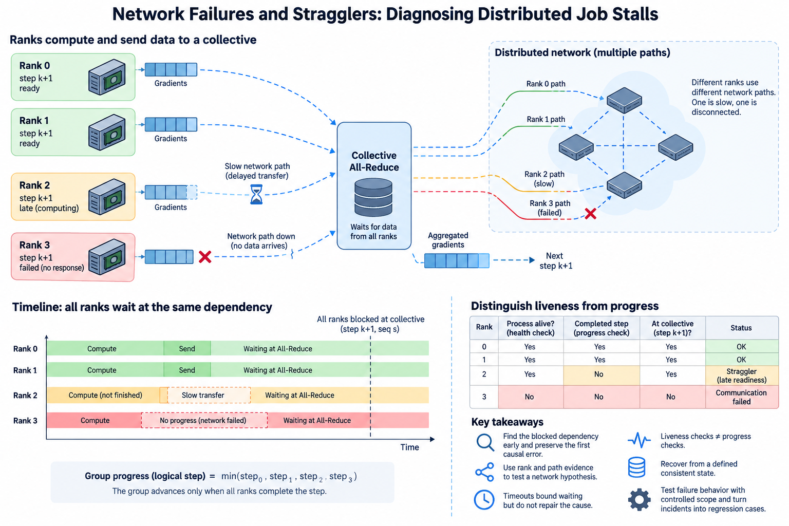
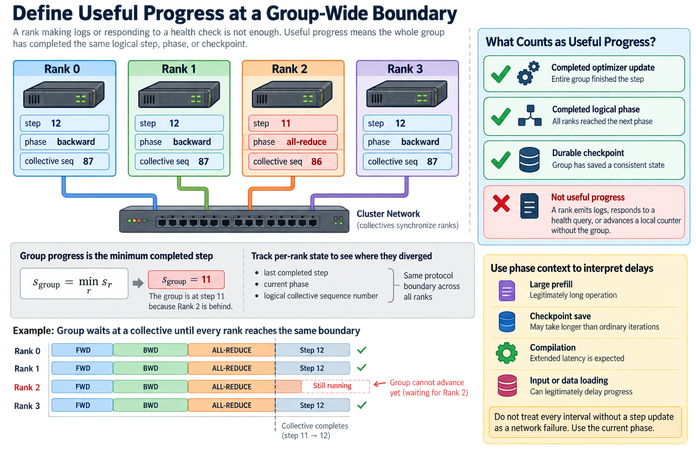
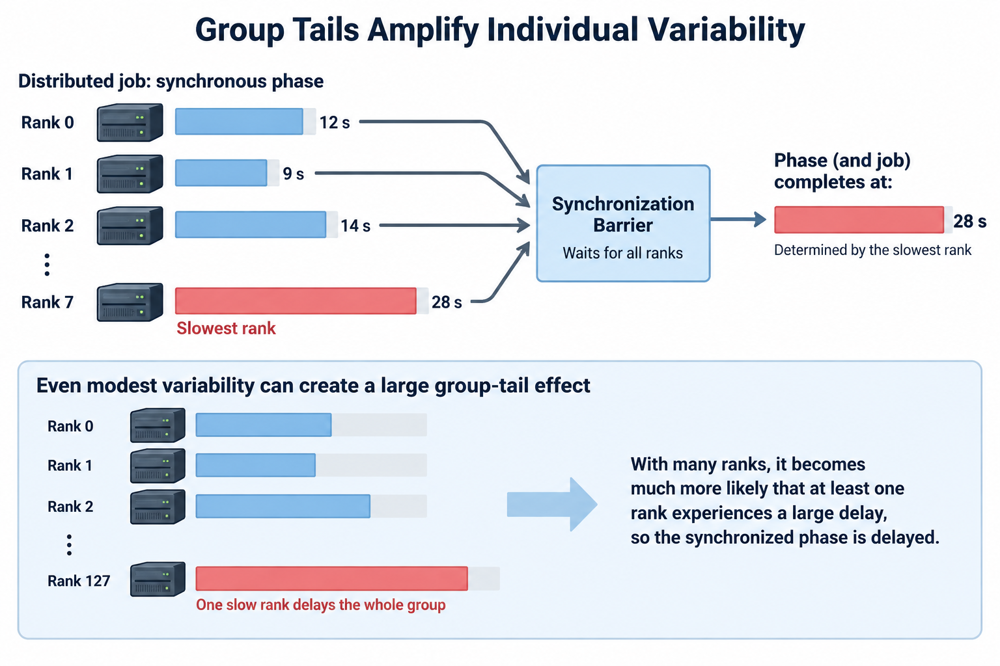
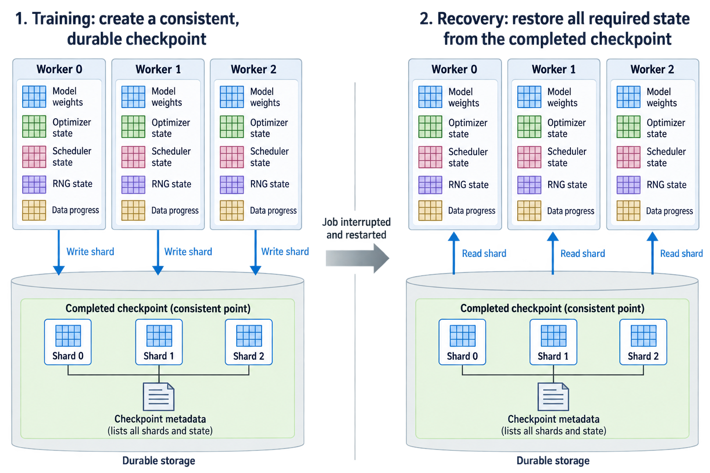
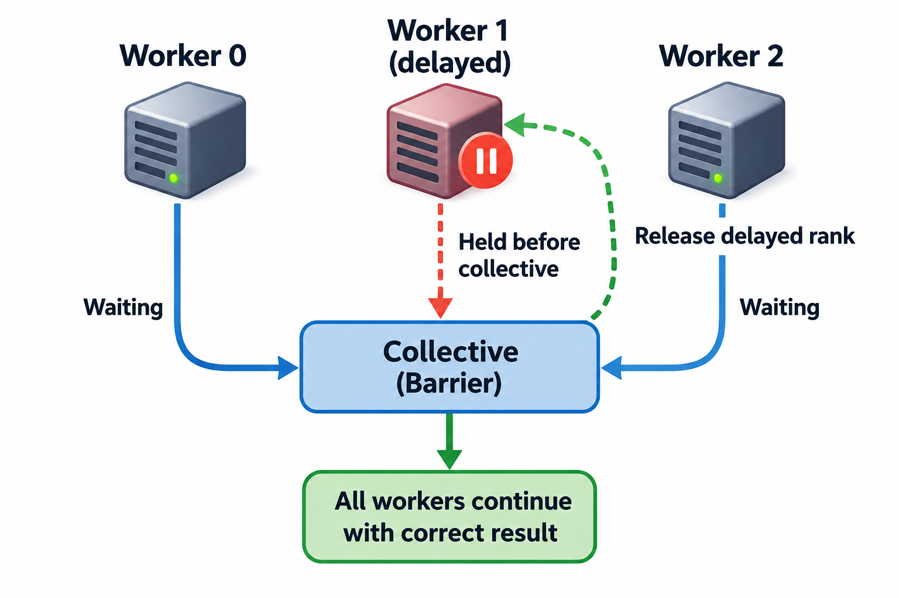

## Overview

A distributed job can stall while every process remains alive and every GPU still appears allocated. One rank may be late, another may have failed asynchronously, or a collective may be waiting for a participant that entered a different operation. A network-path failure is one possible cause among several.

The challenge is to identify the blocked dependency before a cascade of timeouts obscures the original event. Liveness checks reveal that a process responds. Progress checks reveal whether the group advances through the expected computation. Correlated rank and path evidence connects the two.

This article develops a diagnosis and recovery method for distributed stalls. The probability calculations are illustrative models, not measured cluster failure rates. Timeout, tracing, and restart capabilities depend on the installed framework and communication stack.

## Deep dive

### 1. Define useful progress at a group-wide boundary

Choose progress events that have clear semantics: completed optimizer updates, completed logical phases, or durable checkpoints. A rank emitting logs or responding to a health query does not establish that the entire group has completed another update.

Record the last known common step and the current phase on each rank. Include logical collective sequence numbers where controlled instrumentation supports them. The goal is to determine where the ranks diverged, not merely which process eventually reported a timeout.

A simple group-progress indicator can be the minimum completed logical step across ranks:

$$
s_{\mathrm{group}}=\min_r s_r.
$$

This bookkeeping assumes the step counters describe the same protocol boundary. Independently incremented counters with different meanings cannot be combined safely. The minimum can help identify a lagging participant, but it does not certify a recoverable checkpoint.

Distinguish absence of progress from expected long work. A very large prefill, checkpoint save, compilation, or input operation may legitimately take longer than ordinary iterations. The detector needs phase context rather than treating every interval without a step update as a network failure.

### 2. Group tails amplify individual variability

If a synchronized phase waits for every participant, its completion is influenced by the slowest relevant rank. Even modest per-rank variability can therefore create a large group-tail effect as participation grows.

Under an illustrative independence model with identical per-rank completion distribution F(t), the maximum's distribution is

$$
P(T_{\max}\le t)=F(t)^p.
$$

If each rank has a 1% chance of exceeding a threshold, the probability that at least one of 128 independent ranks exceeds it is 1 minus 0.99 raised to 128, about 72.4%. This is not a prediction for a real job; rank delays can be correlated and distributions can differ.

The model explains why single-rank p99 is insufficient to describe a large synchronized group's tail. Measure the actual per-rank and group populations. Shared storage, fabric congestion, and host scheduling can create correlated delays that require different analysis from independent noise.

Inspect which rank is late across repeated events. A consistently late placement suggests a persistent path or resource issue. A changing late rank can suggest workload variability, shared contention, or a broader scheduling problem. These patterns guide the next test without establishing the cause by themselves.

### 3. Separate late readiness from stalled communication

Trace the preceding computation and entry into the collective. A rank waiting on input or a long kernel has not yet supplied its contribution. Peers can spend a long interval inside communication even though the network is not the original bottleneck.

Compute readiness skew from comparable per-rank events, using the latest minus earliest readiness time. Also inspect progress after the required participants are ready. This separates participation delay from transfer or protocol delay within the limitations of the tracing method.

For an illustrative event, 7 ranks become ready at 20 milliseconds while one becomes ready at 80 milliseconds. A collective finishing at 90 milliseconds gives early ranks a 70-millisecond interval, but much of it precedes the final participant's readiness.

If the late rank never enters the expected operation, inspect collective ordering, conditional branches, and earlier failures. A mismatch in group, count, dtype, or operation can create a permanent wait. Increasing the timeout cannot make incompatible distributed participation correct.

### 4. Preserve the first causal error

Asynchronous device errors and transport failures can surface after the operation that caused them. A launcher may then terminate peers, producing many secondary errors. Preserve timestamps and rank context around the earliest relevant event rather than focusing only on the final shutdown message.

Collect bounded logs from all ranks involved in the failing group. Include phase and operation sequence so events can be compared logically even when cross-host clocks are imperfect. Monotonic local durations remain useful, while exact global ordering needs a documented clock relationship.

Inspect device error reports, process exits, communication diagnostics, and adapter or link events. A rank that stopped after a kernel failure can leave others waiting in a collective. A path-down event aligned with communication loss supports a different hypothesis.

Avoid assuming that the first printed message is necessarily causal. Logging can be buffered, and error propagation can differ across ranks. Use the protocol sequence and correlated evidence to identify the earliest failed dependency the observations actually support.

### 5. Use path evidence to test a network hypothesis

Map the affected ranks to GPUs, adapters, hosts, and relevant switch boundaries. Compare with healthy ranks and paths. A stall limited to one adapter or cut can suggest a localized resource or connectivity problem, while broad simultaneous degradation can suggest a shared dependency.

Inspect link state, error and retry counters, congestion evidence, and transport selection using supported diagnostics. Counter increases need a defined interval and traffic population. Historical totals can contain unrelated events and should not automatically be attributed to the current stall.

Reproduce with controlled host-buffer and GPU-buffer tests after preserving the failure evidence. If both fail across the same boundary, the external path becomes a stronger candidate. If only GPU buffers fail, registration, locality, and device synchronization deserve attention.

An isolated healthy test does not disprove an intermittent failure or congestion under concurrency. Match message sizes, rank groups, and traffic timing where possible. A reproduction that removes the original burst or placement can remove the symptom along with the suspected cause.

### 6. Distinguish health checks from progress checks

A heartbeat can show that a process or endpoint is responsive. It may continue during a blocked collective if another thread handles the heartbeat. Device queries can also respond while the application's execution is stalled. These signals are useful but have limited scope.

A progress detector should observe protocol events appropriate to the job phase. It can track how long the group remains at one logical boundary and compare that duration with an expected range. Include context for checkpointing, compilation, and unusually large work.

A simple detection delay budget is

$$
T_{\mathrm{detect}}\approx T_{\mathrm{observation\ interval}}+T_{\mathrm{threshold}}+T_{\mathrm{reporting}}.
$$

This approximation identifies the tradeoff between fast detection and false alarms. It does not prescribe a universal threshold. Real detectors may use multiple missed observations, adaptive baselines, or framework-specific failure signals.

Test false-positive behavior under legitimate long phases. A detector that repeatedly kills healthy jobs can reduce goodput more than the occasional stall it catches. Report both detection latency and incorrect termination rate under representative workloads.

### 7. Timeouts bound waiting but do not repair the cause

A timeout defines when an operation is considered unable to continue under the current policy. Making it longer can tolerate expected variability, but it can also prolong wasted resource allocation after a permanent failure. Making it shorter can detect failures sooner while rejecting healthy slow operations.

Set policy using observed phase distributions and the system's supported failure behavior. Keep operation timeout, launcher supervision, and service deadline distinct. They may start at different boundaries and trigger different cleanup paths.

Do not resume a partially failed collective by simply allowing surviving ranks to continue with their local tensors unless the framework explicitly supports that protocol. Their state can diverge, and communicator membership or outstanding operations may no longer be valid.

Preserve the reason for termination and ensure cleanup releases devices, adapters, buffers, and scheduler allocations through supported paths. A failed job that leaves stale resources can damage later jobs and make recovery appear unreliable for a different reason.

### 8. Recover from state with defined consistency

For training, recovery normally restores a supported checkpoint containing the state required to continue the optimization method. Model weights alone may omit optimizer, scheduler, random-number, and data-progress state. The exact reproducibility target should be documented.

A durable checkpoint is different from a queued asynchronous save. Recovery should use a completed state whose metadata and shards describe a consistent logical point. A directory's existence does not establish that all required data reached durable storage.

A simplified interruption cost is

$$
T_{\mathrm{lost}}=T_{\mathrm{detect}}+T_{\mathrm{cleanup}}+T_{\mathrm{restart}}+T_{\mathrm{restore}}+T_{\mathrm{replayed}}.
$$

Some components can overlap, so this serial model is an accounting starting point. Measure useful recovered progress as well as startup completion. A process becoming healthy does not establish that the restored job successfully executed its next optimizer update.

Use the [checkpoint and recovery method](/blog/distributed-checkpoints-recovery-goodput/) to define state and test restart. Repeated recovery tests should include the supported world-size or sharding changes if those are part of the operating policy.

### 9. Test failure behavior with controlled scope

Use a dedicated test environment and supported fault mechanisms to exercise worker termination, transport interruption, delayed participation, and unavailable checkpoint storage where relevant. Keep the experiment bounded and separate from unrelated production traffic.

For each case, verify detection, first-error preservation, cleanup, restart, restored consistency, and useful progress. A test that ends when the launcher exits verifies only termination, not recovery. A test that ends when workers start verifies only part of restart.

Include slow-but-healthy cases to evaluate false positives. Delay input or introduce representative long computation without changing collective ordering. Compare how the detector handles these cases with true failed participation and path loss.

A deterministic delayed-rank test can hold one rank before a known collective, record the others' wait, then release it. The expected result should still be correct after completion. A mismatched-operation test has different semantics and should be expected to fail under the supported detector rather than be released as though it were ordinary latency. Keeping these cases distinct verifies that diagnostics classify the blocked dependency instead of labeling every wait as a broken network.

### 10. Convert incidents into regression cases

Keep a compact incident record containing the workload, last common progress, rank divergence, first supported causal evidence, failing layer, recovery action, and verification result. Preserve the minimal reproducer and relevant topology mapping.

Measure goodput over an interval that includes detection and recovery. High utilization before the failure and a successful restart afterward can still coexist with substantial lost useful work. The end-to-end metric should count durable or otherwise accepted progress according to the job's objective.

Revisit detection policy after changes to model size, checkpointing, hardware, or communication scheduling. Healthy phase durations can change, and a static threshold can become either too permissive or too aggressive.

## Conclusion

Distributed stalls are dependency failures that require group-wide evidence. Identify the last common progress, separate readiness from transport, preserve the first causal error, and recover through a supported consistency boundary. The network is an important layer of that investigation, but reliable diagnosis begins with what every participant was required to do next.

### Sources

- [NCCL troubleshooting](https://docs.nvidia.com/deeplearning/nccl/user-guide/docs/troubleshooting.html).
- [PyTorch distributed communication and debugging](https://docs.pytorch.org/docs/stable/distributed.html).
- [PyTorch Distributed Checkpoint](https://docs.pytorch.org/docs/stable/distributed.checkpoint.html).
