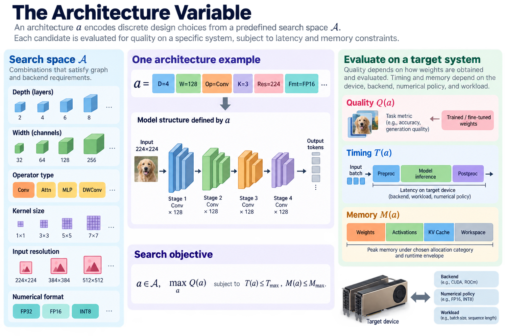
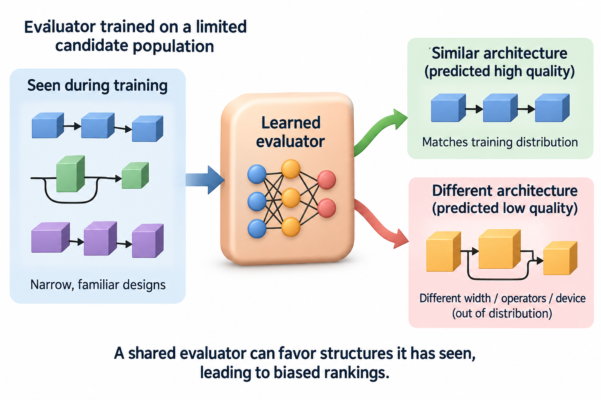

Neural architecture search automates choices about model structure. For efficient deployment, the search must connect quality to a resource constraint on a particular system. The difficulty is that evaluating an architecture can require training, export, and device measurement. A search method therefore also needs a strategy for making its own preparation cost manageable.

This article separates the search space, optimization mechanism, quality estimator, and hardware evidence. It explains innovations in differentiable search, target-aware search, and shared supernet specialization without treating every selected architecture as equally validated. The search result is a hypothesis until the deployed artifact satisfies the intended task and resource budget.

*An original conceptual illustration. Numerical plots and examples are illustrative unless explicitly identified as measured evidence.*

## 1. Define the architecture variable

Let a encode a model's discrete choices: depth, widths, operator types, kernel sizes, resolution, or other allowed structure. The search space A contains combinations that satisfy basic graph and backend requirements.

$$
a\in\mathcal A,\qquad \max_a Q(a)\quad\text{subject to}\quad T(a)\le T_{\max},\ M(a)\le M_{\max}.
$$

Quality Q depends on how candidate weights are obtained and evaluated. Timing T depends on device, backend, numerical policy, and workload. Memory M depends on the chosen allocation category and runtime envelope.

Those dependencies belong in the specification. A search over model names with an unexplained quality score and generic FLOP constraint does not fully define an efficient deployment problem.

## 2. Design the search space deliberately

A search algorithm cannot choose an operation absent from its space. Conversely, a very broad space can make evaluation expensive and include many unsupported or poor candidates. Search-space design already encodes architectural judgment.

Specify compatible branch dimensions, residual interfaces, grouping rules, and export constraints. If resolution changes, preprocessing and quality evaluation must preserve the task definition. If numerical formats vary, include their backend support.

Compare search methods within the same space when the goal is to isolate the optimization mechanism. A better result from a different operator family can reflect the space rather than a superior search algorithm. Both contributions can be useful, but they require different explanations.

## 3. Estimate exhaustive search cost

Suppose a design has J independent locations and K choices per location. The space contains K to the power J combinations before compatibility restrictions.

$$
|\mathcal A|=K^J,\qquad C_{\mathrm{exhaustive}}\approx|\mathcal A|\,C_{\mathrm{candidate}}.
$$

For an illustrative 12 locations with 4 choices each, there are 16,777,216 combinations. Training each independently is usually impractical, even before device evaluation.

This motivates cheaper candidate evaluation and more selective exploration. The same calculation also explains why a search budget must be reported. A method that explores more candidates or uses a larger preparation resource can gain an advantage unrelated to the elegance of its optimizer.

## 4. Use random search as an informative baseline

Sampling feasible architectures provides a transparent baseline against which more elaborate selection can be assessed. It can reveal whether the search space already contains many good candidates or whether resource constraints exclude most of it.

A random baseline should use the same candidate evaluation and search budget where feasible. Otherwise a comparison can confuse optimizer quality with evaluator cost or training effort.

Inspect the distribution of quality and resource use across sampled candidates. If a sophisticated method barely improves over that distribution, the search mechanism may contribute less than the space and training recipe. An understandable baseline makes that conclusion visible rather than hiding it behind one selected model.

## 5. Explain a differentiable relaxation

Differentiable search can replace a discrete operator choice with a weighted mixture controlled by architecture parameters alpha. Softmax creates normalized nonnegative weights for candidate operations.

$$
o_{\alpha}(x)=\sum_{k=1}^{K}\pi_k(\alpha)o_k(x),\qquad \pi_k=\frac{e^{\alpha_k}}{\sum_j e^{\alpha_j}}.
$$

Gradients can then update architecture weights alongside model weights under a chosen procedure. DARTS is a primary example of this broad relaxation approach.

The mixed training graph is not the final discrete architecture. Running several candidate operations can increase search memory and computation. Selecting one operation afterward also changes the graph, so relaxed performance and discrete deployment performance require separate evaluation.

## 6. Understand the bilevel formulation

Architecture selection and weight training have distinct roles. A common theoretical formulation minimizes validation loss over architecture parameters while model weights solve a training-loss problem.

$$
\min_{\alpha}\mathcal L_{\mathrm{val}}(w^*(\alpha),\alpha),\qquad w^*(\alpha)=\arg\min_w\mathcal L_{\mathrm{train}}(w,\alpha).
$$

Exact nested optimization is costly. Practical methods approximate the inner solution and architecture gradients, with method-specific assumptions. Those approximations can influence which structures are selected.

Preserve the training and validation split used during search. Architecture parameters can overfit selection data just as ordinary hyperparameters can. A final held-out evaluation remains necessary even when the search itself never directly updates weights on that test population.

## 7. Bring resource cost into the objective

A resource predictor or lookup table can estimate candidate latency. A relaxed objective can penalize expected operator cost under architecture weights, though complete graph behavior can differ from the sum.

$$
\widehat T(\alpha)=\sum_{j,k}\pi_{j,k}(\alpha)t_{j,k},\qquad \mathcal J=\mathcal L_{\mathrm{val}}+\lambda\widehat T.
$$

The expression is illustrative and not the exact loss of every named search method. The coefficient lambda converts a resource preference into the optimization convention; a constrained formulation can handle budgets more explicitly.

Operator timings need the target shapes, datatype, and device. Fusion and conversion can violate additive assumptions. Verify final exported architectures, especially those predicted to sit close to the acceptance boundary.

## 8. Explain target-aware innovations

MnasNet uses platform-aware feedback in architecture selection. FBNet develops differentiable hardware-aware design, while ProxylessNAS addresses the cost of searching more directly on a target task and hardware configuration.

Their implementations and optimization procedures differ. The shared innovation relevant here is connecting selection to practical resource feedback and reducing reliance on a convenient but potentially misleading proxy task or FLOP score.

Use each paper's exact method when implementing it. A generic softmax mixture and additive latency equation explains one design pattern but does not reproduce every algorithm. Keep published benchmark results attached to their original device, task, training recipe, and measurement policy.

## 9. Explain weight sharing and supernets

A supernet contains several candidate subnetworks that share some parameters. Training it can reduce the cost of evaluating many structures compared with training each from scratch.

The quality of a subnet using inherited weights is an estimate of its eventual performance under a defined specialization policy. Shared training can favor some paths or create interference. Candidate rankings under shared weights need not match rankings after independent training.

Document path sampling, shared parameter interfaces, and the final candidate training procedure. If candidates are evaluated under unequal exposure during supernet training, the search score can reflect training history as well as architectural quality.

## 10. Understand once-for-all specialization

Once-for-All separates a substantial shared training phase from selecting subnetworks for several deployment constraints. Its progressive shrinking procedure supports variation in dimensions such as depth, width, kernel size, and resolution under the paper's design.

This makes preparation amortization part of the efficiency story. One trained family can serve several target operating points without repeating the entire independent architecture-training process for each.

The benefit depends on reuse and the covered space. A deployment outside the trained family's supported options may still need new work. Report the shared training cost, specialization procedure, candidate validation, and device measurement rather than describing specialization as universally costless.

## 11. Work through amortization

Suppose an illustrative independent design-and-training procedure costs 100 device-hours per deployment target. A shared-family preparation costs 500 device-hours, and specialization plus evaluation costs 5 device-hours per target.

$$
C_{\mathrm{independent}}=100K,\qquad C_{\mathrm{shared}}=500+5K.
$$

Under those assumptions, shared preparation becomes cheaper once K exceeds approximately 5.26, so at least 6 targets are needed for this integer comparison.

These invented costs explain the accounting rather than report any paper's benchmark. Include differences in candidate quality, device coverage, and final training before using amortization to make a real decision. A cheaper preparation phase is not useful if the resulting artifacts miss the required operating points.

## 12. Validate rankings and constraints

Compare predicted and measured latency for shortlisted candidates. Inspect quality rankings under inherited weights and the intended final training policy. The most important errors are those that change candidate selection or budget feasibility.

A high average correlation can hide mistakes near the Pareto frontier. Evaluate the actual contenders, not only a broad random set dominated by obviously poor candidates.

Store the exported graph and measurement configuration with each selected architecture. Constraint satisfaction must refer to the complete artifact under the intended workload. A search log's estimated latency does not establish that a production request meets its deadline.

## 13. Report the full search bill

Preparation includes supernet or candidate training, resource-table generation, candidate evaluation, failed runs, final retraining, and export work. Count whichever terms matter to the chosen resource objective.

A search method can produce efficient inference while using expensive preparation. That can be worthwhile for a widely reused model, but the phase distinction must remain visible. Report device-hours or another consistent cost unit with hardware identity.

No architecture-search run, training experiment, or GPU timing was performed for this article. The equations and amortization example are explanatory. Primary papers supply evidence under their conditions; a new deployment requires independent quality and execution evaluation.

## 14. Choose search when the space justifies it

Search is most useful when there are meaningful architectural alternatives, an evaluator that predicts relevant outcomes, and enough reuse to justify preparation. A small design space can sometimes be explored more transparently with controlled manual experiments.

Begin from supported operations and a strong baseline. Identify whether the difficult decision is structure, numerical representation, or an execution bottleneck better solved in the backend. Searching architecture variables cannot repair every software issue.

The useful result is a reproducible quality-resource point with a known preparation cost. Explaining how the candidate was selected and validated makes neural architecture search an engineering method rather than a black box that produces an impressive model name.

## 15. Examine selection bias in shared evaluators

An evaluator trained or calibrated on a limited candidate population can favor structures similar to those it has seen. Extrapolating to different widths, operator families, or devices can change both timing and quality rankings.

Inspect coverage before trusting a predictor. Add measurements where uncertainty affects the selected frontier and reserve independent candidate checks for final validation. A predictor can reduce search cost without becoming a substitute for target-system evidence.

The same principle applies to supernet weights. Shared exposure is not uniform unless the procedure makes it so, and even uniform sampling does not guarantee identical optimization difficulty across paths. Report how subnet scores are obtained and what final training changes.

These limitations do not make automated search unhelpful. They identify the assumptions that connect a cheap evaluator to a costly deployment decision. A rigorous method keeps those assumptions visible and tests the shortlisted artifacts where an incorrect ranking would matter most.

## 16. Preserve the final discrete configuration

Architecture parameters from a relaxed search are not a complete deployment artifact. Export the selected operators, widths, depth, resolution, numerical policy, and trained weights explicitly. Verify branch dimensions and preprocessing after discretization, because the final graph can differ from the mixed graph used during search.

A small reproducibility package should contain the search-space definition, evaluator settings, selected candidate configuration, final training policy, and measured resource envelope. This allows another engineer to distinguish reproducing the search from simply evaluating the published candidate.

Those are different tasks with different costs. A deployment can reuse a verified candidate without repeating the entire search, while a research comparison may need to rerun selection under an equal preparation budget. Keeping the distinction explicit prevents inference efficiency from being confused with the cost of discovering the architecture.

## Sources

- [DARTS: Differentiable Architecture Search](https://arxiv.org/abs/1806.09055).
- [MnasNet](https://arxiv.org/abs/1807.11626).
- [ProxylessNAS](https://arxiv.org/abs/1812.00332).
- [FBNet](https://arxiv.org/abs/1812.03443).
- [Once-for-All](https://arxiv.org/abs/1908.09791).
