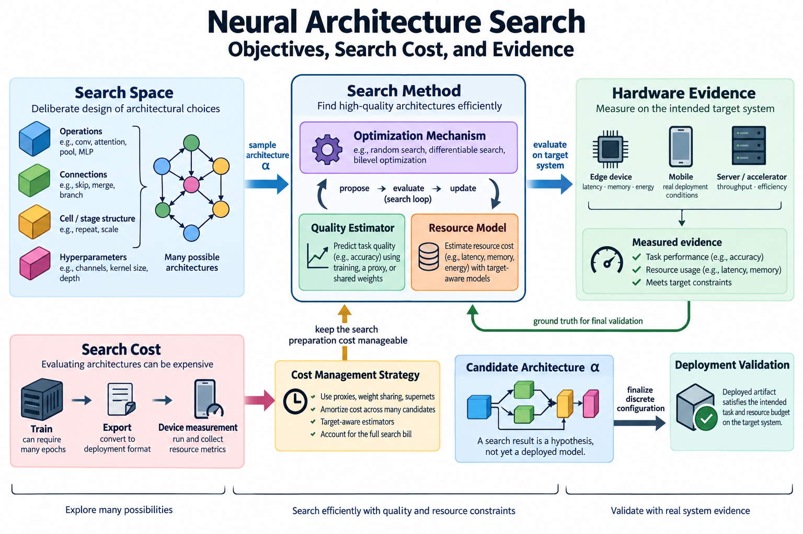
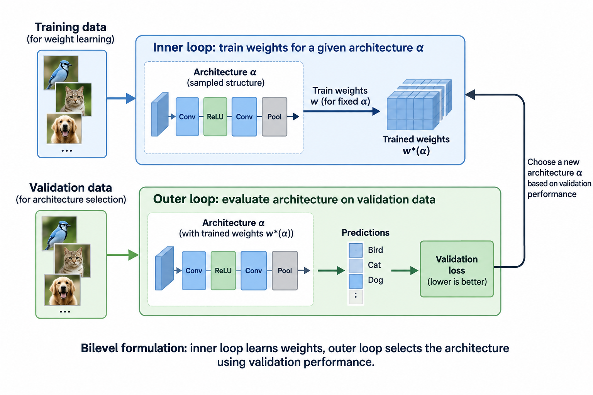
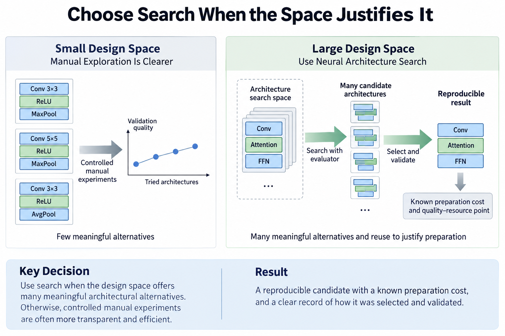
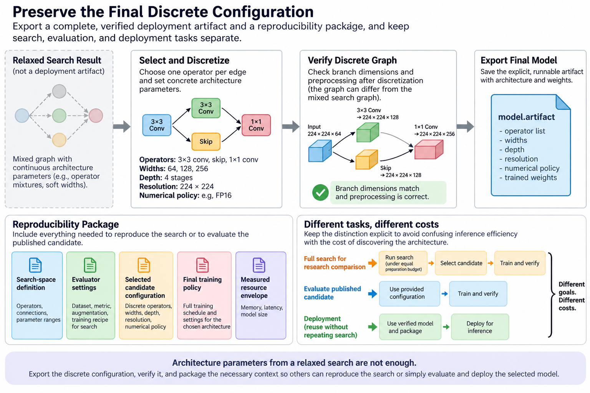

## Overview

Neural architecture search automates choices about model structure. For efficient deployment the search must tie quality to a resource constraint on a particular system, and the hard part is that evaluating one candidate can require 3 separate steps: training, export, and device measurement, so a search method also needs a plan for keeping its own preparation cost manageable.

This article separates 4 parts: the search space, the optimization mechanism, the quality estimator, and the hardware evidence. It explains innovations in differentiable search, target-aware search, and shared supernet specialization without treating every selected architecture as equally validated. The search result stays a hypothesis until the deployed artifact satisfies the intended task and resource budget.

*An original conceptual illustration. Numerical plots and examples are illustrative unless explicitly identified as measured evidence.*

## Deep dive

### 1. Define the architecture variable

Let a encode a model's discrete choices: depth, widths, operator types, kernel sizes, resolution, or other allowed structure. The search space A contains combinations that satisfy basic graph and backend requirements.

$$
a\in\mathcal A,\qquad \max_a Q(a)\quad\text{subject to}\quad T(a)\le T_{\max},\ M(a)\le M_{\max}.
$$

Quality Q depends on how candidate weights are obtained and evaluated. Timing T depends on 4 factors: the device, the backend, the numerical policy, and the workload. Memory M depends on the chosen allocation category and runtime envelope.

Those dependencies belong in the specification. A search over model names with an unexplained quality score and a generic FLOP constraint does not fully define an efficient deployment problem.

### 2. Design the search space deliberately

A search algorithm cannot choose an operation that is absent from its space, and a very broad space makes evaluation expensive while filling the candidate pool with unsupported or plainly poor designs, so search-space design already encodes much of the architectural judgment before any optimizer runs.

Specify 4 constraints: compatible branch dimensions, residual interfaces, grouping rules, and export limits. If resolution changes, preprocessing and quality evaluation must preserve the task definition. If numerical formats vary, include their backend support.

Compare search methods within the same space when the goal is to isolate the optimization mechanism. A better result from a different operator family can reflect the space rather than a superior search algorithm, and the 2 contributions can both be useful, but they call for different explanations.

### 3. Estimate exhaustive search cost

Suppose a design has J independent locations and K choices per location. The space contains K to the power J combinations before compatibility restrictions.

$$
|\mathcal A|=K^J,\qquad C_{\mathrm{exhaustive}}\approx|\mathcal A|\,C_{\mathrm{candidate}}.
$$

For an illustrative 12 locations with 4 choices each, there are 16,777,216 combinations. Training each independently is usually impractical, even before device evaluation.

That is what motivates cheaper candidate evaluation and more selective exploration, and the same arithmetic that produced 16,777,216 combinations also explains why a search budget has to be reported: a method that explores more candidates, or that spends a larger preparation resource, can gain an advantage that has nothing to do with its optimizer.

### 4. Use random search as an informative baseline

Sampling feasible architectures gives a transparent baseline for judging more elaborate selection. It can reveal whether the search space already contains many good candidates or whether resource constraints exclude most of it.

A random baseline should use the same candidate evaluation and search budget where feasible. Otherwise a comparison can confuse optimizer quality with evaluator cost or training effort.

Check the distribution of quality and resource use across sampled candidates, because if a sophisticated method barely improves on that distribution then the search mechanism may be contributing less than the space and the training recipe do, and a baseline anyone can understand makes that conclusion visible instead of hiding it behind 1 selected model.

### 5. Explain a differentiable relaxation

Differentiable search can replace a discrete operator choice with a weighted mixture controlled by architecture parameters alpha. Softmax creates normalized nonnegative weights for candidate operations.

$$
o_{\alpha}(x)=\sum_{k=1}^{K}\pi_k(\alpha)o_k(x),\qquad \pi_k=\frac{e^{\alpha_k}}{\sum_j e^{\alpha_j}}.
$$

Gradients can then update architecture weights alongside model weights under a chosen procedure. DARTS is a primary example of this broad relaxation approach.

The mixed training graph is not the final discrete architecture. Running several candidate operations at once raises search memory and computation. Selecting 1 operation afterwards changes the graph again, so you must evaluate relaxed performance and discrete deployment performance separately.

### 6. Understand the bilevel formulation

Architecture selection and weight training have distinct roles. A common theoretical formulation minimizes validation loss over architecture parameters while model weights solve a training-loss problem.

$$
\min_{\alpha}\mathcal L_{\mathrm{val}}(w^*(\alpha),\alpha),\qquad w^*(\alpha)=\arg\min_w\mathcal L_{\mathrm{train}}(w,\alpha).
$$

Exact nested optimization is costly. Practical methods approximate the inner solution and architecture gradients, with method-specific assumptions. Those approximations can influence which structures are selected.

Preserve the 2 splits that search relies on, training and validation, because architecture parameters can overfit selection data exactly as ordinary hyperparameters do, and you still need a final held-out evaluation even when the search itself never updates weights directly on that test population.

### 7. Bring resource cost into the objective

A resource predictor or lookup table can estimate candidate latency. A relaxed objective can penalize expected operator cost under architecture weights, though complete graph behavior can differ from the sum.

$$
\widehat T(\alpha)=\sum_{j,k}\pi_{j,k}(\alpha)t_{j,k},\qquad \mathcal J=\mathcal L_{\mathrm{val}}+\lambda\widehat T.
$$

The expression is illustrative and not the exact loss of every named search method. The coefficient lambda converts a resource preference into the optimization convention; a constrained formulation can handle budgets more explicitly.

Operator timings need 3 pieces of context: the target shapes, the datatype, and the device. Fusion and conversion can break the additive assumptions. Verify final exported architectures, especially those predicted to sit close to the acceptance boundary.

### 8. Explain target-aware innovations

MnasNet uses platform-aware feedback in architecture selection. FBNet develops differentiable hardware-aware design, while ProxylessNAS addresses the cost of searching more directly on a target task and hardware configuration.

The implementations and optimization procedures of those 3 methods differ. What they share, and what matters here, is that selection is connected to practical resource feedback instead of leaning on a convenient but possibly misleading proxy task or FLOP score.

Use each paper's exact method when you implement it, since a generic softmax mixture with an additive latency term explains 1 design pattern rather than reproducing every algorithm, and keep published benchmark results attached to the device, task, training recipe, and measurement policy they came from.

### 9. Explain weight sharing and supernets

A supernet contains several candidate subnetworks that share some parameters. Training it can reduce the cost of evaluating many structures compared with training each from scratch.

The quality of a subnet using inherited weights is an estimate of its eventual performance under a defined specialization policy, because shared training can favor some paths and create interference between others, and the 2 rankings, one under shared weights and one after independent training, need not agree.

Document 3 details: path sampling, the shared parameter interfaces, and the final candidate training procedure. If candidates get unequal exposure during supernet training, the search score can reflect training history as well as architectural quality.

### 10. Understand once-for-all specialization

Once-for-All separates a large shared training phase from selecting subnetworks for several deployment constraints. Its progressive shrinking procedure supports variation in dimensions such as depth, width, kernel size, and resolution under the paper's design.

This makes preparation amortization part of the efficiency story: 1 trained family can serve several target operating points without repeating the entire independent architecture-training process for each one.

The benefit depends on reuse and on the covered space, and a deployment outside the trained family's supported options may still need new work, so the honest report has 4 terms: the shared training cost, the specialization procedure, the candidate validation, and the device measurement, rather than a claim that specialization is free.

### 11. Work through amortization

Suppose an illustrative independent design-and-training procedure costs 100 device-hours per deployment target. A shared-family preparation costs 500 device-hours, and specialization plus evaluation costs 5 device-hours per target.

$$
C_{\mathrm{independent}}=100K,\qquad C_{\mathrm{shared}}=500+5K.
$$

Under those assumptions, shared preparation becomes cheaper once K exceeds about 5.26, so at least 6 targets are needed for this integer comparison.

The 100, 500, and 5 device-hour figures explain the accounting rather than report any paper's benchmark, so fold in differences in candidate quality, device coverage, and final training before using amortization to make a real decision: a cheaper preparation phase buys nothing if the resulting artifacts miss the required operating points.

### 12. Validate rankings and constraints

Compare the 2 latencies, predicted and measured, for shortlisted candidates. Check quality rankings under inherited weights and under the intended final training policy. The errors that matter are those that change candidate selection or budget feasibility.

A high average correlation can hide mistakes near the Pareto frontier. Evaluate the actual contenders, not only a broad random set dominated by obviously poor candidates.

Store the exported graph and measurement configuration with each selected architecture. Constraint satisfaction must refer to the complete artifact under the intended workload. A search log's estimated latency does not show that a production request meets its deadline.

### 13. Report the full search bill

Preparation covers 6 kinds of work: supernet or candidate training, resource-table generation, candidate evaluation, failed runs, final retraining, and export. Count whichever terms matter to the chosen resource objective.

A search method can produce efficient inference while it burns expensive preparation, which can be worthwhile for a widely reused model, but the distinction between the 2 phases must remain visible, so report device-hours or another consistent cost unit together with the hardware identity.

No architecture-search run, training experiment, or GPU timing was performed for this article. The equations and amortization example are explanatory. Primary papers supply evidence under their conditions; a new deployment requires independent quality and execution evaluation.

### 14. Choose search when the space justifies it

Search is most useful when 3 conditions hold together: the architectural alternatives are meaningful, the evaluator predicts outcomes that matter, and there is enough reuse to justify preparation. You can sometimes explore a small design space more transparently with controlled manual experiments.

Begin from supported operations and a strong baseline. Work out which of 3 things the difficult decision really involves: the structure, the numerical representation, or an execution bottleneck better solved in the backend. Searching architecture variables cannot fix every software issue.

The useful result is a reproducible quality-resource point with a known preparation cost. Explaining how the candidate was selected and validated makes neural architecture search an engineering method rather than a black box that produces an impressive model name.

### 15. Examine selection bias in shared evaluators

An evaluator trained or calibrated on a limited candidate population can favor structures similar to those it has seen. Extrapolating to different widths, operator families, or devices can change both timing and quality rankings.

Check coverage before trusting a predictor. Add measurements where uncertainty affects the selected Pareto frontier, and reserve independent candidate checks for final validation. A predictor can reduce search cost without becoming a substitute for target-system evidence.

The same principle applies to supernet weights. Shared exposure is not uniform unless the procedure makes it so, and even uniform sampling does not guarantee identical optimization difficulty across paths. Report how subnet scores are obtained and what final training changes.

These limitations do not make automated search unhelpful. They identify the assumptions that connect a cheap evaluator to a costly deployment decision. A rigorous method keeps those assumptions visible and tests the shortlisted artifacts where an incorrect ranking would matter most.

### 16. Preserve the final discrete configuration

Architecture parameters from a relaxed search are not a complete deployment artifact. Export 6 items explicitly: the selected operators, the widths, the depth, the resolution, the numerical policy, and the trained weights. Verify branch dimensions and preprocessing after discretization, because the final graph can differ from the mixed graph used during search.

A small reproducibility package holds 5 items: the search-space definition, the evaluator settings, the selected candidate configuration, the final training policy, and the measured resource envelope. That package lets another engineer distinguish reproducing the search from simply evaluating the published candidate.

## Conclusion

Those are different tasks with different costs: a deployment can reuse a verified candidate without repeating the entire search, while a research comparison may need to rerun selection under an equal preparation budget, and keeping the 2 cases apart is what stops anyone confusing inference efficiency with the cost of discovering the architecture.

### Sources

- [DARTS: Differentiable Architecture Search](https://arxiv.org/abs/1806.09055).
- [MnasNet](https://arxiv.org/abs/1807.11626).
- [ProxylessNAS](https://arxiv.org/abs/1812.00332).
- [FBNet](https://arxiv.org/abs/1812.03443).
- [Once-for-All](https://arxiv.org/abs/1908.09791).
