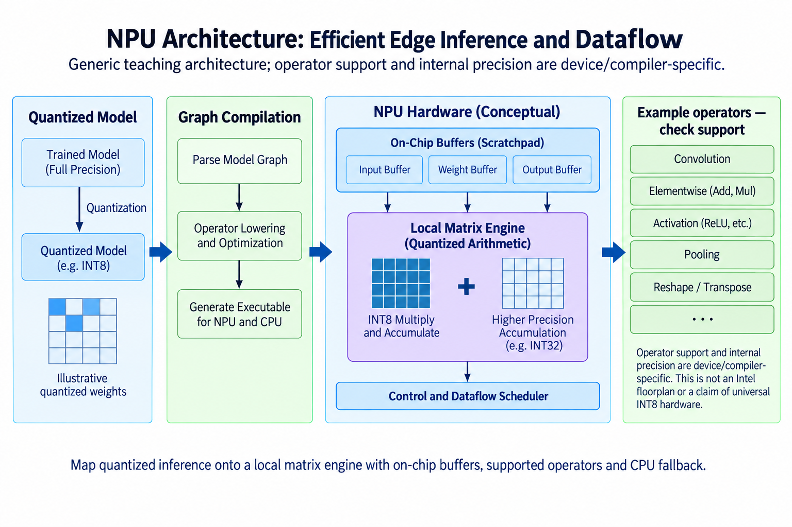
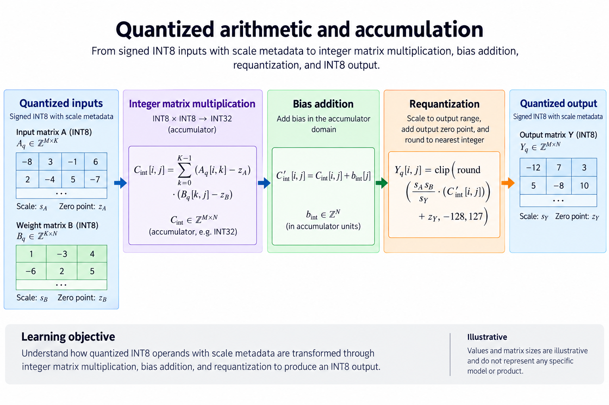
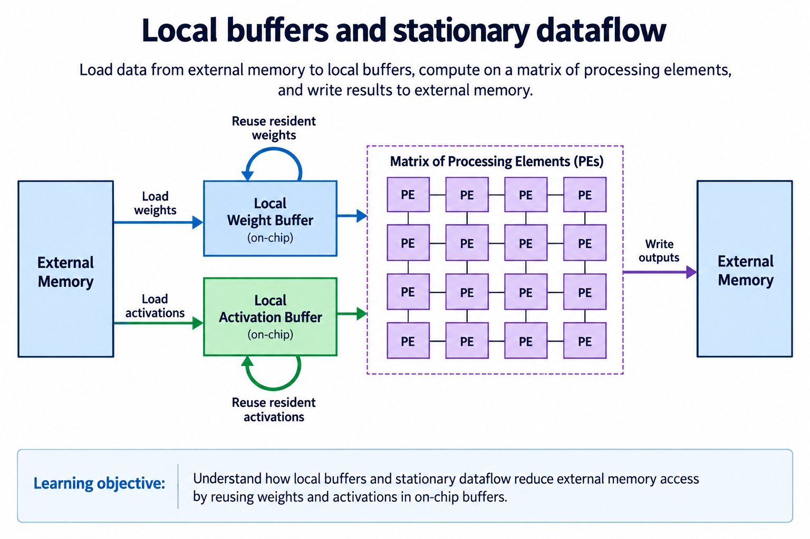
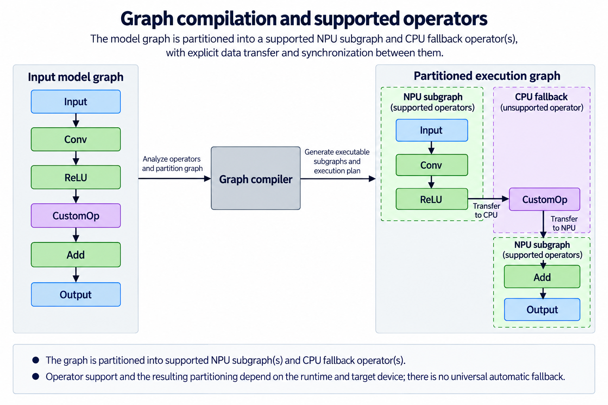
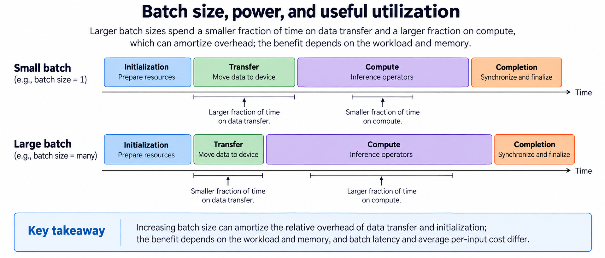

## Overview

A neural processing unit, or NPU, is an accelerator designed around neural-network operators and the power, memory and scheduling constraints of its target system. Many are integrated into client or edge processors, where inference must coexist with CPU and GPU work. The overview shows arithmetic, local storage and graph compilation as connected pieces rather than one universal circuit.

The architecture category does not guarantee a particular integer format, array shape or supported operator set. This article uses a generic quantized datapath to explain arithmetic and dataflow, then distinguishes that model from current Intel/OpenVINO documentation. A quantized model's storage type and the hardware's internal computation type can differ.

The examples are independently calculated and illustrative. Hardware/software details are checked as of 2026-09-13. The goal is to explain how an inference layer gets useful work from an NPU, including the cases where transfer overhead, graph support or numerical conversion decides the result.

## Deep dive

### Quantized arithmetic and accumulation

The precision figure separates a stored integer from the real number it approximates. With a positive scale $$s_x$$ and zero point $$z_x$$, a quantized value $$q_x$$ represents $$x\approx s_x(q_x-z_x)$$. Another operand uses its own scale and zero point. Their dot product therefore requires multiplying centered values and interpreting the result with the product scale.

For symmetric quantization, $$z_x=z_w=0$$. A generic integer implementation computes $$S=\sum_k q_{x,k}q_{w,k}$$ and interprets it as $$s_xs_wS$$ before bias and output conversion. If the zero points are nonzero, expanding the product introduces correction terms. Ignoring them changes the mathematical operator even if every integer multiply is correct.

Take real input values 1 and -2 with scale 0.5, giving integer values 2 and -4. Take real weights 3 and 1 with scale 0.25, giving 12 and 4. The integer sum is $$2\times12-4\times4=8$$. Multiplying by $$0.5\times0.25$$ yields 1, matching the real dot product $$1\times3-2\times1$$ exactly for this representable example.

The accumulator must be wider because it sums many products. The signed INT8 corner $$-128\times-128=16,384$$ is larger than $$127^2=16,129$$. Even 8 maximum positive products yield 131,072, just outside an 18-bit signed accumulator's positive range. The project's [integer arithmetic lesson](/blog/fpga-ai-number-1-int8-arithmetic/) derives this bound.

This is a generic teaching datapath, not an assertion that all NPUs execute INT8 multiplication internally. The current [OpenVINO NPU documentation](https://docs.openvino.ai/2026/openvino-workflow/running-inference/inference-devices-and-modes/npu-device.html) lists quantized and floating inference representations and describes FP16 hardware computation. Inspect the actual device/compiler numerical contract rather than equating model file precision with physical arithmetic.

### Local buffers and stationary dataflow

The buffer figure shows weights and activations staged near the processing array. Keeping an operand local lets it contribute to several outputs before another external transfer. Stationary dataflow names describe what stays resident while other values move: output-stationary keeps partial sums nearby; weight-stationary retains weights for reuse; practical designs can combine strategies across levels.

For a 4×4 output tile with reduction length 8, signed INT8 inputs require 32 bytes from $$A$$ and 32 from $$B$$. INT32 output accumulators require 64 bytes. Useful work is 128 MACs, or 256 operations under a 2-operations-per-MAC convention. If inputs are each loaded once and outputs stored once, the illustrative external intensity is $$256/128=2$$ operations/byte. Intermediate rereads and epilogue traffic change that figure.

Now reuse the same weight tile for 10 input tiles. Its 32-byte external load can be spread over all 10 if capacity and scheduling permit. Activation and output traffic still occur for every tile. So you cannot multiply the entire operator's arithmetic intensity by 10 just because weights are reused.

On-chip capacity, memory ports and routing limit residency. Several arithmetic units can compete for one buffer bank. A bank conflict or refill stall leaves compute capacity unused even when the theoretical MAC count is high. A compiler must choose layouts and tile lifetimes that fit the actual architecture.

An edge system also shares external memory bandwidth with CPU, GPU and other agents. A sustained rate measured in isolation may not survive concurrent workloads. Explain local reuse and external transfers separately, then measure under the system's intended concurrency. Energy benefits depend on the complete movement and execution schedule, not just on using a lower-bit input.

### Graph compilation and supported operators

The graph figure marks supported accelerator operations and an operation placed elsewhere. Compilation converts a model's graph into executable scheduling, layouts and transfers. Operator names alone are not enough: support can depend on shapes, data types, parameter choices and the runtime/compiler version.

If an activation or resize operation cannot run in the selected NPU path, compilation may reject the graph, choose another device, or partition supported work under a documented heterogeneous mode. Those are different behaviors. Configure and inspect the actual placement; do not assume automatic per-operation CPU fallback.

Suppose one NPU subgraph produces a 1-MiB tensor needed by a CPU operation and a later NPU subgraph consumes its result. Even if the tensor is physically in shared system memory, ownership transitions, synchronization and layout conversion can still cost time. If two explicit 1-MiB transfers each sustain 10 GB/s, their payload time alone is about 0.210 ms in total. Dispatch and CPU work add to that illustrative lower bound.

A graph with a very fast matrix operator can therefore be slower end to end than a fully supported graph with a lower isolated arithmetic peak. Fusion may avoid an intermediate store, but it can increase live storage or impose new layout restrictions. Dynamic shapes may require recompilation, a supported bucketing policy or a different backend.

As of the dated check, [OpenVINO's NPU page](https://docs.openvino.ai/2026/openvino-workflow/running-inference/inference-devices-and-modes/npu-device.html) documents static-shape limitations and only partial HETERO support for certain models. Those are software-version-specific constraints rather than universal properties of neural accelerators. Query supported devices, compile the real graph and record actual execution placement before attributing a result to the NPU.

### Batch size, power, and useful utilization

The timeline figure separates setup, movement, useful arithmetic and completion. A small inference job can spend more time in dispatch and synchronization than in multiplication. Larger batches amortize fixed work and may expose weight reuse, but they can increase request waiting time and memory demand.

Let an illustrative execution require 0.2 ms of setup and transfer plus 0.05 ms of compute per input. For one input, total time is 0.25 ms. If 8 inputs share that fixed work and compute scales linearly, total batch time is 0.6 ms, or 0.075 ms per input when averaged. An individual request may still wait for batching and complete only after the 0.6-ms job. Average per-input service cost is not the same as request latency.

Concurrency can keep engines busy while other jobs wait on memory, but it also adds contention. The best queue depth depends on the application. A camera pipeline may require bounded per-frame latency; a background embedding task may prioritize throughput and power. A benchmark must state which objective it measures.

Power claims need a measurement boundary. An NPU subsystem estimate, package power reading and wall-plug system measurement cover different components. An accelerator can reduce CPU work while total system power stays similar because another component becomes active. Report both elapsed time and the measured energy scope when comparing configurations.

The architecture's strength is specialization: it can run supported inference efficiently under its target constraints. Its limits include graph coverage, local storage, memory contention and scheduling overhead. A useful decision combines correctness, latency distribution, throughput and measured energy rather than treating a TOPS label as a complete answer.

### A practical placement experiment

Start with a fixed-shape dense layer whose output can be checked against a reference. Record the input, weight and output types, scales and tolerances. Compile it directly for the intended device and save the compiler/runtime versions. Add an elementwise operation, then a reduction, checking each compiled graph rather than assuming support from the previous result.

For each version, record cold compilation time separately from warm inference. Query the reported execution devices and inspect profiling information where supported. Compare output values before comparing timing. If placement changes, attribute the result to the new execution path instead of labeling the entire model “NPU performance.”

Next sweep batch sizes using the same weights and numerical contract. Record complete request latency and batch throughput independently. Repeat with the CPU/GPU workloads that will coexist in deployment, because shared memory and power constraints can change the bottleneck. Save raw runs rather than only a best result.

Finally inspect the largest intermediate tensor crossing a device boundary. Its element count times stored bytes per element gives payload size; layout conversion, cache handling and dispatch add cost beyond that payload. This experiment finds the limiting mechanism without needing proprietary details of the accelerator's internal circuit.

### A worked engineering decision

A useful NPU comparison starts with the complete deployed graph. Suppose most layers map to the NPU but 1 custom operator runs on the CPU. The cost includes transfers, any required layout or precision conversions, queueing and synchronization at both crossings. A fast supported convolution can coexist with a slow end-to-end application. Count graph boundaries and their tensor sizes before concluding that the accelerator itself lacks arithmetic capability.

Now consider changing INT8 quantization scales to avoid a fallback. That is a numerical-model change, not just a scheduling optimization. Keep the calibration method, rounding rule, zero-point convention and task-quality evaluation. The matrix example in this article is a generic arithmetic explanation; a specific runtime may accept quantized model representations while executing some stages in another internal precision. Inspect the current device documentation and compiler output rather than reading the diagram as a universal implementation claim.

A second experiment compares operator fusion with separate dispatch. Keep shapes and numerics fixed, and identify which intermediate tensors disappear from a named memory boundary. A fused operation can reduce traffic and launch overhead, but may need more local storage or have fewer supported shape combinations. Static-shape restrictions can make a deployment with variable input lengths require preprocessing, padding or another placement strategy.

For an edge device, keep latency distributions and sustained behavior, not just the first completed request. Power policy, thermal state and competing system work affect the usable result. The relevant engineering decision may be meeting a latency and quality target under a device budget rather than maximizing operations per second. The diagrams explain mechanisms; they do not assert a board power measurement or guarantee a particular heterogeneous placement.

## Conclusion

An NPU executes an inference graph through supported arithmetic, local buffers and a compiler-managed schedule. Quantization determines a numerical contract; dataflow determines reuse; placement determines whether transfers and fallback work erase a kernel's advantage.

Start with the actual graph and acceptable numerical error. Check device/compiler support, account for every ownership transition and measure the intended workload under realistic concurrency. The FPGA-to-AI-chip series implements a deliberately small subset of this system, making integer arithmetic, buffer ownership and supported operators explicit before adding hardware-specific optimization.

### Sources

- [OpenVINO NPU device documentation](https://docs.openvino.ai/2026/openvino-workflow/running-inference/inference-devices-and-modes/npu-device.html)
- [Intel Core Ultra product information](https://www.intel.com/content/www/us/en/products/details/processors/core-ultra.html)
