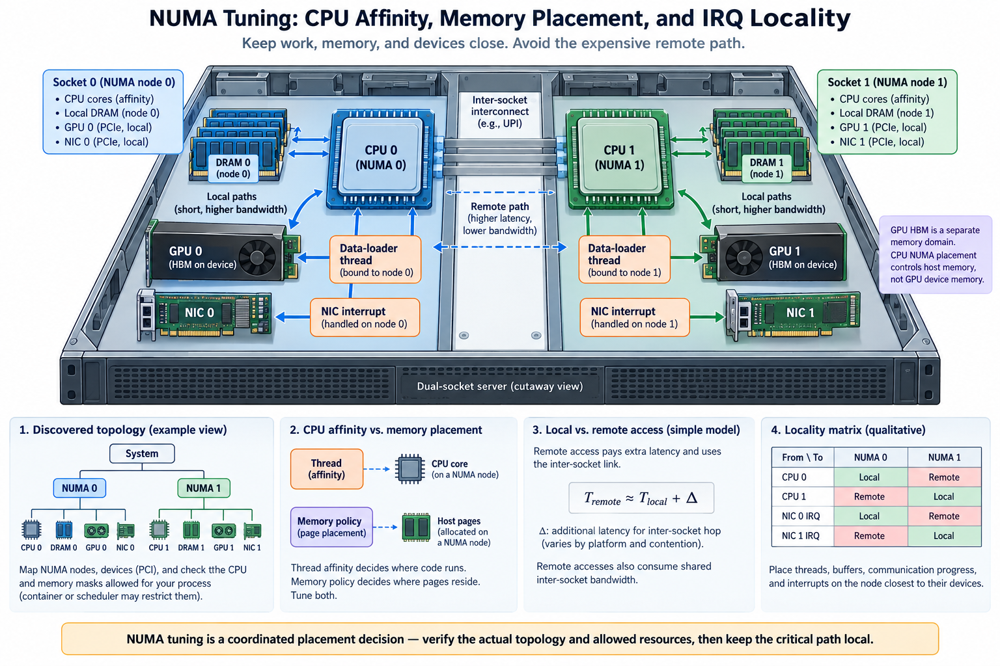
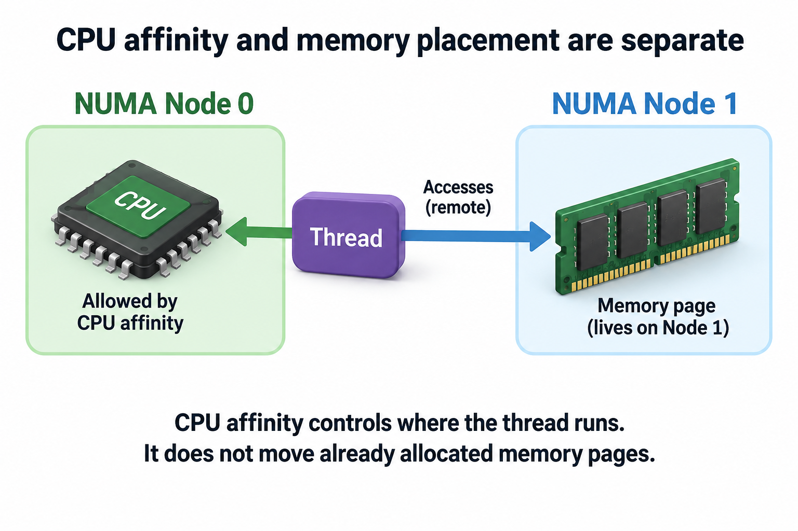
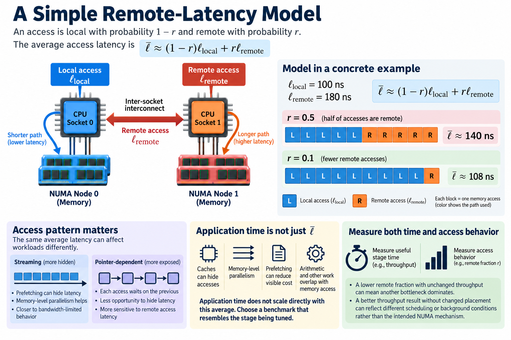

On a multi-socket server, a CPU can access memory attached to another NUMA domain, but the path and available bandwidth can differ from local memory. AI workloads encounter this distinction in data preprocessing, pinned buffers, communication progress, optimizer offload, and storage or network handling. The GPU's own HBM is a different memory domain and should not be confused with host NUMA placement.

NUMA tuning is therefore a coordination problem. CPU affinity determines where threads execute. Memory policy influences where host pages are allocated. Device topology determines which workers and buffers feed GPUs and adapters. A configuration that controls only one of these can leave the expensive path unchanged.

We will derive simple remote-access costs and build a placement experiment that verifies actual state. Numerical values are illustrative. Linux policy semantics, managed interrupts, and container restrictions should be checked for the deployed kernel and runtime.

## 1. Discover the topology and the allowed resources

*Overview of the article’s core mechanism. The following sections explain the objects, relationships, equations, assumptions, and worked examples shown here.*

Map CPU NUMA nodes, host-memory domains, GPU and NIC PCI identities, and relevant interconnect relationships. Also inspect the CPU and memory-node masks the process is actually allowed to use. A container or scheduler can restrict resources even when the host exposes a larger topology.

A topology label is discovery evidence, not an achieved-performance measurement. Two nominally nearby devices can still share a constrained interface or contend with other workers. Preserve the physical map and measure the relevant paths under the intended concurrency.

Identify which workload stages use host memory. Data decoding, collation, optimizer offload, and staging can be NUMA-sensitive. A GPU kernel operating solely on device memory may respond indirectly through scheduling or input supply, but CPU pinning does not change its HBM locality.

Record the current placement before applying changes. Include page distribution and allowed resource masks after initialization, because those observations can differ from the configuration requested before allocation. If the baseline already has local buffers and appropriate workers, a new affinity setting may make no difference. If the baseline varies between runs, reproducible placement can reduce variability even without changing the best observed throughput.

## 2. Separate thread affinity from page placement

CPU affinity limits or selects the CPUs on which a thread can execute. It does not generally move already allocated memory pages to the same node. Memory placement depends on allocation policy and when pages are physically established, along with the operating system's supported behavior.

Linux documents default, preferred, binding, and interleaving policies with specific semantics. The effective policy also interacts with allowed memory nodes and the scope at which policy applies. Use the current kernel documentation instead of treating every policy as a synonym for local allocation.

First-touch behavior is a useful concept under common default allocation conditions: the thread faulting a page can influence its physical placement. It is not a universal guarantee for every allocation, shared mapping, or policy. A parent that initializes a large buffer can place pages differently from workers that later consume it.

Changing affinity after allocation can therefore leave remote pages in place. A meaningful experiment controls initialization and allocation as well as execution, or uses an explicitly supported migration method when that is part of the design. Verify the resulting placement rather than assuming the requested policy relocated existing state.

## 3. Derive a simple remote-latency model

Suppose a fraction r of relevant accesses use a remote path with latency ell_remote, while the remainder use local latency ell_local. A simplified average-access model is

$$
\overline\ell\approx(1-r)\ell_{\mathrm{local}}+r\ell_{\mathrm{remote}}.
$$

For illustrative local latency 100 nanoseconds, remote latency 180 nanoseconds, and r=0.5, the average is 140 nanoseconds. Reducing r to 0.1 yields 108 nanoseconds. These numbers describe the model, not a particular processor's measured behavior.

Application time does not scale directly with this average. Caches, memory-level parallelism, prefetching, and arithmetic can hide or change access cost. A pointer-dependent workload exposes latency differently from a streaming copy. Select a benchmark that resembles the stage being tuned.

Measure useful stage time and access behavior together. A lower remote fraction with unchanged throughput can mean another bottleneck dominates. A better throughput result without changed placement can reflect different scheduling or background conditions rather than the intended NUMA mechanism.

## 4. Model bandwidth and shared inter-socket demand

Remote traffic can consume both memory-controller capacity and an inter-domain path. For required remote bytes D_remote and available inter-domain bandwidth B_remote, a basic bound is

$$
T\ge D_{\mathrm{remote}}/B_{\mathrm{remote}}.
$$

For an illustrative 20 GB transfer at 25 GB/s, the serialization component is at least 0.8 seconds. A local path achieving 50 GB/s would have a 0.4-second component for the same bytes. Startup, computation, and overlap can change observed elapsed time.

Several workers can share the same path. An isolated remote-memory benchmark can therefore obtain bandwidth unavailable during simultaneous loading, communication, and offload. Count aggregate traffic and inspect the intended concurrent workload.

Interleaving can distribute pages across nodes and use multiple memory controllers in supported circumstances. It can also increase remote accesses for workers with localized data. Whether it helps depends on access pattern and shared capacity, not a general rule that interleaving is always more balanced or always slower.

## 5. Align input workers and transfer buffers

Data workers can read, decode, transform, and collate on CPUs before feeding a GPU. Their CPU location and host-buffer placement influence the path to the device. A worker near the GPU but consuming remotely allocated pages can still generate inter-domain traffic.

Control worker initialization and buffer allocation in the experiment. Preserve the dataset population and transform work so a changed sampling pattern does not explain a throughput gain. Inspect both ready-batch supply and GPU starvation.

Pinned buffers have their own allocation and lifetime requirements. The relevant question is where host pages reside and which device path reads them, not merely whether the allocation is pinned. Repeated allocation can also introduce overhead independently of locality.

A simplified end-to-end input budget includes decoding, collation, transfer, and exposed waiting. Optimizing local memory can improve one stage while leaving another dominant. Use a timeline to confirm that the NUMA-sensitive stage was on the training critical path.

## 6. Place communication progress deliberately

Host workers can post network operations, process completions, or support communication progress. Their placement can affect latency and interference, especially when CPU resources are oversubscribed or remote buffers are involved.

Map the worker, adapter, and relevant memory domain. A worker closest to one adapter may not be closest to every GPU it serves. Several workers placed on the same small CPU subset can contend even when that subset is physically local.

A placement objective must therefore include capacity as well as distance. For worker groups assigned to node n with total CPU demand C_n and available capacity A_n, a simplified feasibility condition is

$$
C_n\le A_n.
$$

This is an accounting constraint, not a precise CPU scheduler model. It reminds us that locality cannot make an overloaded node execute unlimited progress work. Measure posting delays, completion processing, and application tails under representative rank count.

Preserve launcher and scheduler affinity settings in the record. A job that receives a different allowed CPU mask can behave differently even when its application configuration is unchanged. Actual masks are stronger evidence than requested placement alone.

## 7. Understand interrupt and queue locality

Network and storage devices can use multiple queues and interrupt vectors. Their processing may interact with CPU placement and the operating system's balancing or managed-interrupt behavior. A requested affinity mask is not always the final execution assignment.

Inspect the active queue and interrupt distribution using supported tools. Correlate it with device traffic and host work. An uneven distribution can be normal for the workload, while a concentrated overloaded CPU can become a progress bottleneck.

Do not move every interrupt to the same local core simply because it is near the adapter. That can create contention with application workers and reduce useful capacity. The intended assignment should account for queue parallelism, CPU availability, and the kernel's supported control model.

Evaluate changes through observed execution and application outcomes. Lower interrupt count on one CPU is not itself a throughput improvement. The useful evidence is reduced host bottleneck or latency under the same traffic population, with no harmful effect on neighboring work.

## 8. Account for container and scheduler boundaries

CPU and memory-node permissions can be constrained by cpusets and the cluster's allocation policy. A NUMA command operating inside those boundaries cannot use resources the job did not receive. Relative node numbering and policy scope can also differ from an operator's host-level assumption.

Record the effective masks and allocation policy alongside the host topology. If the process sees GPUs in one domain but receives CPUs only in another, the placement problem may begin at the scheduler rather than the application.

Memory policy can affect allocation failure behavior and fallback according to its defined semantics. A tightly bound policy should not be assumed to provide unlimited local capacity. Include memory use and failures in the experiment, especially for large pinned buffers or offloaded optimizer state.

Automatic balancing or other system policies can change observed placement over time where supported. Measure sustained behavior and document relevant controls. A short first-touch test does not establish that the same page distribution persists throughout a long job.

## 9. Run a controlled locality matrix

Compare local and remote CPU execution with local and remote buffer allocation under a defined operation. This separates affinity effects from memory effects. Add realistic concurrency only after the isolated relationships are understood.

For each case, preserve useful work, buffer size, allocation timing, warmup, and synchronization. Report stage time, achieved bandwidth where relevant, actual page placement, CPU masks, and GPU or adapter mapping. Inspect variation rather than only the best result.

A useful 2-by-2 experiment can hold the worker on node 0 or 1 and initialize the buffer on node 0 or 1 under the supported policy. If performance follows buffer location more than worker location, memory placement is a stronger explanation. If it follows worker placement despite local buffers, progress or scheduling deserves attention. Device proximity adds another controlled dimension when the operation feeds a GPU or NIC.

Repeat the best candidate in the full workload. An isolated memory improvement can disappear when storage, compute, or another shared resource dominates. The production decision should follow useful throughput and latency, with the locality measurements explaining the mechanism.

## 10. Keep placement as a versioned execution decision

Store topology, allowed masks, worker mapping, allocation policy, initialization behavior, queue and interrupt observations, and representative performance. Revisit after hardware changes, container updates, scheduler policy changes, and workload growth.

A sensible default is a reproducible measured placement that satisfies the job's CPU and memory needs. There is no universal node number or worker count that is optimal across systems. The record should explain why the chosen mapping fits this workload.

NUMA tuning succeeds when execution, host pages, and device progress share appropriate paths without overloading the selected domains. Affinity alone is insufficient, and locality labels are not performance guarantees. Discover the topology, control allocation and execution separately, verify actual state, and adopt the configuration that improves useful workload outcomes.

## Sources

- [Linux NUMA memory policy documentation](https://docs.kernel.org/admin-guide/mm/numa_memory_policy.html).
- [Linux cpuset documentation](https://docs.kernel.org/admin-guide/cgroup-v1/cpusets.html).
- [Linux IRQ affinity documentation](https://docs.kernel.org/core-api/irq/irq-affinity.html).
- [NVIDIA system topology documentation](https://docs.nvidia.com/deploy/nvidia-smi/index.html).
