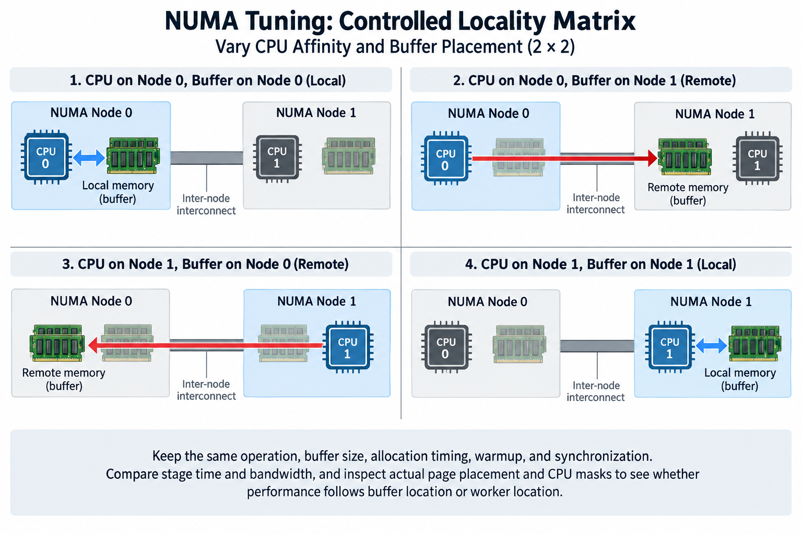

## Overview

On a multi-socket server, a CPU can access memory attached to another NUMA domain, but the path and available bandwidth can differ from local memory. AI workloads hit this distinction in 5 places: data preprocessing, pinned buffers, communication progress, optimizer offload, and storage or network handling. The GPU's own HBM is a different memory domain. Do not confuse it with host NUMA placement.

NUMA tuning is therefore a coordination problem across 3 controls: CPU affinity decides where threads run, memory policy shapes where host pages are allocated, and device topology decides which workers and buffers feed GPUs and adapters. A configuration that controls only 1 of these can leave the expensive path unchanged.

We will derive simple remote-access costs and build a placement experiment that verifies actual state. Numerical values are illustrative. Check Linux policy semantics, managed interrupts, and container restrictions for the deployed kernel and runtime.

## Deep dive

### 1. Discover the topology and the allowed resources

Map 4 things: CPU NUMA nodes, host-memory domains, GPU and NIC PCI identities, and relevant interconnect relationships. Also check the CPU and memory-node masks the process is actually allowed to use, because a container or scheduler can restrict resources even when the host exposes a larger topology.

A topology label is discovery evidence, not a performance measurement, since 2 nominally nearby devices can still share a constrained interface or contend with other workers, so keep the physical map and measure the relevant paths under the intended concurrency.

Find which workload stages use host memory. Data decoding, collation, optimizer offload, and staging are 4 NUMA-sensitive stages. A GPU kernel working only on device memory may respond indirectly through scheduling or input supply, but CPU pinning does not change its HBM locality.

Record the current placement before changing anything. Include 2 observations after initialization, page distribution and allowed resource masks, because those observations can differ from the configuration requested before allocation. If the baseline already has local buffers and suitable workers, a new affinity setting may make no difference. If the baseline varies between runs, reproducible placement can cut variability even without changing the best observed throughput.

### 2. Separate thread affinity from page placement

CPU affinity limits or selects the CPUs a thread can run on, and it does not generally move already allocated memory pages to the same node. Memory placement depends on allocation policy and when pages are physically established, along with the operating system's supported behavior.

Linux documents 4 policies with specific semantics: default, preferred, binding, and interleaving. The effective policy also interacts with allowed memory nodes and the scope at which policy applies. Use the current kernel documentation. Do not treat every policy as a synonym for local allocation.

First-touch behavior is a useful concept under common default allocation conditions, since the thread that faults a page can influence its physical placement, but it is not a universal guarantee for every allocation, shared mapping, or policy, and a parent that initializes a large buffer can place pages differently from the workers that later consume it.

Changing affinity after allocation can therefore leave remote pages in place, so a meaningful experiment controls initialization and allocation as well as execution, or uses an explicitly supported migration method when that is part of the design, and then verifies the resulting placement rather than assuming the requested policy moved existing state.

### 3. Derive a simple remote-latency model

Suppose a fraction r of relevant accesses use a remote path with latency ell_remote, while the remainder use local latency ell_local. A simplified average-access model is

$$
\overline\ell\approx(1-r)\ell_{\mathrm{local}}+r\ell_{\mathrm{remote}}.
$$

For illustrative local latency 100 nanoseconds, remote latency 180 nanoseconds, and r=0.5, the average is 140 nanoseconds. Reducing r to 0.1 yields 108 nanoseconds. These numbers describe the model, not a particular processor's measured behavior.

Application time does not scale directly with this average. Caches, memory-level parallelism, prefetching, and arithmetic are 4 effects that can hide or change access cost. A pointer-dependent workload exposes latency differently from a streaming copy. Pick a benchmark that resembles the stage being tuned.

Measure useful stage time and access behavior together, because a lower remote fraction with unchanged throughput can mean another bottleneck dominates, while better throughput without changed placement can reflect different scheduling or background conditions rather than the intended NUMA mechanism.

### 4. Model bandwidth and shared inter-socket demand

Remote traffic can consume both memory-controller capacity and an inter-domain path. For required remote bytes D_remote and available inter-domain bandwidth B_remote, a basic bound is

$$
T\ge D_{\mathrm{remote}}/B_{\mathrm{remote}}.
$$

For an illustrative 20 GB transfer at 25 GB/s, the serialization component is at least 0.8 seconds. A local path achieving 50 GB/s would have a 0.4-second component for the same bytes. Startup, computation, and overlap can change observed elapsed time.

Several workers can share the same path, so an isolated remote-memory benchmark can get bandwidth that is unavailable during simultaneous loading, communication, and offload. Count aggregate traffic and check the intended concurrent workload.

Interleaving can spread pages across nodes and use multiple memory controllers in supported circumstances, and it can also add remote accesses for workers with localized data, so whether it helps depends on access pattern and shared capacity: there is no general rule that interleaving is always more balanced or always slower.

### 5. Align input workers and transfer buffers

Data workers can do 4 things on CPUs before feeding a GPU: read, decode, transform, and collate. Their CPU location and host-buffer placement shape the path to the device, and a worker near the GPU that consumes remotely allocated pages can still generate inter-domain traffic.

Control worker initialization and buffer allocation in the experiment, and keep the dataset population and transform work fixed so a changed sampling pattern does not explain a throughput gain. Check both ready-batch supply and GPU starvation.

Pinned buffers have their own allocation and lifetime requirements. The relevant question has 2 parts, where host pages sit and which device path reads them, not just whether the allocation is pinned. Repeated allocation can also add overhead independently of locality.

A simplified end-to-end input budget includes 4 terms: decoding, collation, transfer, and exposed waiting. Tuning local memory can improve 1 stage while leaving another dominant. Use a timeline to confirm that the NUMA-sensitive stage was on the training critical path.

### 6. Place communication progress deliberately

Host workers can do 3 jobs: post network operations, process completions, or support communication progress. Where they run can affect latency and interference, especially when CPU resources are oversubscribed or remote buffers are involved.

Map the worker, adapter, and relevant memory domain, because the worker closest to 1 adapter may not be closest to every GPU it serves. Several workers packed onto the same small CPU subset can contend even when that subset is physically local.

A placement objective must therefore include capacity as well as distance. For worker groups assigned to node n with total CPU demand C_n and available capacity A_n, a simplified feasibility condition is

$$
C_n\le A_n.
$$

This is an accounting constraint, not a precise CPU scheduler model. It reminds us that locality cannot make an overloaded node run unlimited progress work. Measure 3 numbers under a representative rank count: posting delays, completion processing, and application tails.

Keep launcher and scheduler affinity settings in the record. A job that receives a different allowed CPU mask can behave differently even when its application configuration is unchanged. Actual masks are stronger evidence than requested placement alone.

### 7. Understand interrupt and queue locality

Network and storage devices can use multiple queues and interrupt vectors, and their processing can interact with CPU placement and the operating system's balancing or managed-interrupt behavior. A requested affinity mask is not always the final execution assignment.

Check the active queue and interrupt distribution with supported tools, and correlate it with device traffic and host work. An uneven distribution can be normal for the workload, but 1 concentrated overloaded CPU can become a progress bottleneck.

Do not move every interrupt to the same local core just because it is near the adapter, since that can create contention with application workers and cut useful capacity. The intended assignment should account for 3 things: queue parallelism, CPU availability, and the kernel's supported control model.

Judge changes by observed execution and application outcomes. A lower interrupt count on 1 CPU is not itself a throughput improvement. The useful evidence is a reduced host bottleneck or lower latency under the same traffic population, with no harm to neighboring work.

### 8. Account for container and scheduler boundaries

The cluster's allocation policy and Cpusets can constrain CPU and memory-node permissions, and a NUMA command running inside those boundaries cannot use resources the job did not receive. Relative node numbering and policy scope can also differ from an operator's host-level assumption.

Record the effective masks and allocation policy alongside the host topology. If the process sees GPUs in 1 domain but receives CPUs only in another, the placement problem may begin at the scheduler rather than the application.

Memory policy can affect allocation failure behavior and fallback according to its defined semantics, and a tightly bound policy does not provide unlimited local capacity. Include memory use and failures in the experiment, especially for large pinned buffers or offloaded optimizer state.

Automatic balancing or other system policies can change observed placement over time where supported. Measure sustained behavior and document the relevant controls. A short first-touch test does not prove that the same page distribution lasts through a long job.

### 9. Run a controlled locality matrix

Compare local and remote CPU execution with local and remote buffer allocation under a defined operation, which gives 4 cases and separates affinity effects from memory effects. Add realistic concurrency only after you understand the isolated relationships.

For each case, hold 5 things fixed: useful work, buffer size, allocation timing, warmup, and synchronization. Report stage time, achieved bandwidth where relevant, actual page placement, CPU masks, and GPU or adapter mapping. Look at variation, not only the best result.

A useful 2-by-2 experiment can hold the worker on node 0 or 1 and initialize the buffer on node 0 or 1 under the supported policy: if performance follows buffer location more than worker location, memory placement is the stronger explanation, and if it follows worker placement despite local buffers, look at progress or scheduling. Device proximity adds another controlled dimension when the operation feeds a GPU or NIC.

Repeat the best candidate in the full workload. An isolated memory improvement can vanish when storage, compute, or another shared resource dominates. The production decision should follow useful throughput and latency, with the locality measurements explaining the mechanism.

### 10. Keep placement as a versioned execution decision

Store 7 records: topology, allowed masks, worker mapping, allocation policy, initialization behavior, queue and interrupt observations, and representative performance. Revisit after hardware changes, container updates, scheduler policy changes, and workload growth.

A sensible default is a reproducible measured placement that meets the job's CPU and memory needs. No node number or worker count is best across all systems. The record should explain why the chosen mapping fits this workload.

## Conclusion

NUMA tuning succeeds when execution, host pages, and device progress share suitable paths without overloading the selected domains. Affinity alone is not enough, and locality labels are not performance guarantees, so the method has 4 steps: discover the topology, control allocation and execution separately, verify actual state, and adopt the configuration that improves useful workload outcomes.

### Sources

- [Linux NUMA memory policy documentation](https://docs.kernel.org/admin-guide/mm/numa_memory_policy.html).
- [Linux cpuset documentation](https://docs.kernel.org/admin-guide/cgroup-v1/cpusets.html).
- [Linux IRQ affinity documentation](https://docs.kernel.org/core-api/irq/irq-affinity.html).
- [NVIDIA system topology documentation](https://docs.nvidia.com/deploy/nvidia-smi/index.html).
