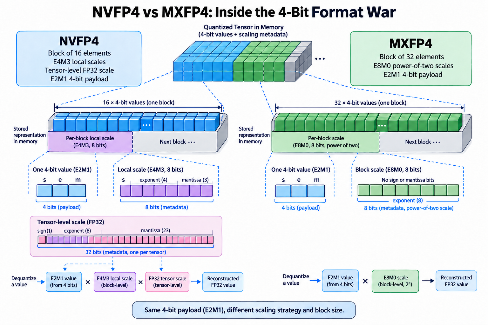
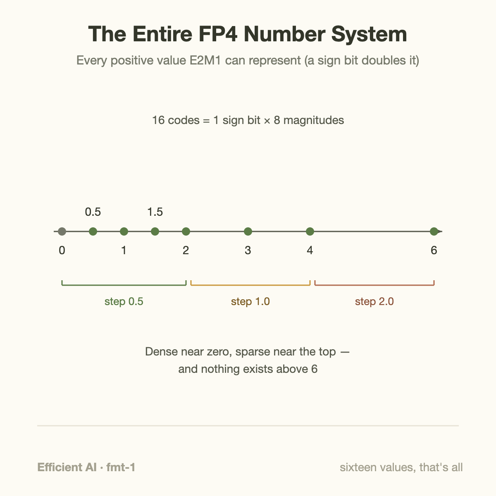
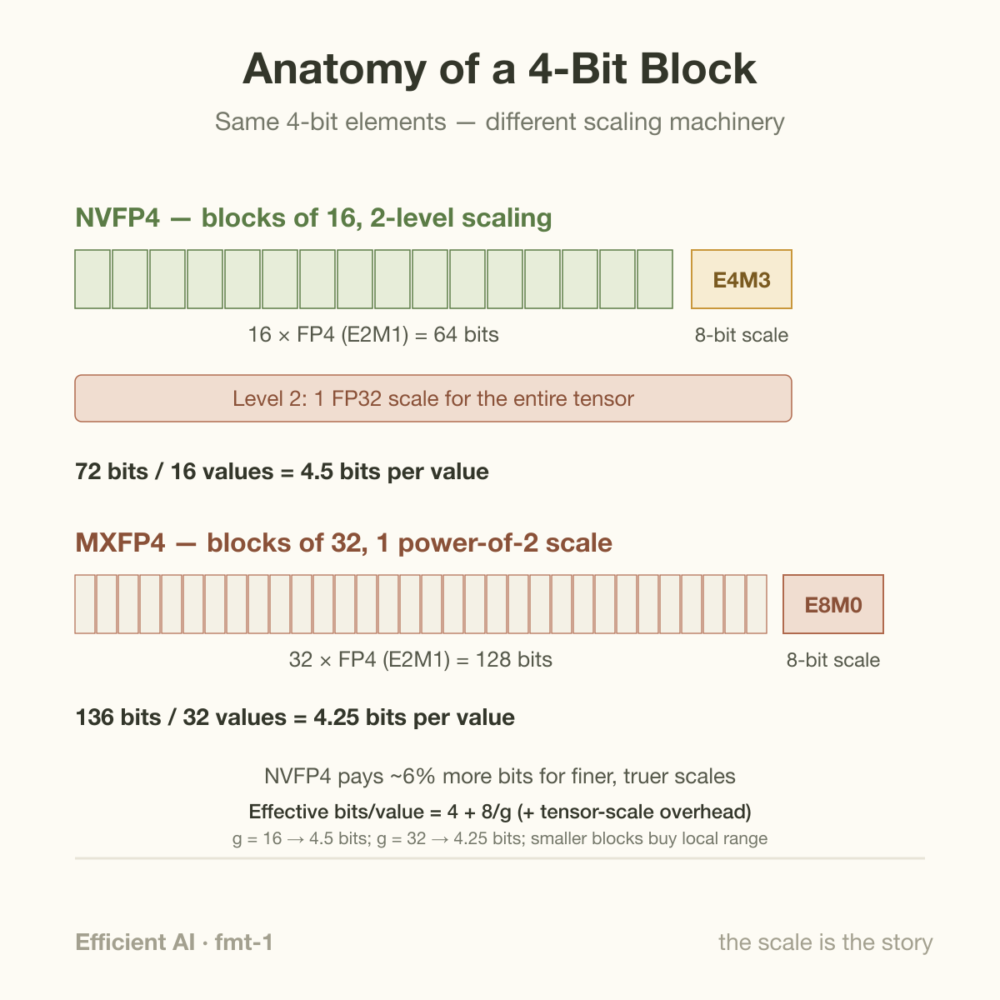
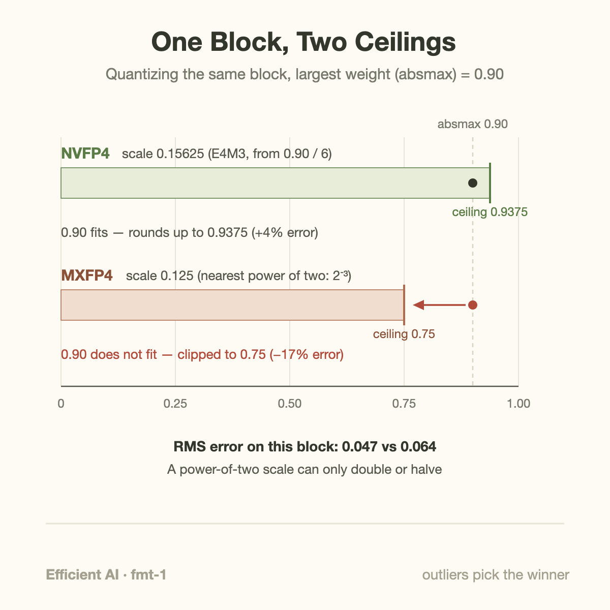

16. That is the complete vocabulary of a 4-bit floating-point number: 16 encodings, including signed zero, and once you account for the sign bit, just 8 magnitudes: 0, 0.5, 1, 1.5, 2, 3, 4, and 6. Every weight in a 4-bit large language model must be expressed as one of those 8 numbers, positive or negative. Nothing between 4 and 6 exists. Nothing above 6 exists at all.

On its face this is a ridiculous way to store the parameters of 1 trillion-dollar industry's flagship products. Yet in 2026, 4-bit is rapidly becoming the default precision for serving big models, OpenAI ships its gpt-oss open-weight models natively in a 4-bit format, and NVIDIA built dedicated silicon for a competing 1. The 2 formats — **NVFP4** and **MXFP4** — agree on the 16 values. They disagree, sharply, on everything wrapped around them. That disagreement is worth understanding in detail, because it is one of the cleanest live examples of hardware and software co-design pulling in different directions: 1 format optimized for numerics, the other for openness and simplicity, with GPU silicon acting as the tiebreaker.

## 8 magnitudes and a sign bit



*Overview of the article’s core mechanism. The following sections explain the objects, relationships, equations, assumptions, and worked examples shown here.*


Start with the raw material. Both formats store each individual value in **FP4 E2M1**: 1 sign bit, 2 exponent bits, 1 mantissa bit. 2 exponent bits give you 4 exponent settings; 1 mantissa bit gives you 2 mantissa steps per exponent. Work through the encoding and you get exactly the 8 magnitudes listed above, from 0 to 6.



Notice 2 things about this tiny number system. First, like all floating-point formats, it is denser near 0: steps of 0.5 up to 2, then steps of 1, then a final leap of 2 from 4 to 6. Second, its dynamic range is pitiful. The ratio between the largest and smallest nonzero magnitude is 12. Real neural network weight tensors span many orders of magnitude, and a single tensor can hold values from 1e-4 to 40. Map that tensor straight onto the FP4 grid and almost everything collapses to 0 while the outliers clip at 6. The model would be destroyed.

So 4-bit formats are never used raw. Every practical scheme pairs the 4-bit codes with **scale factors**: multipliers, stored at higher precision, that stretch the little [0, 6] ruler to fit the data. The entire NVFP4-versus-MXFP4 war is about how many values share 1 scale factor, and what number format the scale factor itself uses.

## Block scaling: renting precision where you need it

A single scale for the whole tensor (the classic approach from the 8-bit era) fails at 4 bits because 1 outlier sets the scale for millions of values. The fix is **block scaling** (also called microscaling): chop the tensor into small blocks, and give each block its own scale. An outlier now only ruins the precision of its immediate neighbors, not the entire tensor.

Here is where the 2 formats split:

- **MXFP4**, defined by the Open Compute Project's Microscaling (MX) specification (an open standard backed by AMD, Arm, Intel, Meta, Microsoft, NVIDIA, Qualcomm, and others), uses **blocks of 32 values**, each sharing 1 **E8M0 scale**: 8 exponent bits, 0 mantissa bits. An E8M0 scale is a pure power of 2, anywhere from 2^-127 to 2^127.
- **NVFP4**, NVIDIA's proprietary refinement introduced with Blackwell, uses **blocks of 16 values**, each sharing 1 **FP8 E4M3 scale** (a real fractional number, not just a power of 2), plus a second-level **FP32 scale for the whole tensor** that keeps every block scale inside E4M3's representable range.



Do the bookkeeping and the storage cost is nearly identical. An MXFP4 block costs 32 × 4 + 8 = 136 bits for 32 values: **4.25 bits per value**. An NVFP4 block costs 16 × 4 + 8 = 72 bits for 16 values: **4.5 bits per value**, plus a single 32-bit tensor scale that amortizes to nothing. Against FP8 with its roughly 8 bits per value, NVFP4's 4.5 bits works out to a 1.78× reduction — the source of NVIDIA's "~1.8× less memory than FP8" figure. NVIDIA pairs that with a claim of **under 1% accuracy loss versus FP8** on measured workloads; that number comes from NVIDIA's own Blackwell Ultra material, so treat it as vendor-reported, but the MLPerf v5.1 results using NVFP4 quantization on DeepSeek-R1 give it independent teeth.

So NVFP4 pays about 6% more storage for 2 upgrades: blocks half the size (outliers poison 16 neighbors instead of 32) and scales that can take fractional values instead of only powers of 2. How much do those upgrades actually buy? Let's quantize a block by hand and find out.

## A worked example you can follow with a pencil

Take 8 weights from a block (real blocks hold 16 or 32; 8 is enough to see the mechanics). Ignore signs, which travel in the sign bit:

```
0.06   0.11   0.23   0.31   0.42   0.55   0.71   0.90
```

The largest magnitude, called the **absmax**, is 0.90. Each format must pick a scale s so that quantizing means: divide by s, snap to the nearest FP4 value, multiply back by s.

**NVFP4.** The ideal scale maps the absmax onto FP4's maximum: s = 0.90 / 6 = 0.15. E4M3 cannot store 0.15 exactly; the nearest representable value is 0.15625, so that becomes the block scale (the scale itself gets quantized — a real effect, and part of why the tensor-level FP32 scale helps keep block scales in E4M3's sweet spot). The block can now represent values up to 6 × 0.15625 = **0.9375**. Our absmax fits. Quantizing 0.90: divide by 0.15625 to get 5.76, snap to 6, multiply back — it lands at 0.9375, an error of +0.0375.

**MXFP4.** The scale must be a power of 2. Following the MX specification's rule, take floor(log2(0.90)) = −1, subtract FP4's maximum exponent of 2, and get scale = 2^-3 = 0.125. The block ceiling is now 6 × 0.125 = **0.75**. Our absmax does not fit: 0.90 / 0.125 = 7.2, which clips at FP4's maximum of 6 and dequantizes to 0.75. The single largest weight in the block just absorbed an error of −0.15, or **17% of its value**.



Run all 8 values through both pipelines and tally the damage:

| weight | NVFP4 result | error | MXFP4 result | error |
|-------:|-------------:|------:|-------------:|------:|
| 0.06 | 0.0781 | +0.018 | 0.0625 | +0.003 |
| 0.11 | 0.0781 | −0.032 | 0.1250 | +0.015 |
| 0.23 | 0.2344 | +0.004 | 0.2500 | +0.020 |
| 0.31 | 0.3125 | +0.003 | 0.2500 | −0.060 |
| 0.42 | 0.4688 | +0.049 | 0.3750 | −0.045 |
| 0.55 | 0.6250 | +0.075 | 0.5000 | −0.050 |
| 0.71 | 0.6250 | −0.085 | 0.7500 | +0.040 |
| 0.90 | 0.9375 | +0.038 | 0.7500 | −0.150 |

Value by value the comparison is messy — MXFP4 actually wins on 5 of the 8, because its smaller scale gives finer steps for the small weights. But the summary statistics tell the real story: root-mean-square error of **0.047 for NVFP4 versus 0.064 for MXFP4**, about 36% worse, and worst-case error of 0.085 versus 0.150. The power-of-2 constraint means MXFP4's coverage can only jump in factors of 2: when the absmax falls awkwardly between powers, the format either clips the top (as here) or wastes up to half its range. NVFP4's fractional E4M3 scale tracks the absmax to within about 4%, block after block.

That is the entire numerical case for NVFP4, compressed into 1 block: finer outlier containment from block-16, and a scale that fits the data instead of rounding to the nearest power of 2.

## Count scale bytes before counting bandwidth savings

With 4 payload bits and 1 8-bit scale per group of $$g$$ values, the effective storage is

$$
b_{\mathrm{eff}}=4+\frac8g\quad\text{bits per value}.
$$

Groups of 32 therefore use 4.25 bits per value, or 0.53125 bytes. Groups of 16 use 4.5 bits, or 0.5625 bytes. A separate 32-bit tensor scale adds another $$32/N$$ bits per value for a tensor containing $$N$$ values. Padding and layout can add more; this calculation counts only the stated representation.

Relative to BF16's 16 bits, the payload-plus-block-scale compression ratios are approximately 3.765 and 3.556. Neither is exactly fourfold. Smaller groups spend more metadata to adapt to local range; a more expressive scale can reduce error where power-of-2 choices are too coarse.

The pencil example should be understood as a quantizer with its stated scale choice, rounding rule, grouping, and tensor scale, not a universal implementation mandate. Compare reconstruction error on identical blocks, then evaluate model quality and actual kernels. Reduced error can justify extra scale traffic, but a conversion-heavy execution path may erase the theoretical bandwidth advantage. 4-bit E2M1 has 16 bit patterns with signed 0, rather than 16 distinct real values. Format precision, storage efficiency, and native hardware support are separate properties.

## Going deeper: why E8M0 exists at all

If power-of-2 scales lose accuracy, why did an industry consortium standardize them? Because E8M0 buys 3 things that matter enormously in silicon and software.

**Multiplication becomes addition.** Scaling by a power of 2 is an integer add to an exponent field — no multiplier circuit, no rounding logic, no extra latency in the datapath. For a format that must be applied to every value flowing through a tensor core, that hardware simplicity is real money and real energy. E4M3 scales require genuine multiplies, and NVIDIA could afford them because it controls both the format and the tensor cores that implement it.

**Range without a second level.** E8M0 spans 2^-127 to 2^127, so a single per-block scale covers any tensor a sane training run produces. NVFP4 needs its 2-level scheme precisely because E4M3's range is narrow; the FP32 tensor scale first normalizes the whole tensor so that per-block scales land within E4M3's grid. 2 levels is more machinery in the quantization pipeline, 1 more place for the recipe to go wrong.

**Exact in both directions.** Scaling by powers of 2 is lossless in binary floating point — no rounding on the way in or out. That symmetry simplifies training: the MX spec defines a whole family (MXFP8, MXFP6, MXFP4) with the same scaling rule, intended for forward and backward passes alike.

Meanwhile, making 4-bit work for **training**, not just inference, took a recipe built around NVFP4's specific weaknesses. The NVFP4 pretraining paper (a 12B-parameter hybrid Mamba-Transformer trained on 10 trillion tokens, tracking the FP8 loss curve) leans on Hadamard transforms to spread outliers into a more Gaussian shape before quantization, 2D block scaling so weights quantize consistently in both the forward and backward pass, and stochastic rounding so gradient noise stays unbiased. Each trick compensates for a failure mode the worked example above makes visible: outliers, scale mismatch between passes, and systematic rounding bias. If you want the refresher on why unbiased gradients matter in the first place, [How Models Learn](/blog/how-models-learn/) covers the machinery this recipe is protecting.

And the deployment scoreboard? OpenAI shipped gpt-oss with its MoE weights, roughly 90% of all parameters, natively in **MXFP4**, which is what lets the 117B-parameter gpt-oss-120b fit on a single 80GB GPU. Crucially, the models were trained with quantization in the loop, so the format's numerical handicap was absorbed during training rather than bolted on afterward. AMD backs the OCP MX formats in its MI355X generation. Blackwell's tensor cores accelerate both formats; Hopper accelerates neither, so gpt-oss runs there through a Triton software path. AWS went a third way entirely, putting a W4A8 weight-decompression path directly into Trainium3 hardware. Everyone agrees on 4-bit weights; nobody agrees on the wrapper.

## Common misconceptions

**"A 4-bit model uses 4 bits per weight."** It uses 4.25 (MXFP4) or 4.5 (NVFP4) bits per weight once you count the shared scales — and that is just the weights. Activations, KV cache, and accumulators typically run at FP8 or BF16, and accumulation inside the tensor cores happens at higher precision still (FP32 in the NVFP4 training recipe). The headline "4-bit" names the narrowest tensor in the pipeline, not the whole pipeline. Budgeting memory for serving with the naive 0.5 bytes per parameter will leave you short.

**"NVFP4 is numerically better, so it will win."** The worked example genuinely favors NVFP4, and on paper the case is solid. But formats are adopted, not graded. MXFP4 is an open standard implemented by multiple vendors, and it is the format actually inside the most-downloaded open-weight release of the era. Quantization-aware training shrinks the numerical gap dramatically — gpt-oss at MXFP4 holds near-parity with its own higher-precision baseline because it never had to survive post-hoc quantization. Betamax lost too. A 36% RMS-error edge on a raw block matters much less once the training loop is allowed to fight back.

**"4-bit is an inference trick; training still needs high precision."** True in 2024, false now. The NVFP4 pretraining result (12B parameters, 10T tokens, loss curve tracking FP8) moved 4-bit from a post-training compression step to a first-class training precision, with the caveat that it required the full recipe of Hadamard transforms, consistent 2D scaling, and stochastic rounding, plus keeping some sensitive layers at higher precision. "4-bit training" does not mean every tensor everywhere is 4-bit; it means the expensive matrix multiplies are.

## The bigger picture: formats are co-design artifacts

Step back and this whole war is downstream of 1 fact about modern inference: generating a token means streaming the model's active weights through the compute units, so **weight bytes are the bill**. That is the same arithmetic that explains why [GPU roadmaps triple bandwidth while holding capacity flat](/blog/blackwell-to-rubin-memory-math/): if the format war halves your bytes per weight, it does for the numerator what HBM4 does for the denominator. A 4-bit format is a bandwidth upgrade you download.

It also explains why the deciding vote belongs to hardware. A format without tensor-core support runs through software emulation and forfeits most of its speed advantage — fine for fitting a model in memory, useless for the compute uplift that made Blackwell Ultra's numbers jump. NVIDIA gets to make NVFP4 fast because it ships the silicon; the MX consortium gets to make MXFP4 ubiquitous because everyone else ships silicon too. Where the weights being quantized actually live in the network — the attention projections and MoE expert matrices — is mapped out in [The Transformer Architecture](/blog/transformer-architecture-in-one-picture/), and gpt-oss quantizing only its MoE experts shows how surgically these formats get applied. Choosing which tensors survive at which precision, and measuring what that does to accuracy and throughput, is bread-and-butter work for the role described in [What Does an ML Performance Engineer Do?](/blog/what-does-an-ml-performance-engineer-do/)

My prediction, for what it is worth: both formats live. NVFP4 wins where NVIDIA's training stack and serving stack are the whole story; MXFP4 wins as the interchange format — the thing open-weight models ship in, because it runs acceptably everywhere. The war ends the way most format wars end, with a boring truce and a conversion tool.

## Takeaway

- **Block scaling is what makes 4-bit usable at all**: FP4 has only 16 values spanning a 12× dynamic range, so small blocks (16 or 32 values) each rent a higher-precision scale factor that stretches the grid to fit the local data.
- **The formats differ in 1 design choice with cascading consequences**: NVFP4's fractional E4M3 scales over blocks of 16 track the data tightly (needing a second FP32 level for range); MXFP4's power-of-2 E8M0 scales over blocks of 32 are cheaper and simpler in hardware but can clip or waste up to 2× of their coverage — in our hand-worked block, 36% worse RMS error.
- **Numerics propose, hardware disposes**: NVFP4 claims under 1% loss versus FP8 at ~1.8× less memory (vendor-reported, MLPerf-corroborated), yet MXFP4 is the format inside gpt-oss — because it is an open standard with multi-vendor silicon, and quantization-aware training absorbs most of its handicap.

## Sources

- NVIDIA, "Inside NVIDIA Blackwell Ultra: The Chip Powering the AI Factory Era" — NVFP4 format details and the ~1.8×/<1% claims: https://developer.nvidia.com/blog/inside-nvidia-blackwell-ultra-the-chip-powering-the-ai-factory-era/
- NVIDIA et al., "Pretraining Large Language Models with NVFP4" (12B / 10T-token 4-bit pretraining): https://arxiv.org/abs/2509.25149
- OpenAI, "Introducing gpt-oss" — native MXFP4 release: https://openai.com/index/introducing-gpt-oss/
- Rakshit Aralimatti, "Learn AI With Me" — MXFP4 in gpt-oss, illustrated: https://huggingface.co/blog/RakshitAralimatti/learn-ai-with-me
- Open Compute Project, "OCP Microscaling Formats (MX) Specification v1.0" — E8M0 scaling rule and block definitions (consortium specification document).
- AWS, Trainium3 hardware W4A8 path: https://aws.amazon.com/ai/machine-learning/trainium/

*Part of the [Efficient AI & Co-Design](/series/efficient-ai/) learning path. Browse its published articles by topic.*
