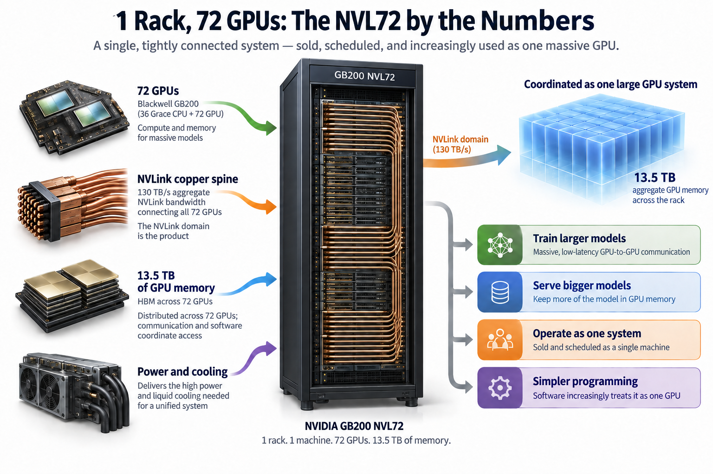
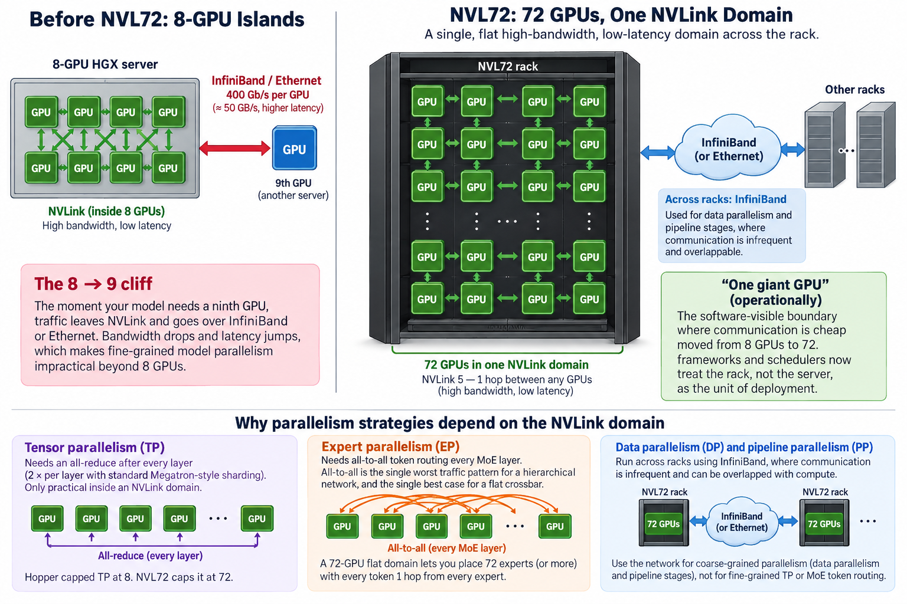
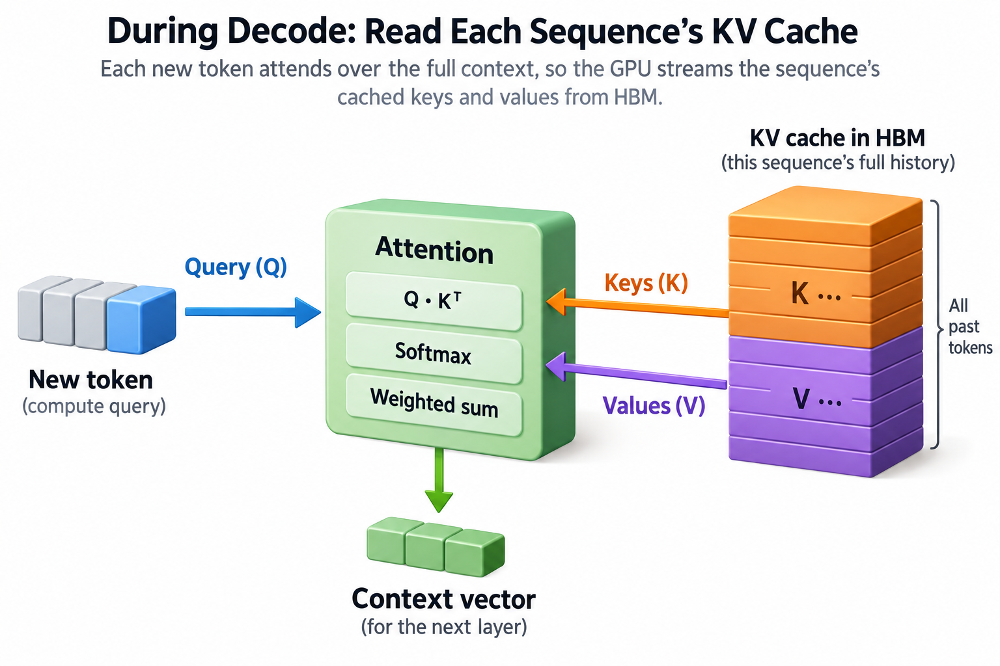
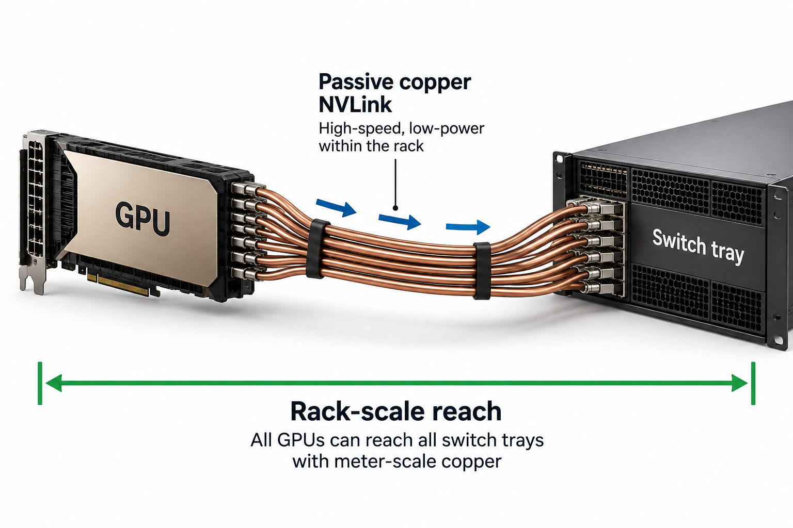

## Overview

130 terabytes per second. That is the aggregate NVLink bandwidth flowing through the copper spine of a single GB200 NVL72 rack, which is more bandwidth between its 72 GPUs than most datacenters have between all of their servers combined. NVIDIA sells this rack as 1 product, schedules it as 1 machine, and, increasingly, software treats it as 1 enormous GPU with 13.5 TB of memory.

That framing is not marketing fluff. It is the most consequential shift in AI hardware since HBM, and understanding exactly why requires nothing more than arithmetic. This article walks through the rack spec by spec, then does the napkin math for serving a 1-trillion-parameter model on it, because the numbers explain the design better than any block diagram.

## Deep dive

### What is actually in the cabinet

The GB200 NVL72 is a liquid-cooled rack containing 18 compute trays and 9 NVLink switch trays. Each compute tray holds 2 GB200 "superchips," and each superchip pairs 1 Grace CPU with 2 Blackwell GPUs over NVLink-C2C, a 900 GB/s coherent chip-to-chip link. Multiply it out: 36 Grace CPUs and 72 Blackwell GPUs per rack.

The headline numbers, from NVIDIA's official spec sheet:

- **Compute:** about 1.44 exaFLOPS of FP4 tensor throughput. Note the fine print: that figure assumes 2:4 structured sparsity; dense FP4 is roughly half. Still, an exaFLOP-class machine in a single cabinet.
- **GPU memory:** ~13.5 TB of HBM3e across the 72 GPUs (about 186 GB per GPU), with an aggregate ~576 TB/s of HBM bandwidth (8 TB/s per GPU).
- **CPU memory:** up to ~17 TB of LPDDR5X hanging off the Grace CPUs, coherently addressable by the GPUs through NVLink-C2C. Total "fast memory" is around 30 TB.
- **Interconnect:** fifth-generation NVLink gives each GPU 1.8 TB/s of bidirectional bandwidth into the switch fabric. The 9 switch trays form a full crossbar, so any GPU reaches any other GPU at full speed in 1 switch hop. Aggregate: ~130 TB/s, carried over a spine of more than 5,000 copper cables, roughly 2 miles of wire.
- **Power:** on the order of 130 kW for the rack, which is why the whole thing is direct liquid-cooled. A traditional datacenter rack budget is 10 to 20 kW; this one draws as much as a small neighborhood.

The number that changes system design is not the exaFLOPS. It is the shape of the interconnect.

### The NVLink domain is the product

Before NVL72, the standard building block was an 8-GPU HGX board. Inside those 8 GPUs you had NVLink; the moment your model needed a ninth GPU, traffic fell off a cliff onto InfiniBand or Ethernet, typically 400 Gb/s per GPU, which is 50 GB/s. NVLink 5 advertises 1.8 TB/s bidirectionally, or approximately 900 GB/s in 1 direction. Compared with 1 400 Gb/s link at 50 GB/s in 1 direction, that is an 18x nominal bandwidth difference, and the latency gap (sub-microsecond NVLink hops versus multi-microsecond RDMA) is just as brutal for the small, latency-sensitive messages that tensor parallelism generates.

Parallelism strategies live or die on this cliff:

- **Tensor parallelism** (splitting individual matrix multiplies across GPUs) needs an all-reduce after every layer, 2 times per layer with standard Megatron-style sharding. It is only practical inside an NVLink domain. On Hopper-era hardware that capped TP at 8. On NVL72 it caps at 72.
- **Expert parallelism** for Mixture-of-Experts models needs all-to-all token routing every MoE layer. All-to-all is the single worst traffic pattern for a hierarchical network, and the single best case for a flat crossbar. A 72-GPU flat domain lets you place 72 experts (or more) with every token 1 hop from every expert.

That is what "one giant GPU" means operationally: the software-visible boundary where communication is cheap moved from 8 GPUs to 72. Inference frameworks and schedulers now treat the rack, not the server, as the unit of deployment. Everything across racks is still InfiniBand and is used for data parallelism and pipeline stages, where communication is infrequent and overlappable.

### Worked example: a 1T-parameter model on 1 rack

Take a hypothetical dense 1-trillion-parameter transformer served in FP8. You can follow every step of this on the back of an envelope.

**Weights.** 1T parameters × 1 byte = **1.0 TB**. On an 8× H200 node (8 × 141 GB = 1.13 TB of HBM), the weights alone consume the entire node; there is no room for KV cache, so you are forced to span nodes and eat the InfiniBand cliff on every layer's all-reduce. On the NVL72, 1.0 TB is 7.4% of the rack's HBM. Sharded 72 ways, each GPU holds about 13.9 GB of weights out of its 186 GB.

**KV cache budget.** Reserve roughly 1.3 TB rack-wide (about 18 GB per GPU) for activations, communication buffers, CUDA graphs, and framework overhead. That leaves:

13.5 − 1.0 − 1.3 ≈ **11.2 TB for KV cache**.

**KV cache per token.** Assume the model uses grouped-query attention with 8 KV heads of dimension 128, has 120 layers, and stores KV in FP8:

8 heads × 128 dim × 2 (K and V) × 120 layers × 1 byte ≈ **0.25 MB per token**.

**Capacity.** 11.2 TB ÷ 0.25 MB ≈ **45 million cached tokens**. At a 128k context length that is about **350 concurrent full-context sequences** on 1 rack, with the whole model resident in HBM and every all-reduce staying on NVLink.

**Now the bandwidth check**, because capacity is only half the story. Decode is memory-bound: each generated token must stream the weights plus each sequence's KV history out of HBM (see [the memory wall](/blog/the-memory-wall-latency-numbers/) for why compute barely matters here).

- Weight traffic per decode step: 1.0 TB (read once, shared by the whole batch).
- KV traffic per step at full occupancy: 350 sequences × 128k tokens × 0.25 MB ≈ 11.2 TB.

Total ≈ 12.2 TB per step against 576 TB/s of aggregate HBM bandwidth: ≈ **21 ms per decode step**, or roughly 47 tokens/s per sequence and ~16,500 tokens/s for the rack, as a theoretical ceiling. Notice what the arithmetic just revealed: at full context occupancy, KV reads outweigh weight reads 11 to 1. The rack's marquee exaFLOPS never entered the calculation. This is why the industry's obsession has shifted from FLOPS to memory, a trend you can read directly off the [Blackwell-to-Rubin roadmap](/blog/blackwell-to-rubin-memory-math/).

Aggregate capacity is conditional on a real partitioning plan. Let M be usable cache bytes after weights and buffers, m cache bytes per token, and S retained tokens per sequence:

$$
N_{\max}\le\left\lfloor\frac{M}{mS}\right\rfloor,\qquad
m=2LH_{\mathrm{kv}}d b_{\mathrm{kv}}.
$$

L, H_kv, d, and b_kv are layer count, KV heads, head width, and cache bytes per element. For the hypothetical 120-layer, 8-head FP8 configuration, m is 245760 bytes. With 11.2 trillion cache bytes and S equal to 128000, the raw bound is 356 sequences. At 350 sequences the cache is about 11.01 TB, leaving some room within that assumed pool.

This does not prove that ordinary 72-way tensor parallelism realizes the bound. 8 KV heads cannot be divided evenly among 72 ranks; an engine may replicate heads, pad tensors, or use a different parallel decomposition. Each changes physical storage and traffic. NVLink provides fast communication rather than a physically unified allocation space. A collective still pays startup latency plus transferred bytes divided by effective link bandwidth, and simultaneous collectives contend. Verify per-rank allocations and collective spans before presenting the rack sum as achievable per-request bandwidth.

### Going deeper: why copper, and why 72

2 mechanism-level details explain the rack's shape.

**Copper reach sets the domain size.** NVLink 5 runs 200 Gb/s per lane over passive copper. Passive copper is essentially free in power (no retimers, no optics) but only reaches about a meter. A rack is precisely the volume you can span with meter-scale copper: every GPU can reach every switch tray through the backplane spine. Going bigger, say 2 racks, would force optical transceivers at roughly 5 to 10 pJ/bit and thousands of dollars per port, multiplied by thousands of links. The NVL72 is, quite literally, the largest single accelerator you can build before physics sends you an optics invoice. (NVIDIA's NVL576 ambitions for the Rubin era attack exactly this constraint.)

**The switch fabric is flat, not a tree.** Each of the 9 switch trays carries 2 NVLink Switch ASICs; each GPU's 18 NVLink ports are spread across all 9 trays. The result is a non-blocking crossbar: 72 GPUs, any-to-any, 1 switch hop, full 1.8 TB/s. There is no oversubscription and no "near" versus "far" GPU inside the rack, which is why frameworks can shard tensors 72 ways without topology-aware placement logic. Contrast this with a fat-tree InfiniBand cluster, where bisection bandwidth and hop count degrade as you scale, and collective performance depends on careful rail-aware scheduling.

And what did the benchmark record show when this fabric met real workloads? In MLPerf Inference v5.0 (March 2025), the first round with GB200 NVL72 submissions, Blackwell delivered on the order of 2 to 2.5x per-GPU throughput over Hopper on comparable benchmarks, with NVIDIA reporting up to about 3x per GPU on the new Llama 3.1 405B test. NVIDIA's headline "30x" rack-level claim on large-model inference, along with the "25x energy efficiency" figure from the Blackwell launch, compounds per-GPU gains with FP4 quantization and the larger NVLink domain against a smaller Hopper system. Treat those 2 as vendor-framed comparisons; the per-GPU MLPerf deltas are the peer-reviewed part.

### Common misconceptions

**"It's just 72 GPUs in a cabinet, i.e., a small cluster."** A cluster has a communication hierarchy: fast inside a node, slow between nodes, and software must respect the boundary. The NVL72 has no interior boundary. All-to-all at 1.8 TB/s per GPU with uniform 1-hop latency means a 72-way tensor-parallel or expert-parallel job runs as if on 1 device. The correct mental model is a single accelerator with 13.5 TB of memory that happens to be physically distributed, not 9 servers that happen to share a rack.

**"MLPerf showed Blackwell is 30x faster, so each GPU is 30x a Hopper GPU."** The measured per-GPU gain in MLPerf v5.0 was roughly 2 to 3x. The 30x figure compares a full 72-GPU FP4 rack against a much smaller FP8 Hopper baseline, so it bundles more silicon, a lower-precision format, and the interconnect advantage into 1 number. It is a true statement about systems and a misleading 1 about chips.

**"1.44 exaFLOPS means inference runs 1.44 exaFLOPS fast."** The FP4 peak assumes structured sparsity, dense is about half, and, as the worked example showed, decode never gets near either: at full KV occupancy the rack is limited by 576 TB/s of HBM bandwidth, spending 21 ms per step moving 12 TB of bytes. The FLOPS number matters for prefill and training; for decode, buy bandwidth. If you internalize 1 spec from this article, make it 576 TB/s, not 1.44 EF.

### Where this fits in the bigger picture

The NVL72 is the physical answer to a question the whole serving stack has been converging on: what is the right unit of inference hardware? Once the rack is 1 big GPU, the next optimization is to stop running prefill and decode, 2 phases with opposite hardware appetites, on the same silicon. That is the story of [prefill/decode disaggregation](/blog/the-prefill-decode-disaggregation-story/), and NVIDIA's own answer of a [dedicated prefill chip in the Rubin generation](/blog/prefill-gets-its-own-chip-rubin-cpx/) only makes sense in a world where NVLink domains, not servers, are the deployment unit. The 130 kW per rack also reframes the economics: when a cabinet draws megawatt-fractions, [tokens per megawatt](/blog/tokens-per-megawatt/) becomes the metric procurement actually optimizes. And the 186 GB per GPU that made our 1T-model math work is itself the product of a decade-long memory arms race traced in [From DRAM to HBM](/blog/from-dram-to-hbm/).

The direction of travel is clear from the roadmap: bigger NVLink domains (Rubin's NVL144, talk of NVL576), more HBM bandwidth per GPU, and interconnect increasingly being the product rather than the accessory. The rack is the new GPU; soon the row may be the new rack.

## Conclusion

- The NVL72's defining spec is the flat 130 TB/s NVLink domain, not the exaFLOPS: it moves the "communication is cheap" boundary from 8 GPUs to 72, which is what makes 72-way tensor and expert parallelism practical.
- Napkin math you can reuse: a 1T-param FP8 model uses 1 TB of the rack's 13.5 TB HBM; the remaining ~11 TB of KV cache holds ~45M tokens, and at full occupancy decode is bound by the 576 TB/s of HBM bandwidth (~21 ms/step), not by compute.
- Read vendor rack-level claims (30x throughput, 25x efficiency) as system comparisons that bundle FP4, more silicon, and interconnect; the measured per-GPU MLPerf v5.0 gain over Hopper was roughly 2 to 3x.

### Sources

- NVIDIA, "GB200 NVL72" official product page and specifications — https://www.nvidia.com/en-us/data-center/gb200-nvl72/
- NVIDIA, "NVIDIA Blackwell Architecture" — https://www.nvidia.com/en-us/data-center/technologies/blackwell-architecture/
- NVIDIA, "NVLink and NVLink Switch" — https://www.nvidia.com/en-us/data-center/nvlink/
- MLCommons, MLPerf Inference: Datacenter v5.0 results (March 2025) — https://mlcommons.org/benchmarks/inference-datacenter/
- NVIDIA Developer Technical Blog, "NVIDIA Blackwell Delivers Massive Performance Leaps in MLPerf Inference v5.0" (2025), vendor analysis of the GB200 NVL72 submissions.

*Part of the [AI Infrastructure Foundations](/series/ai-performance/) learning path. Browse its published articles by topic.*
