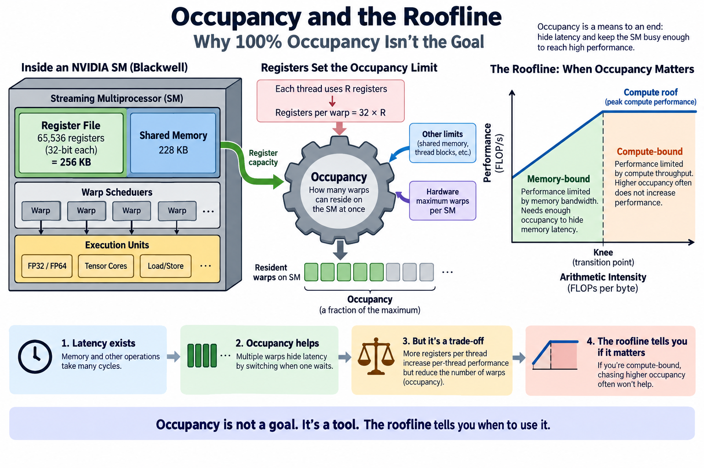
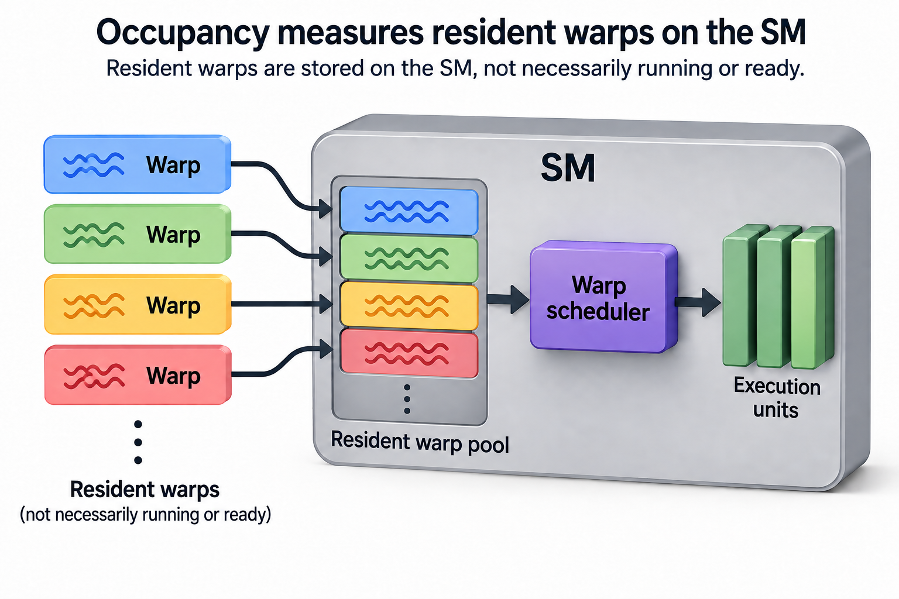
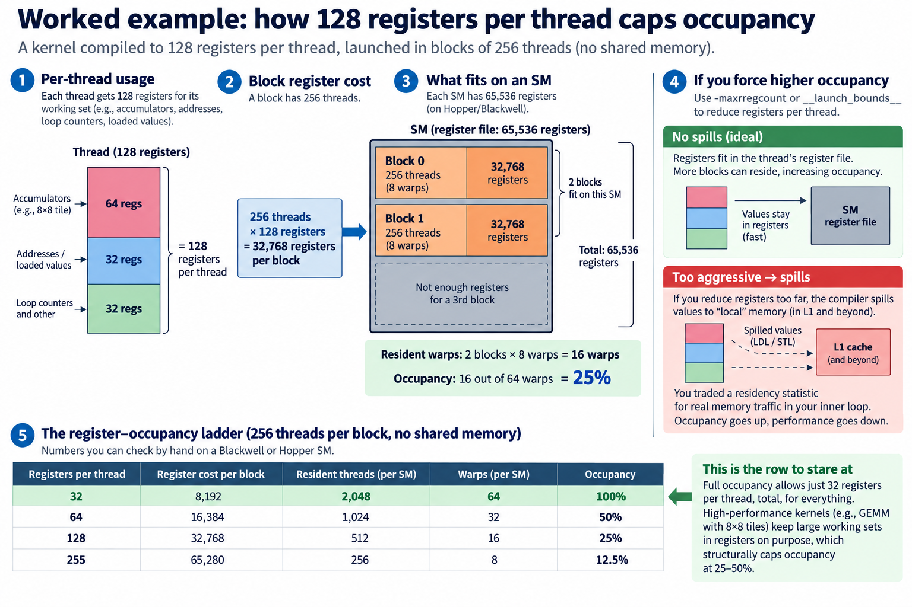
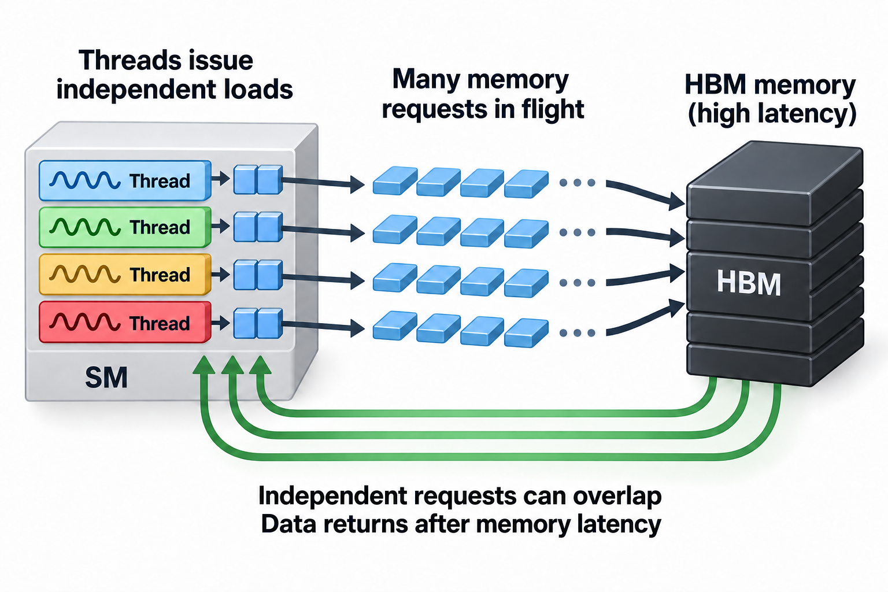

## Overview



The register file on a modern NVIDIA SM holds 65,536 32-bit registers, which is 256 KB. That is larger than the 228 KB of shared memory sitting right next to it on a Blackwell SM. That single number explains more about kernel performance than almost any other spec, because how a kernel spends its register budget decides how many warps can live on the SM at once. That warp count has a name, occupancy, and it is probably the most misread metric in GPU profiling.

Nsight Compute will happily print "Occupancy: 25%" in a worried shade of amber. The reflex is to treat it like CPU utilization: a quarter of the machine working, 3 quarters idle. That reading is wrong. Some of the fastest kernels ever written, including the GEMMs inside cuBLAS and CUTLASS that power every large model, deliberately run at 25-50% occupancy. This article covers what occupancy actually measures, when it matters, and how the roofline model tells you whether to care.

## Deep dive

### What occupancy actually measures



An SM (streaming multiprocessor) on Hopper or Blackwell can keep at most 64 warps resident at once. That is 2,048 threads whose registers and scheduling state physically live on the SM. Occupancy is simply:

```
occupancy = resident warps / maximum resident warps (64)
```

Note what this does not say. It says nothing about whether those warps are executing anything. Occupancy counts warps that are *parked on the SM*, ready to be scheduled, not warps doing useful work. It is a statement about residency, not activity.

Residency is limited by whichever on-chip resource runs out first:

- **Registers.** The SM has 65,536 registers total, and each thread can use up to 255. Every resident thread's registers stay allocated for its entire lifetime, so registers per thread directly caps resident threads.
- **Shared memory.** Blackwell gives each SM 228 KB, carved up among resident thread blocks. A block that asks for 114 KB means at most 2 blocks per SM, whatever the register math says.
- **Block slots and granularity.** At most 32 blocks can be resident per SM, and resources are granted in whole-block units. A leftover 1,900 threads' worth of registers is useless to a 1,024-thread block.

The compiler decides register usage when it compiles the kernel, so occupancy is largely determined at build time. Nsight Compute reports this as *theoretical occupancy*. It separately measures *achieved occupancy*, the average number of warps actually resident while the kernel ran. A big gap between the 2 usually means too few blocks in the grid or a load imbalance in the tail, not a resource limit.

### Why occupancy exists: latency hiding

GPUs tolerate latency instead of avoiding it. A CPU core spends enormous silicon on caches and out-of-order machinery so that 1 thread rarely waits. A GPU spends that silicon on registers so that *many* threads can wait cheaply. When a warp issues a global memory load, the load takes on the order of hundreds of cycles to return. The warp scheduler doesn't stall, it just issues instructions from a different resident warp on the next cycle. Switching costs nothing because every warp's state is already in the register file, which is exactly why that file is 256 KB.

This is the whole design bargain I described in [CPU vs GPU: latency vs throughput machines](/blog/cpu-vs-gpu-latency-vs-throughput-machines/). The GPU hides the [memory wall](/blog/the-memory-wall-latency-numbers/) behind parallelism rather than caching around it.

So more resident warps means more latency-hiding capacity. That part of the folklore is true. The mistake is assuming the relationship is linear all the way to 64 warps. It isn't. Latency hiding saturates: once there are enough independent instructions in flight to cover memory latency, additional warps add nothing. The interesting question is where the knee of that curve sits, and the answer is usually "much lower than 100%."


Vasily Volkov made this argument famous in his GTC 2010 talk "Better Performance at Lower Occupancy." He formalized it in his 2016 Berkeley dissertation on latency hiding. The needed concurrency can come from 2 sources: **thread-level parallelism** (more warps) or **instruction-level parallelism** (more independent operations per thread). A thread that issues 4 independent loads before using any of them keeps 4 memory transactions in flight by itself. It does the latency-hiding work of 4 single-load threads. ILP substitutes for occupancy, and ILP is often cheaper because it doesn't shrink your register budget per thread. It grows with it.

### Worked example: how 128 registers per thread caps occupancy



Take a kernel compiled to 128 registers per thread, launched in blocks of 256 threads, no shared memory. Numbers you can check by hand on a Blackwell or Hopper SM:

**Register cost per block:** 256 threads × 128 registers = 32,768 registers.

**Blocks that fit:** 65,536 / 32,768 = 2 blocks per SM.

**Resident warps:** 2 blocks × 8 warps = 16 warps out of 64. **Occupancy: 25%.**

Now run the ladder:

| Registers/thread | Resident threads | Warps | Occupancy |
|---:|---:|---:|---:|
| 32 | 2,048 | 64 | 100% |
| 64 | 1,024 | 32 | 50% |
| 128 | 512 | 16 | 25% |
| 255 | 256 | 8 | 12.5% |

The 100% row is the one to stare at. Full occupancy allows just 32 registers per thread, total, for everything: loop counters, addresses, loaded values, accumulators. A GEMM thread that computes an 8×8 output tile needs 64 registers for accumulators alone before it holds a single operand. High-performance kernels keep large working sets in registers *on purpose*, because registers are the only memory fast enough to feed the tensor cores. That structurally caps occupancy at 25-50%. The kernel work behind DeepSeek's inference economics, which I covered in [When a Kernel Cuts API Prices 50%](/blog/when-a-kernel-cuts-api-prices/), lives in exactly this register-fat regime.


You can force the compiler's hand with `-maxrregcount` or `__launch_bounds__`. Sometimes that is the right call. But squeeze too hard and the compiler *spills*. Values that no longer fit in registers get stored to "local" memory, which physically lives in L1 and beyond. You traded a residency statistic for real memory traffic in your inner loop. Occupancy goes up, performance goes down. Nsight Compute reports spills as `LDL`/`STL` instructions. If forcing occupancy up makes those appear, you almost certainly made the kernel slower.

### The roofline: deciding whether occupancy even matters

The roofline model arrived in 2009, from Williams, Waterman, and Patterson. It is the tool that tells you whether to spend another day on occupancy at all. Plot attainable throughput against **arithmetic intensity**, the FLOPs a kernel performs per byte it moves from memory. 2 ceilings bound every kernel: a slanted 1 set by memory bandwidth (throughput = bandwidth × intensity) and a flat 1 set by peak compute. They cross at the *ridge point*.


Put numbers on it for an H100 SXM: 3.35 TB/s of HBM3 bandwidth and roughly 990 dense BF16 tensor TFLOP/s (NVIDIA's own spec sheet figures). The ridge point sits near 990e12 / 3.35e12 ≈ **295 FLOPs per byte**. Any kernel below that intensity is memory-bound: its speed limit is bandwidth, full stop. Decode-phase attention reads each KV-cache byte and does about 1 multiply-accumulate with it, roughly 1 FLOP per byte. That puts it 2 orders of magnitude left of the ridge. A large-batch GEMM with big tiles can sit at the ridge or right of it.

Here's the connection to occupancy. For a memory-bound kernel, occupancy has exactly 1 job: keep enough loads in flight to saturate the memory system. Once bandwidth is saturated, the roofline says you are done. The ceiling is physical, and 64 resident warps will not raise it. For a compute-bound kernel, the job is keeping the tensor core pipes fed, which modern kernels achieve with few warps and huge register tiles. In neither regime is "more occupancy" the objective. Occupancy is a means. The roofline names the actual constraint.

### Going deeper: Little's law puts a number on "enough"



How much concurrency does saturation actually take? Little's law from queueing theory: concurrency in flight = latency × throughput.

Global memory latency on Hopper runs roughly 500 ns, as public microbenchmark studies measure it. To saturate 3.35 TB/s at that latency, the GPU needs about 3.35 TB/s × 500 ns ≈ 1.7 MB of memory traffic in flight at all times. Spread across 132 SMs, that's roughly 13 KB in flight per SM.

Now revisit our 25%-occupancy kernel: 512 resident threads per SM. Covering 13 KB needs about 26 bytes in flight per thread, which is 2 outstanding 16-byte vectorized loads (`float4`). That's it. A kernel whose threads each issue a couple of independent 128-bit loads before consuming them saturates HBM at 25% occupancy. This is Volkov's argument with units attached. The hardware needs a fixed amount of in-flight work, and it is agnostic about whether warps or ILP supply it.

The trend line runs away from occupancy, not toward it. Hopper and Blackwell kernels increasingly use warp specialization: a handful of producer warps drive TMA (the Tensor Memory Accelerator, an asynchronous bulk-copy engine) while consumer warps run the tensor cores, with the 2 sides handing off through shared memory barriers. FlashAttention-3 and CUTLASS Hopper kernels are built this way. The dedicated copy hardware keeps enormous amounts of memory traffic in flight on behalf of very few warps. The register budget can then go where it pays: accumulator tiles. Occupancy on these kernels looks terrible on paper. The rooflines they achieve do not.

Compute residency from the limiting allocation rather than the occupancy percentage alone. For t threads per block, r registers per thread, R registers per SM, and s bytes of shared memory per block from an SM budget S:

$$
B_{\mathrm{resident}}\le\min\left(\left\lfloor\frac{R}{rt}\right\rfloor,
\left\lfloor\frac{S}{s}\right\rfloor,B_{\mathrm{hardware}},\left\lfloor\frac{T_{\mathrm{hardware}}}{t}\right\rfloor\right),\qquad
O=\frac{B_{\mathrm{resident}}t/32}{W_{\max}}.
$$

B_hardware and T_hardware are the block and thread residency limits, and W_max the maximum resident warps. O is theoretical occupancy. Achieved occupancy also reflects incomplete waves and runtime behavior. Register allocation granularity and launch restrictions can lower the bound, so check the occupancy calculator for the actual architecture.

With 65536 registers, 256 threads, and 128 registers per thread, the register term allows 2 blocks. They contain 16 warps, giving 25% against a 64-warp limit. Cutting to 60-4 registers could allow 4 blocks, but only if shared memory and other limits permit it. Unrolling to improve independent work may raise r instead. Benchmark both versions and inspect spills: higher occupancy that adds local-memory traffic can lose to a lower-occupancy pipeline with better reuse.

### Common misconceptions

**"100% occupancy means the GPU is fully utilized."** Occupancy counts warps that are resident, not warps that are issuing. A memory-bound kernel at 100% occupancy can have every 1 of its 64 warps stalled on HBM simultaneously. Issue-slot utilization then sits in the single digits. The honest utilization metrics are elsewhere in the profile: DRAM bandwidth as a fraction of peak, or pipe-active percentages. This is the same trap as cluster-level "GPU utilization," which I picked apart in [Goodput vs Utilization](/blog/goodput-vs-utilization/): a residency number masquerading as a work number.

**"Raising occupancy always helps."** Past the latency-hiding knee, extra warps contribute nothing. The price you paid to admit them often hurts. Cutting registers per thread to fit more warps can force spills into the inner loop. Shrinking per-thread tiles also increases total memory traffic, because each output element's inputs get re-fetched by more threads. Volkov's GTC 2010 results showed exactly this pattern over a decade ago: peak throughput at a fraction of full occupancy, and performance *falling* as occupancy is pushed higher.

**"Low occupancy means the kernel is bad."** Occupancy is a budget statement, not a verdict. A 12.5%-occupancy kernel saturating 90% of HBM bandwidth on a memory-bound problem is finished. The roofline says there is nothing left to win. The profile that should worry you is low occupancy *combined with* low bandwidth utilization and low pipe utilization, because then nothing is hiding latency and nothing else is the bottleneck. Diagnose with the roofline chart Nsight Compute draws for you, not with the occupancy percentage alone.

### Where this sits in the bigger picture

Occupancy and the roofline are the 2 mental models that turn kernel profiling from ritual into reasoning, and they compose. The roofline tells you which ceiling binds the kernel, and occupancy analysis tells you whether you have enough concurrency to reach that ceiling. Everything upstream in this series rests on them. The [memory wall numbers](/blog/the-memory-wall-latency-numbers/) explain why latency hiding is necessary at all. The [prefill/decode split](/blog/the-prefill-decode-disaggregation-story/) is the roofline drawn at datacenter scale, separating the compute-bound phase from the memory-bound 1 onto different hardware. And when NVIDIA sizes the register file and shared memory of the next SM generation, it is negotiating exactly the residency budgets this article walked through, 1 worked example per architecture.

## Conclusion

- Occupancy is resident warps over the 64-warp maximum, set by whichever runs out first: the 65,536-register file, 228 KB of shared memory, or block slots. At 128 registers per thread it caps at 25%, and full occupancy leaves threads a starvation ration of 32 registers.
- Latency hiding needs a fixed amount of in-flight work (Little's law: latency × bandwidth, about 13 KB per SM to saturate an H100's HBM), and ILP within a thread supplies it as well as extra warps do. That is why register-fat kernels at 25-50% occupancy win.
- Read occupancy only next to the roofline: first determine whether the kernel is bandwidth-bound or compute-bound, then check whether it is saturating that ceiling. If it is, the occupancy number is trivia.

### Sources

- Williams, Waterman, Patterson, "Roofline: An Insightful Visual Performance Model for Multicore Architectures," CACM 2009. https://doi.org/10.1145/1498765.1498785
- Volkov, "Better Performance at Lower Occupancy," NVIDIA GTC 2010. https://www.nvidia.com/content/GTC-2010/pdfs/2238_GTC2010.pdf
- Volkov, "Understanding Latency Hiding on GPUs," UC Berkeley Technical Report EECS-2016-143, 2016. https://www2.eecs.berkeley.edu/Pubs/TechRpts/2016/EECS-2016-143.html
- NVIDIA CUDA C++ Programming Guide (compute capability limits: registers, shared memory, resident warps). https://docs.nvidia.com/cuda/cuda-c-programming-guide/
- NVIDIA Nsight Compute Profiling Guide (theoretical vs. achieved occupancy, roofline analysis). https://docs.nvidia.com/nsight-compute/ProfilingGuide/
- NVIDIA H100 datasheet figures (bandwidth and dense tensor throughput; vendor self-reported). https://www.nvidia.com/en-us/data-center/h100/

*Part of the [GPU Programming & Performance](/series/gpu-performance/) learning path. Browse its published articles by topic.*
