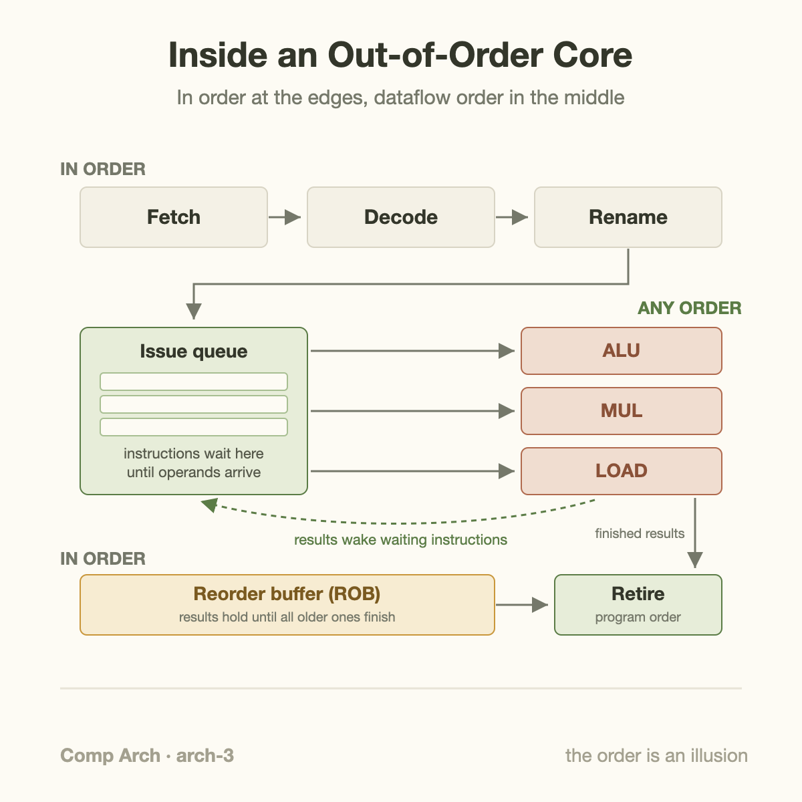
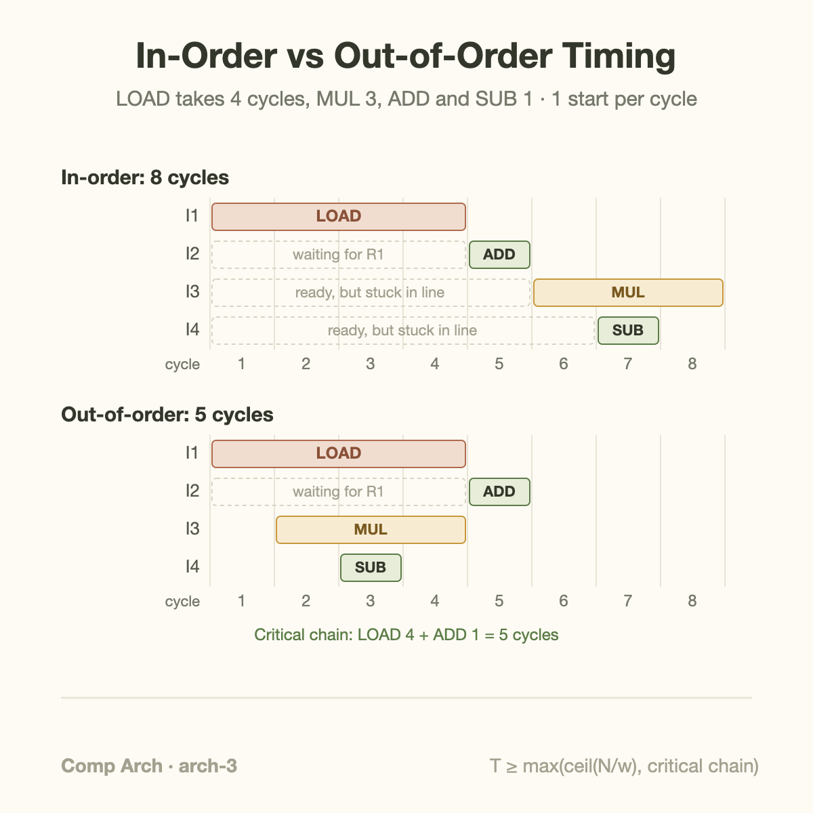
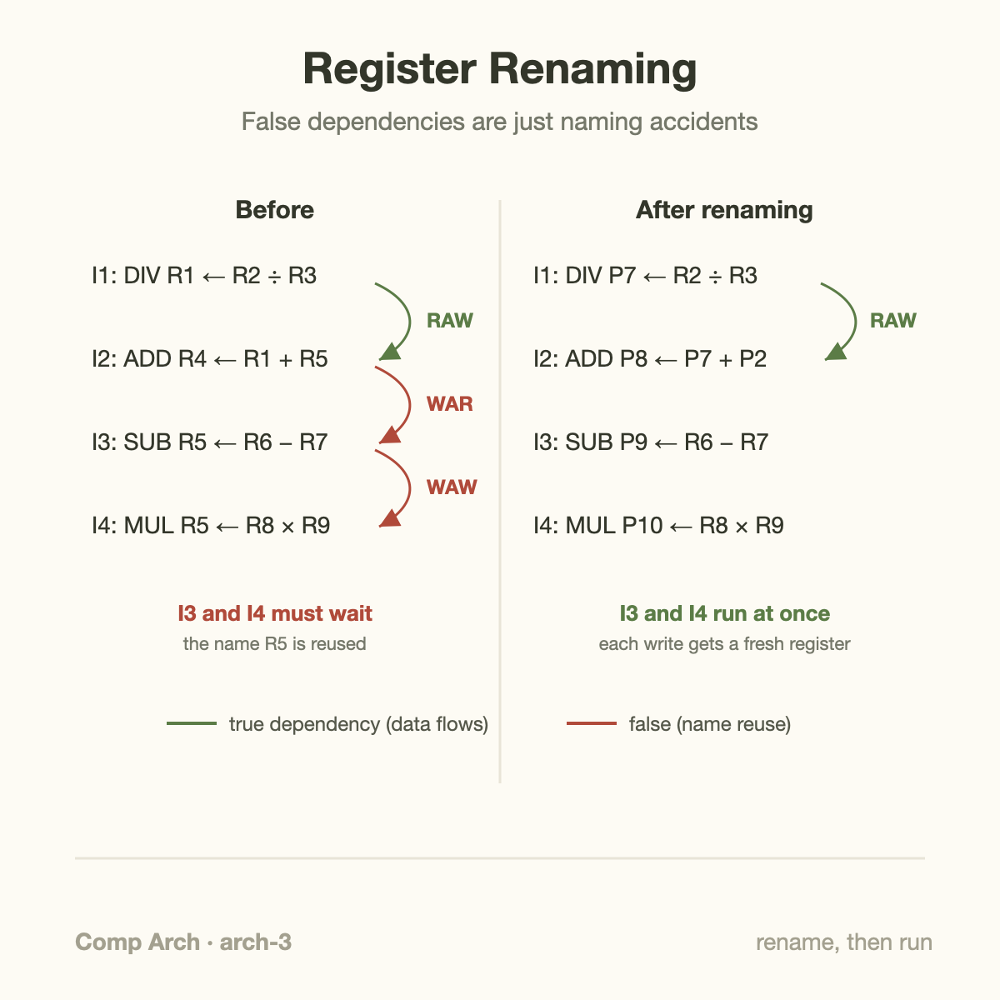

Intel's Golden Cove core can hold 512 instructions in flight at the same time, and independent measurements put Apple's Firestorm core near 630. Your program says "do A, then B, then C." The silicon underneath is juggling hundreds of half-finished operations in whatever order their inputs happen to arrive, then quietly filing the results so it looks like nothing unusual ever happened.

This is out-of-order execution, and it is the single most elaborate piece of machinery in a modern CPU core. It is also, as we'll see at the end, the machinery that AI chips deliberately threw away. Understanding why CPUs need it, and why GPUs and TPUs don't, explains most of the design split between the two worlds.

## Why in-order pipelines stall

In [the first article of this series](/blog/what-a-cpu-actually-does/) we built the pipeline: fetch, decode, execute, overlapped so a new instruction enters every cycle. The pipeline's promise is one instruction completed per cycle. Its weakness is that the promise only holds when every instruction is ready to run the moment its turn comes.

Real code breaks that constantly, because instructions depend on each other. If instruction 2 adds the value that instruction 1 loads from memory, instruction 2 cannot start until the load finishes. That's called a **data dependency** (specifically a read-after-write dependency: 2 reads what 1 writes). An in-order pipeline, which must start instructions in exactly the order the program lists them, has no choice: it stalls. Instruction 2 waits, and so does everything behind it, even instructions 3 and 4 that have nothing to do with the load.

Now put numbers on the wait. On a current core, a load that hits the L1 cache takes roughly 4 to 5 cycles. A hit in L2 is around 12 to 16. A trip to DRAM is 200 to 400 cycles. In an in-order machine, one unlucky load parks the entire pipeline for hundreds of cycles while independent work sits in line behind it, fully ready, doing nothing. It's a supermarket with one checkout lane: the customer disputing a coupon blocks everyone, including people holding exact change.

The fix sounds almost too obvious: let the people with exact change go around. Formally, **out-of-order (OoO) execution** means the core starts instructions as soon as their inputs are ready, regardless of program order, while still making the results appear in program order. The internal order is dataflow order. The external order is the illusion.

## The shape of the machine

An out-of-order core is a sandwich: in-order at both ends, chaos in the middle.



The **front end** fetches and decodes instructions in program order, exactly as written. Before handing them onward, it renames their registers (more on that shortly) and appends each one to two structures: an **issue queue** (also called a scheduler or reservation stations), which is the waiting room, and a **reorder buffer** (ROB), which is the ledger recording the original program order.

The **middle** is where order dissolves. Every cycle, the scheduler scans the waiting room and picks instructions whose operands have all arrived, sending them to whatever execution unit is free. An instruction that entered the queue 40th can execute 3rd if its inputs are ready. When a result comes out of an execution unit, it is broadcast back to the waiting room so dependent instructions wake up.

The **back end** restores the fiction. Finished instructions don't immediately become official. They sit in the reorder buffer, marked "done," until every older instruction is also done. Only then do they **retire** (also called commit): their results become permanent architectural state, in exact program order. The 512 and 630 figures in the opening paragraph are reorder buffer capacities, the size of the window of program the core can work on at once.

Retiring in order is what makes the whole scheme safe. If instruction 30 triggers a page fault, or a branch before it was mispredicted, everything younger in the ROB is simply discarded before it ever becomes official. The program observes a machine that ran instructions 1 through 29 and then stopped, cleanly. Architects call this a **precise exception**, and it's the property that lets operating systems and debuggers work at all.

## A worked example you can trace by hand

Take four instructions. R1 through R8 are registers, and `[R4]` means "the memory address stored in R4":

```
I1: LOAD R1 ← [R4]      # load from memory, 4 cycles
I2: ADD  R2 ← R1 + R1   # needs I1's result
I3: MUL  R5 ← R6 × R7   # independent, 3 cycles
I4: SUB  R8 ← R6 − R3   # independent, 1 cycle
```

Assume the core can start one instruction per cycle, the load takes 4 cycles, the multiply 3, and the add and subtract 1 each, on separate execution units.

**In-order machine.** I1 starts in cycle 1 and its result is ready at the end of cycle 4. I2 needs that result, so it cannot start until cycle 5. And because issue happens in program order, I3 and I4 are stuck behind I2 even though their inputs were ready the whole time: I3 starts in cycle 6 and runs through cycle 8; I4 starts in cycle 7. Last result lands at the end of **cycle 8**.

**Out-of-order machine.** Same hardware, one rule changed: start whatever is ready.

| Cycle | Starts | Why |
|-------|--------|-----|
| 1 | I1 (LOAD) | ready; runs cycles 1–4 |
| 2 | I3 (MUL) | independent, so it jumps the queue; runs 2–4 |
| 3 | I4 (SUB) | independent; runs and finishes in cycle 3 |
| 5 | I2 (ADD) | R1 arrived at end of cycle 4; finishes in cycle 5 |

Last result lands at the end of **cycle 5**. Then the ROB retires I1, I2, I3, I4 in that order, and to the outside world the program ran sequentially. Eight cycles down to five is a 37% speedup, from reordering exactly two instructions.



Scale the intuition up: real windows are hundreds of instructions deep, and the stall being hidden is often not a 4-cycle load but a 300-cycle DRAM miss. The out-of-order engine's real job is to find enough independent work to keep the execution units fed while memory takes its time.

## Register renaming, in plain words

There's a catch I skipped. Real programs reuse register names constantly, because the instruction set only exposes a handful (16 general-purpose registers in x86-64, 31 in ARM). Reuse creates dependencies that are about *names*, not *data*, and they would strangle reordering if taken at face value. Watch:

```
I1: DIV R1 ← R2 ÷ R3    # slow: ~20 cycles
I2: ADD R4 ← R1 + R5    # true dependency: needs I1's R1
I3: SUB R5 ← R6 − R7    # writes R5, which I2 reads
I4: MUL R5 ← R8 × R9    # writes R5 again
```

I2 genuinely must wait for the divide. But look at I3: it only *writes* R5. Nothing about its computation involves I1 or I2. Yet if the core ran I3 early, it would overwrite R5 before the stalled I2 got a chance to read the old value. Wrong answer. This is a **write-after-read hazard** (I3 must not write before I2 reads), and I4 piles on a **write-after-write hazard** (if I4 finished before I3, R5 would end up holding I3's stale result). Both are false dependencies: accidents of having too few register names.

The cure is **register renaming**. The core keeps a large pool of hidden physical registers, far more than the named ones: Golden Cove has 280 integer physical registers behind x86's 16 names. Every time an instruction writes a named register, the renamer hands it a fresh physical register and updates a map from names to physical locations. Subsequent readers of that name are pointed at the new physical register; earlier readers keep their pointer to the old one, which stays alive until they're done with it.

After renaming, our sequence becomes (P-numbers are physical registers):

```
I1: DIV P7  ← R2 ÷ R3     # R1 now lives in P7
I2: ADD P8  ← P7 + P2     # reads the OLD R5, safely parked in P2
I3: SUB P9  ← R6 − R7     # R5 now lives in P9 — no conflict
I4: MUL P10 ← R8 × R9     # R5 now lives in P10 — no conflict
```

I3 and I4 can now run immediately, in any order, while the divide grinds. The only dependency left is the real one, I1 to I2, carried by P7. Renaming deletes every false dependency and leaves the true dataflow graph, which is exactly what the scheduler wants to see.



The everyday analogy: a kitchen with one cutting board forces cooks to queue even when their recipes are unrelated. Renaming is buying a stack of cutting boards and handing a clean one to each cook. The recipes didn't change; the phony contention evaporated.

## Going one level deeper

The scheme has a name and a birthday: Robert Tomasulo built the essentials for the IBM System/360 Model 91's floating-point unit in 1967, including renaming and the broadcast-wakeup mechanism (his "common data bus"). The Model 91 could juggle about a dozen operations; the full apparatus with a reorder buffer didn't become standard in desktop CPUs until the mid-1990s, roughly a million-fold more transistors later.

What does the apparatus cost? More than you'd guess.

The scheduler is the expensive part. Every cycle it must compare every broadcast result tag against the waiting operands of every queued instruction (wakeup), then choose which ready instructions get the execution units (select), all in a fraction of a nanosecond. The comparison hardware grows roughly with the product of window size and issue width, which is why issue queues hold dozens of entries even when reorder buffers hold hundreds. Add the renamer's map tables, register files with a dozen-plus ports, and ROB bookkeeping, and a large fraction of a modern core's area and power goes not to computing but to *deciding what to compute next*. That overhead dominating arithmetic is the normal state of a high-performance CPU core.

One more interaction worth seeing: out-of-order execution is what makes [branch prediction](/blog/branch-prediction-the-cpu-gambler/) so high-stakes. The core doesn't just predict a branch and fetch a few instructions past it; it renames, schedules, and *executes* hundreds of instructions beyond an unresolved branch, all provisionally. Predicted right, they retire and the speculation was free. Predicted wrong, the ROB discards every younger instruction, the rename map rolls back, and 500-odd slots of work evaporate. The deeper the window, the bigger the bonfire.

## Common misconceptions

**"Out of order means the program can compute wrong results."** No. Execution order changes; visible order doesn't. Renaming guarantees every instruction reads exactly the values program order says it should, and in-order retirement guarantees memory, registers, and exceptions appear sequentially. A single-threaded program cannot tell it ran on an OoO core. (The one real leak is timing: speculative execution leaves cache-timing footprints, which is what the 2018 Spectre and Meltdown attacks exploited. That's an information side channel, not a wrong answer.)

**"The compiler could just reorder the instructions itself and save all that hardware."** Compilers do schedule instructions, and it helps, but they're blind to the thing that matters most: whether a given load will hit L1 in 4 cycles or miss to DRAM in 300. That's decided at runtime, differently on every execution, by cache state the compiler cannot know. Intel's Itanium bet an entire architecture on compiler-side scheduling in the early 2000s and lost to ordinary OoO x86 chips, largely because static schedules can't adapt to dynamic memory latency. Hardware reorders at runtime precisely because runtime is when the information exists.

**"A bigger out-of-order window always means proportionally more speed."** Diminishing returns hit fast. Doubling the window helps only if the extra slots contain independent work, and dependent chains, branch mispredictions, and plain lack of parallelism all cap what's findable. Meanwhile scheduler cost climbs steeply with size, which is why 25 years took us from roughly 40-entry windows (Pentium Pro, 1995) to roughly 600, a 15x growth, while transistor budgets grew thousands of times. Memory-bound code is the cruelest case: if every instruction chains off the previous cache miss, a 600-entry window drains just as dry as a 40-entry one.

## The fork in the road: why AI chips said no

Here's the punchline for this series. Out-of-order execution exists to extract parallelism from code that doesn't announce it, one thread of tangled, branchy, pointer-chasing instructions, at enormous cost in silicon and watts per instruction.

But the workloads that matter for AI, the matrix multiplies at the heart of [every transformer layer](/blog/transformer-architecture-in-one-picture/), have the opposite character. Their parallelism is explicit, regular, and essentially infinite: millions of multiply-accumulates whose dependency structure is known entirely in advance. Spending several times an ALU's area on machinery to *discover* parallelism is absurd when the parallelism is printed on the label.

So GPUs and TPUs made the opposite trade. A GPU streaming multiprocessor is, at its core, an in-order machine; when a load stalls one group of threads, the hardware switches to another of the thousands it keeps resident, hiding latency with threads instead of a reorder buffer. A TPU goes further: its systolic array is a grid of multiply-accumulate units through which data marches in a fixed choreography, scheduled entirely by the compiler, with no per-instruction scheduling hardware at all. The transistors a CPU spends on renamers, schedulers, and ROBs, the accelerator spends on more math units and on-chip memory. That single reallocation is *the* design divergence between latency machines and throughput machines. It's why [an ML performance engineer's job](/blog/what-does-an-ml-performance-engineer-do/) is largely about keeping tens of thousands of dumb-but-numerous units fed, and why [utilization numbers need careful reading](/blog/goodput-vs-utilization/) on both kinds of chip.

The CPU's bet: the code is sequential and unpredictable, so build a machine that finds parallelism at runtime. The accelerator's bet: the code is parallel and predictable, so build a machine that doesn't have to look. Both bets are correct, for their own workloads. The rest of this series lives in the space between them.

## Takeaway

- In-order pipelines stall whenever an instruction waits on data, and everything behind it waits too; out-of-order cores execute in dataflow order but retire results in program order, keeping hundreds of instructions in flight (512 in Intel Golden Cove, about 630 measured in Apple Firestorm) so independent work fills the shadow of slow loads.
- Register renaming is the enabling trick: mapping each write of a named register onto a fresh physical register erases write-after-read and write-after-write false dependencies, leaving only the true dataflow graph for the scheduler.
- The whole apparatus buys single-thread speed at a steep price in area and power, and that's exactly the price GPUs and TPUs refuse to pay: with explicitly parallel workloads, they spend the same silicon on arithmetic and hide latency with massive threading or compiler-fixed schedules.

## Sources

- R. M. Tomasulo, "An Efficient Algorithm for Exploiting Multiple Arithmetic Units," IBM Journal of Research and Development, vol. 11, no. 1, 1967 — the original renaming and dynamic scheduling design for the System/360 Model 91.
- J. E. Smith and G. S. Sohi, "The Microarchitecture of Superscalar Processors," Proceedings of the IEEE, vol. 83, no. 12, 1995 — the classic survey of OoO machinery: renaming, scheduling, reorder buffers.
- J. L. Hennessy and D. A. Patterson, *Computer Architecture: A Quantitative Approach* — Chapter 3 covers dynamic scheduling, Tomasulo's algorithm, and speculation in full detail.
- Onur Mutlu, Computer Architecture lectures, ETH Zürich: https://safari.ethz.ch/architecture/ — free slides and videos covering out-of-order execution and precise exceptions.
- Agner Fog, Software Optimization Resources: https://www.agner.org/optimize/ — measured microarchitecture details (buffer sizes, latencies) for real x86 cores.
- Chips and Cheese, microarchitecture analyses: https://chipsandcheese.com/ — source for Golden Cove's 512-entry ROB and 280-entry integer register file; Firestorm figures are from independent third-party measurements, not Apple disclosures.

*Part of the **Computer Architecture & ASIC** series. Previous: [Branch Prediction: The CPU Gambler](/blog/branch-prediction-the-cpu-gambler/). Next: caches, and why memory is the real bottleneck.*
